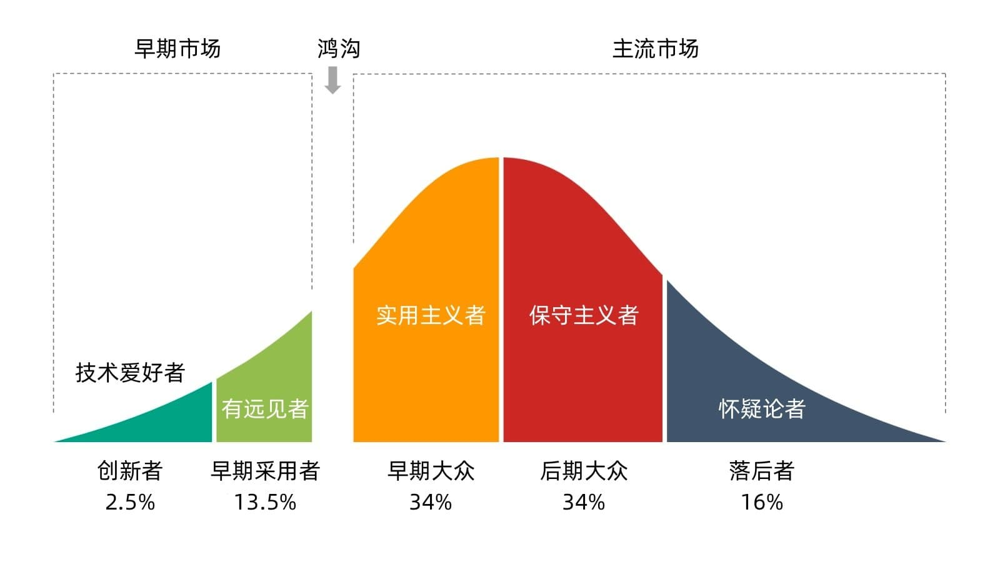
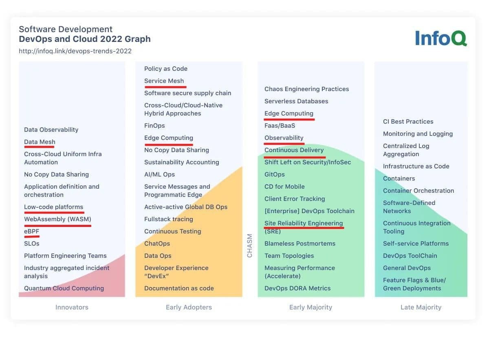

近日 InfoQ 发布了 [DevOps and Cloud InfoQ Trends Report – June 2022](https://www.infoq.com/articles/devops-and-cloud-trends-2022/)，因为报告中所覆盖的技术领域过于宽泛，本文仅仅是对这篇报告的一点个人解读。我基本认同我关注的这些技术中「创新者」和「后期大众」阶段技术的划分。

## 报告概括

下面这段节选自原文的 takeaways：

- 数据可观察性将帮助企业更好地了解和排除其数据密集型系统的故障。
- 云原生应用采用无服务器和分布式SQL数据库的情况也越来越多。
- FinOps将走向成熟。
- eBPF和WASM是令人振奋的新技术，它们被用来在服务网格内开启可观察性、监控和安全的新方法。我们认为这处于创新者阶段。
- 低代码或无代码平台继续成熟，特别是用于内部工具和自动化用途。
- 我们还看到「开发者体验作为决策驱动力」的趋势得到了更多的关注，特别是在云平台领域。「平台工程师」的角色正在许多规模的组织中出现，以支持相关平台抽象、API和工具的建设。

## 报告解读

这篇报告为什么命名为 「DevOps 和云」我就不太清楚了，我觉得把名字换成「云计算」、「云原生」也是可以的，可能是为了延续之前的报告风格吧，毕竟 InfoQ 已经推出过很多期此类报告了。这类报告都是根据「鸿沟理论」将当前流行的技术分成以下阶段：

- 创新者
- 早期采用者
- 早期大众
- 后期大众
- 落后者

不过 InfoQ 的报告中没有「落后者」这个阶段。


鸿沟理论指的就是高科技产品在市场营销过程中遭遇的最大障碍：高科技企业的早期市场和主流市场之间存在着一条巨大的鸿沟，能否顺利跨越鸿沟并进入主流市场，成功赢得实用主义者的支持，就决定了一项高科技产品的成败。实际上每项新技术都会经历鸿沟。关键在予采取适当的策略令高科技企业成功地 “跨越鸿沟”，摩尔在这本书中就告诉了人们一些欠经考验的制胜秘诀。


下图展示的是跨越鸿沟理论中不同阶段人群的分类及占比。

我们来看下 InfoQ 6 月新出的「云和 DevOps」趋势报告。

我们可以看到像低代码、eBPF、Data Mesh、WASM 已经出现在创新者视线里了。Service Mesh 还在「早期采用者」阶段，这点比我预想的要慢好多，我以为服务网格已经跨越鸿沟了，你觉得呢？

