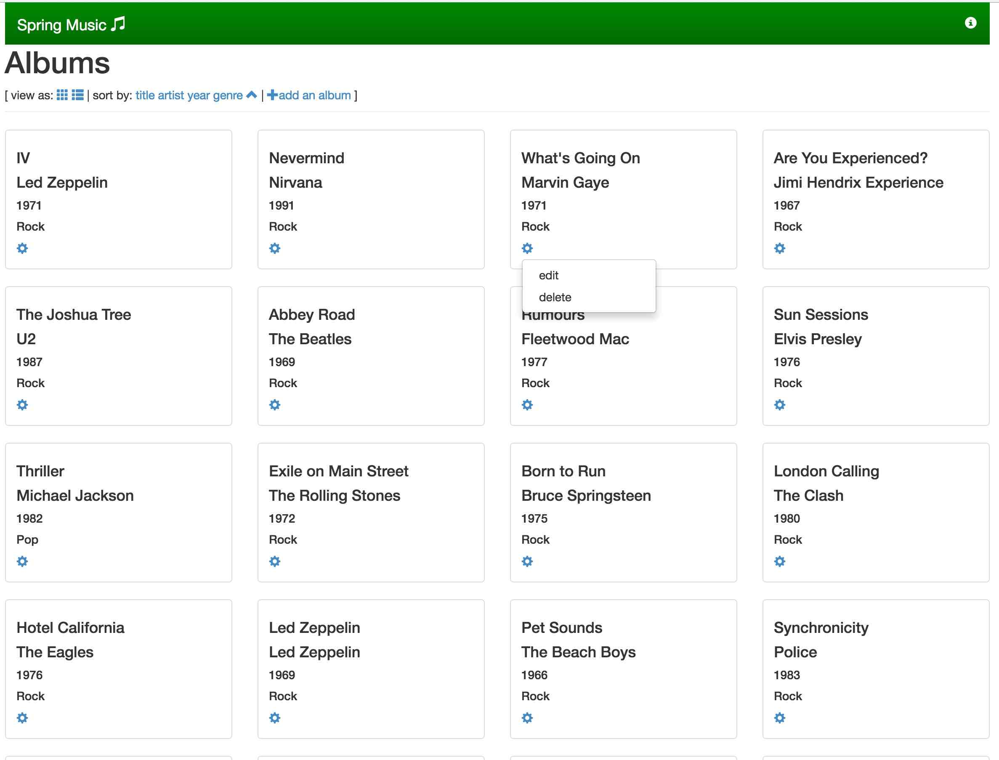

## 前言

最近研究了下**Pivotal**的**Cloud foundry**，CF本身是一款开源软件，很多PAAS厂商都加入了CF，我们用的是的**PCF Dev**（PCF Dev是一款可以在工作站上运行的轻量级PCF安装）来试用的，因为它可以部署在自己的环境里，而**Pivotal Web Services**只免费两个月，之后就要收费。[这里](https://pivotal.io/cn/platform/pcf-tutorials/getting-started-with-pivotal-cloud-foundry-dev/introduction)有官方的详细教程。

## 开始

根据官网的示例，我们将运行一个Java程序示例。

**安装命令行终端**

[下载](https://pivotal.io/cn/platform/pcf-tutorials/getting-started-with-pivotal-cloud-foundry-dev/install-the-cf-cli)后双击安装即可，然后执行`cf help`能够看到帮助。

**安装PCF Dev**

先[下载](https://network.pivotal.io/products/pcfdev)，如果你没有Pivotal network账号的话，还需要注册个用户，然后用以下命令安装：

```shell

$./pcfdev-VERSION-osx && \
cf dev start
Less than 4096 MB of free memory detected, continue (y/N): > y
Please sign in with your Pivotal Network account.
Need an account? Join Pivotal Network: https://network.pivotal.io

Email> 849122844@qq.com

Password> 
Downloading VM...
Progress: |+++++++++++++=======>| 100% 
VM downloaded.
Allocating 4096 MB out of 16384 MB total system memory (3514 MB free).
Importing VM...
Starting VM...
Provisioning VM...
Waiting for services to start...
8 out of 57 running
8 out of 57 running
8 out of 57 running
46 out of 57 running
57 out of 57 running
 _______  _______  _______    ______   _______  __   __
|       ||       ||       |  |      | |       ||  | |  |
|    _  ||       ||    ___|  |  _    ||    ___||  |_|  |
|   |_| ||       ||   |___   | | |   ||   |___ |       |
|    ___||      _||    ___|  | |_|   ||    ___||       |
|   |    |     |_ |   |      |       ||   |___  |     |
|___|    |_______||___|      |______| |_______|  |___|
is now running.
To begin using PCF Dev, please run:
   cf login -a https://api.local.pcfdev.io --skip-ssl-validation
Apps Manager URL: https://local.pcfdev.io
Admin user => Email: admin / Password: admin
Regular user => Email: user / Password: pass
```

启动过程中还需要**Sign In**，所以注册完后要记住用户名（邮箱地址）和密码（必须超过8位要有特殊字符和大写字母）。这个过程中还要下载VM，对内存要求至少4G。而且下载速度比较慢，我下载的了大概3个多小时吧。

下面部署一个应用到PCF Dev上试一试。

## 部署应用

**下载代码**

```bash
$git clone https://github.com/cloudfoundry-samples/spring-music
$cd ./spring-music
$cf login -a api.local.pcfdev.io --skip-ssl-validation
API endpoint: api.local.pcfdev.io

Email> user

Password> pass
Authenticating...
OK

Targeted org pcfdev-org

Targeted space pcfdev-space


                
API endpoint:   https://api.local.pcfdev.io (API version: 2.65.0)
User:           user
Org:            pcfdev-org
Space:          pcfdev-space
```
**编译应用**

使用gradle来编译。

```bash
$./gradlew assemble
:compileJava UP-TO-DATE
:processResources UP-TO-DATE
:classes UP-TO-DATE
:findMainClass
:jar
:bootRepackage
Download https://repo1.maven.org/maven2/com/sun/jersey/jersey-client/1.13/jersey-client-1.13.jar
Download https://repo1.maven.org/maven2/com/sun/jersey/jersey-json/1.13/jersey-json-1.13.jar
Download https://repo1.maven.org/maven2/org/apache/httpcomponents/httpcore/4.4.5/httpcore-4.4.5.jar
Download https://repo1.maven.org/maven2/com/nimbusds/oauth2-oidc-sdk/4.5/oauth2-oidc-sdk-4.5.jar
Download https://repo1.maven.org/maven2/com/google/code/gson/gson/2.3.1/gson-2.3.1.jar
Download https://repo1.maven.org/maven2/com/sun/jersey/jersey-core/1.13/jersey-core-1.13.jar
Download https://repo1.maven.org/maven2/org/codehaus/jackson/jackson-core-asl/1.9.2/jackson-core-asl-1.9.2.jar
Download https://repo1.maven.org/maven2/org/codehaus/jackson/jackson-mapper-asl/1.9.2/jackson-mapper-asl-1.9.2.jar
Download https://repo1.maven.org/maven2/org/codehaus/jackson/jackson-jaxrs/1.9.2/jackson-jaxrs-1.9.2.jar
Download https://repo1.maven.org/maven2/org/codehaus/jackson/jackson-xc/1.9.2/jackson-xc-1.9.2.jar
Download https://repo1.maven.org/maven2/net/jcip/jcip-annotations/1.0/jcip-annotations-1.0.jar
Download https://repo1.maven.org/maven2/org/apache/commons/commons-lang3/3.3.1/commons-lang3-3.3.1.jar
Download https://repo1.maven.org/maven2/net/minidev/json-smart/1.1.1/json-smart-1.1.1.jar
Download https://repo1.maven.org/maven2/com/nimbusds/lang-tag/1.4/lang-tag-1.4.jar
Download https://repo1.maven.org/maven2/com/nimbusds/nimbus-jose-jwt/3.1.2/nimbus-jose-jwt-3.1.2.jar
Download https://repo1.maven.org/maven2/stax/stax-api/1.0.1/stax-api-1.0.1.jar
Download https://repo1.maven.org/maven2/org/bouncycastle/bcprov-jdk15on/1.51/bcprov-jdk15on-1.51.jar
Download https://repo1.maven.org/maven2/javax/mail/mail/1.4.7/mail-1.4.7.jar
:assemble

BUILD SUCCESSFUL

Total time: 1 mins 25.649 secs

This build could be faster, please consider using the Gradle Daemon: https://docs.gradle.org/2.14/userguide/gradle_daemon.html
```

**上传应用**

设置应用的主机名为spring-music。

```bash
$cf push --hostname spring-music
Using manifest file /Users/jimmy/Workspace/github/cloudfoundry-samples/spring-music/manifest.yml

Creating app spring-music in org pcfdev-org / space pcfdev-space as user...
OK

Creating route spring-music.local.pcfdev.io...
OK

Binding spring-music.local.pcfdev.io to spring-music...
OK

Uploading spring-music...
Uploading app files from: /var/folders/61/f7mqkyjn1nz5mfmfvdztgzjw0000gn/T/unzipped-app139680305
Uploading 38.9M, 234 files
Done uploading               
OK

Starting app spring-music in org pcfdev-org / space pcfdev-space as user...
Downloading dotnet-core_buildpack...
Downloading go_buildpack...
Downloading python_buildpack...
Downloading php_buildpack...
Downloading staticfile_buildpack...
Downloaded staticfile_buildpack
Downloading binary_buildpack...
Downloaded binary_buildpack (9.3K)
Downloading java_buildpack...
Downloaded java_buildpack (249.1M)
Downloaded dotnet-core_buildpack (169.3M)
Downloading ruby_buildpack...
Downloading nodejs_buildpack...
Downloaded python_buildpack (255.3M)
Downloaded nodejs_buildpack (109.4M)
Downloaded go_buildpack (392M)
Downloaded php_buildpack (310.4M)
Downloaded ruby_buildpack (260.8M)
Creating container
Successfully created container
Downloading app package...
Downloaded app package (38.8M)
Staging...
-----> Java Buildpack Version: v3.10 (offline) | https://github.com/cloudfoundry/java-buildpack.git#193d6b7
-----> Downloading Open Jdk JRE 1.8.0_111 from https://java-buildpack.cloudfoundry.org/openjdk/trusty/x86_64/openjdk-1.8.0_111.tar.gz (found in cache)
       Expanding Open Jdk JRE to .java-buildpack/open_jdk_jre (1.4s)
-----> Downloading Open JDK Like Memory Calculator 2.0.2_RELEASE from https://java-buildpack.cloudfoundry.org/memory-calculator/trusty/x86_64/memory-calculator-2.0.2_RELEASE.tar.gz (found in cache)
       Memory Settings: -Xss349K -Xmx681574K -XX:MaxMetaspaceSize=104857K -Xms681574K -XX:MetaspaceSize=104857K
-----> Downloading Spring Auto Reconfiguration 1.10.0_RELEASE from https://java-buildpack.cloudfoundry.org/auto-reconfiguration/auto-reconfiguration-1.10.0_RELEASE.jar (found in cache)
Exit status 0
Staging complete
Uploading droplet, build artifacts cache...
Uploading build artifacts cache...
Uploading droplet...
Uploaded build artifacts cache (108B)
Uploaded droplet (83.9M)
Uploading complete
Destroying container
Successfully destroyed container

0 of 1 instances running, 1 starting
0 of 1 instances running, 1 starting
0 of 1 instances running, 1 starting
0 of 1 instances running, 1 starting
1 of 1 instances running

App started


OK

App spring-music was started using this command `CALCULATED_MEMORY=$($PWD/.java-buildpack/open_jdk_jre/bin/java-buildpack-memory-calculator-2.0.2_RELEASE -memorySizes=metaspace:64m..,stack:228k.. -memoryWeights=heap:65,metaspace:10,native:15,stack:10 -memoryInitials=heap:100%,metaspace:100% -stackThreads=300 -totMemory=$MEMORY_LIMIT) && JAVA_OPTS="-Djava.io.tmpdir=$TMPDIR -XX:OnOutOfMemoryError=$PWD/.java-buildpack/open_jdk_jre/bin/killjava.sh $CALCULATED_MEMORY" && SERVER_PORT=$PORT eval exec $PWD/.java-buildpack/open_jdk_jre/bin/java $JAVA_OPTS -cp $PWD/. org.springframework.boot.loader.JarLauncher`

Showing health and status for app spring-music in org pcfdev-org / space pcfdev-space as user...
OK

requested state: started
instances: 1/1
usage: 1G x 1 instances
urls: spring-music.local.pcfdev.io
last uploaded: Thu Mar 23 14:29:46 UTC 2017
stack: cflinuxfs2
buildpack: java-buildpack=v3.10-offline-https://github.com/cloudfoundry/java-buildpack.git#193d6b7 java-main open-jdk-like-jre=1.8.0_111 open-jdk-like-memory-calculator=2.0.2_RELEASE spring-auto-reconfiguration=1.10.0_RELEASE

     state     since                    cpu      memory       disk             details
#0   running   2017-03-23 10:31:36 PM   160.7%   442M of 1G   165.6M of 512M
```

**在浏览器中访问app**

[spring-music.local.pcfdev.io](spring-music.local.pcfdev.io)页面如图：



```bash
requested state: started
instances: 1/1
usage: 512M x 1 instances
urls: spring-music.local.pcfdev.io
```

## 查看日志

PCF提供应用的日志聚合功能，你可以查看HTTP请求、对应用操作时候的output，如扩容、重启等。

每行日志中都包括如下信息：

- Timestamp
- Log type
- Channel
- Message

查看刚才那个应用的日志信息：

查看最近输出：

```bash
$cf logs spring-music --recent
2017-03-23T22:34:05.17+0800 [RTR/0]      OUT spring-music.local.pcfdev.io - [23/03/2017:14:34:05.163 +0000] "GET /templates/albumForm.html HTTP/1.1" 200 0 2518 "http://spring-music.local.pcfdev.io/" "Mozilla/5.0 (Macintosh; Intel Mac OS X 10_12_3) AppleWebKit/537.36 (KHTML, like Gecko) Chrome/57.0.2987.98 Safari/537.36" 192.168.11.1:52097 10.0.2.15:60012 x_forwarded_for:"-" x_forwarded_proto:"http" vcap_request_id:c6b5f34d-bc5a-4c66-77aa-cb768b273f21 response_time:0.007390127 app_id:fdc7a43e-61b8-40e9-b1dc-38b858037da9 app_index:0
```

查看实时输出流：

```bash
$cf logs spring-music
```

## 连接数据库

在上面的那个例子中用的是内存数据库。我们可以改用mysql数据库。

**查看可用的数据**

```bash
$cf marketplace -s p-mysql
Getting service plan information for service p-mysql as user...
OK

service plan   description            free or paid
512mb          PCF Dev MySQL Server   free
1gb            PCF Dev MySQL Server   free
```

**创建数据库**

```bash
$cf create-service p-mysql 512mb my-spring-db
Creating service instance my-spring-db in org pcfdev-org / space pcfdev-space as user...
OK
```

将它与我们上面的示例应用程序绑定。

```bash
$cf bind-service spring-music my-spring-db
Binding service my-spring-db to app spring-music in org pcfdev-org / space pcfdev-space as user...
OK
TIP: Use 'cf restage spring-music' to ensure your env variable changes take effect
```

重启app

```bash
$cf restart spring-music
Stopping app spring-music in org pcfdev-org / space pcfdev-space as user...
OK

Starting app spring-music in org pcfdev-org / space pcfdev-space as user...

0 of 1 instances running, 1 starting
0 of 1 instances running, 1 starting
0 of 1 instances running, 1 starting
0 of 1 instances running, 1 starting
0 of 1 instances running, 1 starting
1 of 1 instances running

App started


OK

App spring-music was started using this command `CALCULATED_MEMORY=$($PWD/.java-buildpack/open_jdk_jre/bin/java-buildpack-memory-calculator-2.0.2_RELEASE -memorySizes=metaspace:64m..,stack:228k.. -memoryWeights=heap:65,metaspace:10,native:15,stack:10 -memoryInitials=heap:100%,metaspace:100% -stackThreads=300 -totMemory=$MEMORY_LIMIT) && JAVA_OPTS="-Djava.io.tmpdir=$TMPDIR -XX:OnOutOfMemoryError=$PWD/.java-buildpack/open_jdk_jre/bin/killjava.sh $CALCULATED_MEMORY" && SERVER_PORT=$PORT eval exec $PWD/.java-buildpack/open_jdk_jre/bin/java $JAVA_OPTS -cp $PWD/. org.springframework.boot.loader.JarLauncher`

Showing health and status for app spring-music in org pcfdev-org / space pcfdev-space as user...
OK

requested state: started
instances: 1/1
usage: 1G x 1 instances
urls: spring-music.local.pcfdev.io
last uploaded: Thu Mar 23 14:29:46 UTC 2017
stack: cflinuxfs2
buildpack: java-buildpack=v3.10-offline-https://github.com/cloudfoundry/java-buildpack.git#193d6b7 java-main open-jdk-like-jre=1.8.0_111 open-jdk-like-memory-calculator=2.0.2_RELEASE spring-auto-reconfiguration=1.10.0_RELEASE

     state     since                    cpu      memory         disk             details
#0   running   2017-03-23 10:44:18 PM   150.4%   461.6M of 1G   165.6M of 512M
```

现在我们再查看下自己的service。

```bash
$cf services
Getting services in org pcfdev-org / space pcfdev-space as user...
OK

name           service   plan    bound apps     last operation
my-spring-db   p-mysql   512mb   spring-music   create succeeded
```

## 应用扩容

扩展应用的示例数。

```bash
$cf scale spring-music -i 2
Scaling app spring-music in org pcfdev-org / space pcfdev-space as user...
OK
```

再查看下`spring-music`应用的信息。

```Bash
$cf app spring-music
Showing health and status for app spring-music in org pcfdev-org / space pcfdev-space as user...
OK

requested state: started
instances: 2/2
usage: 1G x 2 instances
urls: spring-music.local.pcfdev.io
last uploaded: Thu Mar 23 14:29:46 UTC 2017
stack: cflinuxfs2
buildpack: java-buildpack=v3.10-offline-https://github.com/cloudfoundry/java-buildpack.git#193d6b7 java-main open-jdk-like-jre=1.8.0_111 open-jdk-like-memory-calculator=2.0.2_RELEASE spring-auto-reconfiguration=1.10.0_RELEASE

     state      since                    cpu    memory         disk             details
#0   running    2017-03-23 10:44:18 PM   0.5%   451.4M of 1G   165.6M of 512M
#1   starting   2017-03-23 10:46:19 PM   0.0%   348.3M of 1G   165.6M of 512M
```

还可以对内存进行扩容。这个操作会重启应用。

```Bash
$cf scale spring-music -m 1G
0 of 2 instances running, 1 starting, 1 down
0 of 2 instances running, 1 starting, 1 down
0 of 2 instances running, 1 starting, 1 down
0 of 2 instances running, 1 starting, 1 down
0 of 2 instances running, 1 starting, 1 down
0 of 2 instances running, 1 starting, 1 down
1 of 2 instances running, 1 down

App started


OK

App spring-music was started using this command `CALCULATED_MEMORY=$($PWD/.java-buildpack/open_jdk_jre/bin/java-buildpack-memory-calculator-2.0.2_RELEASE -memorySizes=metaspace:64m..,stack:228k.. -memoryWeights=heap:65,metaspace:10,native:15,stack:10 -memoryInitials=heap:100%,metaspace:100% -stackThreads=300 -totMemory=$MEMORY_LIMIT) && JAVA_OPTS="-Djava.io.tmpdir=$TMPDIR -XX:OnOutOfMemoryError=$PWD/.java-buildpack/open_jdk_jre/bin/killjava.sh $CALCULATED_MEMORY" && SERVER_PORT=$PORT eval exec $PWD/.java-buildpack/open_jdk_jre/bin/java $JAVA_OPTS -cp $PWD/. org.springframework.boot.loader.JarLauncher`

Showing health and status for app spring-music in org pcfdev-org / space pcfdev-space as user...
OK

requested state: started
instances: 1/2
usage: 1G x 2 instances
urls: spring-music.local.pcfdev.io
last uploaded: Thu Mar 23 14:29:46 UTC 2017
stack: cflinuxfs2
buildpack: java-buildpack=v3.10-offline-https://github.com/cloudfoundry/java-buildpack.git#193d6b7 java-main open-jdk-like-jre=1.8.0_111 open-jdk-like-memory-calculator=2.0.2_RELEASE spring-auto-reconfiguration=1.10.0_RELEASE

     state     since                    cpu      memory         disk             details
#0   running   2017-03-23 10:48:43 PM   145.1%   412.2M of 1G   165.6M of 512M
#1   down      2017-03-23 10:48:14 PM   0.7%     436.2M of 1G   165.6M of 512M   insufficient resources: memory
```

还可以增加应用的磁盘大小。这个操作也会重启应用。

```bash
$cf scale spring-music -k 512M
This will cause the app to restart. Are you sure you want to scale spring-music?> y

Scaling app spring-music in org pcfdev-org / space pcfdev-space as user...
OK
Stopping app spring-music in org pcfdev-org / space pcfdev-space as user...
OK

Starting app spring-music in org pcfdev-org / space pcfdev-space as user...

0 of 2 instances running, 1 starting, 1 down
0 of 2 instances running, 1 starting, 1 down
0 of 2 instances running, 1 starting, 1 down
0 of 2 instances running, 1 starting, 1 down
0 of 2 instances running, 1 starting, 1 down
1 of 2 instances running, 1 down

App started


OK

App spring-music was started using this command `CALCULATED_MEMORY=$($PWD/.java-buildpack/open_jdk_jre/bin/java-buildpack-memory-calculator-2.0.2_RELEASE -memorySizes=metaspace:64m..,stack:228k.. -memoryWeights=heap:65,metaspace:10,native:15,stack:10 -memoryInitials=heap:100%,metaspace:100% -stackThreads=300 -totMemory=$MEMORY_LIMIT) && JAVA_OPTS="-Djava.io.tmpdir=$TMPDIR -XX:OnOutOfMemoryError=$PWD/.java-buildpack/open_jdk_jre/bin/killjava.sh $CALCULATED_MEMORY" && SERVER_PORT=$PORT eval exec $PWD/.java-buildpack/open_jdk_jre/bin/java $JAVA_OPTS -cp $PWD/. org.springframework.boot.loader.JarLauncher`

Showing health and status for app spring-music in org pcfdev-org / space pcfdev-space as user...
OK

requested state: started
instances: 1/2
usage: 1G x 2 instances
urls: spring-music.local.pcfdev.io
last uploaded: Thu Mar 23 14:29:46 UTC 2017
stack: cflinuxfs2
buildpack: java-buildpack=v3.10-offline-https://github.com/cloudfoundry/java-buildpack.git#193d6b7 java-main open-jdk-like-jre=1.8.0_111 open-jdk-like-memory-calculator=2.0.2_RELEASE spring-auto-reconfiguration=1.10.0_RELEASE

     state     since                    cpu      memory         disk             details
#0   running   2017-03-23 10:50:57 PM   130.8%   376.2M of 1G   165.6M of 512M
#1   down      2017-03-23 10:50:32 PM   0.6%     438.5M of 1G   165.6M of 512M   insufficient resources: memory
```

从上面的操作中可以看到，连续性特别强，所有的操作都可以在几秒钟内完成，特别适合**微服务**的部署和**Cloud Native** APP。

[更多关于**Pivotal Cloud Foundry**的文档](https://pivotal.io/cn/platform/pcf-tutorials/getting-started-with-pivotal-cloud-foundry-dev/next-steps)
