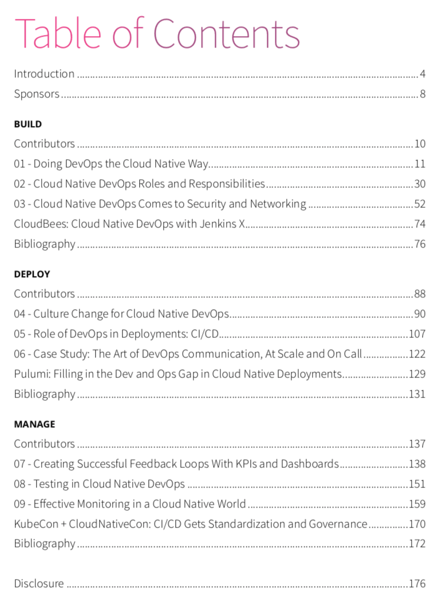
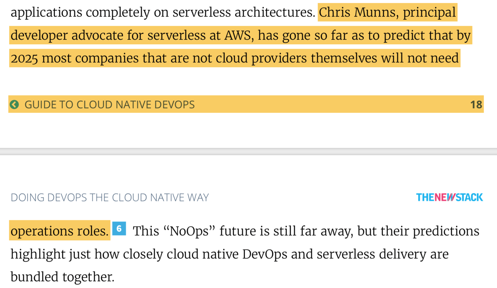

本书的主旨是：如果没有成熟的 DevOps 实践，云原生是玩转不起来的。DevOps 已经不是什么新鲜的话题，但到底什么是 "Cloud Native DevOps”及如何实践 Cloud Native DevOps，这正是本书要探讨的内容。

DevOps 正在经历一次转型，从自动化构建到声明式基础设施、微服务和 Serverless。大部分人对云原生存在误解，以为`云原生`就是`运行在云上`，其实云原生更偏向于一种理念，即应用的定义及架构方式，而不是将应用运行在哪里。而云上的 DevOps 与传统的 DevOps 有什么区别，开发者和运维人员在云原生时代如何转型？也许本书会给你答案。

## 关于本书

本书是由 [TheNewStack](https://thenewstack.com) 出品的免费电子书，可以在 [TheNewStack 网站](https://thenewstack.io/ebooks/devops/cloud-native-devops-2019/) 上获取本书的电子版，同时推荐 [TheNewStack 的电子书系列](https://thenewstack.io/ebooks)，囊括了容器、微服务、Kubernetes、云原生诸多主题，可以作为企业决策的参考读物。

本书是 TheNewStack 编辑集结 DevOps 领域的专家在各种大会上的发言、演讲，有很多观点引用，并结合了一些调查问卷数据展示了一幅云原生 DevOps 的趋势与全景图，下文中我会找一些代表性的观点和图表来说明。

下面是本书目录，一共分为三大部分：构建、部署和管理，其中前两个部分还给出了参考书目、示例研究等。

## 谁适合读这本书

IT 经理、CIO、团队领导者，希望规划自己公司或团队的云原生化 DevOps 的实践路径以面对大规模场景。

## 云原生化的 DevOps

> 云原生是对业务价值和团队功能的重构。

云原生化的 DevOps 在应用的管理上与原始的 DevOps 最大的区别就是——使用 YAML 文件配置的声明式基础设施（Declarative infrastructure）与应用程序的代码本身放在同一个存储库中，这些 `代码` 将由开发团队来维护，而运维团队的职能将转变为基础设施的构建者，服务安全性、健壮性、可见性及耐用性的守护者。

AWS 的 Serverless 布道师 Chris Munns 早已甚至预测到 2025 年非云供应商的运维人员将不复存在，虽然听上去有点危言耸听，但这也是为传统 IT 运维人员的职业生涯敲响的警钟。

开发接手了原来传统运维的一些职责，如配置和发布，减少了每次发布的成本，而运维的职责向管理整个系统的复杂性转变，例如转变为 SRE（Site Reliability Engineer）。	

## 工作流自动化的价值

DevOps 的原始教义：DevOps 不是一种工具或流程，而是一种重视整个组织的持续沟通、协作、集成和自动化的实践。

根据自动化的驱动力及持续时间的长短，将 Workflow Automation 划分为五个类别。

- 业务流程自动化
- 分布式系统通信
- 分布式事务
- 编排
- 决策自动化

## 运维需要做出的转变

Damon Edwards 提出于运维需要面对的四个灾难（[圣经启示录中的四骑士](https://zh.wikipedia.org/wiki/启示录中的四骑士)）：

- Silos（孤岛）
- Ticket queues（无尽的低效的工单）
- Toil（干脏活累活的辛勤）
- Low trust（低信任度）

要向云原生 DevOps 转变就要克服以上几个问题。

## DevOps 领域的扩展

本书第三章中提到 DevOps 的领域扩展到 Security 和 Networking。

- 为了维持合规的编程语言
- 容器镜像扫描
- 基于策略的网络安全
- 金丝雀测试
- 运行时的威胁检测
- 日志分析