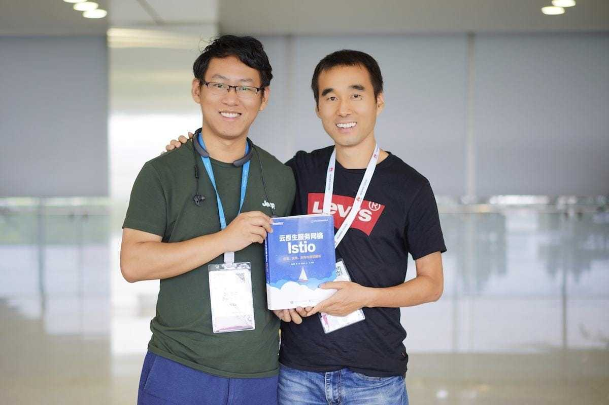
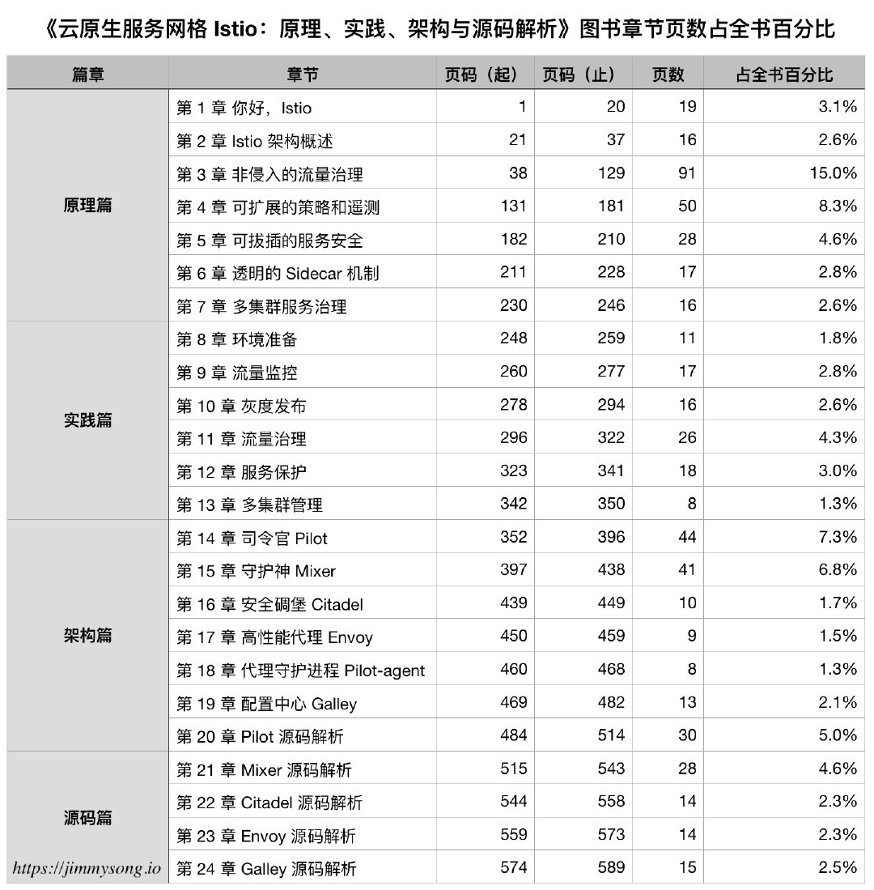
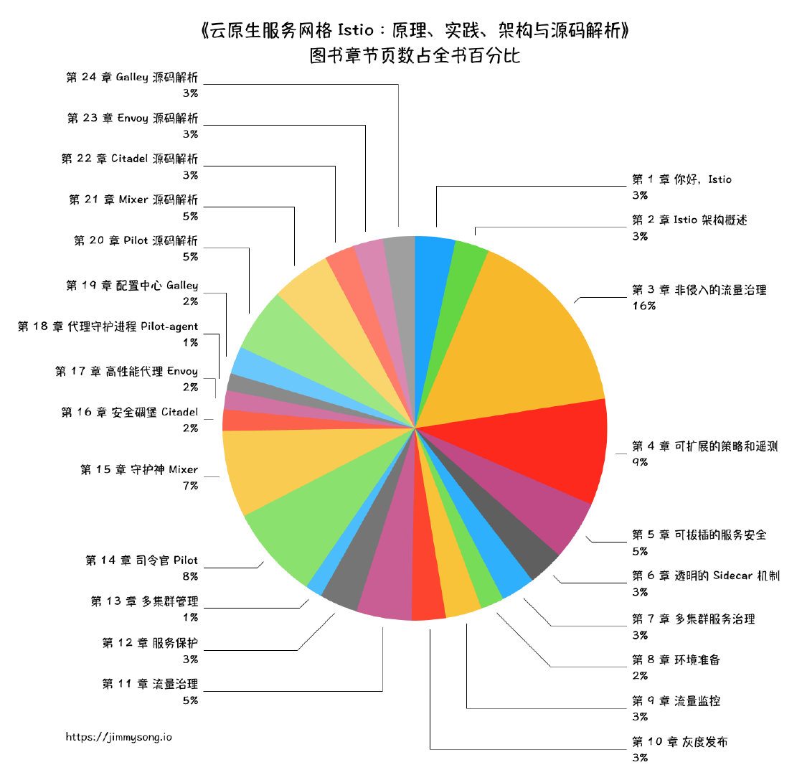

[《云原生服务网格 Istio：原理、实践、架构与源码解析（张超盟、章鑫、徐中虎、徐飞编著）》](https://item.jd.com/12538407.html)是 2019 年国内出版的第四本 Istio 相关图书，前三本分别是：

- [深入浅出Istio：Service Mesh快速入门与实践，崔秀龙 著](https://item.jd.com/12527008.html)
- [Service Mesh实战：用Istio软负载实现服务网格，周遥 著](https://item.jd.com/12516473.html)
- [Istio 入门与实战，毛广献 著](https://item.jd.com/12601120.html)

在这四本书刚上市时我都获得了作者的赠书，这本书是由四位华为的同学编写，于 2019 年  7 月第一次印刷，全书共 24 章，606 页，售价 139 元。我是在 KubeCon China 2019 的上海大会现场张超盟亲手赠与我的，张超盟也是 2018 年[第三届 Service Mesh Meetup](https://www.servicemesher.com/blog/service-mesh-meetup-shenzhen-20180825/) 的讲师。

## 本书结构

全书共分四个篇章，24 个章节，606 页，每个章节的页数占比统计如下图所示。

从统计结果中可以看出书中第 3 章（非侵入的流量治理）、第 14 章（司令官 Pilot）一共占全书的页数百分比为 24%，几乎占了四分之一的篇幅。

这本书是目前（2019年08月15日）市面上能买到的最全的一本 Istio 相关的图书了，话说国外还一本 Istio 的书也出来，国内到现在都出了四本了，是不是有种墙外开花墙内香的感觉？

建议大家结合 [Istio 官方文档](https://istio.io)一起来看这本书，Istio 版本更新虽然没有 Kubernetes 那么快，但是在本书发行一个多月后也要发布 1.2 版本了，欢迎大家[加入 ServiceMesher 社区](https://www.servicemesher.com)一起来共读！

