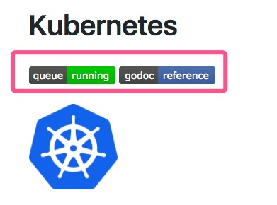
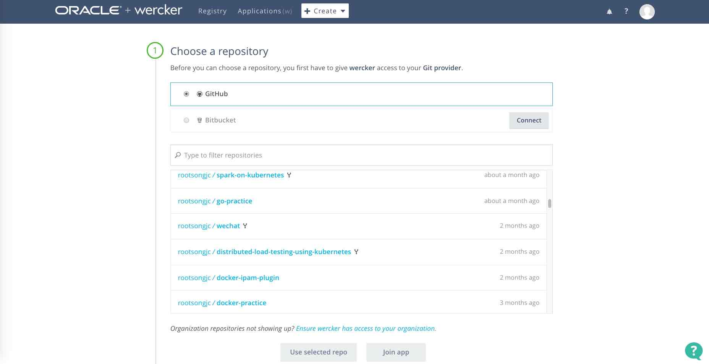
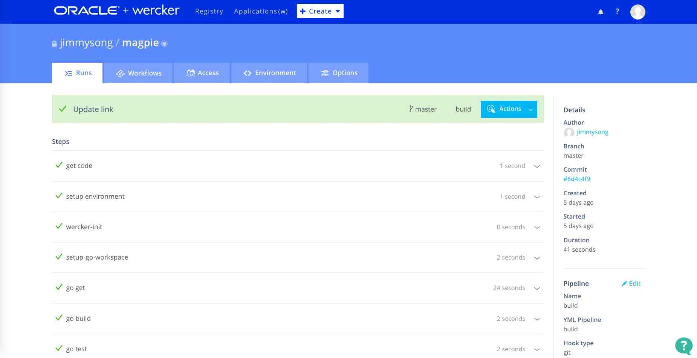
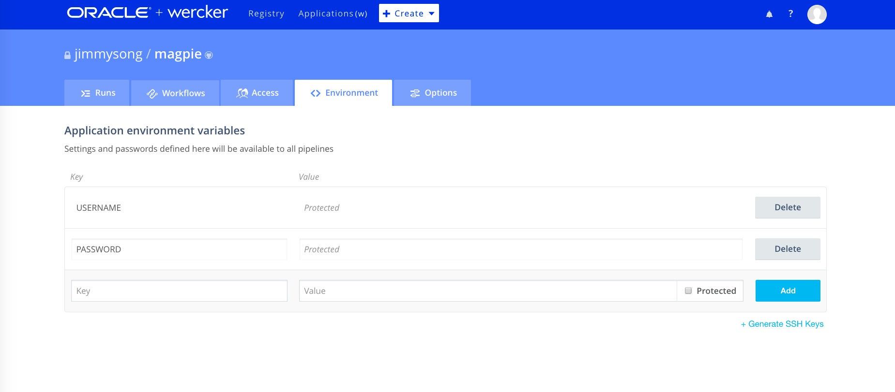
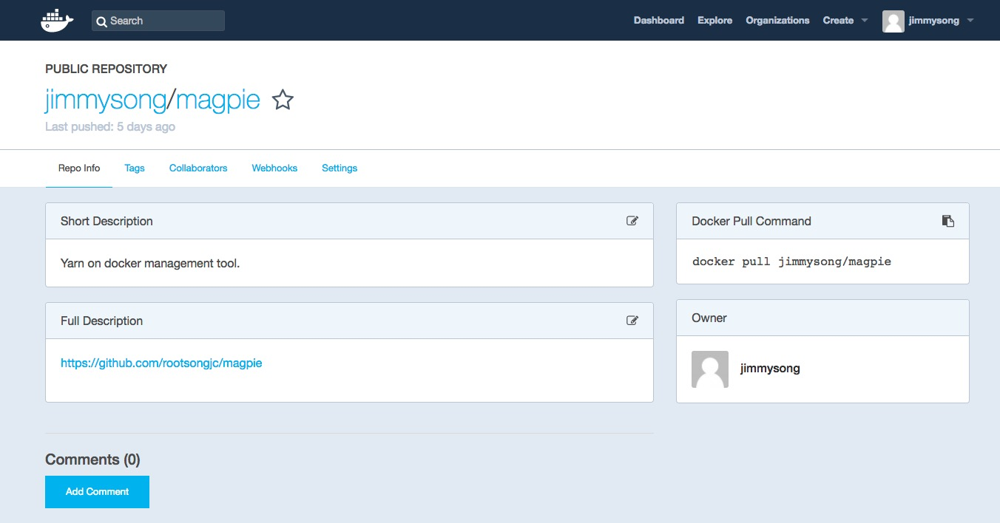

本文介绍了 wercker 和它的基本用法，并用我 GitHub 上的[magpie](https://github.com/rootsongjc/magpie)应用作为示例，讲解如何给 GitHub 项目增加 wercker 构建流程，并将生成的镜像自动上传到 Docker Hub 上。

注：本文参考了[Cloud Native Go](https://jimmysong.io/cloud-native-go)书中的”持续交付“章节。

## CI 工具

开源项目的构建离不开 CI 工具，你可能经常会在很多 GitHub 的开源项目首页上看到这样的东西：



这些图标都是 CI 工具提供的，可以直观的看到当前的构建状态，例如 wercker 中可以在`Application`-`magpie`-`options`中看到：


将文本框中的代码复制到你的项目的`README`文件中，就可以在项目主页上看到这样的标志了。

现在市面上有很多流行的CI/CD工具和DevOps工具有很多，这些工具提高了软件开发的效率，增加了开发人员的幸福感。这些工具有：

适用于 GitHub 上的开源项目，可以直接使用 GitHub 账户登陆，对于公开项目可以直接使用：[Travis-ci](https://travis-ci.org)、[CircleCI](https://circleci.com)、[Wercker](http://www.wercker.com/)。从目前 GitHub 上开源项目的使用情况来看，Travis-ci 的使用率更高一些。

适用于企业级的：[Jenkins](https://jenkins.io/)

不仅包括CI/CD功能的DevOps平台：[JFrog](https://www.jfrog.com/)、[Spinnaker](https://spinnaker.io)、[Fabric8](https://fabric8.io)

## Wercker 简介

Wercker 是一家为现代云服务提供容器化应用及微服务的快速开发、部署工具的初创企业，成立于 2012 年，总部位于荷兰阿姆斯特丹。其以容器为中心的平台可以对微服务和应用的开发进行自动化。开发者通过利用其命令行工具能够生成容器到桌面，然后自动生成应用并部署到各种云平台上面。其支持的平台包括 Heroku、AWS 以及 Rackspace 等。

Wercker 于 2016 年获得 450 万美元 A 轮融资，此轮融资由 Inkef Capital 领投，Notion Capital 跟投，融资所得将用于商业版产品的开发。此轮融资过后其总融资额为 750 万美元。

Wercker 于 2017 年 4 月被 Oracle 甲骨文于收购。

## 为什么使用 Wercker

所有的 CI 工具都可以在市面上获取，但为何要建议使用 Wercker 呢？依据云之道的准则评估了所有工具，发现 Wercker 正是我们需要的。

首先，无须在工作站中安装 Wecker，仅安装一个命令行客户端即可，构建过程全部在云端进行。

其次，不用通过信用卡就可使用 Wercker。当我们迫切希望简化流程时，这是一件令人赞叹的事。付款承诺这一条件大大增加了开发者的压力，这通常是不必要的。

最后，Wercker 使用起来非常简单。它非常容易配置，不需要经过高级培训或拥有持续集成的博士学位，也不用制定专门的流程。

通过 Wercker 搭建 CI 环境只需经过三个基本步骤。

1. 在 Wercker 网站中创建一个应用程序。
1. 将 wercker.yml 添加到应用程序的代码库中。
1. 选择打包和部署构建的位置。

## 如何使用

可以使用 GitHub 帐号直接登录[Wercker](http://www.wercker.com)，整个创建应用 CI 的流程一共 3 步。

一旦拥有了账户，那么只需简单地点击位于顶部的**应用程序**菜单，然后选择**创建**选项即可。如果系统提示是否要创建组织或应用程序，请选择**应用程序**。Wercker 组织允许多个 Wercker 用户之间进行协作，而无须提供信用卡。下图为设置新应用程序的向导页面。



选择了 GitHub 中的 repo 之后，第二步配置访问权限，最后一步 Wercker 会尝试生成一个 wercker.yml 文件（后面会讨论）。不过至少对于 Go 应用程序来说，这个配置很少会满足要求，所以我们总是需要创建自己的 Wercker 配置文件。

## 安装 Wercker 命令行程序

这一步是可选的，如果你希望在本地进行 wercker 构建的话才需要在本地安装命令行程序。本地构建和云端构建都依赖于 Docker 的使用。基本上，代码会被置于所选择的 docker 镜像中（在 wercker.yml 中定义），然后再选择执行的内容和方法。

要在本地运行 Wercker 构建，需要使用 Wercker CLI。有关如何安装和测试 CLI 的内容，请查看 http://devcenter.wercker.com/docs/cli。Wercker 更新文档的频率要比本书更高，所以请在本书中做个标记，然后根据 Wercker 网站的文档安装 Wercker CLI。

如果已经正确安装了 CLI，应该可以查询到 CLI 的版本，代码如下所示。

```ini
Version: 1.0.882
Compiled at: 2017-06-02 06:49:39 +0800 CST
Git commit: da8bc056ed99e27b4b7a1b608078ddaf025a9dc4
No new version available
```

本地构建只要在项目的根目录下输入`wercker build`命令即可，wercker 会自动下载依赖的 docker 镜像在本地运行所有构建流程。

## 创建 Wercker 配置文件 wercker.yml

Wercker 配置文件是一个 YAML 文件，该文件必须在 GitHub repo 的最顶层目录，该文件主要包含三个部分，对应可用的三个主要管道。

- **Dev**：定义了开发管道的步骤列表。与所有管道一样，可以选定一个**box**用于构建，也可以全局指定一个 box 应用于所有管道。box 可以是 Wercker 内置的预制 Docker 镜像之一，也可以是 Docker Hub 托管的任何 Docker 镜像。
- **Build**：定义了在 Wercker 构建期间要执行的步骤和脚本的列表。与许多其他服务（如 Jenkins 和 TeamCity）不同，构建步骤位于代码库的配置文件中，而不是隐藏在服务配置里。
- **Deploy**：在这里可以定义构建的部署方式和位置。

Wercker 中还有**工作流**的概念，通过使用分支、条件构建、多个部署目标和其他高级功能扩展了管道的功能，这些高级功能读着可以自己在 wercker 的网站中探索。

## 示例

我们以我用 Go 语言开发的管理 yarn on docker 集群的命令行工具[magpie](https://github.com/rootsongjc/magpie)为例，讲解如何使用 wercker 自动构建，并产生 docker 镜像发布到 Docker Hub 中。 

下面是 magpie 这个项目中使用的`wercker.yml`文件。

```Yaml
box: golang
build:
  steps:
    # Sets the go workspace and places you package
    # at the right place in the workspace tree
    - setup-go-workspace

    # Gets the dependencies
    - script:
        name: go get
        code: |
          go get github.com/rootsongjc/magpie
    # Build the project
    - script:
        name: go build
        code: |
          go build -o magpie main.go
    # Test the project
    - script:
        name: go test
        code: |
          go test ./...
    - script:
        name: copy files to wercker output 
        code: |
          cp -R ./ ${WERCKER_OUTPUT_DIR}
deploy: 
  steps:
    - internal/docker-push:
        username: $USERNAME
        password: $PASSWORD 
        cmd: /pipeline/source/magpie
        tag: latest
        repository: jimmysong/magpie
```

此文件包含两个管道：build 和 deploy。在开发流程中，我们使用 Wercker 和 Docker 创建一个干净的 Docker 镜像，然后将它 push 到 Docker Hub 中。Wercker 包含一个叫做`Internal/docker-push`的 deploy plugin，可以将构建好的 docker 镜像 push 到镜像仓库中，默认是 Docker Hub，也可以配置成私有镜像仓库。

box 键的值是 golang。这意味着我们使用的是一个基础的 Docker 镜像，它已经安装了 Go 环境。这一点至关重要，因为执行 Wercker 构建的基准 Docker 镜像需要包含应用程序所需的构建工具。

这部分存在一些难以理解的概念。当使用 Wercker 进行构建时，其实并没有使用本地工作站的资源（即使在技术层面上，构建也是在本地执行的），相反，使用的是 Docker 镜像中的可用资源。因此，如果要使用 Wercker 编译 Go 应用程序，需要首先运行包含 Go 的 Docker 镜像。如果想要构建唯一的工件，无论它是在本地还是在 Wercker 的云端运行，使用 Docker 镜像都是完全合理的。

本次构建中运行的第一个脚本是 go get。这一步可以 go get 可能需要的、但不包含在基础镜像中的任何东西。无论为脚本设置什么名称，构建输出都会有所显示，如下图所示。



在 build 管道中，接下来的两个脚本执行的构建和测试流程，最后一个脚本是将构建后的文件拷贝到 wercker 的输出目录中，我们将使用该目录构建 docker 镜像。

我们注意到 deploy 中有两个变量：`$USERNAME`、`$PASSWORD`，这是我们自定义的变量，当你不希望将隐私内容直接写在代码中的时候，可以在 wercker 中自定义变量，变量可以只作用于单个 pipeline，也可以是所有 pipeline 共享的。



可以将变量设置成**Protected**模式，这样只有设置者本人才知道该变量的值是什么，其他人即使有共享访问权限，也看不到该变量的值，但可以重新设置来覆盖原值。

Deploy 管道中配置的 docker 镜像的 repo、tag 和 cmd 命令，其他容器配置都在代码顶层目录的`Dockerfile`中定义。当整个构建流程完成后，就可以在 docker 镜像仓库中看到刚构建的镜像`jimmysong/magpie:latest`了。



## 总结

当然以上只是一个很简单的示例，还有很多可以优化的流程，比如我们在示例使用`latest`作为 docker 镜像的 tag，wercker 本身提供了很多内置和构建时[环境变量](http://devcenter.wercker.com/docs/environment-variables/available-env-vars)，我们可以在`wercker.yml`文件里获取这些变量作为命令中的值。

当比于其他 CI 工具，wercker 配置简单，更易于使用，同时在 wercker 的 registry 中还可以看到很多别人构建的 pipline 可供参考，还有十分友好的[workflows](http://devcenter.wercker.com/docs/workflows)可用于编排构建流程和依赖。

当然 CI 工具的功能不止这些，利用它可以实现很多自动化流程，节约我们的时间，解放生产力，更多玩法就要大家自己去探索了。

## 参考

- [容器化应用开发部署平台 Wercker 获 450 万美元 A 轮融资](http://36kr.com/p/5042850.html)
- [甲骨文收购创业公司 Wercker 为开发人员自动化代码测试部署]([http://www.admin5.com/article/20170418/737167.shtml)
- [Wercker docs](http://devcenter.wercker.com/docs/home)
- [Wercker workflow](http://devcenter.wercker.com/docs/workflows)
- [magpie](https://github.com/rootsongjc/magpie)
