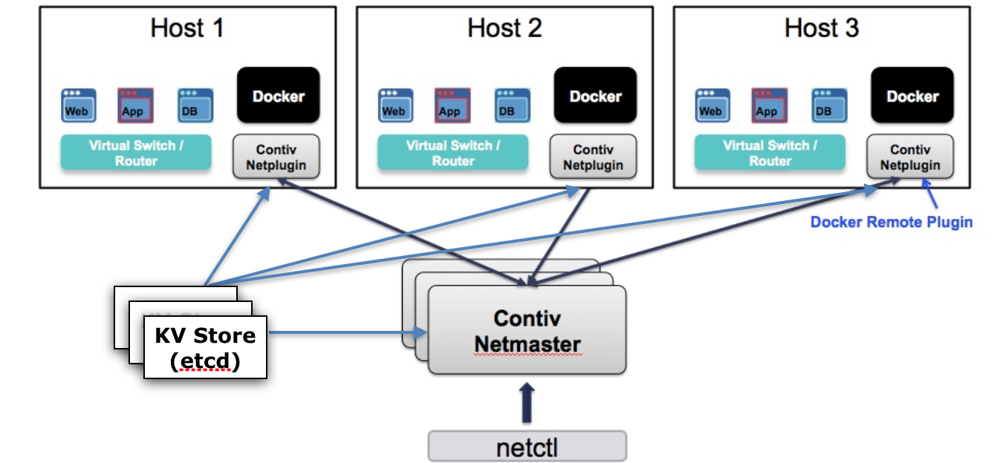
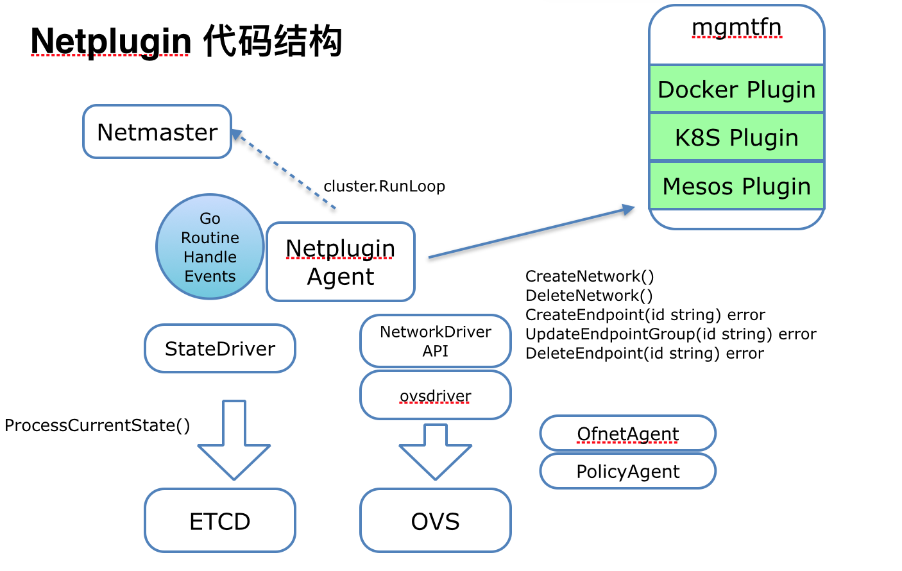

**Contiv**是思科开发的 docker 网络插件，从 2015 年就开源了，业界通常拿它和 Calico 比较。貌似 Contiv 以前还开发过 volume plugin，现在销声匿迹了，只有 netplugin 仍在活跃开发。

[容器网络插件 Calico 与 Contiv Netplugin 深入比较](http://dockone.io/article/1935)。

还有篇文章讲解了[docker 网络方案的改进](http://blog.dataman-inc.com/shurenyun-docker-133/)。

### Contiv Netplugin 简介

Contiv Netplugin 是来自思科的解决方案。编程语言为 Go。它基于 OpenvSwitch，以插件化的形式支持容器访问网络，支持 VLAN，Vxlan，多租户，主机访问控制策略等。作为思科整体支持容器基础设施 contiv 项目的网络部分，最大的亮点在于容器被赋予了 SDN 能力，实现对容器更细粒度，更丰富的访问控制功能。另外，对 Docker CNM 网络模型的支持，并内置了 IPAM 接口，不仅仅提供了一容器一 IP，而且容器的网络信息被记录的容器配置中，伴随着容器的整个生命周期，减低因为状态不同步造成网络信息丢失的风险。有别于 CNI，这种内聚化的设计有利于减少对第三方模块的依赖。随着项目的发展，除了 Docker，还提供了对 Kubernetes 以及 Mesos 的支持，即 CNI 接口。

- Netmaster 后台进程负责记录所有节点状态，保存网络信息，分配 IP 地址
- Netplugin 后台进程作为每个宿主机上的 Agent 与 Docker 及 OVS 通信，处理来自 Docker 的请求，管理 OVS。Docker 方面接口为 remote driver，包括一系列 Docker 定义的 JSON-RPC(POST) 消息。OVS 方面接口为 remote ovsdb，也是 JSON-RPC 消息。以上消息都在 localhost 上处理。
- 集群管理依赖 etcd/serf

### Netplugin 的优势

- 较早支持 CNM 模型。与已有的网络基础设施兼容性较高，改造影响小。基于 VLAN 的平行扩展与现有网络结构地位对等
- SDN 能力，能够对容器的网络访问做更精细的控制
- 多租户支持，具备未来向混合云/公有云迁移的潜力
- 代码规模不大，逻辑结构清晰，并发好，VLAN 在公司内部有开发部署运维实践经验，稳定性经过生产环境验证
- <u>**京东**基于相同的技术栈（OVS + VLAN）已支持 10w+ 容器的运行。</u>

### Next

后续文章会讲解 contiv netplugin 的环境配置和开发。目前还在 1.0-beta 版本。**Docker store**上提供了 contiv 插件的[下载地址](https://store.docker.com/plugins/803eecee-0780-401a-a454-e9523ccf86b3)。
