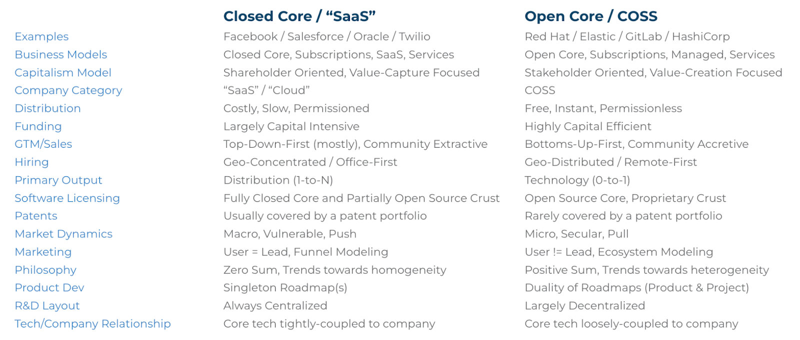

昨天 COSS（Commercial Open Source）公司的创始人也是投资者 Joseph（JJ）Jacks 给我发消息，让我看下他们新发布的这个报告。



我早就知道 JJ 创业搞了一个 COSS 投资公司并创立了一个基金，这次他整理的这个全球 COSS 公司融资数据还是比较全面的。



COSS 是英文 Commercial Open Source Software（商业化开源软件）的简称，COSS 公司指的依靠这些 COSS 而生存的公司，即如果没有这些软件，这家公司就不会存在，例如：

- 如果没有 Kafka 就没有 Confluent；
- 如果没有 Hadoop 就没有 Cloudera；
- 如果没有 Spark，就没有 Databricks；
- 如果没有 Git，就没有 GitLab；
- 如果没有 Linux，就没有 Red Hat、SUSE 等；



COSS 与 SaaS 类公司的区别见下图。

## 关于 COSS 公司融资的一些数据

自 2020 年一月至 2022 年 8 月（32 个月）这段时间内全球公开的 COSS 公司融资数据如下：

- 500+ 次融资
- 360+ 家 COSS 初创公司
- 340+ 个开源项目
- 230+ 家风投公司参与
- 总融资 240+ 亿美元
- 平均每月融资 7.5 亿美元
- 2021 年 2 月和 2021 年 9 月单月融资规模最大

更多详细数据请阅读博客 [Global VC Funding In COSS: $24B+ Raised From Jan 2020 to August 2022](https://www.coss.community/cossc/global-vc-funding-into-coss-24b-raised-from-jan-2020-to-august-2022-3pc6) 和[原始数据表格](https://docs.google.com/spreadsheets/d/1Bz0lxWzwW8q9AUSO5HgRrUyfR47em6YQW4h8PF_vRmE/edit#gid=666389338)。

## 中国的开源商业化公司

近两年中国也涌现了一系列的开源商业化（COSS）公司，例如：



| 开源软件                | 公司名称                                 |
| ----------------------- | ---------------------------------------- |
| Apache ShardingSphere   | [SphereEx](https://sphere-ex.cn)         |
| TDengine                | [涛思数据](https://www.taosdata.com/)    |
| OceanBase               | [OceanBase](https://www.oceanbase.com/)  |
| Apache APISIX           | [API7](https://www.apiseven.com/)        |
| Apache Pulsar           | [StreamNative](https://streamnative.io/) |
| Apache DolphinScheduler | 未知                                     |
| Nebula Graph            | [悦数科技](https://www.vesoft.com/cn/)   |
| Milvus                  | [Zilliz](https://zilliz.com/)            |



以上仅列举了部分笔者观察到的 COSS 公司，如有遗漏，欢迎补充。

## 总结

在 2020 年之前国内也有不少开源商业化公司，比如 PingCAP、Kylingence、EasyStack 等，2020 年后似乎在全球都有一种 COSS 创业的趋势，国内的开源商业化相对于国外还处于比较早期的阶段，一是有影响力的开源项目太少，二是国内用户尚未对商业化开源软件的付费的习惯，还有一些其他政策和法规问题。

