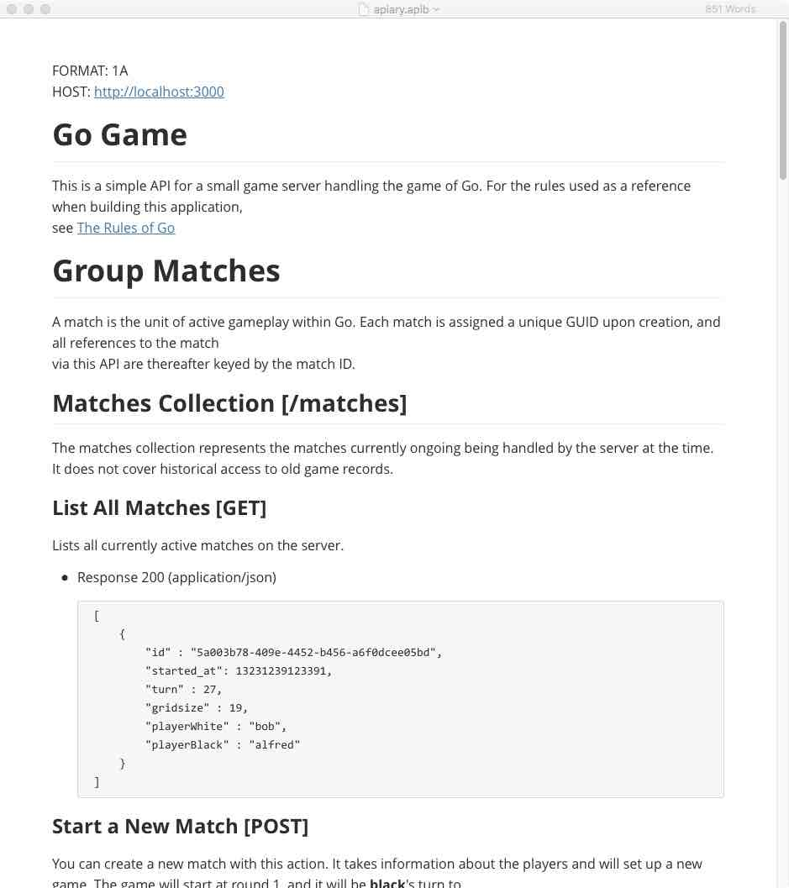
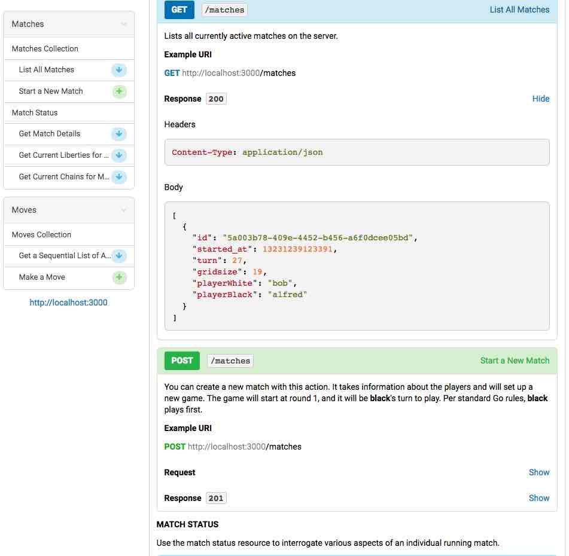
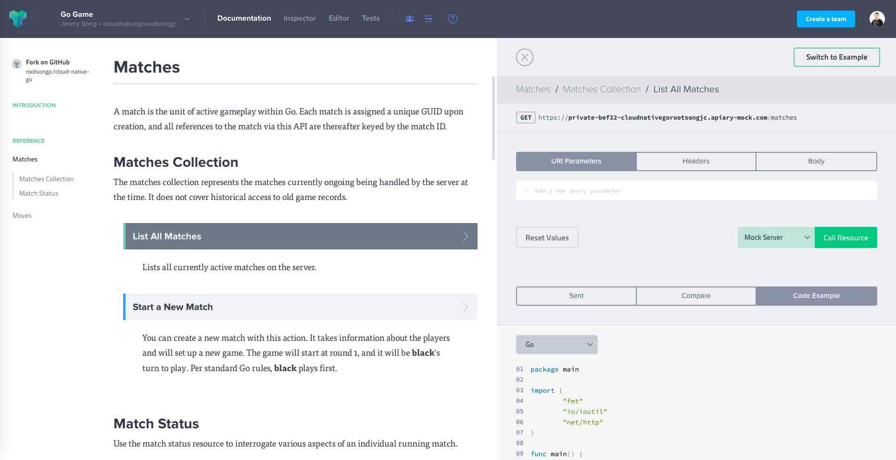

在进行微服务开发的过程中，为了保证最终开发的系统跟最初的设计保持一致，约定RESTful接口之间的调用方法，我们需要将API设计文档化，因此我们引入了API Blueprint。

## API Blueprint 是什么

[API Blueprint](https://apiblueprint.org/) 用来编写API文档的一种标记语言，类似于Markdown，因为是纯文本的，所以方便共享编辑，具体的语法规则可以在 [API Blueprint documentation](https://apiblueprint.org/documentation/) 查看，配合一些开源的工具可以把接口文档渲染成 html 再搭配一个静态服务器，方便于分享。

另外，配合一些工具，可以直接生成一个 mock data 数据，这样只要和后端的同学约定好接口格式，那么前端再开发的时候可以使用 mock data 数据来做测试，等到后端写好接口之后再做联调就可以了。

我们以[Cloud Native Go](https://jimmysong.io/cloud-native-go)书中的[gogo-service](https://github.com/rootsongjc/gogo-service)示例里的`apiary.apib`文件为例。

该文件实际上是一个Markdown格式的文件，Github中原生支持该文件，使用[Typora](https://typora.io)打开后是这样子。



在Visual Studio Code中有个API Element extension对于API Blueprint文件的支持也比较好。

## 生成静态页面和进行冒烟测试

我们分别使用开源的[aglio](https://github.com/danielgtaylor/aglio)和[drakov](https://github.com/Aconex/drakov)来生成静态页面和进行冒烟测试。

[aglio](https://github.com/danielgtaylor/aglio) 是一个可以根据 api-blueprint 的文档生成静态 HTML 页面的工具。

其生成的工具不是简单的 markdown 到 html 的转换, 而是可以生成类似 rdoc 这样的拥有特定格式风格的查询文档。

在本地安装有node环境的情况下，使用下面的命令安装和使用aglio。

```bash
$ npm install -g aglio
$ aglio -i apiary.apib -o api.html
```

打开api.html文件后，如图：



安装和使用drakov。

```bash
$ npm install -g drakov
$ drakov -f apiary.apib -p 3000
[INFO] No configuration files found
[INFO] Loading configuration from CLI
   DRAKOV STARTED   
[LOG] Setup Route: GET /matches List All Matches
[LOG] Setup Route: POST /matches Start a New Match
[LOG] Setup Route: GET /matches/:match_id Get Match Details
[LOG] Setup Route: GET /matches/:match_id Get Current Liberties for Match
[LOG] Setup Route: GET /matches/:match_id Get Current Chains for Match
[LOG] Setup Route: GET /matches/:match_id/moves Get a Sequential List of All Moves Performed in a Match
[LOG] Setup Route: POST /matches/:match_id/moves Make a Move
   Drakov 1.0.4      Listening on port 3000
```

通过`http://localhost:3000`就可以对该应用进行冒烟测试了。

例如查询有哪些match：

```bash
$ curl http://localhost:3000/matches
[
    {
        "id" : "5a003b78-409e-4452-b456-a6f0dcee05bd",
        "started_at": 13231239123391,
        "turn" : 27,
        "gridsize" : 19,
        "playerWhite" : "bob",
        "playerBlack" : "alfred"
    }
]
```
另外通过[Apiary](https://apiary.io)这个网站，我们可以直接以上的所有功能，还可以同时在页面上进行mock test，生成多种语言的code example。如图：


