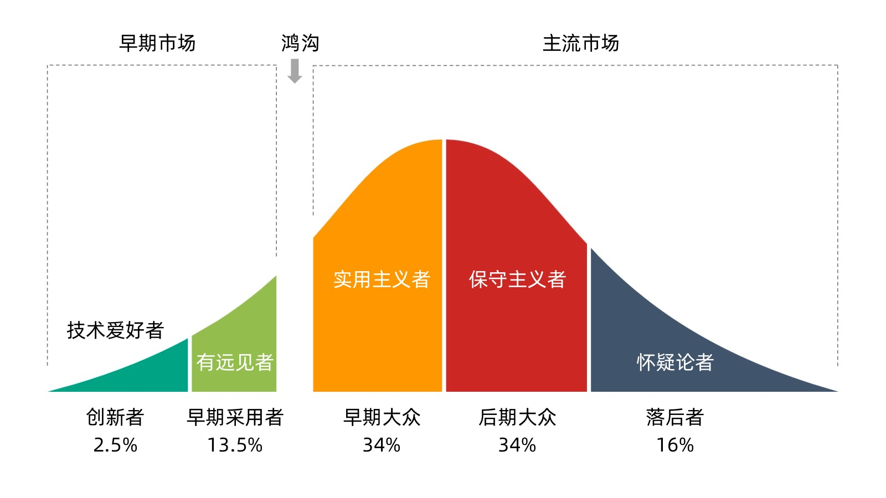

最近为某网站撰写服务网格技术的 2021 年总结，笔者关注该领域也有 4 年时间了，再结合自己最近这几年对云原生行业发展的观察，越发觉得《跨越鸿沟》（Crossing the chasm）这本书中所写的新技术的推广生命周期一一应验了。虽然该理论由 Jeffery Moore 于 1991 年提出，距今已有 30 年时间，但该理论至今依然奏效，另外该理论也在 [CNCF 项目](https://www.cncf.io/projects/)的成熟度划分中得到应用，还有人指出过[云原生技术需要跨越的鸿沟](https://www.infoq.cn/article/hv5dft_bgjdfpqongzqx)。本文将为读者分享一些关于” 鸿沟理论 “有关的一些知识，希望能够引发大家对于新技术推广的一些思考。

## 什么是鸿沟理论？

鸿沟理论指的就是高科技产品在市场营销过程中遭遇的最大障碍：高科技企业的早期市场和主流市场之间存在着一条巨大的鸿沟，能否顺利跨越鸿沟并进入主流市场，成功赢得实用主义者的支持，就决定了一项高科技产品的成败。实际上每项新技术都会经历鸿沟。关键在予采取适当的策略令高科技企业成功地 “跨越鸿沟”，摩尔在这本书中就告诉了人们一些欠经考验的制胜秘诀。

## 前言

基于经典的钟形曲线分布，“跨越鸿沟 " 是一个将新技术的采用随时间推移而可视化的概念：从一小撮早期采用者开始，经过大规模的中端市场，最终进入最抗拒变化的消费者手中。

1962 年，社会学家 [Everett Rogers](https://en.wikipedia.org/wiki/Everett_Rogers) 出版了 [Diffusion of Innovasions](https://en.wikipedia.org/wiki/Diffusion_of_innovations)（创新扩散） 一书。在这本书中，他根据消费者的购买行为，将他们分为不同的群体。他以 500 多项扩散研究的结果为基础进行分类。今天，这个模型被称为 “技术采用生命周期”。这个模型全面地描述了新技术产品或创新的采用或接受情况。在《跨越鸿沟》一书中，杰弗里・摩尔根据扩散生命周期中的客户群体，阐述了成功锁定主流消费者的营销技巧。

## 客户群体

基于人口学和心理学特征，客户群保护以下五种：

- 创新者
- 早期采用者
- 早期大众
- 后期大众
- 落后者

图：”鸿沟理论“客户分布情况

## 分布情况

正如可以观察到的，技术采用的生命周期有一个钟形曲线。各个分界线大约相当于标准差的落点。这意味着：

- 创新者约占总人口的 2.5%
- 早期采用者约占 13.5%
- 早期大众和后期大众均为 34%
- 落后者占剩余的 16%

每个群体都代表着一个独特的心理特征，即心理和人口特征的组合。因此，针对这些群体的营销需要与其他群体完全不同的策略。营销人员通过更好地了解这些群体之间的差异，可以通过正确的营销技术更好地锁定所有这些消费者。

### 创新者

创新者是技术爱好者。这是第一个有可能投资于你产品的消费者群体。创新者积极地追求新的产品和技术。有时，他们甚至在公司启动正式的营销计划之前就开始寻求创新。这是因为技术在他们的生活或业务中占据了核心利益。对于这个客户群体来说，产品功能组合的完整性或性能是次要的。

不幸的是，在任何特定的细分市场中，都没有很多创新者（大约 2.5%）。通常情况下，他们不愿意为新产品付出很多。尽管如此，赢得他们是很重要的，因为他们的认可为市场上的其他消费者提供了必要的保证。此外，技术爱好者可以作为一个测试小组，在面向主流市场之前进行必要的修改。

### 早期采用者

和创新者一样，早期采用者也是有远见的人，他们在新产品的生命周期的早期就接受了新产品的概念。然而，与创新者不同，他们不是技术专家。相反，他们是有远见的人，不只是在寻找一种改进，而且是一种革命性的突破。因此，他们愿意承担高风险，尝试新事物。他们是对价格最不敏感的客户群体，对产品的功能设置和性能要求很高。

早期采用者在做出购买决定时不依赖成熟的参考资料。相反，他们更愿意依靠自己的直觉和眼光。此外，他们愿意作为其他采用者群体的参考。由于有远见的人善于提醒其他人群，他们是最重要的争取对象。

### 早期大众

这个客户群由实用主义者组成。前两个采用者群体属于早期市场。然而，为了获得真正的成功，一个公司必须从早期大众开始，赢得主流市场。这些实用主义者与早期采用者有一些相同的能力，能够与技术产生联系。然而，他们受到强烈的实用意识的驱动。他们知道，很多发明最终会成为过眼云烟。因此，在自己投资之前，他们更期望等待，看看其他客户对该技术的使用情况如何。他们希望在进行大量投资之前看到成熟的参考资料。因为这部分人很多（大约 34%），对于任何努力争取大量利润和增长的企业来说，赢得这些人的支持是最基本的。

### 后期大众

这个群体主要由保守派组成。后期大众作为一个群体与早期大众一样大（占总人口的 34%）。他们与早期大众有着同样的担忧。此外，他们对传统的信仰远远多于对进步的信仰。早期大众的顾客如果决定购买新技术产品，他们对自己处理该产品的能力感到满意。相比之下，“后期大众 " 的成员则不然。因此，这些保守派更愿意等到某样东西已经成为一种惯例时才购买。

### 落后者

这个群体是由怀疑论者组成的。这一部分人占总数的 16%。这些人根本不希望与新技术有任何关系。他们唯一一次购买技术产品是当它被深埋在另一个产品中时。这些持怀疑态度的人强烈认为，颠覆性的创新很少能实现他们的承诺。他们总是担心意外的后果。从市场发展的角度来看，落后者通常被认为是不值得追求的。然而，他们对产品功能设置和性能的批评为技术公司提供了宝贵的反馈。

## 鸿沟

在技术采用生命周期中，你可以看到早期采用者和早期大众群体之间的差距。这个差距代表了技术必须跨越的鸿沟。它标志着将左边的群体作为右边的客户群的参考基础而产生的可信度差距。**鸿沟的存在是因为消费者信任属于他们自己的采用者群体的人的推荐。**

当然，这给技术公司带来了一个具有挑战性的困境。

如果他们还没有从你这里买过东西，你怎么能利用首选参考群体的人呢？

换句话说，将一个群体的客户作为其他群体的参考是无效的。因此，鸿沟就是这样产生的！

由于从早期采用者到早期大众的飞跃意味着从早期市场到主流市场的过渡，跨越鸿沟对于新推出的产品 / 技术真正实现市场成功是最重要的。

## 总结

根据摩尔的说法，成功跨越鸿沟可以通过首先瞄准早期大众中一个非常具体的利基市场来实现。组织试图跨越鸿沟的唯一目标应该是在主流市场上获得一个桥头堡，以创造一个可供参考的实用主义客户群。在这里，细分就是一切：将你所有的营销资源集中在一个特定的细分市场上，并确保你在这个特定的细分市场上成为领导者，然后再去做下一个细分市场。这就是所谓的 “大鱼小池 " 的方法。营销漏斗或 AIDA 模型是一个很好的营销框架，它可以帮助为潜在客户挑选正确的营销技术。此外，确保你的产品提供一个完整的解决方案，并且服务水平高（即整个产品解决方案）。实用主义者对你的产品的用户体验将最终决定他们是否也会激起他们的同行。一旦你在早期大众的不同部分建立了强大的口碑，你就成功地跨越了鸿沟。

## 更多

你觉得服务网格目前处于鸿沟理论的哪个阶段呢？你又是何种受众？

## 参考

- [《Crossing the Chasm》丨 NOTES - jianshu.com](https://www.jianshu.com/p/a305fa93580b)
- [灵雀云 CTO 陈恺：从 “鸿沟理论” 看云原生，哪些技术能够跨越鸿沟？ - infoq.cn](https://www.infoq.cn/article/hv5dft_bgjdfpqongzqx)
