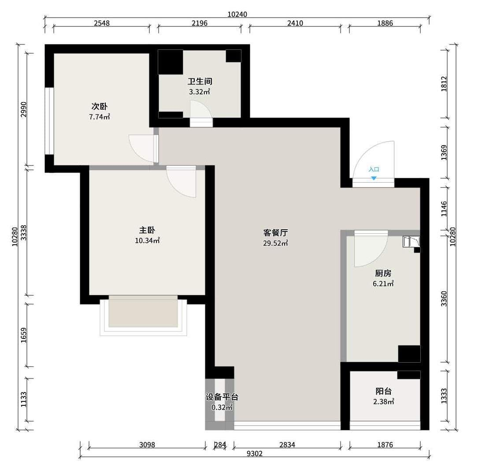
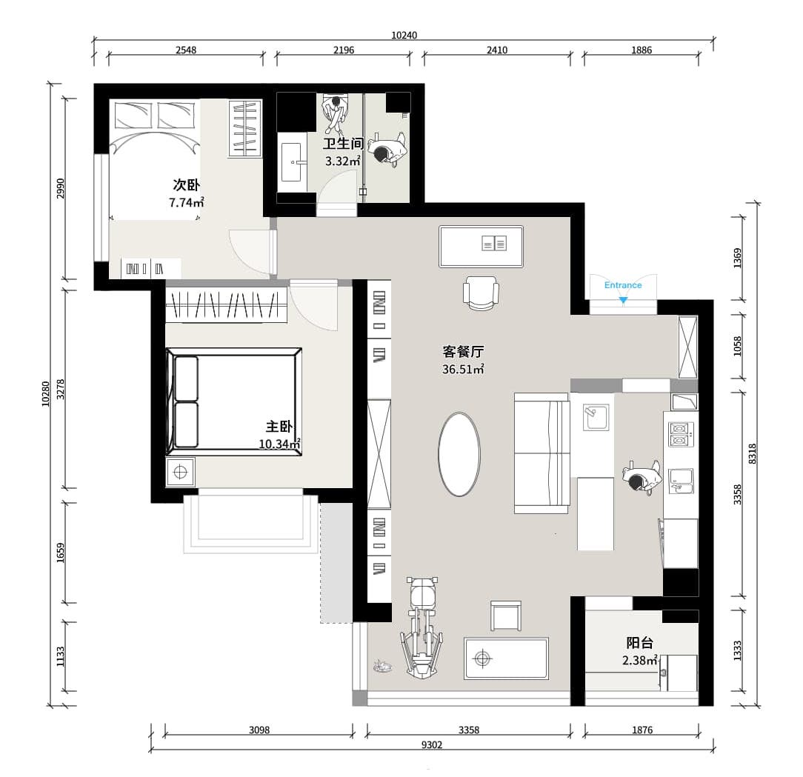

本文记录了 2023 年 2 月入手自己的第一套房后装修的全过程。

## 前言 {#foreword}

现在买的这套房是 2022 年 7 月网签的，业主给了半年的首付周期，所以到 2023 年 2 月才交房。在这之前，房子里 还有人租住，我也仅请过某互联网全包公司现场量过房，并与他们的设计师交谈过，对方案不是很满意。然后有看过其他两个全包公司，我觉得他们的报价太贵，且可选材料有限，最终选择了**设计师 + 工长**的形式来装修。

## 房屋情况 {#department-status}

我的房子位于北京朝阳，朝青版块某小区的中高层小户型两居，建与 2007 年，地暖集中供暖。房子的装修比较一般，门窗都已老旧，但是它的户型，尤其是大客厅落地窗是最吸引我的地方。在交房之前我去现场量过一次房，自己画了一份平面图，如图 1 所示。

注：图中深黑色的部分为承重墙，浅灰色部分为非承重墙。

因为比较喜欢 LDK 设计，所以想把客厅和厨房打通，形成一个客餐厅。


"L" 代表起居室（Living Room），"D" 代表餐厅（Dinning Room）,"K" 则代表厨房（Kitchen）。即让客厅、餐厅、厨房共处于一个开放空间内，构成家的“核心区”。详见 [「装修干货」大家都在“吹嘘”的 LDK 设计到底是什么？](https://zhuanlan.zhihu.com/p/386113096)



## 自主设计 {#self-design}

时间：2022 年 7 月 - 2023 年 2 月

在交房之前是自主设计阶段，我使用了[酷家乐](https://kujiale.com)绘制了户型图及基本硬装设计，并渲染出了效果图。这款软件大大降低了装修设计的入门门槛，操作方便，逻辑清晰，推荐大家试一试。

考虑到家中的人口——目前家里一共两口人，加两只猫，笔者需要居家办公，还有给两只猫预留个厕所，因此也要考虑到动线设计。在计划将客厅与厨房打通后，我重新绘制了平面图，并添加了部分家具，如图 2 所示。

使用酷家乐还可以绘制 3D 效果图，我的第一版设计的效果图如图 3 所示。



注：本图为本人设计，家具仅供位置和大小示意，样式尚未确定。

## 寻找设计师

时间：2023 年 2 月

因为需要对房子进行比较大的改造，所以我们需要寻找一个设计师。
