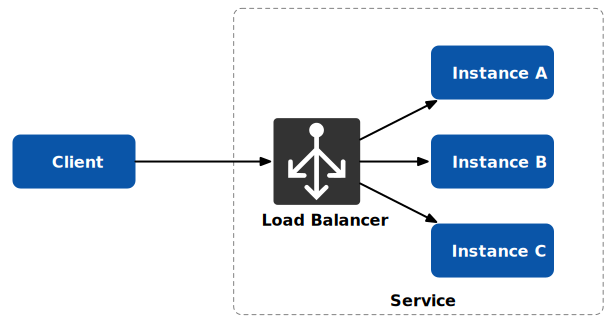
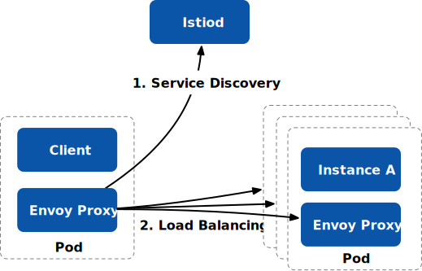
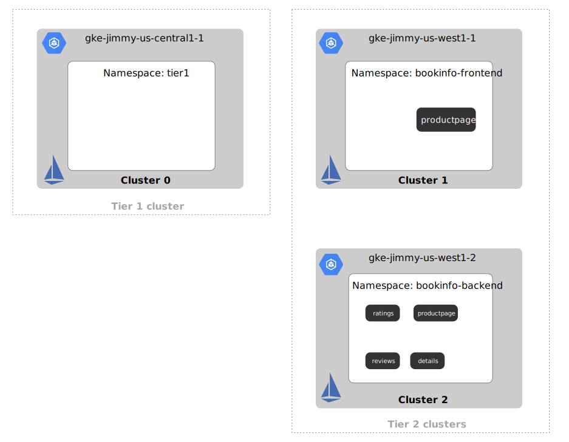
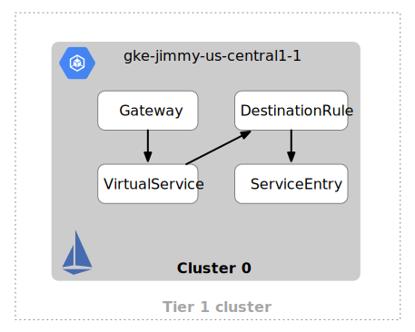
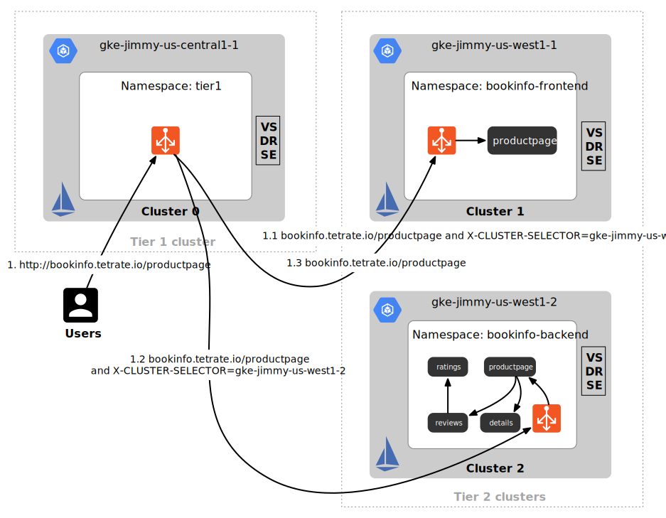



本文介绍了 Istio 中支持的负载均衡类型，然后提出多集群网格负载均衡的解决方案。如果您已经了解 Istio 中负载均衡，可以直接从[多集群网格中的负载均衡](#multicluster)部分开始阅读。



在之前的博客[为什么在使用了 Kubernetes 后你可能还需要 Istio](https://jimmysong.io/blog/why-do-you-need-istio-when-you-already-have-kubernetes/) 中提到 Istio 是在 Kubernetes 的基础之上构建起来的，Kubernetes 中的组件 kube-proxy 本身已有负载均衡功能，但是只支持四层流量的负载均衡，而且无法实现服务超时、熔断等高级功能。具体来说，服务网格比起 Kubernetes 新增了以下负载均衡及韧性（Resiliency）特性：

1. **Layer 7 负载均衡**：服务网格在应用层（Layer 7）操作和管理流量，可以更细粒度地识别和控制流量。这使得它可以实现更高级的负载均衡策略，如基于 HTTP 请求头、URL 路径、Cookie 等的路由和流量分发。

2. **动态负载均衡**：服务网格通常具备自动负载均衡的能力，可以根据后端服务的实时健康状态和性能指标来动态分发流量。这允许它实现智能负载均衡策略，将流量路由到性能最佳的服务实例。

3. **故障检测和自动故障转移**：服务网格具备高级的故障检测和自动故障转移功能。它可以检测到后端服务实例的故障，并自动将流量从故障实例转移到健康实例，以确保应用程序的可用性。

4. **A/B 测试和金丝雀发布**：服务网格允许实施高级部署策略，如 A/B 测试和金丝雀发布。这些策略允许在不同的服务版本之间动态分配流量，并根据结果进行决策。

5. **熔断和重试**：服务网格通常包含熔断和重试机制，以提高应用程序的可用性和稳定性。它可以根据后端服务的性能和可用性情况来自动执行熔断操作，并在必要时重试请求。

6. **全局流量控制**：服务网格提供了集中式的流量控制和策略定义，允许对整个服务网格中的流量进行全局管理。这使得实现统一的安全性、监控和策略成为可能。

7. **深度集成的监控和追踪**：服务网格通常集成了强大的监控和追踪工具，可以提供有关流量性能和可见性的详细信息，帮助进行故障排除和性能优化。

虽然 Kubernetes 提供了基本的负载均衡能力，但服务网格在其之上构建了更高级的负载均衡和流量管理功能，以满足微服务架构中复杂的需求。

### 客户端负载均衡 vs 服务端负载均衡

客户端负载均衡和服务端负载均衡是两种不同的负载均衡方法，它们在不同的场景和应用中有各自的优势。以下是对它们的解释，适用的场景，实现案例以及相关的开源项目：

**客户端负载均衡（Client-Side Load Balancing）**

客户端负载均衡的示意图如图 1 所示。


- **定义**：在客户端负载均衡中，负载均衡决策是由服务的消费者（客户端）来做出的。客户端负载均衡器通常会维护一个服务实例列表，并根据配置和策略选择要发送请求的实例。

- **适用场景**：客户端负载均衡适用于以下情况：
  - 多个客户端需要访问同一组后端服务，每个客户端可以根据自己的需求和策略选择后端服务。
  - 服务消费者需要更多的流量控制和策略定义，例如 A/B 测试、金丝雀发布等。

- **实现案例**：常见的实现客户端负载均衡的开源项目包括：
  - **Ribbon**：Netflix Ribbon 是一个用于客户端负载均衡的开源项目，它可以与 Spring Cloud 集成。
  - **Envoy**：Envoy 是一个高性能的代理服务器，支持客户端负载均衡，广泛用于服务网格和微服务架构中。
  - **NGINX**：虽然 NGINX 通常用于反向代理，但也可以用作客户端负载均衡器。

**服务端负载均衡（Server-Side Load Balancing）**

服务端负载均衡如图 2 所示。



- **定义**：在服务端负载均衡中，负载均衡决策是由服务端的负载均衡器或代理来做出的。客户端只需将请求发送到服务端，然后服务端决定将请求路由到哪个后端服务实例。

- **适用场景**：服务端负载均衡适用于以下情况：
  - 客户端不关心后端服务的具体实例，只关心发送请求到服务的名称或地址。
  - 负载均衡策略需要在服务端进行全局配置，客户端不需要关心负载均衡细节。

- **实现案例**：常见的实现服务端负载均衡的开源项目包括：
  - **NGINX**：NGINX 可以用作反向代理服务器，执行服务端负载均衡，将请求路由到后端服务。
  - **HAProxy**：HAProxy 是一种高性能的负载均衡器，通常用于服务端负载均衡。
  - **Amazon ELB（Elastic Load Balancer）**：亚马逊提供的负载均衡服务，用于将请求路由到 AWS 后端服务实例。

在实际应用中，有时也会将客户端负载均衡和服务端负载均衡结合使用，以满足特定的需求。选择哪种负载均衡方法通常取决于您的架构、部署需求以及性能要求。服务网格（如 Istio）通常使用客户端负载均衡来实现细粒度的流量控制和策略定义，而在云服务提供商中，服务端负载均衡通常用于自动扩展和流量管理。

### Istio 如何实现负载均衡 {#how-istio-do-lb}

在服务网格（如 Istio）中，客户端负载均衡通常是通过 Envoy 代理实现的。Envoy 是一个高性能的代理服务器，它可以用于构建服务网格的数据平面，用于处理服务之间的通信。客户端负载均衡是一种在服务消费者（客户端）一侧实现的负载均衡策略，它决定了请求应该如何路由到后端服务实例。

单集群单网络 Istio 服务网格的负载均衡如图 3 所示。



以下是服务网格中如何实现客户端负载均衡的一般流程：

1. **Sidecar 代理**: 在服务网格中，每个部署的服务实例通常都与一个 Sidecar 代理（通常是 Envoy）关联。这个 Sidecar 代理位于服务实例旁边，负责处理该服务实例的入站和出站流量。

2. **服务注册与发现**: 在服务网格中，服务实例的注册和发现通常由服务注册表（Kubernetes 的服务发现机制）处理。这些注册表维护了服务实例的信息，包括它们的网络地址和健康状态。

3. **客户端负载均衡配置**: 在客户端（服务消费者）发送请求时，Sidecar 代理会执行负载均衡策略。这些负载均衡策略通常在服务注册表中获取的服务实例列表上操作。策略可以基于多种因素进行选择，例如权重、健康状态、延迟等。

4. **请求路由**: 根据负载均衡策略，Sidecar 代理将请求路由到选择的后端服务实例。这可以包括使用轮询、加权轮询、最少连接等算法来选择目标实例。

5. **通信处理**: 一旦选择了目标实例，Sidecar 代理将请求转发给该实例，然后将响应传回给客户端。它还可以处理连接管理、故障检测和自动故障转移等任务。

总之，客户端负载均衡是在服务消费者一侧（通常是 Envoy 代理）实现的负载均衡策略，它使服务网格能够有效地分发流量并处理后端服务实例的故障。这种方式使得负载均衡决策在服务消费者的控制下，并允许更精细的流量控制和策略定义。Envoy 代理是实现客户端负载均衡的关键组件之一，它具有丰富的配置选项，可用于满足不同的负载均衡需求。

## Istio 中的负载均衡类型 {#lb-types}

在 Istio 的[DestinationRule](https://istio.io/latest/docs/reference/config/networking/destination-rule/)资源中，`loadBalancer`部分用于配置负载均衡策略，控制请求如何分发到不同的服务实例或版本，如下图所示。


从图中我们可以看出，Istio 支持三种类型的负载均衡，分别是：

- `simple`：基于常用负载均衡算法的简单负载均衡
- `consistentHashLB`：基于一致性哈希算法的负载均衡
- `localityLbSetting`：基于地域的本地性负载均衡

以下是与负载均衡配置相关的字段的含义：

1. **simple**：这个部分定义了一些简单的负载均衡策略选项，其中包括以下选项：
   - **ROUND_ROBIN**：请求会依次分发到所有可用的后端实例，以轮询的方式。
   - **LEAST_CONN**：请求将路由到当前连接数最少的后端实例。
   - **RANDOM**：请求将随机路由到后端实例。
   - **PASSTHROUGH**：Istio 不会进行负载均衡，而是将请求直接路由到服务的一个实例，适用于特定用例。
2. **consistentHashLB**：这个部分允许你配置一致性哈希负载均衡，其中包括以下字段：
   - **httpHeaderName**：用于哈希计算的 HTTP 标头的名称。
   - **httpCookie**：用于哈希计算的 HTTP Cookie 的配置，包括名称、路径和生存时间（TTL）。
   - **useSourceIp**：是否使用请求的源 IP 地址进行哈希计算。
   - **httpQueryParameterName**：用于哈希计算的 HTTP 查询参数的名称。
   - **ringHash**：配置环形哈希负载均衡，包括最小环大小（minimumRingSize）。
   - **maglev**：配置 Maglev 负载均衡，包括表格大小（tableSize）和最小环大小（minimumRingSize）。
3. **localityLbSetting**：这个部分用于配置本地性负载均衡设置，其中包括以下字段：
   - **distribute**：定义了请求的分布，包括起始位置（from）和结束位置（to）。
   - **failover**：定义了故障切换，包括起始位置（from）和结束位置（to）。
   - **failoverPriority**：故障切换的优先级设置。
   - **enabled**：是否启用本地性负载均衡。

这些字段允许你根据你的需求选择适当的负载均衡策略，并配置额外的选项，以确保请求按照所需的方式分发到后端服务实例。不同的策略和配置选项可以满足各种负载均衡需求，如性能、可靠性和流量控制。关于这些字段的详细介绍请见 [Istio 文档](https://istio.io/latest/docs/reference/config/networking/destination-rule/)。

## 如何在 Istio 中为服务设置负载均衡 {#istio-lb}

正如我在[如何理解 Istio 中的 VirtualService 和 DestinationRule](/blog/understand-istio-vs-and-dr/)这篇文章中所说的，`VirtualService` 主要用于设置路由规则，而服务弹性（负载均衡、超时、重试、熔断等）需要靠它和 DestinationRule 来共同维持。只有同时部署了以上两种资源，负载均衡才能真正生效。

以下是设置负载均衡的一般步骤：

1. **创建 DestinationRule 资源**：首先，你需要创建一个 DestinationRule 资源，该资源定义了服务的流量策略和目标规则。在 DestinationRule 中，你可以指定要设置负载均衡的服务的名称（host）以及负载均衡策略。

   以下是一个 DestinationRule 的示例，其中将流量分发到具有标签 "version: v1" 和 "version: v2" 的两个子集中，并使用 `ROUND_ROBIN` 负载均衡策略：

   ```yaml
   apiVersion: networking.istio.io/v1alpha3
   kind: DestinationRule
   metadata:
     name: my-destination-rule
   spec:
     host: my-service.example.com
     trafficPolicy:
       loadBalancer:
         simple: ROUND_ROBIN
     subsets:
       - name: v1
         labels:
           version: v1
       - name: v2
         labels:
           version: v2
   ```

2. **应用 DestinationRule**：创建 DestinationRule 后，将其应用于要进行负载均衡的服务。这通常可以通过 Istio 的 VirtualService 资源来完成，通过在 VirtualService 中引用 DestinationRule。

   以下是一个 VirtualService 示例，将流量引导到名为 "my-destination-rule" 的 DestinationRule：

   ```yaml
   apiVersion: networking.istio.io/v1alpha3
   kind: VirtualService
   metadata:
     name: my-virtual-service
   spec:
     hosts:
       - my-service.example.com
     http:
       - route:
           - destination:
               host: my-service.example.com
               subset: v1
         weight: 80
       - route:
           - destination:
               host: my-service.example.com
               subset: v2
         weight: 20
   ```

   在上面的示例中，根据权重配置，80% 的流量将路由到子集 v1，而 20% 的流量将路由到子集 v2。

3. **应用配置**：最后，将 VirtualService 和 DestinationRule 资源应用到你的 Istio 环境中，以确保负载均衡规则生效。

   使用 kubectl 命令将 VirtualService 和 DestinationRule 应用到 Istio 中：

   ```bash
   kubectl apply -f your-service.yaml
   ```

通过这些步骤，你可以为你的服务设置负载均衡策略，根据需要将流量分发到不同的服务版本或实例，并控制流量的权重。这有助于实现诸如金丝雀发布、A/B 测试和灰度发布等部署策略。请根据你的具体需求和环境调整负载均衡配置。

### 为什么要分开配置？{#devide}

在 Istio 中，负载均衡和路由是两个不同的概念，它们通常用于控制服务之间的流量和行为，因此通常分别配置在两个不同的资源对象中：`DestinationRule` 用于负载均衡，`VirtualService` 用于路由。这种分离的设计有一些优点：

1. **模块化和清晰性：** 将负载均衡和路由配置分离成两个资源对象可以使配置更加模块化和清晰。这样，您可以更容易地理解和维护这两个方面的配置，而不会使配置对象过于复杂。

2. **可维护性：** 将负载均衡和路由配置分开可以使它们更容易维护和修改，因为它们位于不同的资源对象中。这样，您可以针对不同的需求更改负载均衡策略而不会影响路由规则，反之亦然。

3. **可重用性：** 模块化的配置允许您更容易地重用配置片段。您可以在不同的 `DestinationRule` 或 `VirtualService` 中使用相同的负载均衡策略或路由规则，以提高配置的可重用性。

4. **精细控制：** 分离的配置允许您对每个方面进行更精细的控制。您可以根据需要为每个服务定制不同的路由规则和负载均衡策略，以满足特定的用例和要求。

虽然负载均衡和路由通常是分开配置的，但它们之间仍然存在紧密的关联，因为路由规则决定了请求将如何被路由到后端服务，而负载均衡策略决定了在所选目标服务之间如何分发流量。因此，在 Istio 中，这两个配置对象通常需要协同工作，以实现您的流量管理需求。通过将它们分开配置，使得配置更加清晰和可维护，并允许更灵活地满足不同的需求。

## 多集群网格中的负载均衡 {#multicluster}

在微服务领域，Istio 已被证明是管理服务通信的无价之宝。虽然它在单集群场景下表现出色，但多集群设置引入了独特的挑战，特别是在负载均衡方面。接下来我们将揭秘 Istio 中的多集群负载均衡，为您提供解决这一复杂任务的清晰路线图。

### 两层入口网关：实现多集群通信的关键 {#two-tier-ingress-gateway}

在涉及来自不同供应商的集群的多集群设置中，第一步是为每个集群建立一个网关。然而，需要特别注意的关键一点是需要一个唯一的用户访问入口点。尽管可以在同一集群中部署此网关，但通常建议将其放置在一个单独的集群中。

两层入口网格的部署架构如图 4 所示。


### 多集群通信所需组件 {#components}

基于 Istio 创建的多集群网格，通常是[多网格多网络模式](https://istio.io/latest/docs/setup/install/multicluster/multi-primary_multi-network/)，为了让网格互通，我们需要添加一个一级（Tier-1）集群，并在每个集群中创建如下组件：

1. **入口网关**：每个网格必须有一个入口网关。
2. **ServiceEntry**：用于允许集群发现彼此的端点。
3. **VirtualServices 和 DestinationRules**：对于每个集群内部的服务发现和路由至关重要。

## 实战演示：一个多集群演示 {#demo}

在这个演示中，我将涵盖三个 GKE 上的 Kubernetes 集群，分布在不同的区域，如图 5 所示。当然你也可以使用不同的供应商或者跨供应商。在每个集群中部署了 Istio，为多集群通信奠定了基础。

建立了两层集群：一个专门托管 `productpage` 服务，另一个包含完整 [bookinfo](https://istio.io/latest/docs/examples/bookinfo/) 的服务套件。



### 实现多集群路由和负载均衡 {#multicluster-routing-and-lb}

为了实现诸如负载均衡和故障转移等高级功能，解决多集群路由问题至关重要。由于一级集群也部署了 Istio，可以将先前讨论的负载均衡技巧应用于此网关。

关键步骤：

1. 在每个集群中创建入口网关，并获取网关使用的负载均衡器的 IP 地址。

2. 在每个集群中创建 **VirtualServices、DestinationRules 和 ServiceEntries**。确保 ServiceEntries 包含每个集群入口网关的入口点。

3. 为进一步的测试，**检索 Tier 1 网关的 IP 地址**。

   ```bash
   export GATEWAY_IP=$(kubectl -n tier1 get service tier1-gateway -o jsonpath='{.status.loadBalancer.ingress[0].ip}')
   ```

   注意：这一步需要在一级集群中操作。

一级集群的网关作为统一网关入口，你可以通过在这个集群中配置 Gateway、VirtualService、DestinationRule 和 ServiceEntry 资源对象，实现多集群的路由，如图 6 所示。



在这个演示中我们将实现基于 HTTP header 和 prefix 的多集群的路由，最终的路由路径如图 7 所示。



关于操作的细节可以参考 TSB 文档中的[统一网关](https://docs.tetrate.io/service-bridge/next/howto/gateway/unified-gateway)。

### 测试设置 {#test}

演示继续进行实际测试，使用 `curl` 命令：

1. 无需 HTTP 标头的请求 URL。

   ```bash
   curl -Ss "http://bookinfo.tetrate.io/productpage" --resolve "bookinfo.tetrate.io:80:$GATEWAY_IP" -v > index1.html
   ```

2. 使用指示首选集群的 HTTP 标头请求 URL。

   ```bash
   curl -Ss "http://bookinfo.tetrate.io/productpage" --resolve "bookinfo.tetrate.io:80:$GATEWAY_IP" -v -H "X-CLUSTER-SELECTOR: gke-jimmy-us-west1-1" > index2.html
   curl -Ss "http://bookinfo.tetrate.io/productpage" --resolve "bookinfo.tetrate.io:80:$GATEWAY_IP" -v -H "X-CLUSTER-SELECTOR: gke-jimmy-us-west1-2" > index3.html
   ```

通过导出的 HTML 文件验证结果。在浏览器中分别打开 `index1.html`、`index2.html` 和 `index3.html` 这三个文件，你将看到页面 1 和页面 2 中都显示 reviews 和 details 服务不可用，只有页面 3 中的所有服务都可访问。

### 多集群负载均衡 {#multicluster-lb}

演示成功展示了如何利用 HTTP 标头和路径路由。路由是负载均衡的基础。实现了多集群路由之后，你就可以将来自二级（Tier-2）集群的端点添加到一个 subset 中，从而在 DestinationRule 中实现负载均衡配置。

可以通过将二级集群中的入口网关配置为东西向网关，从而解决 Cluster 1 中的故障转移问题。请参考 [Istio 文档](https://istio.io/latest/docs/setup/install/multicluster/multi-primary_multi-network/)。

### 自动化的呼声 {#automation}

尽管 Istio 提供了基于 Envoy 的各种负载均衡类型，但手动在多个集群中创建资源对象容易出错且效率低下。自动化，最好是在 Istio 之上添加一个解释层，是下一个发展阶段。

Tetrate 使用 TSB 解决了这个需求，TSB 与上游的 Istio 兼容，为多集群部署提供了无缝的解决方案。有关更多信息，请访问 [Tetrate 网站](https://tetrate.io)。

## 总结 {#summary}

精通 Istio 中的多集群负载均衡对于在复杂环境中发挥微服务的全部潜力至关重要。通过谨慎的配置和合适的工具，您可以在集群之间实现强大且可靠的通信，确保您的应用程序无论部署在何处都能顺利运行。对于更精细的负载均衡调整，请考虑探索 EnvoyFilter。感谢您加入我们一起揭秘 Istio 中的多集群负载均衡之旅！

## 参考 {#reference}

- [Install Multi-Primary on different networks - istio.io](https://istio.io/latest/docs/setup/install/multicluster/multi-primary_multi-network/)
- [Unified Gateway - docs.tetrate.io](https://docs.tetrate.io/service-bridge/next/howto/gateway/unified-gateway)
- [DestinationRule - istio.io](https://istio.io/latest/docs/reference/config/networking/destination-rule/)
