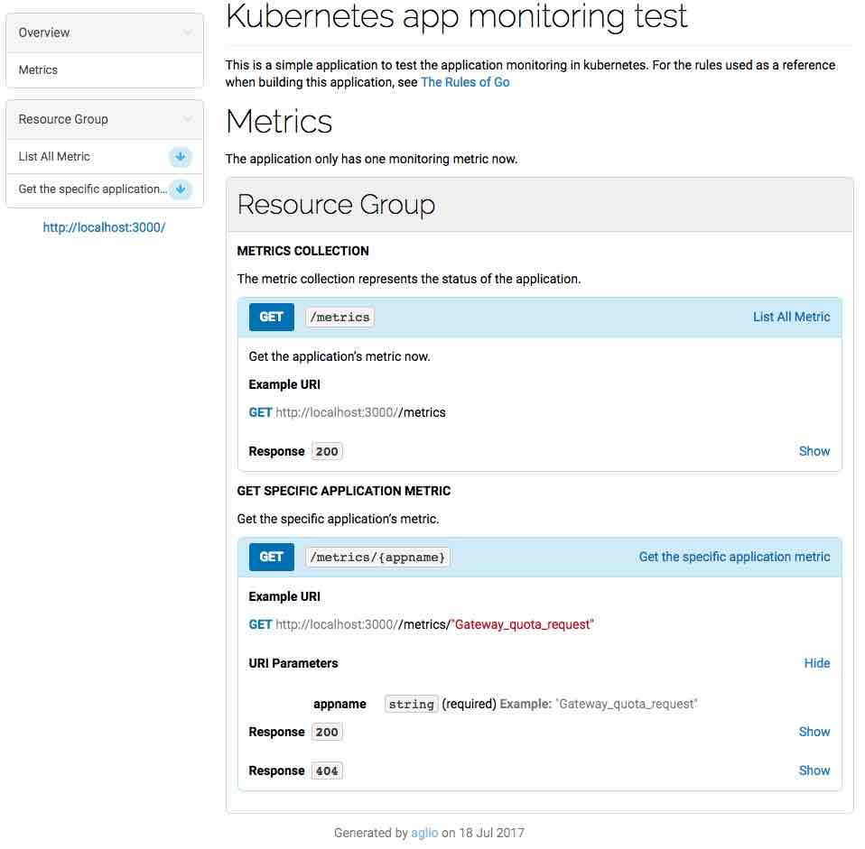
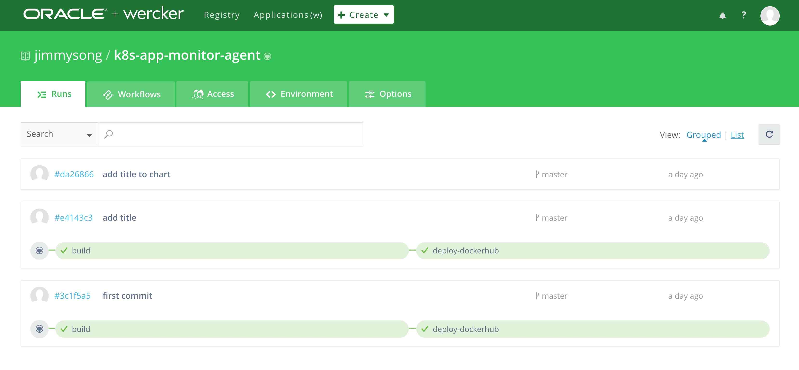
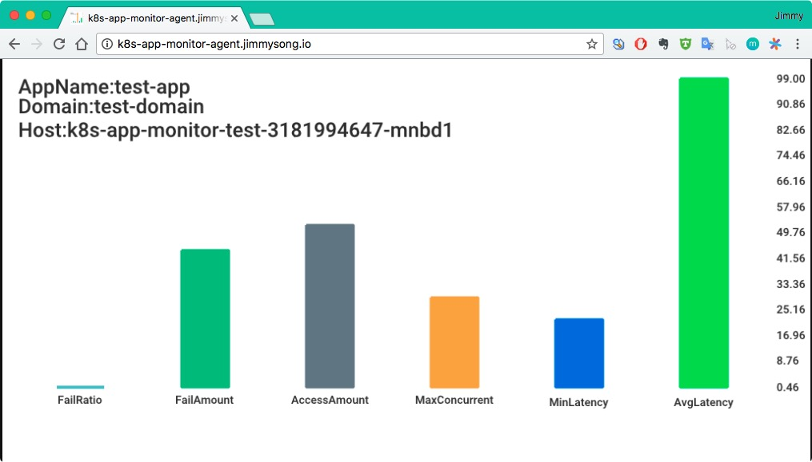

本文已归档在[kubernetes-handbook](https://github.com/rootsongjc/kubernetes-handbook)中的第 3 章【用户指南】中，一切更新以 kubernetes-handbook 中为准。

为了详细说明，我特意写了两个示例程序放在 GitHub 中，模拟应用开发流程：

- [k8s-app-monitor-test](https://github.com/rootsongjc/k8s-app-monitor-test)：生成模拟的监控数据，发送 http 请求，获取 json 返回值
- [K8s-app-monitor-agent](https://github.com/rootsongjc/k8s-app-monitor-agent)：获取监控数据并绘图，访问浏览器获取图表

API 文档见[k8s-app-monitor-test](https://github.com/rootsongjc/k8s-app-monitor-test)中的`api.html`文件，该文档在 API blueprint 中定义，使用[aglio](https://github.com/danielgtaylor/aglio)生成，打开后如图所示：



**关于服务发现**

`K8s-app-monitor-agent`服务需要访问`k8s-app-monitor-test`服务，这就涉及到服务发现的问题，我们在代码中直接写死了要访问的服务的内网 DNS 地址（kubedns 中的地址，即`k8s-app-monitor-test.default.svc.cluster.local`）。

我们知道 Kubernetes 在启动 Pod 的时候为容器注入环境变量，这些环境变量在所有的 namespace 中共享（环境变量是不断追加的，新启动的 Pod 中将拥有老的 Pod 中所有的环境变量，而老的 Pod 中的环境变量不变）。但是既然使用这些环境变量就已经可以访问到对应的 service，那么获取应用的地址信息，究竟是使用变量呢？还是直接使用 DNS 解析来发现？

答案是使用 DNS，详细说明见[Kubernetes 中的服务发现与 Docker 容器间的环境变量传递源码探究](https://jimmysong.io/posts/exploring-kubernetes-env-with-docker/)。

**打包镜像**

因为我使用 wercker 自动构建，构建完成后自动打包成 docker 镜像并上传到 docker hub 中（需要提前在 docker hub 中创建 repo），如何使用 wercker 做持续构建与发布，并集成 docker hub 插件请参考[使用 Wercker 进行持续构建与发布](https://jimmysong.io/posts/continuous-integration-with-wercker/)。

[查看详细构建流程](https://app.wercker.com/jimmysong/k8s-app-monitor-agent/)



生成了如下两个 docker 镜像：

- jimmysong/k8s-app-monitor-test:latest
- jimmysong/k8s-app-monitor-agent:latest

**启动服务**

所有的 kubernetes 应用启动所用的 yaml 配置文件都保存在那两个 GitHub 仓库的`manifest.yaml`文件中。

分别在两个 GitHub 目录下执行`kubectl create -f manifest.yaml`即可启动服务。

**外部访问**

服务启动后需要更新 ingress 配置，在[ingress.yaml](https://github.com/rootsongjc/kubernetes-handbook/blob/master/manifests/traefik-ingress/ingress.yaml)文件中增加以下几行：

```Yaml
  - host: k8s-app-monitor-agent.jimmysong.io
    http:
      paths:
      - path: /
        backend:
          serviceName: k8s-app-monitor-agent
          servicePort: 8080
```

保存后，然后执行`kubectl replace -f ingress.yaml`即可刷新 ingress。

修改本机的`/etc/hosts`文件，在其中加入以下一行：

```ini
172.20.0.119 k8s-app-monitor-agent.jimmysong.io
```

当然你也可以加入到 DNS 中，为了简单起见我使用 hosts。

详见[边缘节点配置](https://github.com/rootsongjc/kubernetes-handbook/blob/master/practice/edge-node-configuration.md)。

在浏览器中访问 http://k8s-app-monitor-agent.jimmysong.io



刷新页面将获得新的图表。

## 参考

- [使用 Wercker 进行持续构建与发布](https://jimmysong.io/posts/continuous-integration-with-wercker/)
- [示例的项目代码服务器端](https://app.wercker.com/jimmysong/k8s-app-monitor-agent/)
- [示例项目代码前端](https://github.com/rootsongjc/k8s-app-monitor-agent)
- [kubernetes-handbok](https://jimmysong.io/kubernetes-handbook/)
- [边缘节点配置](https://github.com/rootsongjc/kubernetes-handbook/blob/master/practice/edge-node-configuration.md)
