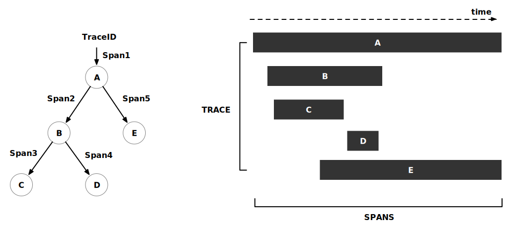
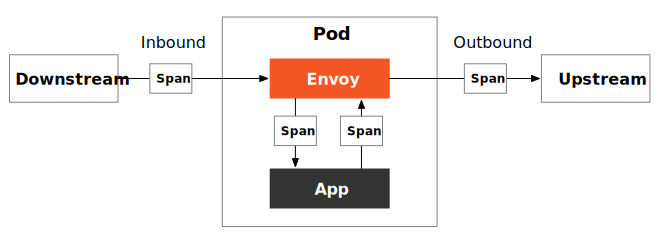

在云原生应用中，一次请求往往需要经过一系列的 API 或后台服务处理才能完成，这些服务有些是并行的，有些是串行的，而且位于不同的平台或节点。那么如何确定一次调用的经过的服务路径和节点以帮助我们进行问题排查？这时候就需要使用到分布式追踪。

本文将向你介绍：

- 分布式追踪的原理
- 如何选择分布式追踪软件
- 在 Istio 中如何使用分布式追踪
- 以 Bookinfo 和 SkyWalking 为例说明如何查看分布式追踪数据

## 分布式追踪基础 {#tracing-basic}

分布式追踪是一种用来跟踪分布式系统中请求的方法，它可以帮助用户更好地理解、控制和优化分布式系统。分布式追踪中用到了两个概念：TraceID 和 SpanID。

- TraceID 是一个全局唯一的 ID，用来标识一个请求的追踪信息。一个请求的所有追踪信息都属于同一个 TraceID，TraceID 在整个请求的追踪过程中都是不变的。

- SpanID 是一个局部唯一的 ID，用来标识一个请求在某一时刻的追踪信息。一个请求在不同的时间段会产生不同的 SpanID，SpanID 用来区分一个请求在不同时间段的追踪信息。

TraceID 和 SpanID 是分布式追踪的基础，它们为分布式系统中请求的追踪提供了一个统一的标识，方便用户查询、管理和分析请求的追踪信息。



下面是分布式追踪的过程：

1. 当一个系统收到请求后，分布式追踪系统会为该请求分配一个 TraceID，用于串联起整个调用链；
2. 分布式追踪系统会为该请求在系统内的每一次服务调用生成一个 SpanID 和 ParentID，用于记录调用的父子关系，没有 ParentID 的 Span 将作为调用链的入口；
3. 每个服务调用过程中都要传递 TraceID 和 SpanID；
4. 在查看分布式追踪时，通过 TraceID 查询某次请求的全过程；

## 分布式追踪系统如何选择 {#how-to-choose-a-distributed-tracing-system}

分布式追踪系统的原理类似，市面上也有很多这样的系统，例如 [Apache SkyWalking](https://github.com/apache/skywalking)、[Jaeger](https://github.com/jaegertracing/jaeger)、[Zipkin](https://github.com/openzipkin/zipkin/)、Lightstep、Pinpoint 等。下面我们选择三个常用的基于 OpenTracing 规范的开源分布式追踪系统，从多个维度对比，可供您参考选型。

| 类别      | Apache SkyWalking                                            | Jaeger                                       | Zipkin                                       |
| --------- | ------------------------------------------------------------ | -------------------------------------------- | -------------------------------------------- |
| 实现方式  | 基于语言的探针、服务网格探针、eBPF agent、第三方指标库（当前支持 Zipkin） | 基于语言的探针                               | 基于语言的探针                               |
| 数据存储  | ES、H2、MySQL、TiDB、Sharding-sphere、BanyanDB               | ES、MySQL、Cassandra、内存                   | ES、MySQL、Cassandra、内存                   |
| 支持语言  | Java、Rust、PHP、NodeJS、Go、Ruby、Python                    | Java、Go、Python、NodeJS、C#、PHP、Ruby、C++ | Java、Go、Python、NodeJS、C#、PHP、Ruby、C++ |
| 发起者    | 个人                                                         | Uber                                         | Twitter                                      |
| 治理方式  | Apache Foundation                                            | CNCF                                         | CNCF                                         |
| 版本      | 9.3.0                                                        | 1.39.0                                       | 2.23.19                                      |
| Star 数量 | 20.9k                                                        | 16.8k                                        | 15.8k                                        |

虽然 Agent 支持的语言没有 Jaeger 和 Zipkin，但是 SkyWalking 的实现方式更丰富，并且与 Jeager、Zipkin 的追踪数据兼容，开发更为活跃，且为国人开发，中文资料丰富，是构建遥测平台的最佳选择之一。

## Istio 中的分布式追踪


参考：https://piotrminkowski.com/2022/01/31/distributed-tracing-with-istio-quarkus-and-jaeger/

## 各个服务访问时的 header

productpage 

```
HTTP/1.1 200 OK
content-type: application/json
content-length: 395
server: istio-envoy
date: Thu, 01 Dec 2022 03:18:14 GMT
x-envoy-upstream-service-time: 4
```

所有的应用都会传播 `x-request-id` 这个 header。


x-envoy-upstream-service-time 是一个 HTTP Header，它表示从客户端发起请求到服务端响应完成，经过 Envoy 代理服务器的处理时间。这个 HTTP Header 的值是一个以毫秒为单位的时间戳，表示 Envoy 代理服务器处理该请求所花费的时间。

通常情况下，这个 HTTP Header 用于监控系统中，可以帮助监控人员了解 Envoy 代理服务器的性能情况。例如，可以通过统计 x-envoy-upstream-service-time 的值来判断 Envoy 代理服务器是否工作正常，如果值过大，则可能表示 Envoy 代理服务器出现了问题，需要进行相应的调整和优化。

在 Istio 服务网格中，不论你的应用程序使用何种语言开发，要想为应用添加分布式追踪功能，只需要对应用程序做一点很小的改动。Istio 会为请求自动 Trace 和 Span，你需要在应用程序中传播 HTTP Header 将这些 Span 关联到一个 Trace 中。应用程序需要收集和传播从传入请求到任何传出请求的头信息。要传播的头信息的选择由使用的跟踪配置决定。参见 getForwardHeaders 以了解不同的头信息选项。

这个示例代码使用 OpenTracing（http://opentracing.io/ ）来传播’b3’（zipkin）头信息。为此使用 OpenTracing 并不是必须的。使用 OpenTracing 可以让你在以后添加特定于应用程序的跟踪，但如果你愿意，你可以直接手动转发头信息。

## 实验 {#demo}

参考 [Istio 文档](https://istio.io/latest/docs/tasks/observability/distributed-tracing/skywalking/)来安装和配置 Apache SkyWalking。

### 环境说明 {#environments}

以下是我们实验的环境：

- Kubernetes 1.24.5
- Istio 1.16
- SkyWalking 9.1.0

### 安装 Istio {#install-istio}

安装之前可以先检查下环境是否有问题

```bash
$ istioctl experimental precheck
✔ No issues found when checking the cluster. Istio is safe to install or upgrade!
  To get started, check out https://istio.io/latest/docs/setup/getting-started/
```

然后安装 Istio 同时集成 SkyWalking：

```bash
# 初始化 Istio Operator
istioctl operator init
# 安装 Istio 并配置使用 SkyWalking
kubectl apply -f - <<EOF
apiVersion: install.istio.io/v1alpha1
kind: IstioOperator
metadata:
  namespace: istio-system
  name: istio-with-skywalking
spec:
  meshConfig:
    defaultProviders:
      tracing:
      - "skywalking"
    enableTracing: true
    extensionProviders:
    - name: "skywalking"
      skywalking:
        service: tracing.istio-system.svc.cluster.local
        port: 11800
EOF
```

### 部署 Apache SkyWalking {#install-skywalking}

Istio 1.16 支持使用 Apache SkyWalking 进行分布式追踪，执行下面的代码安装 SkyWalking：

```bash
kubectl apply -f https://raw.githubusercontent.com/istio/istio/release-1.16/samples/addons/extras/skywalking.yaml
```

它将在 `istio-system` 命名空间下安装 SkyWalking OAP (Observability Analysis Platform) 和 UI 组件。

我们在前面将 SkyWalking 设置为追踪的OAP 从多种数据源接收数据，这些数据分为两大类，**链路追踪**和**度量指标**.

- **链路追踪**. 包括 SkyWalking 原生数据格式，Zipkin V1 和 V2 数据格式，以及 Jaeger 数据格式.
- **度量指标**. SkyWalking 集成了服务网格平台，如 Istio, Envoy 和 Linkerd, 并在数据面板和控制面板进行观测. 此外，SkyWalking 原生代理还可以运行在度量模式，这极大提升了性能.

### 部署 Bookinfo 应用 {#install-bookinfo}

执行下面的命令安装 bookinfo 示例：

```bash
kubectl label namespace default istio-injection=enabled
kubectl apply -f samples/bookinfo/platform/kube/bookinfo.yaml
kubectl apply -f samples/bookinfo/networking/bookinfo-gateway.yaml
```

查看网关 IP，并访问 Productpage 服务访问端点，然后打开 SkyWalking UI：

```bash
istioctl dashboard skywalking
```

SkyWalking 的 General Service 页面展示了 bookinfo 应用中的所有服务。


你还可以看到实例、端点、拓扑、追踪等信息。例如下图展示了 bookinfo 应用的服务拓扑。


SkyWalking 的追踪视图有多种显示形式，如列表、树形、表格和统计。


为了方便我们检查，将追踪的采样率设置为 100%：

```bash
kubectl apply -f - <<EOF
apiVersion: telemetry.istio.io/v1alpha1
kind: Telemetry
metadata:
  name: mesh-default
  namespace: istio-system
spec:
  tracing:
  - randomSamplingPercentage: 100.00
EOF
```

### 卸载 {#purge}

在实验完后，执行下面的命令卸载 Istio 和 SkyWalking：

```bash
samples/bookinfo/platform/kube/cleanup.sh
istioctl unintall --purge
kubectl delete namespace istio-system
```

## Bookinfo demo 追踪信息说明 {#bookinfo-tracing}

在 Apache SkyWalking UI 中导航到 General Service 分页，查看最近的 `istio-ingressgateway` 服务的追踪信息，表视图如下所示。图中展示了此次请求所有 Span 的基本信息，点击每个 Span 可以查看详细信息。


切换为列表视图，可以看到每个 Span 的执行顺序，如下图所示。


你可能会感到困惑，为什么这么简单的一个应用会产生如此多的 Span 信息？因为我们为 Pod 注入了 Envoy 代理之后，每个服务间的请求都会被 Envoy 拦截和处理，如下图所示。



整个追踪流程如下图所示。


图中给每一个 Span 标记了序号，并在括号里注明了耗时。为了便于说明我们将所有 Span 汇总在下面的表格中。

| 序号 | 方法     | 总耗时（ms） | 组件耗时（ms） | 当前服务         | 说明                    |
| -------- | ------------ | ------------------------ | -------------------------- | -------------------- | ------------------------------- |
| 1    | /productpage | 190                      | 0                          | istio-ingressgateway | Envoy Outbound          |
| 2    | /productpage | 190                      | 1                          | istio-ingressgateway | Ingress -> Productpage 网络传输 |
| 3    | /productpage | 189                      | 1                          | productpage          | Envoy Inbound       |
| 4    | /productpage | 188                      | 21                         | productpage          | 应用内部处理        |
| 5    | /details/0   | 8                        | 1                          | productpage          | Envoy Outbound      |
| 6    | /details/0   | 7                        | 3                          | productpage          | Productpage -> Details 网络传输     |
| 7    | /details/0   | 4                        | 0                          | details              | Envoy Inbound           |
| 8    | /details/0   | 4                        | 4                          | details              | 应用内部                |
| 9    | /reviews/0   | 159                      | 0                          | productpage          | Envoy Outbound      |
| 10   | /reviews/0   | 159                      | 14                         | productpage          | Productpage -> Reviews 网络传输 |
| 11   | /reviews/0   | 145                      | 1                          | reviews              | Envoy Inbound           |
| 12   | /reviews/0   | 144                      | 109                        | reviews              | 应用内部处理              |
| 13   | /ratings/0   | 35                       | 2                          | reviews              | Envoy Outbound          |
| 14   | /ratings/0   | 33                       | 16                         | reviews              | Reviews -> Ratings 网络传输         |
| 15   | /ratings/0   | 17                       | 1                          | ratings              | Envoy Inbound           |
| 16   | /ratings/0   | 16                       | 16                         | ratings              | 应用内部处理            |

从以上信息可以发现：

- 本次请求总耗时 190ms；
- 在 Istio sidecar 模式下，每次流量在进出应用容器时都需要经过一次 Envoy 代理，每次耗时在 0 到 2 ms；
- 在 Pod 间的网络请求耗时在 1 到 16ms 之间；
- 将耗时做多的调用链 Ingress Gateway -> Productpage -> Reviews -> Ratings 上的所有耗时累计 182 ms，小于请求总耗时 190ms，这是因为数据本身有误差，以及 Span 的开始时间并不一定等于父 Span 的结束时间，如果你在 SkyWalking 的追踪页面，选择「列表」样式查看追踪数据（见图 2）可以更直观的发现这个问题；
- 我们可以查看到最耗时的部分是 Reviews 应用，耗时 109ms，因此我们可以针对该应用进行优化；

## 总结 {#summary}

Apache SkyWalking 是一个完备的可观测性系统，它不仅支持分布式追踪，还支持指标和日志收集、报警、Kubernetes 和服务网格监控，[使用 eBPF 诊断服务网格性能](https://skywalking.apache.org/zh/diagnose-service-mesh-network-performance-with-ebpf/)等功能。

另外，在生产使用时请根据需要调整采样策略（采样百分比），防止产生过多的追踪日志。

## 参考 {#reference}

- [Istio 分布式追踪概览 - istio.io](https://istio.io/latest/zh/docs/tasks/observability/distributed-tracing/overview/)
