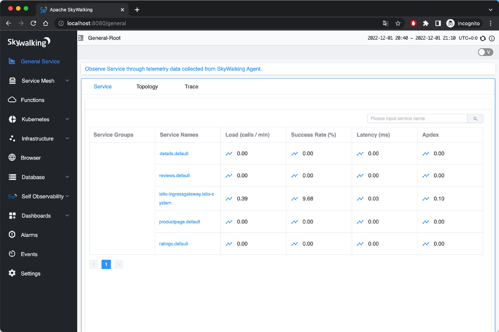
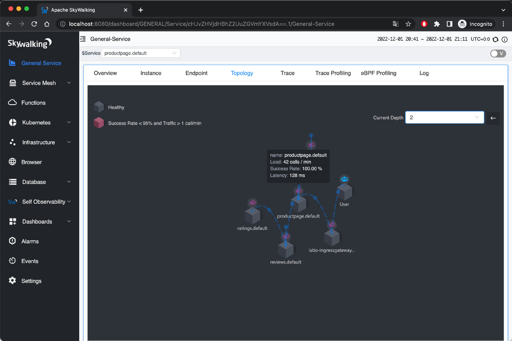
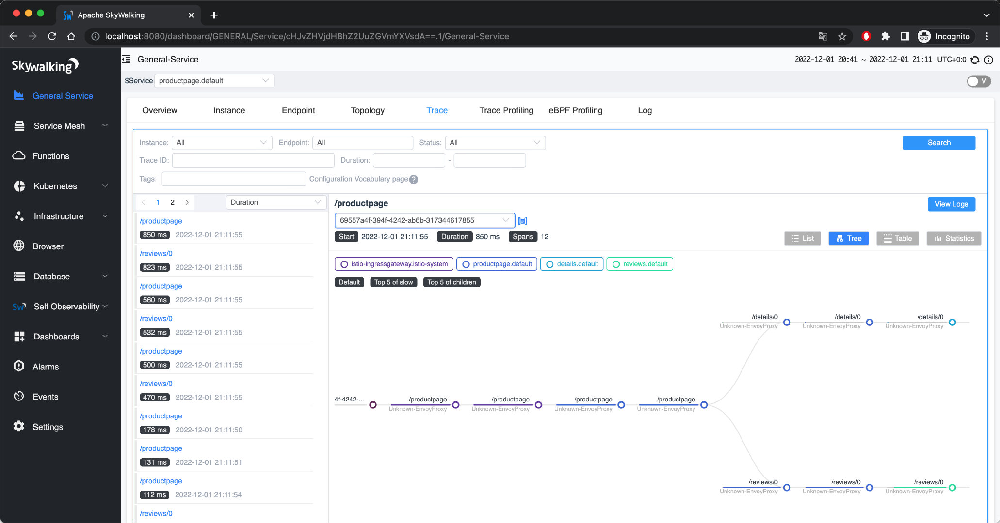
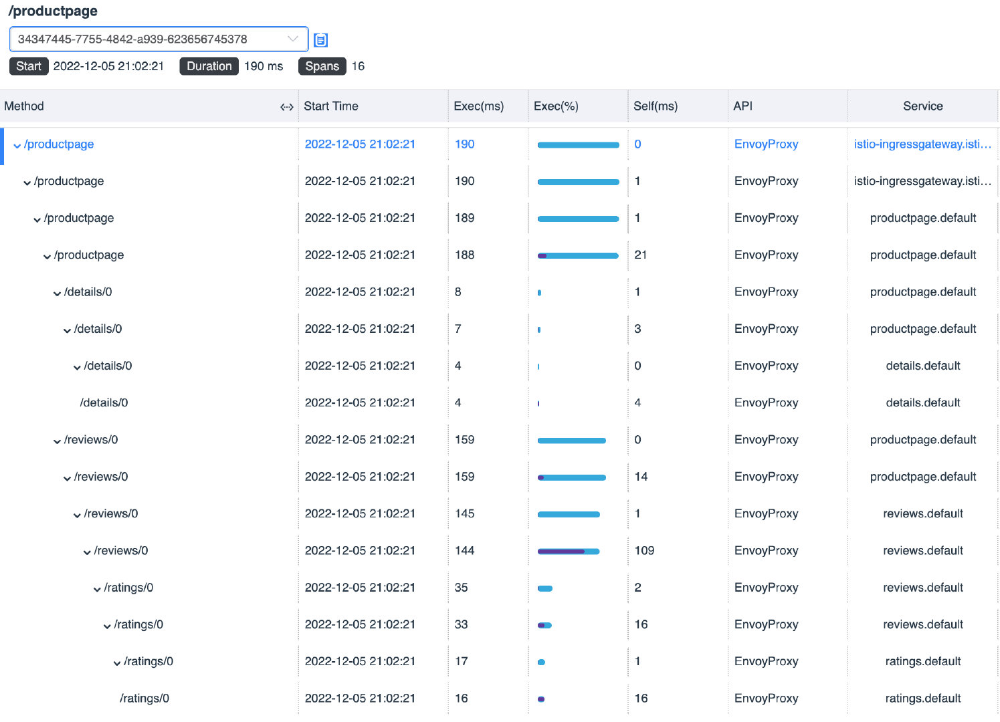
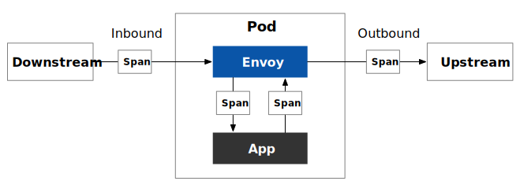

在云原生应用中，一次请求往往需要经过一系列的 API 或后台服务处理才能完成，这些服务有些是并行的，有些是串行的，而且位于不同的平台或节点。那么如何确定一次调用的经过的服务路径和节点以帮助我们进行问题排查？这时候就需要使用到分布式追踪。

本文将向你介绍：

- 分布式追踪的原理
- 如何选择分布式追踪软件
- 在 Istio 中如何使用分布式追踪
- 以 Bookinfo 和 SkyWalking 为例说明如何查看分布式追踪数据

## 分布式追踪基础 {#tracing-basic}

分布式追踪是一种用来跟踪分布式系统中请求的方法，它可以帮助用户更好地理解、控制和优化分布式系统。分布式追踪中用到了两个概念：TraceID 和 SpanID。

- TraceID 是一个全局唯一的 ID，用来标识一个请求的追踪信息。一个请求的所有追踪信息都属于同一个 TraceID，TraceID 在整个请求的追踪过程中都是不变的；

- SpanID 是一个局部唯一的 ID，用来标识一个请求在某一时刻的追踪信息。一个请求在不同的时间段会产生不同的 SpanID，SpanID 用来区分一个请求在不同时间段的追踪信息；

TraceID 和 SpanID 是分布式追踪的基础，它们为分布式系统中请求的追踪提供了一个统一的标识，方便用户查询、管理和分析请求的追踪信息。


下面是分布式追踪的过程：

1. 当一个系统收到请求后，分布式追踪系统会为该请求分配一个 TraceID，用于串联起整个调用链；
2. 分布式追踪系统会为该请求在系统内的每一次服务调用生成一个 SpanID 和 ParentID，用于记录调用的父子关系，没有 ParentID 的 Span 将作为调用链的入口；
3. 每个服务调用过程中都要传递 TraceID 和 SpanID；
4. 在查看分布式追踪时，通过 TraceID 查询某次请求的全过程；

## Istio 如何实现分布式追踪 {#distributed-tracing-in-istio}

Istio 中的分布式追踪是基于数据平面中的 Envoy 代理实现的。服务请求在被劫持到 Envoy 中后，Envoy 在转发请求时会附加大量 Header，其中与分布式追踪相关的有：

- 作为 TraceID：`x-request-id`
- 用于在 LightStep 追踪系统中建立 Span 的父子关系：`x-ot-span-context`
- 用于 Zipkin，同时适用于 Jaeger、SkyWalking，详见 [b3-propagation](https://github.com/openzipkin/b3-propagation)：
  - `x-b3-traceid`
  - `x-b3-spanid`
  - `x-b3-parentspanid`
  - `x-b3-sampled`
  - `x-b3-flags`
  - `b3`
- 用于 Datadog：
  - `x-datadog-trace-id`
  - `x-datadog-parent-id`
  - `x-datadog-sampling-priority`
- 用于 SkyWalking：`sw8`
- 用于 AWS X-Ray：`x-amzn-trace-id`

关于这些 Header 的详细用法请参考 [Envoy 文档](https://www.envoyproxy.io/docs/envoy/latest/configuration/http/http_conn_man/headers)。

Envoy 会在 Ingress Gateway 中为你产生用于追踪的 Header，不论你的应用程序使用何种语言开发，Envoy 都会将这些 Header 转发到上游集群。但是，你还要对应用程序代码做一些小的修改，才能为使用分布式追踪功能。这是因为应用程序无法自动传播这些 Header，可以在程序中集成分布式追踪的 Agent，或者在代码中手动传播这些 Header。Envoy 会将追踪数据发送到 tracer 后端处理，然后就可以在 UI 中查看追踪数据了。

例如在 Bookinfo 应用中的 Productpage 服务，如果你查看它的代码可以发现，其中集成了 Jaeger 客户端库，并在 `getForwardHeaders (request)` 方法中将 Envoy 生成的 Header 同步给对 Details 和 Reviews 服务的 HTTP 请求：

```python
def getForwardHeaders(request):
    headers = {}

    # 使用 Jaeger agent 获取 x-b3-* header
    span = get_current_span()
    carrier = {}
    tracer.inject(
        span_context=span.context,
        format=Format.HTTP_HEADERS,
        carrier=carrier)

    headers.update(carrier)

    # 手动处理非 x-b3-* header
    if 'user' in session:
        headers['end-user'] = session['user']
    incoming_headers = [
        'x-request-id',
        'x-ot-span-context',
        'x-datadog-trace-id',
        'x-datadog-parent-id',
        'x-datadog-sampling-priority',
        'traceparent',
        'tracestate',
        'x-cloud-trace-context',
        'grpc-trace-bin',
        'sw8',
        'user-agent',
        'cookie',
        'authorization',
        'jwt',
    ]

    for ihdr in incoming_headers:
        val = request.headers.get(ihdr)
        if val is not None:
            headers[ihdr] = val

    return headers
```

关于 Istio 中分布式追踪的常见问题请见 [Istio 文档](https://istio.io/latest/zh/about/faq/#distributed-tracing)。

## 分布式追踪系统如何选择 {#how-to-choose-a-distributed-tracing-system}

分布式追踪系统的原理类似，市面上也有很多这样的系统，例如 [Apache SkyWalking](https://github.com/apache/skywalking)、[Jaeger](https://github.com/jaegertracing/jaeger)、[Zipkin](https://github.com/openzipkin/zipkin/)、[LightStep](https://lightstep.com/)、[Pinpoint](https://github.com/pinpoint-apm/pinpoint) 等。我们将选择其中三个，从多个维度进行对比。之所以选择它们是因为：

- 它们是当前最流行的开源分布式追踪系统；
- 都是基于 OpenTracing 规范；
- 都支持与 Istio 及 Envoy 集成；


| 类别      | Apache SkyWalking                                            | Jaeger                                       | Zipkin                                       |
| --------- | ------------------------------------------------------------ | -------------------------------------------- | -------------------------------------------- |
| 实现方式  | 基于语言的探针、服务网格探针、eBPF agent、第三方指标库（当前支持 Zipkin） | 基于语言的探针                               | 基于语言的探针                               |
| 数据存储  | ES、H2、MySQL、TiDB、Sharding-sphere、BanyanDB               | ES、MySQL、Cassandra、内存                   | ES、MySQL、Cassandra、内存                   |
| 支持语言  | Java、Rust、PHP、NodeJS、Go、Python、C++、.NET、Lua          | Java、Go、Python、NodeJS、C#、PHP、Ruby、C++ | Java、Go、Python、NodeJS、C#、PHP、Ruby、C++ |
| 发起者    | 个人                                                         | Uber                                         | Twitter                                      |
| 治理方式  | Apache Foundation                                            | CNCF                                         | CNCF                                         |
| 版本      | 9.3.0                                                        | 1.39.0                                       | 2.23.19                                      |
| Star 数量 | 20.9k                                                        | 16.8k                                        | 15.8k                                        |



虽然 Apache SkyWalking 的 Agent 支持的语言没有 Jaeger 和 Zipkin 多，但是 SkyWalking 的实现方式更丰富，并且与 Jaeger、Zipkin 的追踪数据兼容，开发更为活跃，且为国人开发，中文资料丰富，是构建遥测平台的最佳选择之一。

## 实验 {#demo}

参考 [Istio 文档](https://istio.io/latest/docs/tasks/observability/distributed-tracing/skywalking/)来安装和配置 Apache SkyWalking。

### 环境说明 {#environments}

以下是我们实验的环境：

- Kubernetes 1.24.5
- Istio 1.16
- SkyWalking 9.1.0

### 安装 Istio {#install-istio}

安装之前可以先检查下环境是否有问题：

```bash
$ istioctl experimental precheck
✔ No issues found when checking the cluster. Istio is safe to install or upgrade!
  To get started, check out https://istio.io/latest/docs/setup/getting-started/
```

然后安装 Istio 同时配置发送追踪信息的目的地为 SkyWalking：

```bash
# 初始化 Istio Operator
istioctl operator init
# 安装 Istio 并配置使用 SkyWalking
kubectl apply -f - <<EOF
apiVersion: install.istio.io/v1alpha1
kind: IstioOperator
metadata:
  namespace: istio-system
  name: istio-with-skywalking
spec:
  meshConfig:
    defaultProviders:
      tracing:
      - "skywalking"
    enableTracing: true
    extensionProviders:
    - name: "skywalking"
      skywalking:
        service: tracing.istio-system.svc.cluster.local
        port: 11800
EOF
```

### 部署 Apache SkyWalking {#install-skywalking}

Istio 1.16 支持使用 Apache SkyWalking 进行分布式追踪，执行下面的代码安装 SkyWalking：

```bash
kubectl apply -f https://raw.githubusercontent.com/istio/istio/release-1.16/samples/addons/extras/skywalking.yaml
```

它将在 `istio-system` 命名空间下安装：

- [SkyWalking OAP](https://skywalking.apache.org/docs/main/v9.3.0/en/concepts-and-designs/backend-overview/) (Observability Analysis Platform) ：用于接收追踪数据，支持 SkyWalking 原生数据格式，Zipkin v1 和 v2 以及 Jaeger 格式。
- [UI](https://skywalking.apache.org/docs/main/v9.3.0/en/ui/readme/)：用于查询分布式追踪数据。

关于 SkyWalking 的详细信息请参考 [SkyWalking 文档](https://skywalking.apache.org/docs/main/v9.3.0/readme/)。

### 部署 Bookinfo 应用 {#install-bookinfo}

执行下面的命令安装 bookinfo 示例：

```bash
kubectl label namespace default istio-injection=enabled
kubectl apply -f samples/bookinfo/platform/kube/bookinfo.yaml
kubectl apply -f samples/bookinfo/networking/bookinfo-gateway.yaml
```

打开 SkyWalking UI：

```bash
istioctl dashboard skywalking
```

SkyWalking 的 General Service 页面展示了 bookinfo 应用中的所有服务。



你还可以看到实例、端点、拓扑、追踪等信息。例如下图展示了 bookinfo 应用的服务拓扑。



SkyWalking 的追踪视图有多种显示形式，如列表、树形、表格和统计。



为了方便我们检查，将追踪的采样率设置为 100%：

```bash
kubectl apply -f - <<EOF
apiVersion: telemetry.istio.io/v1alpha1
kind: Telemetry
metadata:
  name: mesh-default
  namespace: istio-system
spec:
  tracing:
  - randomSamplingPercentage: 100.00
EOF
```

### 卸载 {#purge}

在实验完后，执行下面的命令卸载 Istio 和 SkyWalking：

```bash
samples/bookinfo/platform/kube/cleanup.sh
istioctl unintall --purge
kubectl delete namespace istio-system
```

## Bookinfo demo 追踪信息说明 {#bookinfo-tracing}

在 Apache SkyWalking UI 中导航到 General Service 分页，查看最近的 `istio-ingressgateway` 服务的追踪信息，表视图如下所示。图中展示了此次请求所有 Span 的基本信息，点击每个 Span 可以查看详细信息。



切换为列表视图，可以看到每个 Span 的执行顺序及持续时间，如下图所示。


你可能会感到困惑，为什么这么简单的一个应用会产生如此多的 Span 信息？因为我们为 Pod 注入了 Envoy 代理之后，每个服务间的请求都会被 Envoy 拦截和处理，如下图所示。



整个追踪流程如下图所示。


图中给每一个 Span 标记了序号，并在括号里注明了耗时。为了便于说明我们将所有 Span 汇总在下面的表格中。

| 序号 | 方法     | 总耗时（ms） | 组件耗时（ms） | 当前服务         | 说明                    |
| -------- | ------------ | ------------------------ | -------------------------- | -------------------- | ------------------------------- |
| 1    | /productpage | 190                      | 0                          | istio-ingressgateway | Envoy Outbound          |
| 2    | /productpage | 190                      | 1                          | istio-ingressgateway | Ingress -> Productpage 网络传输 |
| 3    | /productpage | 189                      | 1                          | productpage          | Envoy Inbound       |
| 4    | /productpage | 188                      | 21                         | productpage          | 应用内部处理        |
| 5    | /details/0   | 8                        | 1                          | productpage          | Envoy Outbound      |
| 6    | /details/0   | 7                        | 3                          | productpage          | Productpage -> Details 网络传输     |
| 7    | /details/0   | 4                        | 0                          | details              | Envoy Inbound           |
| 8    | /details/0   | 4                        | 4                          | details              | 应用内部                |
| 9    | /reviews/0   | 159                      | 0                          | productpage          | Envoy Outbound      |
| 10   | /reviews/0   | 159                      | 14                         | productpage          | Productpage -> Reviews 网络传输 |
| 11   | /reviews/0   | 145                      | 1                          | reviews              | Envoy Inbound           |
| 12   | /reviews/0   | 144                      | 109                        | reviews              | 应用内部处理              |
| 13   | /ratings/0   | 35                       | 2                          | reviews              | Envoy Outbound          |
| 14   | /ratings/0   | 33                       | 16                         | reviews              | Reviews -> Ratings 网络传输         |
| 15   | /ratings/0   | 17                       | 1                          | ratings              | Envoy Inbound           |
| 16   | /ratings/0   | 16                       | 16                         | ratings              | 应用内部处理            |

从以上信息可以发现：

- 本次请求总耗时 190ms；
- 在 Istio sidecar 模式下，每次流量在进出应用容器时都需要经过一次 Envoy 代理，每次耗时在 0 到 2 ms；
- 在 Pod 间的网络请求耗时在 1 到 16ms 之间；
- 将耗时做多的调用链 Ingress Gateway -> Productpage -> Reviews -> Ratings 上的所有耗时累计 182 ms，小于请求总耗时 190ms，这是因为数据本身有误差，以及 Span 的开始时间并不一定等于父 Span 的结束时间，如果你在 SkyWalking 的追踪页面，选择「列表」样式查看追踪数据（见图 2）可以更直观的发现这个问题；
- 我们可以查看到最耗时的部分是 Reviews 应用，耗时 109ms，因此我们可以针对该应用进行优化；

## 总结 {#summary}

只要对应用代码稍作修改就可以在 Istio 很方便的使用分布式追踪功能。在 Istio 支持的众多分布式追踪系统中，[Apache SkyWalking](https://skywalking.apache.org/) 是其中的佼佼者。它不仅支持分布式追踪，还支持指标和日志收集、报警、Kubernetes 和服务网格监控，[使用 eBPF 诊断服务网格性能](https://skywalking.apache.org/zh/diagnose-service-mesh-network-performance-with-ebpf/)等功能，是一个功能完备的云原生应用分析平台。本文中为了方便演示，将追踪采样率设置为了 100%，在生产使用时请根据需要调整采样策略（采样百分比），防止产生过多的追踪日志。

## 参考 {#reference}

- [Istio 分布式追踪概览 - istio.io](https://istio.io/latest/zh/docs/tasks/observability/distributed-tracing/overview/)
- [Istio 分布式追踪 FAQ - istio.io](https://istio.io/latest/zh/about/faq/#distributed-tracing)
