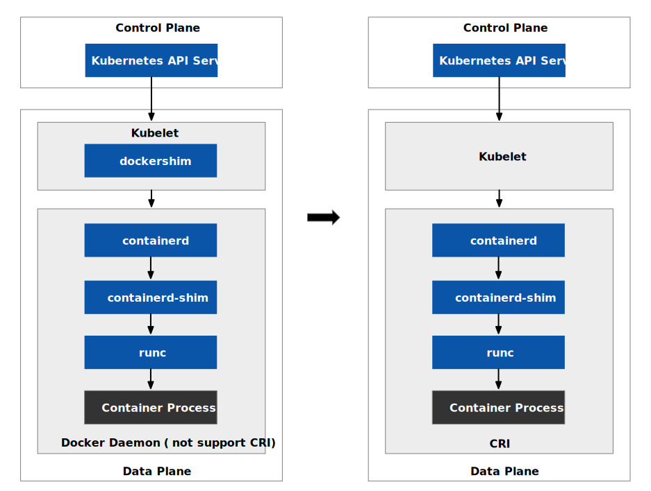

在 2017 年的容器编排大战中，Docker 公司失败后沉寂了几年，但近年来又开始频繁行动，例如腾退开源组织账号，支持 WebAssembly 等。本文将回顾 Docker 公司发展过程中的四个重大举措，这些措施深深地影响了 Docker 公司的发展，也对 Docker 甚至 Kubernetes 社区产生了深远的影响。

## 当我们在谈论 Docker 时我们在谈论什么？{#what-are-we-talking-about-docker}

首先我们需要先确定 Docker 这个词的含义。当人们在谈论 Docker 时可能指的是：

1. Docker 公司
2. Docker 软件栈
3. Docker 命令行工具
4. Docker 容器运行时

为什么同一个词会有这么多不同的意思呢？这都是有历史原因的。Docker 软件于 2013 年发布，起初定位为开发者工具。作为最早发布的容器工具，它迅速走红，并成为容器技术的代名词。但它最初只是在单机上运行，有太多耦合的接口设计。后来容器集群出现，才需要用到容器编排调度工具。因为 Kubernetes 具有丰富的功能和扩展性，Docker 公司推出的 Swarm 在这场容器编排大战中败下阵来。归根结底，Docker 面向开发者，而容器运行时则面向机器，只需要对应的接口即可，不需要那么丰富的管理工具。如今，Docker 仍然是最受开发者喜爱的容器工具之一，其 Docker Hub 是全球最大的镜像仓库。

## 将 Docker 项目改名为 Moby {#rename-docker-to-moby}

2017 年 4 月，Docker 公司将 Docker 项目重命名为 Moby，详见 [Introducing Moby Project: a new open-source project to advance the software containerization movement](https://www.docker.com/blog/introducing-the-moby-project/)：

- [Moby Project](https://github.com/moby/moby) 是 Docker 公司为了应对容器技术在各个领域和用例中普及的趋势而发起的一个开源项目。
- Moby Project 是 Docker 公司作为一个开放的研发实验室，与整个生态系统合作，实验，开发新的组件，并协作构建容器技术的未来。
- Moby Project 不是 Docker 产品的替代品，而是 Docker 产品的基础。
- Moby Project 包括三个层次：组件层，框架层和装配层。
    - 组件层包括一些可复用的开源组件，如 runc, containerd, LinuxKit, InfraKit 等，可以用于构建各种类型的容器系统。
    - 框架层提供了一些工具和库，用于将组件组装成系统，并管理其生命周期。
    - 装配层是一个社区驱动的平台，用于分享和协作构建基于 Moby 框架的系统。

Moby Project 是一个新的开源项目，旨在推动软件容器化运动的发展，帮助生态系统让容器技术走向主流。它提供了一个组件库，一个用于将组件组装成定制的基于容器的系统的框架，以及一个让所有容器爱好者可以实验和交流想法的地方。

Moby Project 和 Docker 的区别和联系是：

- Moby Project 是一个开源项目，Docker 是一个商业产品。
- Moby Project 是 Docker 产品的基础，Docker 产品是 Moby Project 的一个实例。
- Moby Project 是一个通用的框架，可以用于构建各种类型和用例的容器系统，Docker 是一个针对特定用例的容器系统，即构建，运行和共享应用程序。
- Moby Project 是一个开放的研发实验室，用于实验和协作开发新的容器技术，Docker 是一个成熟的产品，用于提供稳定和可靠的容器服务。

## 支持 Kubernetes 调度 {#support-kubernetes}

Docker 公司在 2017 年 12 月发布的 Docker 17.12 版本中开始支持 Kubernetes。在此之前，Docker 公司一直在发展自己的容器编排和调度工具 Docker Swarm。然而，Kubernetes 在容器编排和调度方面具有更广泛的支持和社区贡献，已经成为了业界标准。因此，Docker 公司决定将 Kubernetes 集成到 Docker 平台中，以提供更广泛的选择和更好的用户体验。Docker 公司在 Docker Desktop 和 Docker Enterprise 中提供了 Kubernetes 的集成支持，使得 Kubernetes 和 Docker 容器可以更加方便地部署和管理。同时，Docker 公司也开发了一些工具，如 Kompose 和 Docker Compose，使得用户可以将 Docker Compose 配置文件转换为 Kubernetes YAML 文件，以便更加方便地将应用程序从 Docker Swarm 迁移到 Kubernetes。

## Kubernetes 不再支持 Docker 运行时 {#kubernetes-not-support-docker}

Kubernetes 从 v1.20 起不再支持 Docker 运行时并在 2022 年 4 月发布的 v1.24 中被完全移除，如下图所示。这意味着在 Kubernetes 中只能使用 containerd 或 CRI-O 容器运行时，不过你依然可以使用 Docker 镜像，只是无需使用 docker 命令或 Docker 守护程序。

Kubernetes v1.24 正式移除 Docker 运行时

## 腾退开源组织账号 {#deprecate-open-source-organization}

2023 年 3 月，据 [Alex Ellis 的博客](https://blog.alexellis.io/docker-is-deleting-open-source-images/) 介绍，Docker 公司决定删除一些开源组织的账户和镜像，除非他们升级到付费的团队计划，这对开源社区造成了很大的困扰和不安。很多 Docker 忠实拥护者和贡献者对 Docker 的这一举动表示了不满和失望。

这一事件是这样的：

- Docker 公司给所有创建过组织的 Docker Hub 用户发了一封邮件，告知他们如果不升级到付费的团队计划，他们的账户和镜像都将被删除。
- 这一举动只影响开源社区经常使用的组织账户，个人账户没有变化。
- 付费的团队计划每年需要 420 美元，很多开源项目没有足够的资金支持。
- Docker 公司的开源项目计划（DSOS）要求非常苛刻，与开源项目的可持续性相悖。
- Docker 公司的沟通方式非常脱节，引起了开源社区的反感和担忧。
- 文章作者建议开源项目使用其他的容器镜像仓库，如 GitHub Container Registry、[Quay.io](http://quay.io/)、各大云厂商的镜像仓库等。
- 开源社区还提供了一些迁移镜像和重命名镜像的方法和工具。

## 增加对 WebAssembly 运行时的支持 {#support-webassembly-runtime}

2022 年 10 月，Docker 公司发布了 Docker+Wasm 技术预览，这是一个特殊的构建，可以让开发者更容易地使用 Docker 运行 Wasm 工作负载。作为这次发布的一部分，Docker 还宣布将加入 Bytecode Alliance 作为一个投票成员。

Wasm 是一种新技术，可让你在沙箱环境中运行 40 多种语言的应用程序代码，包括 Rust，C，C++，JavaScript 和 Golang。最初，Wasm 的用例是在浏览器中运行本地代码，如 Figma，AutoCAD 和 Photoshop 等。现在，一些公司如 Vercel，Fastly，Shopify 和 Cloudflare 等支持使用 Wasm 在边缘和云端运行代码。

Docker+Wasm 技术预览包括：

- Docker 的目标是帮助开发者通过克服应用开发的复杂性来实现他们的想法。
- Docker 将 Wasm 视为与 Linux 容器相辅相成的技术，开发者可以根据用例选择使用哪种技术（或两者都用）。
- Docker 想要帮助开发者更容易地使用熟悉的经验和工具来开发，构建和运行 Wasm 应用。
- 要获取技术预览，需要下载并安装适合你系统的版本，然后启用 containerd 镜像存储（设置 > 开发中的功能 > 使用 containerd 拉取和存储镜像）。
- 这个预览支持使用 WasmEdge 运行时引擎运行 Wasm 容器，并可以通过容器仓库如 DockerHub 等分享。

2023 年 3 月 Docker 公司又发布了 Docker+Wasm 技术预览 2，包括了三个新的 Wasm 运行时引擎：Fermyon 的 spin，Deislabs 的 slight，和 Bytecode Alliance 的 wasmtime。

该版本的主要更新是：

- Docker+Wasm 技术预览 2 是在 Docker Desktop 4.15 版本中发布的，旨在让开发者更容易地运行 Wasm 工作负载，并扩展运行时支持。
- Docker+Wasm 技术预览 2 支持四种 Wasm 运行时引擎，包括之前已经支持的 WasmEdge，以及新增加的 spin，slight，和 wasmtime。
- 这四种 Wasm 运行时引擎都基于 runwasi 库，这是一个 Rust 库，可以让容器管理器 containerd 运行 Wasm 工作负载，并创建一种新的容器类型。
- runwasi 库基于 WASI 标准，这是一个为 WebAssembly 提供通用平台接口的模块化系统接口。这意味着如果一个程序编译成目标是 WASI，它就可以在任何符合 WASI 的运行时上运行。
- Wasm 容器通常只包含一个编译好的 Wasm 字节码文件，不需要任何额外的二进制库，这使得它比 Linux 容器更小。这也意味着 Wasm 容器通常启动更快，更可移植。
- 由于 Wasm 容器直接被 containerd 支持，在 Docker Desktop 最新版本中尝试 Docker+Wasm 技术预览 2 只需要启用“使用 containerd”选项。
- 通过这种方式，Wasm 容器可以与 Linux 容器一起使用 Docker Compose 或其他编排平台如 Kubernetes 运行。
- 此外，Docker Desktop 还能够将一个 Wasm 应用打包成一个 OCI 容器，并在其中嵌入一个 Wasm 运行时，以便通过容器仓库如 DockerHub 等分享。

## 总结 {#summary}

本文介绍了 Docker 发展过程中的四个重大举措：Moby Project、支持 Kubernetes、删除开源组织账号和增加对 WebAssembly 运行时的支持。其中，Moby Project 旨在推动容器技术走向主流，支持 Kubernetes 的举措提供了更广泛的选择和更好的用户体验，删除开源组织账号的举措引起了开源社区的不满和失望，增加对 WebAssembly 运行时的支持的举措则扩展了 Docker 的应用场景。

## 参考 {#reference}

- [Introducing Moby Project: a new open-source project to advance the software containerization movement](https://www.docker.com/blog/introducing-the-moby-project/)
- [Docker for Windows Desktop… Now With Kubernetes!](https://www.docker.com/blog/docker-windows-desktop-now-kubernetes/)
- [Introducing the Docker+Wasm Technical Preview](https://www.docker.com/blog/docker-wasm-technical-preview/)
- [Announcing Docker+Wasm Technical Preview 2](https://www.docker.com/blog/announcing-dockerwasm-technical-preview-2/)
- [Docker is deleting Open Source organisations - what you need to know](https://blog.alexellis.io/docker-is-deleting-open-source-images/)
- [别慌：Kubernetes 和 Docker](https://kubernetes.io/zh-cn/blog/2020/12/02/dont-panic-kubernetes-and-docker/)
