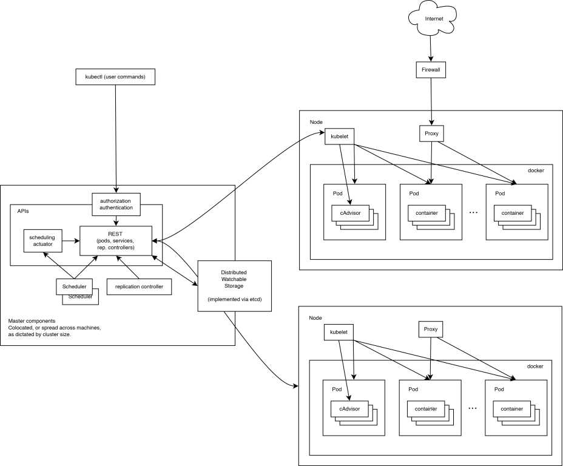

本文是`Docker v.s Kubernetes `系列第二篇，续接上文[Docker 对比 Kuberntes 第一部分](/blog/docker-vs-kubernetes-part1/)。

Kubernetes 是典型的**Master/Slave**架构模式，本文简要的介绍 kubenetes 的架构和组件构成。

## Kubernetes 核心架构

### master 节点

- apiserver：作为 kubernetes 系统的入口，封装了核心对象的增删改查操作，以 RESTFul 接口方式提供给外部客户和内部组件调用。它维护的 REST 对象将持久化到 etcd（一个分布式强一致性的 key/value 存储）。
- scheduler：负责集群的资源调度，为新建的 Pod 分配机器。这部分工作分出来变成一个组件，意味着可以很方便地替换成其他的调度器。
- controller-manager：负责执行各种控制器，目前有两类：
  1. endpoint-controller：定期关联 service 和 Pod(关联信息由 endpoint 对象维护)，保证 service 到 Pod 的映射总是最新的。
  2. replication-controller：定期关联 replicationController 和 Pod，保证 replicationController 定义的复制数量与实际运行 Pod 的数量总是一致的。

### node 节点

- kubelet：负责管控 docker 容器，如启动/停止、监控运行状态等。它会定期从 etcd 获取分配到本机的 Pod，并根据 Pod 信息启动或停止相应的容器。同时，它也会接收 apiserver 的 HTTP 请求，汇报 Pod 的运行状态。
- proxy：负责为 Pod 提供代理。它会定期从 etcd 获取所有的 service，并根据 service 信息创建代理。当某个客户 Pod 要访问其他 Pod 时，访问请求会经过本机 proxy 做转发。

## Kubernetes 组件详细介绍

### etcd

虽然不是 Kubernetes 的组件但是有必要提一下，etcd 是一个分布式协同数据库，基于 Go 语言开发，`CoreOS`公司出品，使用 raft 一致性算法协同。Kubernetes 的主数据库，在安装 kubernetes 之前就要先安装它，很多开源下项目都用到，老版本的`docker swarm`也用到了它。目前主要使用的是`2.7.x`版本，`3.0+`版本的 API 变化太大。

### APIServer

APIServer 负责对外提供 kubernetes API 服务，它运行在 master 节点上。任何对资源的增删改查都要交给 APIServer 处理后才能提交给 etcd。APIServer 总体上由两部分组成：HTTP/HTTPS 服务和一些功能性插件。这些功能性插件又分为两种：一部分与底层 IaaS 平台（Cloud Provide）相关；另一部分与资源管理控制（Admission Control）相关。

### Scheduler

Scheduler 的作用是**根据特定的调度算法将 pod 调度到 node 节点上**，这一过程也被称为绑定。Scheduler 调度器的输入是待调度的 pod 和可用的工作节点列表，输出则是一个已经绑定了 pod 的节点，这个节点是通过调度算法在工作节点列表中选择的最优节点。

工作节点从哪里来？工作节点并不是由 Kubernetes 创建，它是由 IaaS 平台创建，或者就是由用户管理的物理机或者虚拟机。但是 Kubernetes 会创建一个 Node 对象，用来描述这个工作节点。描述的具体信息由创建 Node 对象的配置文件给出。一旦用户创建节点的请求被成功处理，Kubernetes 又会立即在内部创建一个 node 对象，再去检查该节点的健康状况。只有那些当前可用的 node 才会被认为是一个有效的节点并允许 pod 调度到上面运行。       

工作节点可以通过资源配置文件或者 kubectl 命令行工具来创建。Kubernetes 主要维护工作节点的两个属性：spec 和 status 来描述一个工作节点的期望状态和当前状态。其中，所谓的当前状态信息由 3 个信息组成：`HostIp`、`NodePhase`和`Node Condition`。        

工作节点的动态维护过程依靠**Node Controller**来完成，它是`Kubernetes Controller Manager`下属的一个控制器。它会一直不断的检查 Kubernetes 已知的每台 node 节点是否正常工作，如果一个之前已经失败的节点在这个检查循环中被检查为可以工作的，那么 Node Controller 会把这个节点添加到工作节点中，Node Controller 会从工作节点中删除这个节点。        

### Controller Manager

Controller Manager 运行在集群的 Master 节点上，是基于 pod API 的一个独立服务，它**重点实现 service Endpoint（服务端点）的动态更新**。管理着 Kubernetes 集群中各种控制节点，包括**replication Controller**和**node Controller**。        

**与 APIServer 相比，APIServer 负责接受用户请求并创建对应的资源，而 Controller Manager 在系统中扮演的角色是在一旁旁默默的管控这些资源，确保他们永远保持在预期的状态**。它采用各种管理器定时的对 pod、节点等资源进行预设的检查，然后判断出于预期的是否一致，若不一致，则通知 APIServer 采取行动，比如重启、迁移、删除等。

### kubelet

kubelet 组件工作在 Kubernetes 的 node 上，**负责管理和维护在这台主机上运行着的所有容器**。kubelet 与 cAdvisor 交互来抓取 docker 容器和主机的资源信息。kubelet 垃圾回收机制，包括容器垃圾回收和镜像垃圾回收。kubelet 工作节点状态同步。

### kube-proxy

kube-proxy 提供两种功能：

- 提供算法将客服端流量负载均衡到 service 对应的一组后端 pod。
- 使用 etcd 的 watch 机制，实现服务发现功能，维护一张从 service 到 endpoint 的映射关系，从而保证后端 pod 的 IP 变化不会对访问者的访问造成影响。
