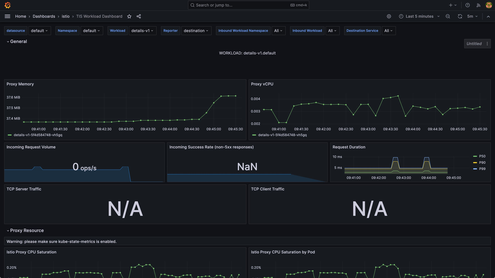
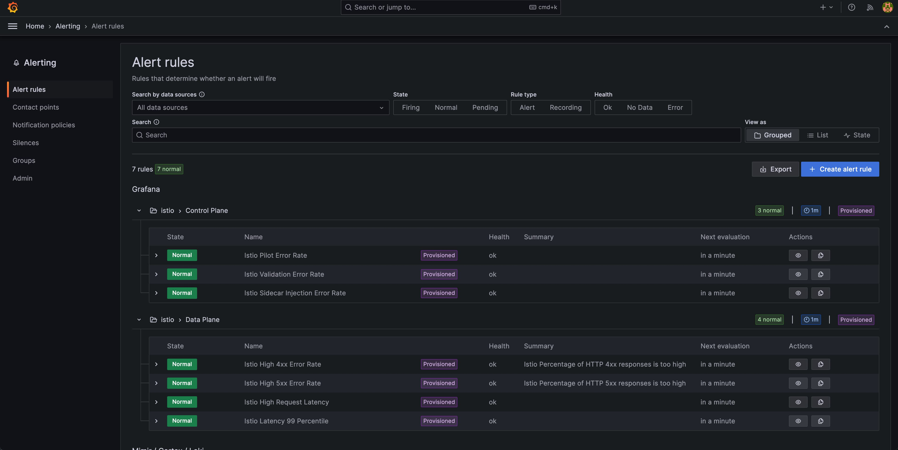

在这篇博客中我将指导你如何安装 TIS 并启用监控插件。

## 什么是 TIS？

Tetrate Istio Subscription（TIS）是由 Tetrate 提供的企业级、全面支持的产品，提供了经过全面测试且适用于所有主要云平台的 Istio 版本。TIS 基于开源的 Tetrate Istio Distro 项目，增加了对这些构建版本的全面高级支持，并可选提供 FIPS 验证的加密模块。此外，TIS 包含一系列经过测试和支持的 Add-Ons 和 Integrations，使得 Istio 的功能扩展和与常用基础设施工具的集成变得简单安全。

## 为什么使用 TIS？

TIS 不是 Istio 的一个分支，而是提供针对特定环境进行测试的上游发行版。我们对 Istio 所做的任何增强都会应用于上游。TIS与普通的Istio相比有以下关键优势：

1. **长期支持**：TIS提供14个月的安全更新支持，确保稳定性和安全性。
2. **商业支持**：TIS有商业支持选项，适用于企业用例，包括合规性需求。
3. **易于管理**：TIS提供简化的安装和管理过程，减少了操作复杂性。
4. **多环境适配**：TIS支持不同云环境，满足各种部署需求。
5. **FIPS验证**：提供FIPS验证版本，适用于高安全性要求的场景。

想要了解 TIS 的更多信息请访问：<https://docs.tetrate.io/istio-subscription/>

## 准备条件

在安装 TIS 及其插件前，你需要准备：

- 安装 [Terraform](https://www.terraform.io/)：用于导入 Dashboard 到 Grafana
- 向 Tetrate 请求安装 TIS 所需的 credentials

## 安装 Istio 及 Monitoring addons

首先使用下面的命令查看 TIS 支持的 Istio 版本：

```bash
helm search repo tetratelabs/base --versions
NAME            	CHART VERSION  	APP VERSION    	DESCRIPTION
tetratelabs/base	1.20.1+tetrate0	1.20.1-tetrate0	Helm chart for deploying Istio cluster resource...
tetratelabs/base	1.20.0+tetrate0	1.20.0-tetrate0	Helm chart for deploying Istio cluster resource...
tetratelabs/base	1.19.5+tetrate0	1.19.5-tetrate0	Helm chart for deploying Istio cluster resource...
tetratelabs/base	1.19.4+tetrate0	1.19.4-tetrate0	Helm chart for deploying Istio cluster resource...
tetratelabs/base	1.19.3+tetrate0	1.19.3-tetrate0	Helm chart for deploying Istio cluster resource...
tetratelabs/base	1.18.6+tetrate0	1.18.6-tetrate0	Helm chart for deploying Istio cluster resource...
tetratelabs/base	1.18.5+tetrate0	1.18.5-tetrate0	Helm chart for deploying Istio cluster resource...
tetratelabs/base	1.18.3+tetrate0	1.18.3-tetrate0	Helm chart for deploying Istio cluster resource...
tetratelabs/base	1.17.8+tetrate0	1.17.8-tetrate0	Helm chart for deploying Istio cluster resource...
tetratelabs/base	1.17.6+tetrate0	1.17.6-tetrate0	Helm chart for deploying Istio cluster resource...
tetratelabs/base	1.16.7+tetrate0	1.16.7-tetrate0	Helm chart for deploying Istio cluster resource...
tetratelabs/base	1.16.6+tetrate0	1.16.6-tetrate0	Helm chart for deploying Istio cluster resource...
```

我们将安装当前最新的 Istio 1.20.1 版本。

```bash
export TIS_USER=<tis_username>
export TIS_PASS=<tis-password>
# Helm chart version
export VERSION=1.20.1+tetrate0
# Image tag
export TAG=1.20.1-tetrate0
kubectl create namespace istio-system

kubectl create secret docker-registry tetrate-tis-creds \
    --docker-server="addon-containers.istio.tetratelabs.com" \
    --docker-username=${TIS_USER} \
    --docker-password=${TIS_PASS} \
    -n istio-system

# Install Istio
helm install istio-base tetratelabs/base -n istio-system \
    --set global.tag=${TAG} \
    --set global.hub="addon-containers.istio.tetratelabs.com" \
    --set "global.imagePullSecrets[0]=tetrate-tis-creds" \
    --version ${VERSION}

helm install istiod tetratelabs/istiod -n istio-system \
    --set global.tag=${TAG} \
    --set global.hub="addon-containers.istio.tetratelabs.com" \
    --set "global.imagePullSecrets[0]=tetrate-tis-creds" \
    --version ${VERSION} \
    --wait

# install ingress Gateway
kubectl create namespace istio-ingress

kubectl create secret docker-registry tetrate-tis-creds \
    --docker-server="addon-containers.istio.tetratelabs.com" \
    --docker-username=${TIS_USER} \
    --docker-password=${TIS_PASS} \
    -n istio-ingress

helm install istio-ingress tetratelabs/istio-ingress -n istio-ingress \
    --set global.tag=${TAG} \
    --set global.hub="addon-containers.istio.tetratelabs.com" \
    --set "global.imagePullSecrets[0]=tetrate-tis-creds" \
    --version ${VERSION} \
    --wait

# Install TIS addon
helm install istio-monitoring-demo tis-addons/istio-monitoring-demo --namespace tis --create-namespace
```

端口转发 Grafana 服务，然后在本地浏览器中打开 Grafana：http://localhost:3000

```bash
kubectl port-forward --namespace tis svc/grafana 3000:3000
```

注意：请保持该命令持续运行，因为我们在向 Grafana 导入 dashboard 时还需要访问该端口。

## 安装 Istio Monitoring Addons

使用默认的用户名密码 `admin/admin` 登录后，在左侧导航栏中选择 Administration - Service accounts，参考 Grafana 文档上的说明创建一个 admin 权限的 Service account。


记下这个 Token，我们将在下面的操作中用到。

使用 Terraform 向 Grafana 中导入 dashboard：

```bash
cat>~/.terraformrc<<EOF
credentials "terraform.cloudsmith.io" {
  token = "tetrate/tis-containers/kuhb8CPZhaOiR3v6"
}
EOF

# Create a terraform module file
cat>istio-monitoring-grafana.tf<<EOF
module "istio_monitoring_grafana" {
  source = "terraform.cloudsmith.io/tis-containers/istio-monitoring-grafana/tetrate"
  version = "v0.2.0"
  gf_url  = "<http://localhost:3000>"
  gf_auth = "<grafana_token>"
}
EOF

# Run the commands
terraform init
terraform plan
terraform apply -auto-approve
```

恭喜你现在已经成功的向 Grafana 中导入了以下四个 dashboard：

- TIS Workload Dashboard
- TIS Service Dashboard
- TIS Wasm Extension Dashboard
- TIS Control Plan Dashboard

但是现在有些 dashboard 还没有数据，我们需要在网格中制造一些流量。

## 测试监控

部署 Bookinfo 应用和入口网关：

```bash
kubectl create secret docker-registry tetrate-tis-creds \
    --docker-server="addon-containers.istio.tetratelabs.com" \
    --docker-username=${TIS_USER} \
    --docker-password=${TIS_PASS} \
    -n default
kubectl label namespace default istio-injection=enabled
kubectl apply -f samples/bookinfo/platform/kube/bookinfo.yaml -n default
kubectl apply -f samples/bookinfo/networking/bookinfo-gateway.yaml -n default
```

获取入口网关的 IP 并发送一些流量：

```bash
export GATEWAY_IP=$(kubectl -n istio-ingress get service istio-ingressgateway -o jsonpath='{.status.loadBalancer.ingress[0].ip}')
for i in $(seq 1 100);do curl http://$GATEWAY_IP/productpage ; sleep 3;done
```

现在访问 Grafana dashboard，你可以看到监控数据了。



除此之外，在导入了这些 dashboard 的同时，我们还导入了以下警报规则：



你也可以在Grafana中定义警报规则，比如[整合 Telegram](https://grafana.com/blog/2023/12/28/how-to-integrate-grafana-alerting-and-telegram/) 或 Slack 来发送通知。

## 清理

运行下面的命令清理 Bookinfo 应用和 TIS：

```bash
kubectl delete -f samples/bookinfo/platform/kube/bookinfo.yaml -n default
kubectl delete -f samples/bookinfo/networking/bookinfo-gateway.yaml -n default
helm uninstall istio-ingress -n istio-ingress
helm uninstall istio-monitoring-demo -n tis
helm uninstall istiod -n istio-system
helm uninstall istio-base -n istio-system
kubectl delete namespace tis
kubectl delete namespace istio-ingress
kubectl delete namespace istio-system
```

## 总结

通过执行这些步骤，您已经使用TIS成功地在Istio中设置和测试了监视。在Istio环境中享受增强监控的见解和优势！
