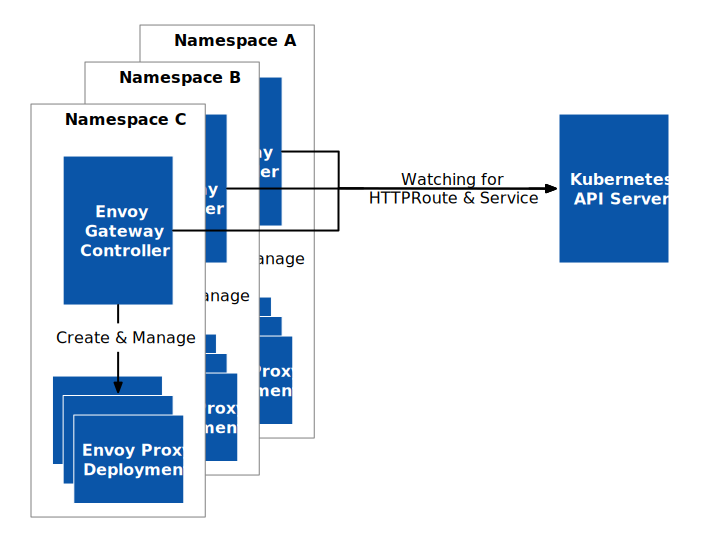

[Envoy Gateway](https://github.com/envoyproxy/gateway) 是一款基于 Envoy 代理和 [Kubernetes Gateway API](https://gateway-api.sigs.k8s.io/) 开发的开源 API 网关，最近发布了 [0.4.0 版本](https://gateway.envoyproxy.io/v0.4.0/releases/v0.4.html)。此次发布的版本着重于自定义功能，旨在为最终用户提供更多的用例。在本文中，我们将讨论此版本中可用的新自定义选项及其对用户的重要性。

## 自定义 Envoy 代理架构 {#customization}

此次版本中最主要的自定义功能之一是配置 [EnvoyProxy](https://gateway.envoyproxy.io/v0.4.0/api/config_types.html#envoyproxy)（Envoy Gateway 定义的 CRD） 部署的确切类型。你可以定义 EnvoyProxy 部署的副本数、镜像和资源限制。还可以向 EnvoyProxy 部署和服务添加注解（Annotation）。这使得不同的用例成为可能，例如：

- 将 Envoy Gateway 与 AWS、NLB、ELB 和 GCP 等外部负载均衡器链接起来。
- 在 EnvoyProxy 旁边注入 Sidecar，这对于 Ingress 层管理南北向流量的 Envoy Gateway 和服务网格层用于管理东西向流量互联 TLS（mTLS）的 Envoy Sidecar 非常有用。此自定义功能消除了用户创建自己证书的需要，因为它基于历史的证书管理。

关于 Envoy Gateway 的更多自定义功能请参考 [Envoy Gateway 文档](https://gateway.envoyproxy.io/v0.4.0/user/customize-envoyproxy.html)。

此外，Envoy Gateway 除了默认的 Kubernetes 单租户模式以外还新增其他部署模式支持，例如多租户，如下图所示。

分别在每个租户的 namespace 部署一个 Envoy Gateway Controller，它们监视 Kubernetes 中的 HTTPRoute 和 Service 资源，并在各自的 namespace 中创建和管理 EnvoyProxy 部署。

## 自定义 Envoy xDS 引导程序 {#bootstrap}

此版本中的另一个重要自定义功能是[自定义 Envoy xDS 引导程序](https://gateway.envoyproxy.io/v0.4.0/user/customize-envoyproxy.html#customize-envoyproxy-bootstrap-config)。使用此功能，用户可以提供引导配置，在启动 EnvoyProxy 时配置一些静态资源。例如配置访问日志记录、跟踪和指标以发送到 SkyWalking（可以作为 APM）非常有用。此外，此版本添加了大量 CLI 工具，以帮助验证用户配置。用户可以将 CLI 用作干运行以更改引导程序中的特定字段，如果配置在语法上不正确，则将失败。

## 扩展控制平面 {#extend-control-plane}

Envoy Gateway 现在允许供应商和扩展开发人员在 Envoy Gateway 管道的不同阶段添加 gRPC 钩子，以进一步扩展其功能，允许用户做一些事情，比如增强发送给 EnvoyProxy 的 xDS 配置，这在以前是不可能的。

## 总结 {#summary}

最后，Envoy Gateway 0.4.0 扩展了自定义 API，并为最终用户提供了更多用例。新的自定义功能包括自定义 Envoy 部署、Envoy xDS 引导程序以及扩展控制平面。这些新功能消除了用户创建自己的证书的需要，配置访问日志记录、跟踪和指标，并使供应商能够扩展 XDS 翻译用例。通过此版本的发布，Envoy Gateway 正变得更加用户友好，成为 Istio 的绝佳替代品。
