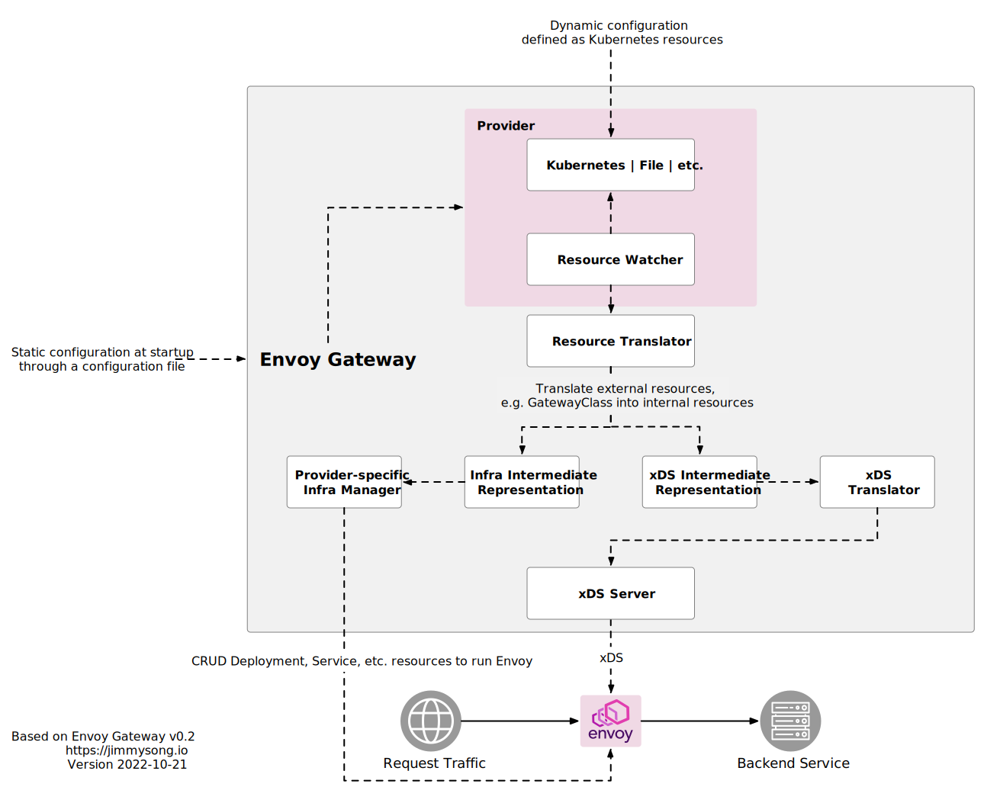

今年五月 Envoy 社区宣布成立一个新的项目 [Envoy Gateway](https://github.com/envoyproxy/gateway)，经过五个月时间的开发，今天它的首个开源版本 [v0.2 发布](https://gateway.envoyproxy.io/releases/v0.2.html)，本文将为你介绍什么是 Envoy Gateway，它的架构、快速入门和使用指南。

## 什么是 Envoy Gateway？{#what-is-envoy-gateway}

Envoy Gateway 是一个用于管理 Envoy Proxy 的开源项目，可单独使用或作为 Kubernetes 中应用的网关。它通过了 Gateway API 核心一致性测试，使用 [Gateway API](https://gateway-api.sigs.k8s.io/) 作为其唯一的配置语言来管理 Envoy 代理，支持 `GatewayClass`、Gateway、`HTTPRoute` 和 `TLSRoute` 资源。

Envoy Gateway 的目标是降低用户采用 Envoy 作为 API 网关的障碍，以吸引更多用户采用 Envoy。它通过入口和 L4/L7 流量路由，表达式、可扩展、面向角色的 API 设计，使其成为供应商建立 API 网关增值产品的基础。

Envoy Gateway 的核心优势是轻量级、开放、可动态编程，尤其是为后端增加了安全功能，这些优势使得它很适合作为后端 API 网关。

## 架构 {#architecture}

下图展示的是 Envoy Gateway 的架构，图中的阴影部分表示是 Envoy Gateway。你可以通过静态和动态两种方式来配置它，其中的 Provider 是针对不同的供应商开发的。



该架构图基于 Envoy Gateway v0.2 版本绘制，并参考了 [Envoy Gateway 文档](https://gateway.envoyproxy.io/design/system-design.html#architecture)。

## 配置流程

下面是配置 Envoy Gateway 的流程：

1. 你可以通过配置文件为其 Provider 提供静态配置（目前仅支持 Kubernetes 和文件方式，将来有可能支持更多不同平台供应商），在 Envoy Gateway 启动后，你还可以通过 Kubernetes 动态配置 Provider；
2. 这些配置会被 Provider 中的资源监视器看到后应用到 Envoy Gateway 的资源转义器上；
3. 资源转义器将配置分别转义为针对不同 Provider 开发的基础设施管理器的中间表示（Infra IR）和 xDS 中间表示（xDS IR）；
4. 两种中间表示（IR）分别应用到其对应的基础设施管理器和 xDS 转义上；
5. 基础设施通过增删改查（CRDU）Kubernetes Deployment、Service 等资源来运行 Envoy，xDS 管理器通过将 xDS 协议配置 xDS Server 的方式配置 Envoy 代理；
6. 对于 Envoy 代理的流量请求将应用以上配置并转发到对应的后端；

以上就是对 Envoy Gateway 配置的流程，关于 Envoy 代理设计的更多细节请参考 [Envoy Gateway 文档](https://gateway.envoyproxy.io/design/system-design.html)

## 快速开始 {#quick-start}

下面我们将在 Kubernetes 集群中安装 Envoy Gateway 并部署一个测试网站来看看它是否可以正常运行。

### 前提 {#prerequisites}

在使用 Envoy Gateway 前，请注意它的兼容性问题，参考[兼容性矩阵](https://gateway.envoyproxy.io/intro/compatibility.html)。

| Envoy Gateway 版本 | Envoy 代理版本   | Gateway API 版本 | Kubernetes 最低版本 |
| ------------------ | ---------------- | ---------------- | ------------------- |
| v0.2.0             | **v1.23 - 最新** | **v0.5.1**       | v1.24               |

### 安装 {#setup}

因为在 Kubernetes 集群中 Gateway API 不是默认安装的，因此你需要手动安装 Gateway CRD。执行下面的命令安装 Gateway CRD 和 Envoy Gateway：

```bash
kubectl apply -f https://github.com/envoyproxy/gateway/releases/download/v0.2.0/install.yaml
```

该命令将为你创建 `envoy-gateway-system`、`gateway-system` 两个命令空间，同时创了一系列 CRD。还有一些 Envoy Gateway 运行所需要的 ConfigMap、服务账户、RBAC、角色等。

### 测试 {#test}

执行下面的命令安装 GatewayClass、Gateway、HTTPRoute 和示例应用程序：

``` bash
kubectl apply -f https://github.com/envoyproxy/gateway/releases/download/v0.2.0/quickstart.yaml
```

端口转发到 Envoy 服务：

```bash
kubectl -n envoy-gateway-system port-forward service/${ENVOY_SERVICE} 8888:8080 &
```

通过 Envoy 代理 curl 示例应用程序：

```bash
curl --verbose --header "Host: www.example.com" http://localhost:8888/get
```

你将看到如下输出：

```
*   Trying 127.0.0.1:8888...
* Connected to localhost (127.0.0.1) port 8888 (#0)
> GET /get HTTP/1.1
> Host: www.example.com
> User-Agent: curl/7.79.1
> Accept: */*
>
* Mark bundle as not supporting multiuse
< HTTP/1.1 200 OK
< content-type: application/json
< x-content-type-options: nosniff
< date: Sat, 22 Oct 2022 07:10:34 GMT
< content-length: 513
< x-envoy-upstream-service-time: 22
< server: envoy
< x-envoy-decorator-operation: backend.default.svc.cluster.local:3000/*
<
{
 "path": "/get",
 "host": "www.example.com",
 "method": "GET",
 "proto": "HTTP/1.1",
 "headers": {
  "Accept": [
   "*/*"
  ],
  "User-Agent": [
   "curl/7.79.1"
  //内容省略...
 },
 "namespace": "default",
 "ingress": "",
 "service": "",
 "pod": "backend-764c65b4dd-lp6jw"
* Connection #0 to host localhost left intact
}
```

如果你看到以上输出就证明你的 Envoy Gateway 安装成功并可正常运行。

如果你的 Kubernetes 集群部署在云上，可以使用云负载均衡器的 IP 地址来访问测试：

```bash
export GATEWAY_HOST=$(kubectl get svc/${ENVOY_SERVICE} -n envoy-gateway-system -o jsonpath='{.status.loadBalancer.ingress[0].ip}')
curl --verbose --header "Host: www.example.com" http://$GATEWAY_HOST:8080/get
```

笔者使用的 GKE，运行上面的命令，`GATEWAY_HOST` 环境变量的值几位负载均衡器的 IP 地址，最后同样可以类似上文的 `curl` 输出。

## Envoy Gateway 中使用的 CRD 简介 {#isito-gateway-crd}

上文说到安装 Envoy Gateway 的时候创建了一系列 CRD，在此我们将简要介绍一下这些 CRD：

- `envoyproxies.config.gateway.envoyproxy.io`：Envoy Proxy API 的 Schema。
- `gatewayclasses.gateway.networking.k8s.io`：GatewayClass 描述了用户可用于创建 Gateway 资源的一类 Gateways。建议将该资源作为 Gateway 的模板。这意味着一个 Gateway 是基于创建时 GatewayClass 的状态，对 GatewayClass 或相关参数的改变不会向下传播到现有的 Gateway。这项建议的目的是限制 GatewayClass 或相关参数的变化的爆炸半径。如果实现者选择将 GatewayClass 的变化传播给现有 Gateway，实现者必须清楚地记录这一点。每当一个或多个 Gateway 使用一个 GatewayClass 时，实现必须在相关的 GatewayClass 上添加 `gateway-exists-finalizer.gateway.networking.k8s.io` finalizer。这可以确保与 Gateway 相关的 GatewayClass 在使用中不会被删除。GatewayClass 是一个集群级的资源。
- `gateways.gateway.networking.k8s.io`：Gateway 通过将 Listener 与一组 IP 地址绑定，代表了一个服务流量处理基础设施的实例。
- `httproutes.gateway.networking.k8s.io`： HTTPRoute 提供了一种路由 HTTP 请求的方法。这包括通过主机名、路径、标头或查询参数来匹配请求的能力。过滤器可以用来指定额外的处理步骤。后端指定匹配的请求应该被路由到哪里。
- `referencegrants.gateway.networking.k8s.io`：`ReferenceGrant` 标识了其他命名空间中的资源种类，这些资源被信任为引用与策略相同的名称空间中的指定资源种类。 每个 `ReferenceGrant` 都可以用来代表一个独特的信任关系。额外的引用授权可以用来添加到它们所定义的命名空间的入站引用的信任源集合中。Gateway API 中的所有跨命名空间引用（除了跨命名空间的 Gateway-route 附件）都需要一个 `ReferenceGrant`。
- `referencepolicies.gateway.networking.k8s.io`：该资源已被重新命名为ReferenceGrant，且将在 Gateway API v0.6.0 中被删除，而采用相同的 ReferenceGrant 资源。
- `tcproutes.gateway.networking.k8s.io`：TCPRoute 提供了一种路由 TCP 请求的方法。当与 Gateway 监听器结合使用时，它可以用来将监听器指定的端口上的连接转发到 TCPRoute 指定的一组后端。
- `tlsroutes.gateway.networking.k8s.io`：TLSRoute 资源与 TCPRoute 类似，但可以配置为与 TLS 特定的元数据相匹配。这使得为特定的 TLS 监听器匹配数据流时有更大的灵活性。如果你需要将流量转发到一个 TLS 监听器的单一目标，你可以选择同时使用 TCPRoute 和 TLS 监听器。
- `udproutes.gateway.networking.k8s.io`：UDPRoute 提供了一种路由 UDP 流量的方法。当与网关监听器结合使用时，它可以用来将监听器指定的端口上的流量转发到 UDPRoute 指定的一组后端。

关于这些 CRD 的具体用法以及 Envoy Gateway 的用户指南，将在以后的文章中分享。

下面两篇我同事写的关于 Envoy Gateway 的文章推荐给大家阅读：

- [使用 Envoy Gateway 0.2 体验新的 Kubernetes Gateway API](https://lib.jimmysong.io/blog/hands-on-with-envoy-gateway/)
- [面向未来的网关：新的 Kubernetes Gateway API 和 Envoy Gateway 0.2 介绍](https://lib.jimmysong.io/blog/envoy-gateway-to-the-future/)

## 参考 {#reference}

- [开源项目 Envoy Gateway 简介 - lib.jimmysong.io](https://lib.jimmysong.io/blog/introducing-envoy-gateway/)
- [Envoy API Gateway—— 推动网关的进一步发展 - lib.jimmysong.io](https://lib.jimmysong.io/blog/the-gateway-to-a-new-frontier/)
- [Envoy Gateway 官方网站 - gateway.envoyproxy.io](https://gateway.envoyproxy.io/)
