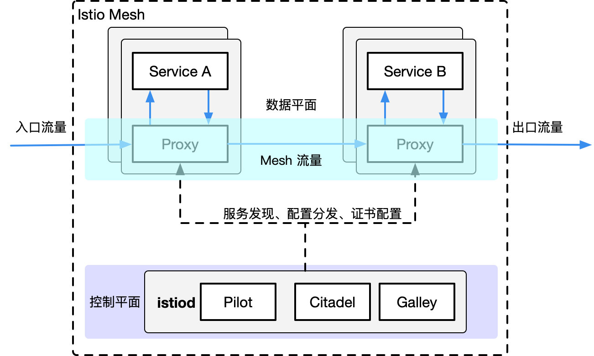
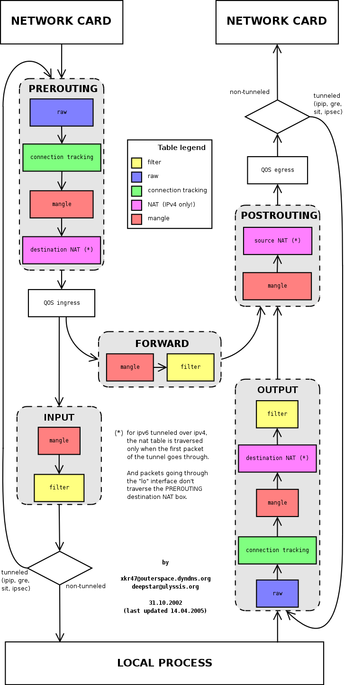
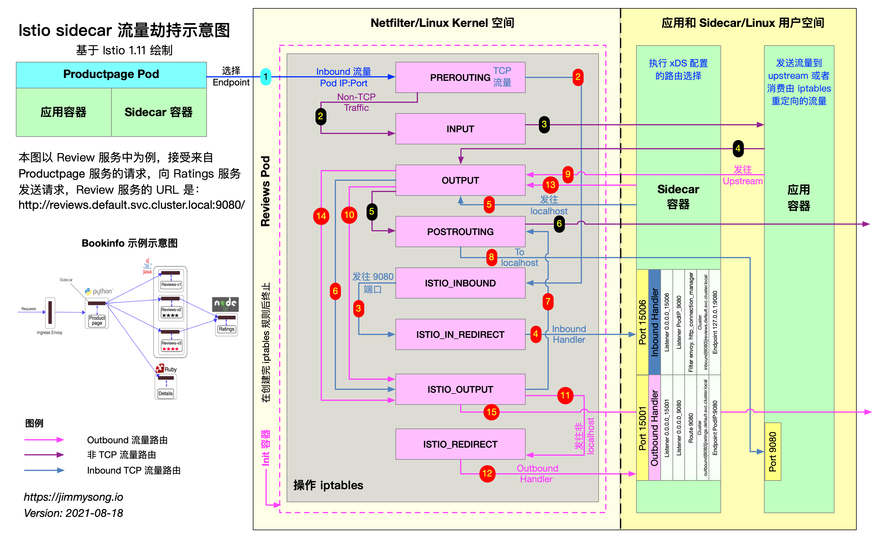

本文最新更新于 2022 年 3 月 7 日。

> 以往有很多文章讲解 Istio 是如何做 Sidecar 注入的，但是没有讲解注入之后 Sidecar 工作的细节。本文将带大家详细了解 Istio 是如何将 Envoy 作为 Sidecar 的方式注入到应用程序 Pod 中，及 Sidecar 是如何做劫持流量的。

在讲解 Istio 如何将 Envoy 代理注入到应用程序 Pod 中之前，我们需要先了解以下几个概念：

- Sidecar 模式：容器应用模式之一，Service Mesh 架构的一种实现方式。
- Init 容器：Pod 中的一种专用的容器，在应用程序容器启动之前运行，用来包含一些应用镜像中不存在的实用工具或安装脚本。
- iptables：流量劫持是通过 iptables 转发实现的。

查看目前 `reviews-v1-745ffc55b7-2l2lw` Pod 中运行的容器：

```bash
$ kubectl -n default get pod reviews-v1-745ffc55b7-2l2lw -o=jsonpath='{..spec.containers[*].name}'
reviews istio-proxy
```

`reviews` 即应用容器，`istio-proxy` 即 Envoy 代理的 sidecar 容器。另外该 Pod 中实际上还运行过一个 Init 容器，因为它执行结束就自动终止了，所以我们看不到该容器的存在。关注 `jsonpath` 的用法请参考 [JSONPath Support](https://kubernetes.io/docs/reference/kubectl/jsonpath/)。

## Sidecar 模式

在了解 Istio 使用 Sidecar 注入之前，需要先说明下什么是 Sidecar 模式。Sidecar 是容器应用模式的一种，也是在 Service Mesh 中发扬光大的一种模式，详见 [Service Mesh 架构解析](https://www.servicemesher.com/blog/service-mesh-architectures/)，其中详细描述了**节点代理**和 **Sidecar** 模式的服务网格架构。

使用 Sidecar 模式部署服务网格时，无需在节点上运行代理（因此您不需要基础结构的协作），但是集群中将运行多个相同的 Sidecar 副本。从另一个角度看：我可以为一组微服务部署到一个服务网格中，你也可以部署一个有特定实现的服务网格。在 Sidecar 部署方式中，你会为每个应用的容器部署一个伴生容器。Sidecar 接管进出应用容器的所有流量。在 Kubernetes 的 Pod 中，在原有的应用容器旁边运行一个 Sidecar 容器，可以理解为两个容器共享存储、网络等资源，可以广义的将这个注入了 Sidecar 容器的 Pod 理解为一台主机，两个容器共享主机资源。

下图展示的是 Service Mesh 的架构图，其中的位于每个 Pod 中的 proxy  组成了数据平面，而这些 proxy 正是以 sidecar 模式运行的。



**注意**：下文中所指的 Sidecar 都是指的 Envoy 代理容器。

## Init 容器

Init 容器是一种专用容器，它在应用程序容器启动之前运行，用来包含一些应用镜像中不存在的实用工具或安装脚本。

一个 Pod 中可以指定多个 Init 容器，如果指定了多个，那么 Init 容器将会按顺序依次运行。只有当前面的 Init 容器必须运行成功后，才可以运行下一个 Init 容器。当所有的 Init 容器运行完成后，Kubernetes 才初始化 Pod 和运行应用容器。

Init 容器使用 Linux Namespace，所以相对应用程序容器来说具有不同的文件系统视图。因此，它们能够具有访问 Secret 的权限，而应用程序容器则不能。

在 Pod 启动过程中，Init 容器会按顺序在网络和数据卷初始化之后启动。每个容器必须在下一个容器启动之前成功退出。如果由于运行时或失败退出，将导致容器启动失败，它会根据 Pod 的 `restartPolicy` 指定的策略进行重试。然而，如果 Pod 的 `restartPolicy` 设置为 Always，Init 容器失败时会使用 `RestartPolicy` 策略。

在所有的 Init 容器没有成功之前，Pod 将不会变成 `Ready` 状态。Init 容器的端口将不会在 Service 中进行聚集。 正在初始化中的 Pod 处于 `Pending` 状态，但应该会将 `Initializing` 状态设置为 true。Init 容器运行完成以后就会自动终止。

关于 Init 容器的详细信息请参考 [Init 容器 - Kubernetes 中文指南/云原生应用架构实践手册](https://jimmysong.io/kubernetes-handbook/concepts/init-containers.html)。

## Sidecar 注入示例分析

本文我们将以 Istio 官方示例 `bookinfo` 中 `reivews` 服务为例，来接讲解 Sidecar 容器注入的额流程，每个注入了 Sidecar 的 Pod 中除了原先应用的应用本身的容器外，都会多出来这样两个容器：

- `istio-init`：用于给 Sidecar 容器即 Envoy 代理做初始化，设置 iptables 端口转发
- `istio-proxy`：Envoy 代理容器，运行 Envoy 代理

接下来将分别解析下这两个容器。

### Init 容器解析

Istio 在 Pod 中注入的 Init 容器名为 `istio-init`，如果你查看 `reviews` Deployment 配置，你将看到其中 `initContaienrs` 的启动参数：

```bash
      initContainers:
        - name: istio-init
          image: docker.io/istio/proxyv2:1.13.1
          args:
            - istio-iptables
            - '-p'
            - '15001'
            - '-z'
            - '15006'
            - '-u'
            - '1337'
            - '-m'
            - REDIRECT
            - '-i'
            - '*'
            - '-x'
            - ''
            - '-b'
            - '*'
            - '-d'
            - 15090,15021,15020
```

我们看到 `istio-init` 容器的入口是 `istio-iptables` 命令，该命令是用于初始化路由表的。

### Init 容器启动入口

Init 容器的启动入口是 `/usr/local/bin/istio-iptable` 命令，该命令的用法如下：

```bash
$ istio-iptables -p PORT -u UID -g GID [-m mode] [-b ports] [-d ports] [-i CIDR] [-x CIDR] [-h]
  -p: 指定重定向所有 TCP 流量的 Envoy 端口（默认为 $ENVOY_PORT = 15001）
  -u: 指定未应用重定向的用户的 UID。通常，这是代理容器的 UID（默认为 $ENVOY_USER 的 uid，istio_proxy 的 uid 或 1337）
  -g: 指定未应用重定向的用户的 GID。（与 -u param 相同的默认值）
  -m: 指定入站连接重定向到 Envoy 的模式，“REDIRECT” 或 “TPROXY”（默认为 $ISTIO_INBOUND_INTERCEPTION_MODE)
  -b: 逗号分隔的入站端口列表，其流量将重定向到 Envoy（可选）。使用通配符 “*” 表示重定向所有端口。为空时表示禁用所有入站重定向（默认为 $ISTIO_INBOUND_PORTS）
  -d: 指定要从重定向到 Envoy 中排除（可选）的入站端口列表，以逗号格式分隔。使用通配符“*” 表示重定向所有入站流量（默认为 $ISTIO_LOCAL_EXCLUDE_PORTS）
  -i: 指定重定向到 Envoy（可选）的 IP 地址范围，以逗号分隔的 CIDR 格式列表。使用通配符 “*” 表示重定向所有出站流量。空列表将禁用所有出站重定向（默认为 $ISTIO_SERVICE_CIDR）
  -x: 指定将从重定向中排除的 IP 地址范围，以逗号分隔的 CIDR 格式列表。使用通配符 “*” 表示重定向所有出站流量（默认为 $ISTIO_SERVICE_EXCLUDE_CIDR）。
  -z: 所有入站 TCP 流量重定向端口（默认为 $INBOUND_CAPTURE_PORT 15006）
```

关于该命令的详细代码请[查看 GitHub：`tools/istio-iptables/pkg/cmd/root.go`](https://github.com/istio/istio/blob/master/tools/istio-iptables/pkg/cmd/root.go)。

再参考 `istio-init` 容器的启动参数，完整的启动命令如下：

```bash
$ /usr/local/bin/istio-iptables -p 15001 -z 15006 -u 1337 -m REDIRECT -i '*' -x "" -b * -d "15090,15201,15020"
```

该容器存在的意义就是让 Envoy 代理可以拦截所有的进出 Pod 的流量，即将入站流量重定向到 Sidecar，再拦截应用容器的出站流量经过 Sidecar 处理后再出站。

**命令解析**

这条启动命令的作用是：

- 将应用容器的所有流量都转发到 Envoy 的 15006 端口。
- 使用 `istio-proxy` 用户身份运行， UID 为 1337，即 Envoy 所处的用户空间，这也是 `istio-proxy` 容器默认使用的用户，见 YAML 配置中的 `runAsUser` 字段。
- 使用默认的 `REDIRECT` 模式来重定向流量。
- 将所有出站流量都重定向到 Envoy 代理。
- 将除了 15090、15201、15020 端口以外的所有端口的流量重定向到 Envoy 代理。

因为 Init 容器初始化完毕后就会自动终止，因为我们无法登陆到容器中查看 iptables 信息，但是 Init 容器初始化结果会保留到应用容器和 Sidecar 容器中。

### istio-proxy 容器解析

为了查看 iptables 配置，我们需要登陆到 Sidecar 容器中使用 root 用户来查看，因为 `kubectl` 无法使用特权模式来远程操作 docker 容器，所以我们需要登陆到 `reviews` Pod 所在的主机上使用 `docker` 命令登陆容器中查看。

查看 `reviews` Pod 所在的主机。

```bash
$ kubectl -n default get pod -l app=reviews -o wide
NAME                              READY     STATUS    RESTARTS   AGE       IP             NODE
reviews-v1-745ffc55b7-2l2lw   2/2       Running   0          1d        172.33.78.10   node3
```

从输出结果中可以看到该 Pod 运行在 `node3` 上，使用 `vagrant` 命令登陆到 `node3` 主机中并切换为 root 用户。

```bash
$ vagrant ssh node3
$ sudo -i
```

查看 iptables 配置，列出 NAT（网络地址转换）表的所有规则，因为在 Init 容器启动的时候选择给  `istio-iptables.sh` 传递的参数中指定将入站流量重定向到 Envoy 的模式为 “REDIRECT”，因此在 iptables 中将只有 NAT 表的规格配置，如果选择 `TPROXY` 还会有 `mangle` 表配置。`iptables` 命令的详细用法请参考 [iptables](https://wangchujiang.com/linux-command/c/iptables.html)，规则配置请参考 [iptables 规则配置](http://www.zsythink.net/archives/1517)。

## 理解 iptables

`iptables` 是 Linux 内核中的防火墙软件 netfilter 的管理工具，位于用户空间，同时也是 netfilter 的一部分。Netfilter 位于内核空间，不仅有网络地址转换的功能，也具备数据包内容修改、以及数据包过滤等防火墙功能。

在了解 Init 容器初始化的 iptables 之前，我们先来了解下 iptables 和规则配置。

下图展示了 iptables 调用链。



### iptables 中的表

Init 容器中使用的的 iptables 版本是 `v1.6.0`，共包含 5 张表：

1. `raw` 用于配置数据包，`raw` 中的数据包不会被系统跟踪。
2. `filter` 是用于存放所有与防火墙相关操作的默认表。
3. `nat` 用于 [网络地址转换](https://en.wikipedia.org/wiki/Network_address_translation)（例如：端口转发）。
4. `mangle` 用于对特定数据包的修改（参考[损坏数据包](https://en.wikipedia.org/wiki/Mangled_packet)）。
5. `security` 用于[强制访问控制](https://wiki.archlinux.org/index.php/Security#Mandatory_access_control) 网络规则。

**注**：在本示例中只用到了 `nat` 表。

不同的表中的具有的链类型如下表所示：

| 规则名称    | raw  | filter | nat  | mangle | security |
| ----------- | ---- | ------ | ---- | ------ | -------- |
| PREROUTING  | ✓    |        | ✓    | ✓      |          |
| INPUT       |      | ✓      | ✓    | ✓      | ✓        |
| OUTPUT      |      | ✓      | ✓    | ✓      | ✓        |
| POSTROUTING |      |        | ✓    | ✓      |          |
| FORWARD     | ✓    | ✓      |      | ✓      | ✓        |

下图是 iptables 的调用链顺序。


### iptables 命令

`iptables` 命令的主要用途是修改这些表中的规则。`iptables` 命令格式如下：

```bash
$ iptables [-t 表名] 命令选项［链名]［条件匹配］[-j 目标动作或跳转］
```

Init 容器中的 `/istio-iptables.sh` 启动入口脚本就是执行 iptables 初始化的。

### 理解 iptables 规则

查看 `istio-proxy` 容器中的默认的 iptables 规则，默认查看的是 filter 表中的规则。

```bash
$ iptables -L -v
Chain INPUT (policy ACCEPT 350K packets, 63M bytes)
 pkts bytes target     prot opt in     out     source               destination

Chain FORWARD (policy ACCEPT 0 packets, 0 bytes)
 pkts bytes target     prot opt in     out     source               destination

Chain OUTPUT (policy ACCEPT 18M packets, 1916M bytes)
 pkts bytes target     prot opt in     out     source               destination
```

我们看到三个默认的链，分别是 INPUT、FORWARD 和 OUTPUT，每个链中的第一行输出表示链名称（在本例中为INPUT/FORWARD/OUTPUT），后跟默认策略（ACCEPT）。

每条链中都可以添加多条规则，规则是按照顺序从前到后执行的。我们来看下规则的表头定义。

- **pkts**：处理过的匹配的报文数量
- **bytes**：累计处理的报文大小（字节数）
- **target**：如果报文与规则匹配，指定目标就会被执行。
- **prot**：协议，例如 `tdp`、`udp`、`icmp` 和 `all`。 
- **opt**：很少使用，这一列用于显示 IP 选项。
- **in**：入站网卡。
- **out**：出站网卡。
- **source**：流量的源 IP 地址或子网，后者是 `anywhere`。
- **destination**：流量的目的地 IP 地址或子网，或者是 `anywhere`。

还有一列没有表头，显示在最后，表示规则的选项，作为规则的扩展匹配条件，用来补充前面的几列中的配置。`prot`、`opt`、`in`、`out`、`source` 和 `destination` 和显示在 `destination` 后面的没有表头的一列扩展条件共同组成匹配规则。当流量匹配这些规则后就会执行 `target`。


**target 支持的类型**

`target` 类型包括 ACCEPT`、REJECT`、`DROP`、`LOG` 、`SNAT`、`MASQUERADE`、`DNAT`、`REDIRECT`、`RETURN` 或者跳转到其他规则等。只要执行到某一条链中只有按照顺序有一条规则匹配后就可以确定报文的去向了，除了 `RETURN` 类型，类似编程语言中的 `return` 语句，返回到它的调用点，继续执行下一条规则。`target` 支持的配置详解请参考 [iptables 详解（1）：iptables 概念](http://www.zsythink.net/archives/1199)。

从输出结果中可以看到 Init 容器没有在 iptables 的默认链路中创建任何规则，而是创建了新的链路。

## 查看 iptables nat 表中注入的规则

Init 容器通过向 iptables nat 表中注入转发规则来劫持流量的，下图显示的是三个 reviews 服务示例中的某一个 Pod，其中有 init 容器、应用容器和 sidecar 容器，图中展示了 iptables 流量劫持的详细过程。



Init 容器启动时命令行参数中指定了 `REDIRECT` 模式，因此只创建了 NAT 表规则，接下来我们查看下 NAT 表中创建的规则，这是全文中的**重点部分**，前面讲了那么多都是为它做铺垫的。

### 进入到 reviews pod

Reviews 服务有三个版本，我们进入到其中任意一个版本，例如 reviews-1，首先你需要搞清楚这个 pod 运行在哪个节点上，知道那个容器的具体 ID，然后使用 SSH 登录那个节点，使用 `ps` 命令查看到那个容器的具体 IP，使用 `nsenter` 命令进入该容器。

```sh
nsenter -t{PID} -n
```

**为什么不直接使用 kubectl 进入容器？**

Istio 向 pod 中自动注入的 sidecar 容器（名为 `istio-proxy`）其中默认的用户是 `istio-proxy`，该用户没有权限查看路由表规则，即当你在该容器中运行 `iptabes` 命令时会得到 `iptables -t nat -L -v` 这样的结果，而且你又没有 root 权限。对于 reviews 容器也是一样，默认用户的 UID 是 `1000`，而且这个用户又没有名字，一样也无法切换为 root 用户，系统中默认没有安装 iptabels 命令。所以我们只能登录到 Pod 的宿主节点上，使用 `nsenter` 命令进入容器内部。

### 查看路由表

下面是查看 nat 表中的规则，其中链的名字中包含 `ISTIO` 前缀的是由 Init 容器注入的，规则匹配是根据下面显示的顺序来执行的，其中会有多次跳转。

```bash
# 查看 NAT 表中规则配置的详细信息
$ iptables -t nat -L -v
# PREROUTING 链：用于目标地址转换（DNAT），将所有入站 TCP 流量跳转到 ISTIO_INBOUND 链上
Chain PREROUTING (policy ACCEPT 0 packets, 0 bytes)
 pkts bytes target     prot opt in     out     source               destination
    2   120 ISTIO_INBOUND  tcp  --  any    any     anywhere             anywhere

# INPUT 链：处理输入数据包，非 TCP 流量将继续 OUTPUT 链
Chain INPUT (policy ACCEPT 2 packets, 120 bytes)
 pkts bytes target     prot opt in     out     source               destination

# OUTPUT 链：将所有出站数据包跳转到 ISTIO_OUTPUT 链上
Chain OUTPUT (policy ACCEPT 41146 packets, 3845K bytes)
 pkts bytes target     prot opt in     out     source               destination
   93  5580 ISTIO_OUTPUT  tcp  --  any    any     anywhere             anywhere

# POSTROUTING 链：所有数据包流出网卡时都要先进入POSTROUTING 链，内核根据数据包目的地判断是否需要转发出去，我们看到此处未做任何处理
Chain POSTROUTING (policy ACCEPT 41199 packets, 3848K bytes)
 pkts bytes target     prot opt in     out     source               destination

# ISTIO_INBOUND 链：将所有目的地为 9080 端口的入站流量重定向到 ISTIO_IN_REDIRECT 链上
Chain ISTIO_INBOUND (1 references)
 pkts bytes target     prot opt in     out     source               destination
    2   120 ISTIO_IN_REDIRECT  tcp  --  any    any     anywhere             anywhere             tcp dpt:9080

# ISTIO_IN_REDIRECT 链：将所有的入站流量跳转到本地的 15006 端口，至此成功的拦截了流量到 Envoy 
Chain ISTIO_IN_REDIRECT (1 references)
 pkts bytes target     prot opt in     out     source               destination
    2   120 REDIRECT   tcp  --  any    any     anywhere             anywhere             redir ports 15006

# ISTIO_OUTPUT 链：选择需要重定向到 Envoy（即本地） 的出站流量，所有非 localhost 的流量全部转发到 ISTIO_REDIRECT。为了避免流量在该 Pod 中无限循环，所有到 istio-proxy 用户空间的流量都返回到它的调用点中的下一条规则，本例中即 OUTPUT 链，因为跳出 ISTIO_OUTPUT 规则之后就进入下一条链 POSTROUTING。如果目的地非 localhost 就跳转到 ISTIO_REDIRECT；如果流量是来自 istio-proxy 用户空间的，那么就跳出该链，返回它的调用链继续执行下一条规则（OUPT 的下一条规则，无需对流量进行处理）；所有的非 istio-proxy 用户空间的目的地是 localhost 的流量就跳转到 ISTIO_REDIRECT
Chain ISTIO_OUTPUT (1 references)
 pkts bytes target     prot opt in     out     source               destination
    0     0 ISTIO_REDIRECT  all  --  any    lo      anywhere            !localhost
   40  2400 RETURN     all  --  any    any     anywhere             anywhere             owner UID match istio-proxy
    0     0 RETURN     all  --  any    any     anywhere             anywhere             owner GID match istio-proxy	
    0     0 RETURN     all  --  any    any     anywhere             localhost
   53  3180 ISTIO_REDIRECT  all  --  any    any     anywhere             anywhere

# ISTIO_REDIRECT 链：将所有流量重定向到 Envoy（即本地） 的 15001 端口
Chain ISTIO_REDIRECT (2 references)
 pkts bytes target     prot opt in     out     source               destination
   53  3180 REDIRECT   tcp  --  any    any     anywhere             anywhere             redir ports 15001
```

`iptables` 显示的链的顺序，即流量规则匹配的顺序。其中要特别注意 `ISTIO_OUTPUT` 链中的规则配置。为了避免流量一直在 Pod 中无限循环，所有到 istio-proxy 用户空间的流量都返回到它的调用点中的下一条规则，本例中即 OUTPUT 链，因为跳出 `ISTIO_OUTPUT` 规则之后就进入下一条链 `POSTROUTING`。

`ISTIO_OUTPUT` 链规则匹配的详细过程如下：

- 如果目的地非 localhost 就跳转到 ISTIO_REDIRECT 链
- 所有来自 istio-proxy 用户空间的非 localhost 流量跳转到它的调用点 `OUTPUT` 继续执行 `OUTPUT` 链的下一条规则，因为 `OUTPUT` 链中没有下一条规则了，所以会继续执行 `POSTROUTING` 链然后跳出 iptables，直接访问目的地
- 如果流量不是来自 istio-proxy 用户空间，又是对 localhost 的访问，那么就跳出 iptables，直接访问目的地
- 其它所有情况都跳转到 `ISTIO_REDIRECT` 链

其实在最后这条规则前还可以增加 IP 地址过滤，让某些 IP 地址段不通过 Envoy 代理。

以上 iptables 规则都是 Init 容器启动的时使用 [istio-iptables](https://github.com/istio/istio/tree/master/tools/istio-iptables) 命令生成的，详细过程可以查看该命令行程序。

## 参考

- [Init 容器 - Kubernetes 中文指南/云原生应用架构实践手册 - jimmysong.io](https://jimmysong.io/kubernetes-handbook/concepts/init-containers.html)
- [JSONPath Support - kubernetes.io](https://kubernetes.io/docs/reference/kubectl/jsonpath/)
- [iptables 命令使用说明 - wangchujiang.com](https://wangchujiang.com/linux-command/c/iptables.html)
- [How To List and Delete Iptables Firewall Rules - digitalocean.com](https://www.digitalocean.com/community/tutorials/how-to-list-and-delete-iptables-firewall-rules)
- [一句一句解说 iptables的详细中文手册 - cnblog.com](https://www.cnblogs.com/fhefh/archive/2011/04/04/2005249.html)
