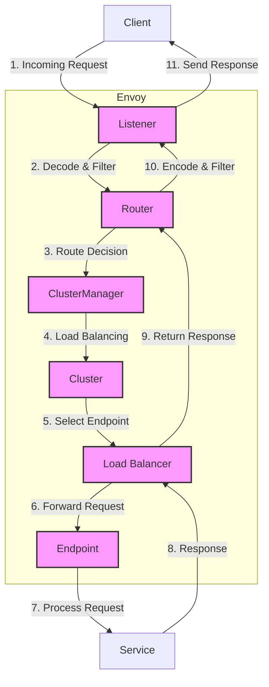
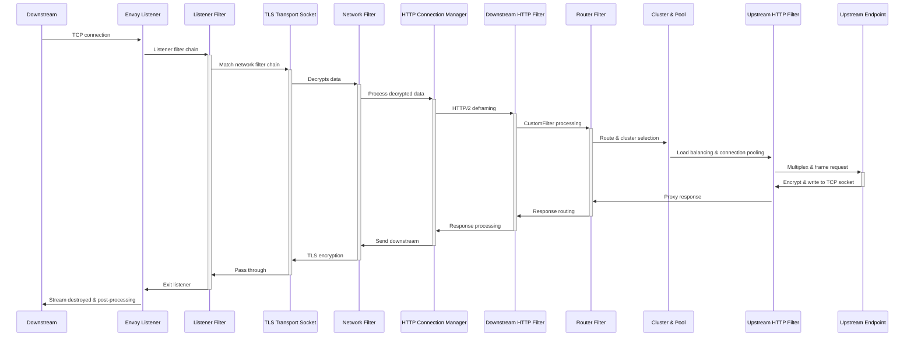
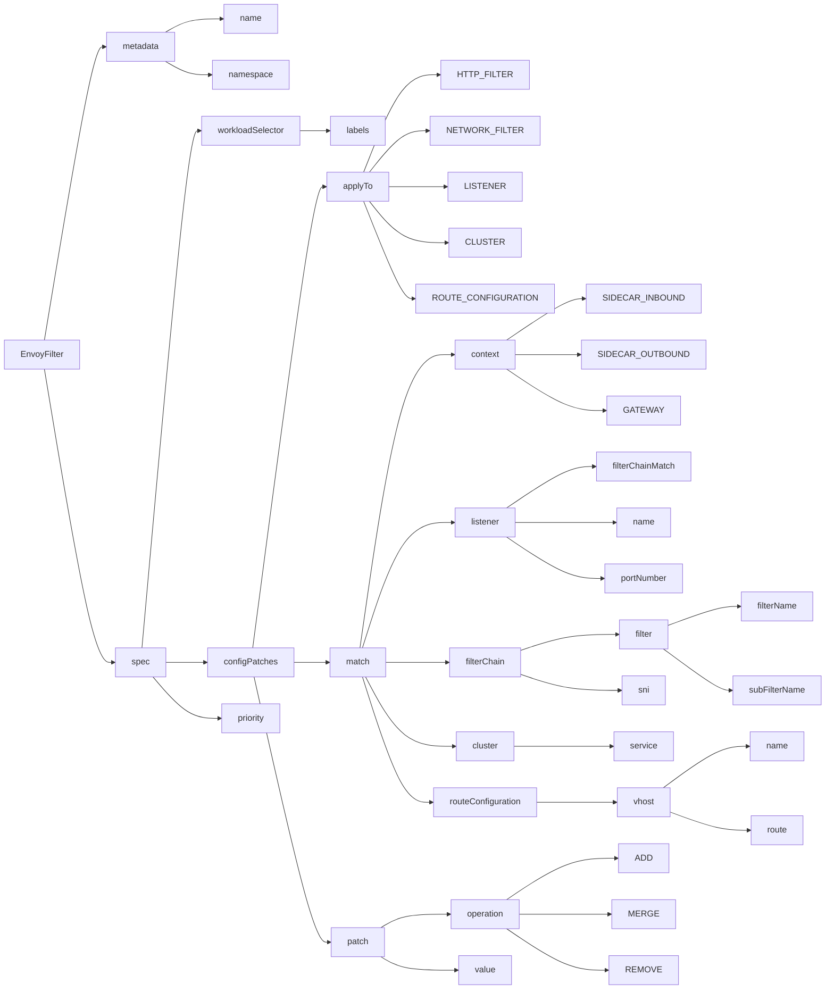

Envoy 是一个网络代理，可以代理 L3/L4、L7 流量，其中最核心的可拔插的过滤器链（Filter Chain），它就像 Unix 中的管道，可以将一个操作的输出作为另一个操作的输入，这样串联在一起。

## Envoy 基本数据流

Envoy Proxy 的内部架构设计为处理高性能网络通信，支持多种协议，并提供动态配置、健康检查、负载均衡等功能。以下是使用 Mermaid 绘图语法描述的 Envoy 内部组成的简化视图，包括主要的组件和它们之间的交互：

1. **Listener**: 监听器负责监听入站连接，是请求进入 Envoy 的入口点。
2. **Router**: 路由组件负责根据配置的路由规则，决定如何处理请求，包括请求应该发送到哪个集群。
3. **ClusterManager**: 集群管理器负责管理Envoy配置的所有集群，包括服务发现、健康检查和负载均衡配置。
4. **Cluster**: 集群代表一组逻辑上相似的后端服务实例。
5. **Load Balancer (LB)**: 负载均衡器根据配置的负载均衡策略，从集群中选择一个健康的服务实例。
6. **Endpoint**: 端点是集群中的具体服务实例，请求将被转发到此处。
7. **Service**: 实际的后端服务，处理请求并返回响应。

**流程解释**

- 请求首先被监听器接收，然后根据路由配置决定如何处理。
- 路由组件基于请求信息，通过集群管理器选择适当的集群。
- 集群中的负载均衡器选择一个端点来处理请求。
- 请求被转发到选定的服务实例（端点），服务处理请求并返回响应。
- 响应沿原路径返回给客户端，过程中可能经过一系列的过滤器处理。

以上是 Envoy 处理请求和响应的高级流程，实际配置和使用中可能涉及更多详细的组件和设置。

## Envoy 的配置

下图展示了 Envoy 的配置，涵盖了多个方面：

- 基本组件配置：Listeners、Upstream Clusters
- RPC 协议支持：Dubbo、Thrift
- HTTP 协议支持
- 操作、安全、可观测性
- 高级配置

## Listener Filter

Envoy 中的 Listener Filter 主要用于处理网络连接的输入和输出，提供了一些额外的功能和服务。以下是一些常见的 Listener Filter：

1. **HTTP Inspector**: 用于检查传入 HTTP 请求的内容。
2. **Local rate limit**: 用于限制本地连接速率，以保护服务免受滥用或恶意攻击。
3. **Original Destination**: 用于恢复经过 NAT 转换后的原始目标地址。
4. **Original Source**: 用于恢复经过 NAT 转换后的原始源地址。
5. **Proxy Protocol**: 支持处理使用 Proxy Protocol 传输的连接，可以从代理服务器获取客户端的原始 IP 地址。
6. **TLS Inspector**: 用于检查传入连接的 TLS 握手和证书信息。

除了上述常见的 Listener Filter，Envoy 还提供了许多其他 Listener Filter，用于处理连接的不同方面和需求。

## Envoy 请求流程

下图展示了一个数据流在进入 Envoy 之后的处理流程。

## EnvoyFilter 配置项

## 如何配置 EnvoyFilter

首先确定应用对象（applyTo）：

- INVALID
- LISTENER
- FILTER_CHAIN
- NETWORK_FILTER
- HTTP_FILTER
- ROUTE_CONFIGURATION
- VIRTUAL_HOST
- HTTP_ROUTE
- CLUSTER
- EXTENSION_CONFIG
- BOOTSTRAP
- LISTENER_FILTER

然后设置匹配条件（match）：

- context：
  - ANY
  - SIDECAR_INBOUND
  - SIDECAR_OUTBOUND
  - GATEWAY
- proxy
- listener：
  - name
  - portNumber
  - filterChain
- routeConfigurationMatch
- cluster

匹配完成后就可以执行 patch 操作了：

- operation
  - ADD
  - REMOVE
  - INSERT_BEFORE
  - INSERT_AFTER
  - INSERT_FIRST
  - MERGE
  - REPLACE
