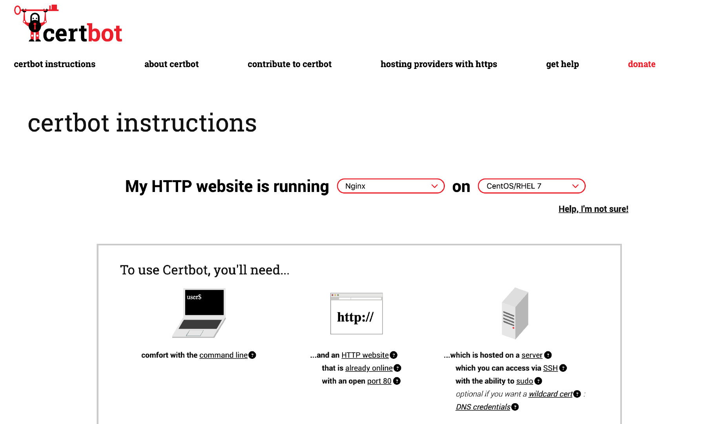

我的博客从上线第一天起就使用了 HTTPS，用的是 [Cloudflare](https://www.cloudflare.com/zh-cn/)，直接在其后台配置即可。如果你是用 nginx、apache、haproxy 等服务器来运行自己的网站，给大家推荐 [Certbot](https://certbot.eff.org/)，可以自动化来配置 SSL 证书和定时更新。

下面记录我自己为 [servicemesher.com](https://www.servicemesher.com) 网站配置 HTTPS 证书的过程，全程不需要 5 分钟。

## 环境

网站的托管环境如下：

- OS：CentOS 7.6 阿里云
- 网站服务器：Nginx，使用 yum 安装，版本 1.12
- 提前配置好 Nginx，确保使用 HTTP 先可以访问到网站

注意：请使用 `yum` 命令安装 nginx，这样可以确保 nginx 安装在默认的位置，因为 certbot 会检测 `/etc/nginx/` 目录下的配置文件。

## 操作步骤

执行下面的步骤可以直接为你的网站配置 HTTPS 证书。

```bash
yum -y install yum-utils
yum-config-manager --enable rhui-REGION-rhel-server-extras rhui-REGION-rhel-server-optional
yum install certbot python2-certbot-nginx
```
下图是在 Certbot 中选择服务器和操作系统的页面。



执行下面的命令，根据提示会自动配置 nginx。

```bash
certbot --nginx
Saving debug log to /var/log/letsencrypt/letsencrypt.log
Plugins selected: Authenticator nginx, Installer nginx
Starting new HTTPS connection (1): acme-v02.api.letsencrypt.org

Which names would you like to activate HTTPS for?
1：servicemesher.com
2: www.servicemsher.com
# 这里直接回车选择所有的域名
- - - - - - - - - - - - - - - - - - - - - - - - - - - - - - - - - - - - - - - -
Select the appropriate numbers separated by commas and/or spaces, or leave input
blank to select all options shown (Enter 'c' to cancel):

- - - - - - - - - - - - - - - - - - - - - - - - - - - - - - - - - - - - - - - -
You have an existing certificate that contains a portion of the domains you
requested (ref: /etc/letsencrypt/renewal/servicemesher.com.conf)

It contains these names: servicemesher.com, www.servicemesher.com

You requested these names for the new certificate: servicemesher.com,
prow.servicemesher.com, www.servicemesher.com.

Do you want to expand and replace this existing certificate with the new
certificate?
- - - - - - - - - - - - - - - - - - - - - - - - - - - - - - - - - - - - - - - -
(E)xpand/(C)ancel: E
Renewing an existing certificate
Performing the following challenges:
http-01 challenge for prow.servicemesher.com
Waiting for verification...
Cleaning up challenges
Deploying Certificate to VirtualHost /etc/nginx/nginx.conf
Deploying Certificate to VirtualHost /etc/nginx/nginx.conf
Deploying Certificate to VirtualHost /etc/nginx/nginx.conf

Please choose whether or not to redirect HTTP traffic to HTTPS, removing HTTP access.
- - - - - - - - - - - - - - - - - - - - - - - - - - - - - - - - - - - - - - - -
1: No redirect - Make no further changes to the webserver configuration.
2: Redirect - Make all requests redirect to secure HTTPS access. Choose this for
new sites, or if you're confident your site works on HTTPS. You can undo this
change by editing your web server's configuration.
- - - - - - - - - - - - - - - - - - - - - - - - - - - - - - - - - - - - - - - -
Select the appropriate number [1-2] then [enter] (press 'c' to cancel):
# 这里是为了扩展证书支持更多的域名，所有输入 2 回车
Traffic on port 80 already redirecting to ssl in /etc/nginx/nginx.conf
Redirecting all traffic on port 80 to ssl in /etc/nginx/nginx.conf
Traffic on port 80 already redirecting to ssl in /etc/nginx/nginx.conf

- - - - - - - - - - - - - - - - - - - - - - - - - - - - - - - - - - - - - - - -
Your existing certificate has been successfully renewed, and the new certificate
has been installed.
```

然后重新加载配置。

```bash
nginx -t;nginx -s reload
```

设置证书自动更新。

```bash
echo "0 0,12 * * * root python -c 'import random; import time; time.sleep(random.random() * 3600)' && certbot renew" | sudo tee -a /etc/crontab > /dev/null
```

好了现在访问你的网站就可以看到 https 头部加了 HTTPS 锁了。

## 参考

- [让网站永久拥有HTTPS - 申请免费SSL证书并自动续期](https://blog.csdn.net/xs18952904/article/details/79262646)
- [certbot - 免费的 https 证书](https://certbot.eff.org/lets-encrypt/centosrhel7-nginx)
