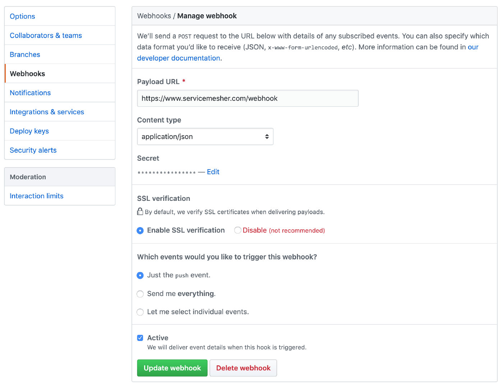
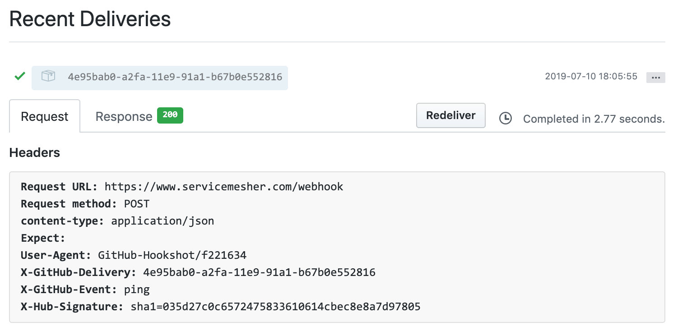

本文介绍如何为 [ServiceMesher.com](https://www.servicemesher.com) 网站配置自动化部署的详细说明，通过本文你将了解到：

- 如何使用 GitHub Webhook 来自动化发布您的网站
- 如何配置 Nginx 代理根据 URI 请求转发到本地服务器的指定端口

## 自动发布脚本

使用名为 `deploy.sh` 的 Shell 脚本编译 Hugo 生成 HTML 文件，并放到 Nginx 配置的目录下。该脚本位于 [ServiceMesher 官网 GitHub 仓库](https://github.com/servicemesher/website)同级目录下，内容如下：

```bash
#!/bin/bash
# 网站的代码仓库目录
input="website"
# Nginx 中配置的网站的 HTML 根目录
output="/home/admin/servicemesher.com"
cd $input
git pull
hugo
cd ..
cp -r $input/public/* $output
```

## 依赖安装

该网站部署在阿里云上，操作系统为 CentOS 7.6.1810，并配置好了 [HTTPS](/posts/free-certificates-with-certbot)	。

安装后端服务配置所需的组件。

```bash
yum install -y npm
```

安装 NPM 包。

```bash
npm i -S github-webhook-handler
npm i -g pm2
```

## 创建 webhook 服务后端

我们使用 NodeJS 创建 webhook 服务后端，后端代码保存在 `webhook.js`文件中，调用 `deploy.sh` 来发布，因此需要与 `deploy.sh` 文件在同一级目录中，监听 `http://127.0.0.1:6666/webhook`：

当前的所有文件的结构如下：

```bash
$ ls -1
deploy.sh
node_modules
package.json
sofastack.tech
webhook.js
```

`webhook.js` 文件内容如下：

```javascript
var http = require('http');
var spawn = require('child_process').spawn;
var createHandler = require('github-webhook-handler');
// 注意将 secret 修改你自己的
var handler = createHandler({ path: '/webhook', secret: 'yourwebhooksecret' });

http.createServer(function (req, res) {
  handler(req, res, function (err) {
    res.statusCode = 404;
    res.end('no such location');
  })
}).listen(6666);

handler.on('error', function (err) {
  console.error('Error:', err.message)
});

handler.on('push', function (event) {
  console.log('Received a push event for %s to %s',
    event.payload.repository.name,
    event.payload.ref);

  runCommand('sh', ['./deploy.sh'], function( txt ){
    console.log(txt);
  });
});

function runCommand( cmd, args, callback ){
    var child = spawn( cmd, args );
    var resp = 'Deploy OK';
    child.stdout.on('data', function( buffer ){ resp += buffer.toString(); });
    child.stdout.on('end', function(){ callback( resp ) });
}
```

在 `webhook.js` 所在目录下启动后端服务：

```bash
pm2 start webhook.js
```

查看服务状态：

```bash
$ pm2 status
┌──────────┬────┬─────────┬──────┬───────┬────────┬─────────┬────────┬─────┬───────────┬──────┬──────────┐
│ App name │ id │ version │ mode │ pid   │ status │ restart │ uptime │ cpu │ mem       │ user │ watching │
├──────────┼────┼─────────┼──────┼───────┼────────┼─────────┼────────┼─────┼───────────┼──────┼──────────┤
│ webhook  │ 0  │ 1.0.0   │ fork │ 30366 │ online │ 0       │ 6h     │ 0%  │ 30.8 MB   │ root │ disabled │
└──────────┴────┴─────────┴──────┴───────┴────────┴─────────┴────────┴─────┴───────────┴──────┴──────────┘
 Use `pm2 show <id|name>` to get more details about an app
```

使用 `pm2 logs webhook` 可以查看后端服务日志。

## Nginx 配置

在 nginx 配置中增加转发设置，将对网站 `/webhook` URI 的访问转发到服务器本地的 6666 端口，即 webhook 后端服务商。

```bash
        # GitHub auto deploy webhook
        location /webhook {
            proxy_pass http://127.0.0.1:6666;
        }
```

## GitHub Webhook 配置

在 GitHub 仓库的 `Settings` - `webhooks` 设置中创建一个新的 webhook。



注意选择 Content Type 为 `application/json`，secret 设置成与 `webhook.js` 中的相同。

配置完成后 GitHub 将自动调用 Webhook 以验证有效性。



如果看到 200 响应表示成功调用 Webhook 后端服务，这样每次我们的仓库合并后就会触发网站自动部署。

## 更多

为了加强 GitHub 自动化，还有更多 GitHub App 可以使用，推荐：

- [auto-assigin](https://github.com/apps/auto-assign)
- [mergify](https://github.com/apps/mergify)

这些已经在 [servicemesher.com](https://www.servicemesher.com) 网站上集成了，感兴趣的读者可以访问 [ServiceMesher 官网的代码仓库](https://github.com/servicemesher/website)查看配置。

## 参考

- [使用Github的webhooks进行网站自动化部署](https://aotu.io/notes/2016/01/07/auto-deploy-website-by-webhooks-of-github/index.html)
