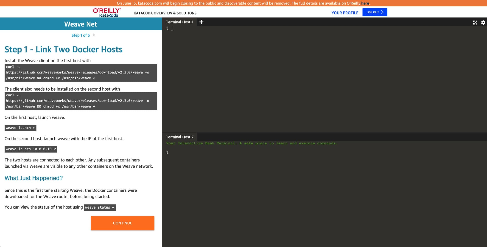



近日听闻 O'Reilly 将永久关闭在线学习网站 KataCoda，对于广大程序员和学习者来说，这无疑是一件痛心疾首的事情，以后我们再也看不到那只会变成的功夫猫了。

## KataCoda 简介

KataCoda 成立于 2016 年，它是一个在线学习平台，提供了上百个交互课程，用户可以登录免费学习。另外用户还可以基于 KataCoda 提供的基础镜像来构建和发布自己的在线课程，这一切都是免费的。

你可以根据提示，在一个临时的容器环境中操作，输入命令、观察结果，这种实时的反馈式学习方式，让你不需要再为准备环境而操心，大大降低了众多技术的上手门槛，可以说这种方式对于计算机技术教育来说是一种“革命式”的。

这些交互环境没有任何网络限制，你可以访问任何网站，还可以构建临时的公开网站让互联网中的所有用户访问。这种便利可以说是云原生或者容器时代赋予我们的，

## O'Reilly 为什么关闭 KataCoda？

O'Reilly 与 2019 年底收购了 KataCoda，如今关闭该网站应该也实属无奈。在 O'Reilly 官网发布的 [仅在 O'Reilly 内部利用 Katacoda 技术以及关闭  katacoda.com 的决定](https://www.oreilly.com/online-learning/leveraging-katacoda-technology.html) 这篇博客中，我们可以获得以下数据：

- KataCoda 有 28 万会员
- KataCoda 上有超过 387,866 名独立用户已花费超过 74,711 小时在平台上学习
- O'Reilly 有 280 万会员

以上数据仍然无法支撑 KataCoda 高昂的运营成本，主要是因为免费课程被滥用，比如用来挖矿，发送不良信息（所有免费课程连接互联网没有任何限制而且网速极快）。

## KataCoda 关闭之后怎么办？

KataCoda 上的很多免费课程其实都有在 GitHub 上开源，只有有另一个平台来托管，这些课程就可以继续使用。KataCoda 关闭后，还有众多交互式课程平台可以选择，比如下面这两个：

- [Killercoda](https://killercoda.com/)
- [CloudYuga](https://cloudyuga.guru/)
- [Instruqt](https://instruqt.com/)

关于 O'Reilly 关闭 KataCoda 你有什么想法，欢迎在下面留言评论。
