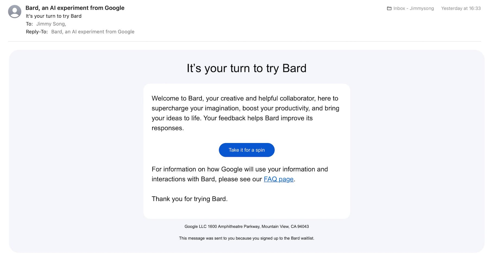
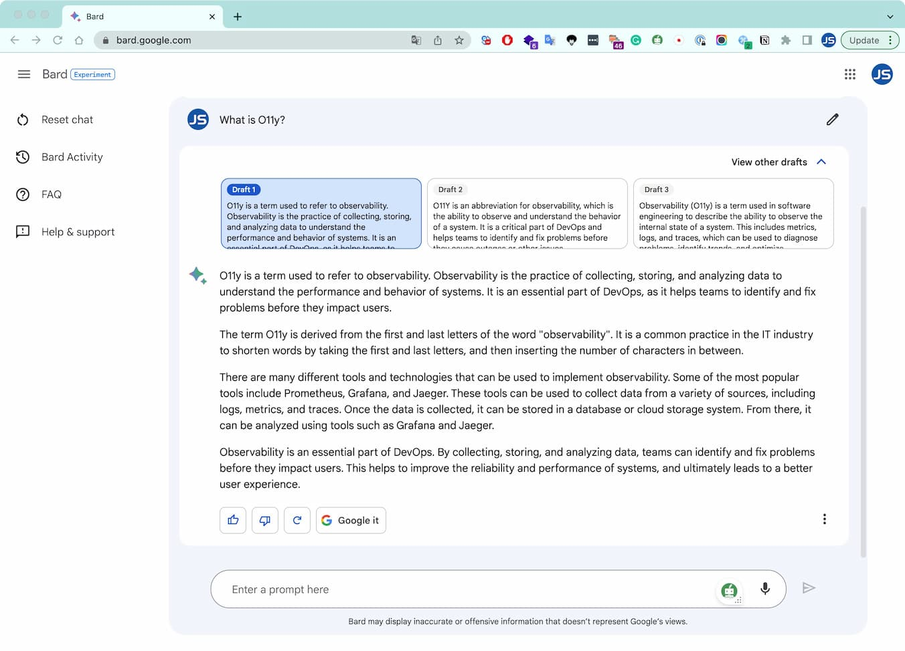
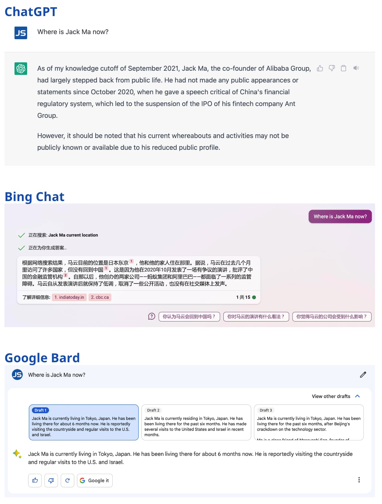

上周我申请加入 Google Bard waitlist，没想到这么快今天就收到了试用邀请，比起其他的生成式 AI 聊天工具申请试用要几个周甚至几个月才能通过要快的多。

## Google Bard 简介

Google Bard 是一个早期的实验性项目，它让你可以和生成式 AI 合作。它是由一个大型语言模型（LLM）驱动的，具体来说是 LaMDA 的一个轻量化和优化版本。你可以用 Google Bard 来提高你的效率，加速你的想法，激发你的好奇心。你可以向 Google Bard 提出各种问题，它会尝试给你有用的回答和建议。例如，你可以问 Google Bard 如何达到今年读更多书的目标，如何用简单的语言解释量子物理，或者如何为一篇博客文章写一个大纲。

Google Bard 目前仅对英国和美国用户开放，且只支持英文。你可以在[这里](https://bard.google.com/)申请加入 Google Bard 体验的 Waitlist。在申请通过之后你会收到一封告知邮件如图 1 所示，然后就可以去 [bard.google.com](https://bard.google.com/) 体验了。

Google Bard 的用户界面如图 2 所示。

## 测试：马云去哪了？

下面我就同一个问题向 ChatGPT、必应聊天、Google Bard 提问——”Where is Jack Ma now?“，它们的回答如图 3 所示。

你觉得哪个回答更好呢？我觉得是必应聊天。

## Google Bard vs Bing Chat vs ChatGPT

前段时间我也体验了新必应的聊天，见[体验新必应——聊天式的搜索引擎辅助工具](/blog/new-bing-chat/)。

正好使用生成式 AI 工具已经有好多个月了，三样工具我都用过了，我在下表中简单比较一下它们。

| 技术        | 开发者 | 应用场景                               | 主要功能                                               | 特色                                                         | 缺点                                                         |
| ----------- | ------ | -------------------------------------- | ------------------------------------------------------ | ------------------------------------------------------------ | ------------------------------------------------------------ |
| Google Bard | Google | 帮助用户更有效地思考和创造             | 回答问题和提供建议                                     | 同时提供三个回答供用户选择                                   | 界面体验一般，缺乏个性                                       |
| Bing Chat   | 微软   | 提供聊天交互式服务，聊天式搜索         | 回答常见问题，帮助预订机票或查找餐厅                   | 增加了引用来源，使得回答更可信；可检索互联网上的实时数据；提供联想问题可供用户追问 | 缺乏个性，数据来源不够广泛                                   |
| ChatGPT     | OpenAI | 聊天交互、问题回答、文本摘要等多个领域 | 应用广泛，包括自然语言处理、信息检索、机器翻译、编程等 | 简单直接，更加人性化，提供开发者 API                         | 时常胡言乱语，数据只更新到 2021 年；服务不稳定，免费账户需要经常刷新才能使用 |

## 总结

这篇文章介绍了 Google Bard，它是一个由 Google 开发的生成式 AI 工具，可以与用户合作，帮助他们更有效地思考和创造。文章还比较了 Bing Chat、OpenAI ChatGPT 和 Google Bard 的不同，以及它们对同一个问题的回答。笔者认为必应聊天的回答最好。
