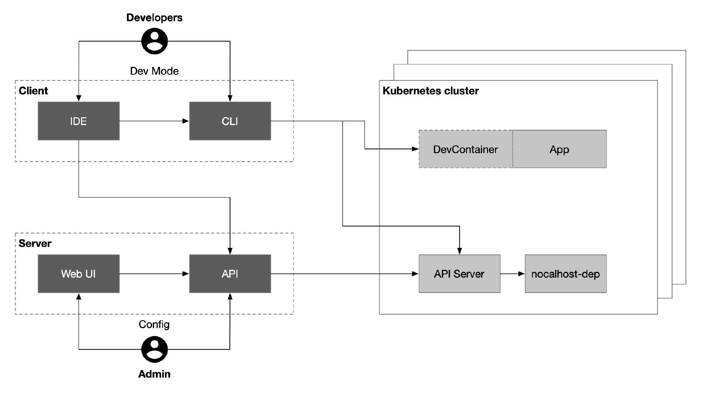
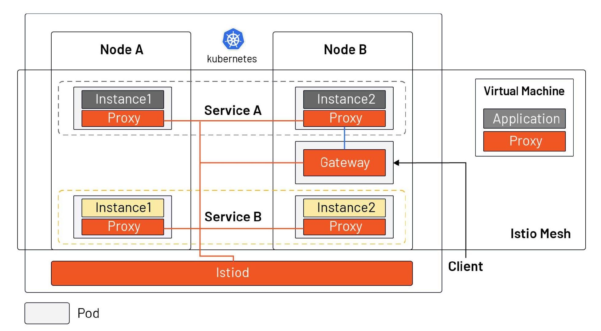

Kubernetes 可以说是目前为止用来运行微服务的最佳载体，但是在调试 Kubernetes 环境中的微服务时的体验可能就没那么友好了。本文将带你了解如何调试 Kubernetes 中的微服务，介绍常用的工具，以及 Istio 的引入为微服务的调试带来的变革。

## 调试微服务与传统单体应用有巨大的不同

微服务的调试是一直长期困扰软件开发人员的问题，这在传统的单体应用中不存在，因为开发者可以利用 IDE 中的调试器，为应用程序增加断点、修改环境变量，单步执行等，这些都为软件调试提供了巨大帮助。随着 Kubernetes 的流行，微服务的调试就成了一个棘手的问题，其中相比传统单体应用的调试多了以下问题：

### 多依赖

一个微服务往往依赖多个其他微服务，在调试某个微服务时，如何部署其他依赖服务以快速搭建一套最新的 stagging 环境？

### 从本地机器访问

微服务在开发者的本地电脑上运行时，通常无法直接访问到 Kubernetes 集群中的服务，如何像调试本地服务一样调试部署在 Kubernetes 集群中的微服务？

### 开发效率低下

通常情况下，代码从更新到构建成镜像再推送到集群中需要一个漫长的过程，如何加快开发速度？

我们一起来看下哪些工具能够解决以上问题。

## 工具

调试 Kubernetes 中的微服务的主要解决方案有：

- Proxy：在 Kubernetes 集群和本地调试终端中部署一个代理，通过构建一个 VPN，使得本地应用可以直接访问到 Kubernetes 中的服务；
- Sidecar：替换原来应用容器的镜像为开发镜像，可以在这个容器中中对该服务进行调试，同时在要调试的微服务 pod 中注入一个 sidecar 作为辅助工具来同步代码；
- 服务网格：要想了解应用的整体情况，就需要在所有微服务中注入 sidecar，这样你就可以获得一个监控全局状态的仪表板；

下面是实现以上解决方案的三个典型的开源项目，它们分别从不同的角度可以帮助你调试微服务。

### Proxy 模式：Telepresence

[Telesprence](https://www.telepresence.io/) 本质上是一个本地代理，该代理将 Kubernetes 集群中的数据卷、环境变量、网络都代理到了本地。下图展示的是 Teleprence 的主要使用场景。


用户需要在本地自主地执行 `telepresence` 命令，它会自动将代理部署到 Kubernetes 中，有了该代理之后：

- 本地的服务就可以完整的访问到 Kubernetes 集群中的其他服务、环境变量、Secret、ConfigMap 等；
- 集群中的服务还能直接访问到本地暴露出来的端点；

但是这种方式仍然不够连贯，还需要用户在本地调试时运行多次命令，而且在某些网络环境下可能无法与 Kubernetes 集群建立 VPN 连接。

### Sidecar 模式：Nocalhost

[Nocalhost](https://nocalhost.dev/) 是一个基于 Kubernetes 的云端开发环境。要想使用它，你只需要在你的 IDE——VS Code 中安装一个插件即可扩展 Kubernetes，并缩短开发反馈周期。通过为不同的用户创建不同的 namespace，并使用 ServiceAccount 绑定到不同用户角身上时，就可以实现开发环境隔离。同时，Nocalhost 还提供了 Web 控制台和 API，方便管理员来管理不同的开发环境。



#### 测试

参考 [Nocalhost 文档](https://nocalhost.dev/getting-started.html)，我们在 macOS 上安装 Nocalhost，并使用 Minikube 来演示如何调试。

执行下面的命令安装 Nocalhost 客户端并查看 `nhctl` 命令行工具的版本。

```bash
brew install nocalhost/repo/nocalhost

nhctl version
```

我们假设你机的 `kubeconfig` 文件位于 `~/.kube/config`（若不在此位置需要在下面的命令中使用 `--kubeconfig` 手动指定） 并拥有 Kubernetes 集群的 admin 角色，执行下面的命令使用 Helm3 在 Kubernetes 上安装 Nocalhost 服务端。

```bash
nhctl init demo -n nocalhost 
```

执行下面的命令启动 Minikube 隧道并查看 Nocalhost web 端地址。

```bash
minikube tunnel
kubectl get service nocalhost-web
```

在浏览器中访问 `http://<EXTERNAL-IP>` 即可，用户名/密码为：`admin@admin.com/123456`。

要想在 VS Code 中使用，你还想需要创建一个 ServiceAccount 并绑定 admin 角色，然后将该 ServiceAccount 作为 Kubeconfig 文件导出。

```bash
kubectl create serviceaccount my-service-account
kubectl create rolebinding admin --clusterrole=admin --serviceaccount=default:my-service-account
```

只要你有一个 Kubernetes 集群，并有集群的 admin 权限，就可以参考 Nocalhost 的文档快速开始试用。在 VS Code 中使用 Nocalhost 插件时需要先为插件中配置 Kubernetes 集群。选择你刚导出的 Kubeconfig 文件或者直接复制文件中的内容粘贴到配置里。然后选择你需要测试的服务，并选择对应的 Dev Container，VS Code 会自动打开一个新的代码窗口。

下面是以 Istio 官方提供的 [bookinfo 示例](https://istio.io/latest/docs/examples/bookinfo/)为例，你可以在本地 IDE 中打开克隆下来的代码，然后点击代码文件旁边的锤子即可进入开发模式。选择对应的 DevContainer，nocalhost 会自动向 pod 中注入一个开发容器 sidecar，并在终端中自动进入该容器，如下图所示。


在开发模式中，本地修改代码，无需重新构建镜像，远端开发环境实时生效，这样可以极大的加快开发速度。同时，Nocalhost 还提供了服务端，可用于开发环境和用户权限进行管理，如下图所示。


### Service Mesh 模式：Istio

以上使用 proxy 和 sidecar 的方式，一次只能对一个服务进行调试，如果想要掌握服务的全局状况，比如获取的服务的指标，以及通过分布式追踪了解服务的依赖和调用流程，对服务的性能进行调试。这些[可观察性](https://istio.io/latest/zh/docs/concepts/observability/)的功能，需要为所有服务统一注入 sidecar 来实现。

而且，当你的服务正处于从虚拟机迁移到 Kubernetes 的过程中时，使用 Istio 可以将虚拟机与 Kubernetes 纳入一个网络平面中（如下图所示），方便开发者调试和做渐进式的迁移。



当然要获得这些好处也不是一点“代价”也不没有的，引入 Istio 后，你的 Kubernetes  service 需要遵守 Istio 的[命名规范](https://istio.io/latest/zh/docs/ops/deployment/requirements/)，学习使用 [Istioctl](https://istio.io/latest/docs/ops/diagnostic-tools/istioctl-analyze/) 命令行和日志的方式来调试微服务。

- 使用 `istioctl analyze` 命令来调试集群中的微服务部署情况，可以使用 YAML 文件来检查某个命名空间或整个集群中的资源部署情况。
- 使用 `istioctl proxy-config secret`  来调试 service mesh 中的 pod 的 secret 被正确的加载并有效。

Istio 的配置信息在大型的集群部署中传播将会耗时更长并且可能有几秒钟的延迟时间，sidecar 的引入会给服务间调用带来一定延迟。

## 总结

在应用微服务化和从虚拟机迁移到 Kubernetes 的过程中，开发者需要很多观念和习惯上的转变。通过 proxy 在本地跟 Kubernetes 间构建 VPN，可以方便开发者像调试本地服务一样调试 Kubernetes 中的服务。通过向 pod 中注入 sidecar，可以实现实时调试，加快开发进度。最后，Istio service mesh 真正实现了全局的可观察性，你还可以使用像 [Tetrate Service Bridge](https://www.tetrate.io/tetrate-service-bridge/) 这样的工具来管理异构平台，帮助你渐渐地从单体应用过度到微服务。
