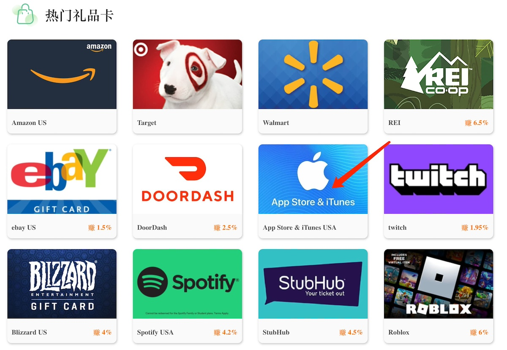

在上一篇博客中，我向大家介绍了我开发的[Istio Advisor Plus GPT](https://chat.openai.com/g/g-pv9WQ7xgm-istio-advisor)。但是，要使用这个工具，需要满足一个前提条件，即您必须已经订阅了 ChatGPT Plus。对于很多中国用户来说，注册 ChatGPT 账户可能已经费了不少力气，但是在订阅 ChatGPT Plus 时可能会遇到一些困难。在这篇文章中，我将指导您如何通过正规渠道、无需使用国外信用卡，也无需虚拟信用卡来成功订阅和续费 ChatGPT Plus。

答案其实很简单，首先您需要拥有一个美国地区的 Apple ID。然后，您可以前往 [https://shop.pockyt.io/](https://shop.pockyt.io/) 这个网站购买**App Store & iTunes**礼品卡，您可以选择礼品卡的金额，范围从 2 美元到 500 美元不等。接下来，您可以使用**支付宝**进行支付。您也可以直接在您自己的支付宝中将地区设置为美国，然后搜索礼品卡，即可找到购买链接。我为了方便起见，选择在网站上直接购买。购买完成后，您将收到礼品卡代码，登录您的美国地区的 Apple Store 账户后，即可兑换礼品卡。

通过这种方式，您可以轻松订阅 ChatGPT Plus，无需繁琐的操作，同时也避免了使用国外信用卡或虚拟信用卡的麻烦。这是一个简单而有效的方法，让更多人能够享受 ChatGPT Plus 的服务。

