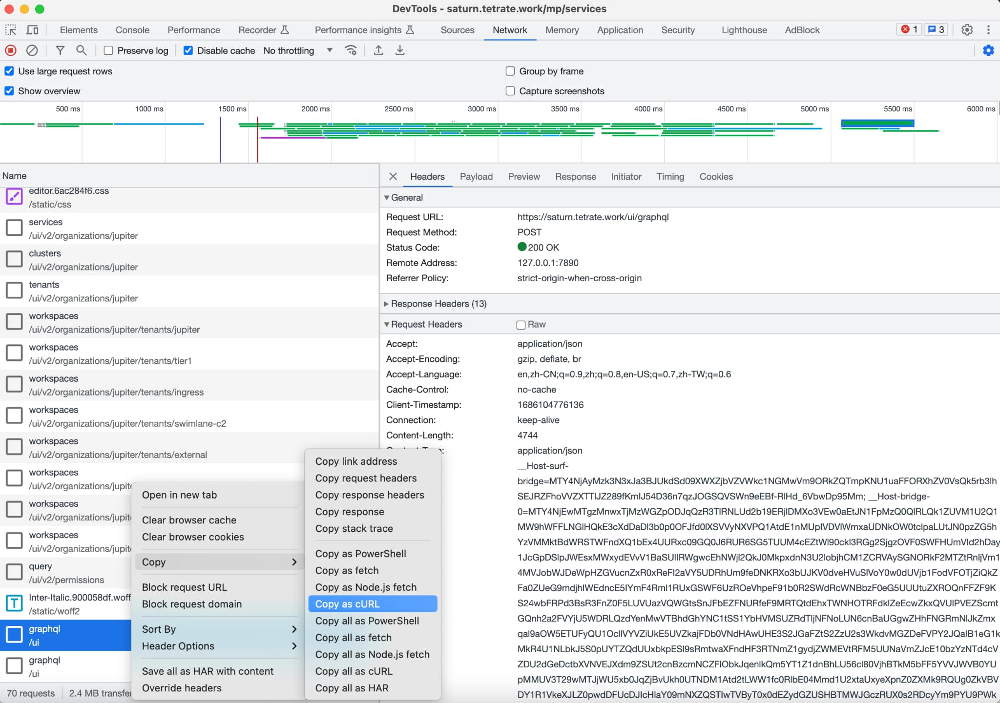

在本文中，我将解释如何使用 [GraphQL 与](https://graphql.org/)[Postman](https://www.postman.com/) 一起从 [SkyWalking](https://skywalking.apache.org/) 查询数据。它包括获取不记名令牌、构建查询以检索特定服务的负载指标以及使用 GraphQL 自省来查看 SkyWalking GraphQL API 架构的步骤。本文还提供了更多信息的参考。

## 什么是 GraphQL？

GraphQL 是 Facebook 开发的一种 API 查询语言和运行时。它允许客户端准确指定他们需要的数据并仅接收该数据作为响应，从而为传统 REST API 提供了更高效、更强大、更灵活的替代方案。使用 GraphQL，客户端可以在单个请求中查询多个资源，从而减少与服务器的往返次数并提高性能。

## GraphQL 和 REST API 之间有什么区别？

GraphQL 允许客户端仅请求他们需要的数据，而 REST API 要求客户端检索资源中的所有内容，无论他们是否需要。此外，GraphQL 允许客户端在单个请求中查询多个资源，这使其比 REST API 更高效、更简洁。

## 如何查询 SkyWalking 数据？

SkyWalking 定义了查询阶段的通信协议。SkyWalking 原生 UI 和 CLI 使用此协议从后端持续获取数据，无需担心后端更新。

从 SkyWalking 查询指标有两种方法：

1. [GraphQL API](https://skywalking.apache.org/docs/main/v9.4.0/en/api/query-protocol/)
2. [PromQL API](https://skywalking.apache.org/docs/main/v9.4.0/en/api/promql-service/)

本文提供了有关如何使用 GraphQL 从 SkyWalking 查询指标的指南。如果你对 PromQL API 感兴趣，可以参阅文章[为 Apache SkyWalking 构建 Grafana Dashboard - 原生 PromQL 支持](https://skywalking.apache.org/zh/2023-03-17-build-grafana-dashboards-for-apache-skywalking-native-promql-support/) 。继续执行以下步骤需要安装 TSB。如果你没有，但仍想体验使用 GraphQL 在 SkyWalking 中查询数据，你可以使用 SkyWalking 提供的免费[演示环境](https://skywalking.apache.org/)（用户名 / 密码：skywalking/skywalking）。登录演示网站并获取查询令牌。GraphQL 查询的端点地址是 <http://demo.skywalking.apache.org/graphql> 。构造查询的步骤与下面描述的相同。

## 观察 TSB 中的 GraphQL 查询

在我们使用 Postman 构建自己的 GraphQL 查询之前，我们首先观察 TSB 如何从 SkyWalking 获取数据。

1. 打开 Chrome DevTools 并切换到“Network”选项卡。
2. 访问网站上的**Organization - Services** 选项卡。

观察网络请求列表并右键单击其中一个 graphql 请求，如下图所示：



你看到的 curl 命令将如下所示。在终端中执行该命令，你将从 SkyWalking 中获取 TSB 管理的服务列表。

```bash
curl '<https://saturn.tetrate.work/ui/graphql>' \\
  -H 'Accept-Language: en,zh-CN;q=0.9,zh;q=0.8,en-US;q=0.7,zh-TW;q=0.6' \\
  -H 'Cache-Control: no-cache' \\
  -H 'Client-Timestamp: 1686104776136' \\
  -H 'Connection: keep-alive' \\
  -H 'Content-Type: application/json' \\
  -H 'Cookie: ...' \\
  -H 'Origin: <https://saturn.tetrate.work>' \\
  -H 'Pragma: no-cache' \\
  -H 'Referer: <https://saturn.tetrate.work/mp/services>' \\
  -H 'Request-Id: ...' \\
  -H 'Sec-Fetch-Dest: empty' \\
  -H 'Sec-Fetch-Mode: cors' \\
  -H 'Sec-Fetch-Site: same-origin' \\
  -H 'User-Agent: Mozilla/5.0 (Macintosh; Intel Mac OS X 10_15_7) AppleWebKit/537.36 (KHTML, like Gecko) Chrome/114.0.0.0 Safari/537.36' \\
  -H 'X-Bridge-Csrf-Token: IOmJszLAqY3TRIUNhTuGu7vQgnfQY1FtgYFm+l/+Mu4EmVQU5T8EaQ7bngkCv4hQ12ZGids+I21pHMdepE9/qQ==' \\
  -H 'X-Csrf-Token: xTbxZerD3t8N3PaS7nbjKCfxk1Q9dtvvrx4D+IJohHicb0VfB4iAZaP0zh1eXDWctQyCYZWaKLhAYT3M6Drk3A==' \\
  -H 'accept: application/json' \\
  -H 'sec-ch-ua: "Not.A/Brand";v="8", "Chromium";v="114", "Google Chrome";v="114"' \\
  -H 'sec-ch-ua-mobile: ?0' \\
  -H 'sec-ch-ua-platform: "macOS"' \\
  --data-raw $'{"query":"query ServiceRegistryListMetrics(...)}' \\
  --compressed
```

**注意：** *上例中的某些字段太长，用点 (...) 替换*。

接下来，我将指导你构建一个查询来检索特定服务的负载指标。

## 获取 Bearer Token

首先，你需要获取网站的 Bearer Token。登录到 TSB UI，点击右上角的用户按钮，然后点击“Show token information”。在弹出窗口中，你将看到 Bearer Token，如下图所示。


注意：Bearer token 的有效期比较短。当它过期时，你需要重新登录 TSB 以获取新的 token。

我们已经预先部署了[bookinfo 应用程序](https://istio.io/latest/docs/examples/bookinfo/)并发送了一些测试流量。要在 Postman 客户端中使用 GraphQL 查询`reviews`的负载指标，请执行以下步骤：

1. 创建一个新的 GraphQL 请求，并输入请求 URL：`$TSB_ADDRESS/graphql`
2. 添加带有值`Bearer $TOKEN`的`Authorization`头
3. 使用 GraphQL Introspection 查看 SkyWalking GraphQL APIs 的模式。查找并单击`readMetricsValues`项。你将在右侧看到变量。填写`condition`和`duration`项目，如下图所示。


变量如下：

```graphql
query ReadMetricsValues {
    readMetricsValues(condition: {
    name: "service_cpm", entity: {scope: Service, serviceName: "reviews", normal: true}
  }, duration: {
    start: "2023-06-05 0625",
    end: "2023-06-05 0627",
    step: MINUTE
  }) {
        label
        values {
            values {
                id
                value
            }
        }
    }
}
```

单击 Query 按钮以获取结果。它应该类似于以下内容：

```json
{
    "data": {
        "readMetricsValues": {
            "label": null,
            "values": {
                "values": [
                    {
                        "id": "service_cpm_202306050625_cmV2aWV3cw==.1",
                        "value": 0
                    },
                    {
                        "id": "service_cpm_202306050626_cmV2aWV3cw==.1",
                        "value": 0
                    },
                    {
                        "id": "service_cpm_202306050627_cmV2aWV3cw==.1",
                        "value": 0
                    }
                ]
            }
        }
    }
}
```

以上是使用 SkyWalking Demo 环境测试 GraphQL 查询。TSE 也支持 GraphQL 查询，并且端点地址为`$TSB_SERVER/graphql`。

注意：此处的查询端点与 DevTool 中看到的不同。TSB UI 特定的 GraphQL 查询端点是`$TSB_SERVER/ui/graphql`。

有关 SkyWalking GraphQL 查询协议的详细信息，请参见[GitHub](https://github.com/apache/skywalking-query-protocol/tree/master)。

## 总结

在本文中，我介绍了如何在 Postman 中使用 GraphQL 查询协议查询 SkyWalking 中的数据。你可以根据 SkyWalking 的 GraphQL 模式构建自己的查询条件。TSB / TSE 中也提供了此功能。
