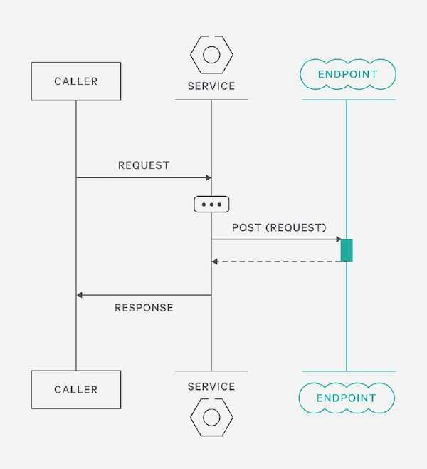
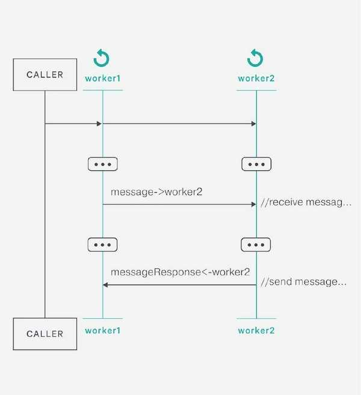
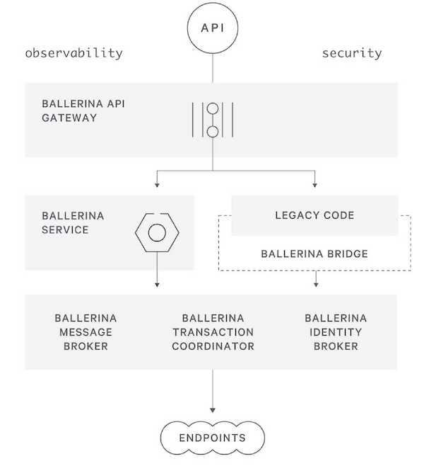
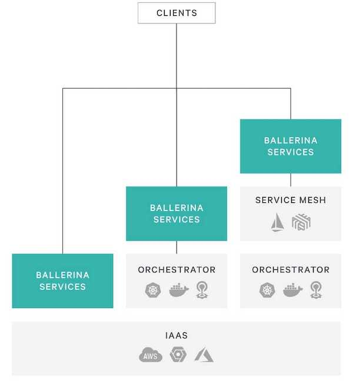
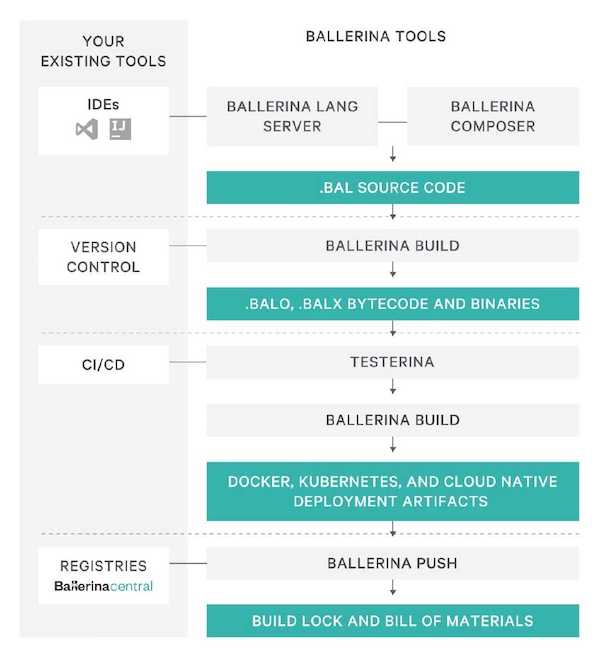

当我第一眼看到 [Ballerina](https://ballerina.io) 还真有点惊艳的感觉。Ballerina 这个单词的意思是“芭蕾舞女演员”。我想他们之所以给公司和这们语言起这个名字，可能是希望它成为云原生这个大舞台中，Ballerina 能像一个灵活的芭蕾舞者一样轻松自如吧！

Ballerina 是一款开源的编译式的强类型语言，该语言本身的代码可以通过 [GitHub](https://github.com/ballerina-platform/ballerina-lang) 上获取。我们可以通过 Ballerina 官网上的[设计哲学](https://ballerina.io/philosophy/)页面来对这门云原生编程语言一探究竟。


未来的应用程序应该是基于 API 的，而众多 API 之间的通讯和集成就成了关键问题。Ballerina 是一款使用文本和图形语法编译的、事务的、静态和强类型编程语言。Ballerina 包含分布式系统集成到语言的基本概念，并提供类型安全，并发环境下实现的分布式事务，可靠的消息传递，流处理和工作流。

## 为什么创建 Ballerina？

与 ESB 集成仍然是瀑布式开发。你必须部署服务器，配置连接器，使用 XML 编程服务逻辑以及使用 XPath 查询和转换数据。这不是开发者友好的。

带有 Spring 和 Node.js 等框架的编程语言提供了灵活性，但是它没有使适合于序列并行化、并发模型编程的分布式系统结构变得简单。

ESB、EAI、BPM 和 DSL 需要 XML 和配置来中断迭代开发流程：编辑、构建、运行和测试。这与运行实际应用之间是有一条鸿沟的，而云原生编程语言 Ballerina 的出现就是为了解决这条“集成鸿沟”的。

## Ballerina 设计理念

### 序列图



**语言灵感**

序列图反映了设计开发人员记录的互联的系统。Ballerina 的语法和高效的编码模式要求开发人员使用强大的交互最佳实践来编码。

**序列图可视化**

Ballerina 的语言语义模型旨在定义独立的各方如何通过结构化的交互沟通。接着，每个 Ballerina 程序都可以显示为其流程的序列图。IntelliJ 和 VS Code 的插件中提供了这些可视化。Ballerina Composer 是一款通过序列图创建 Ballerina 服务的工具。

**Actor 与 action**

客户端、worker 和远程系统在 Ballerina 的序列图中以不同的 actor 表示。在代码中，远程端点通过连接器进行连接，连接器提供类型安全操作。在图形上，每个连接器在序列图中表示为一个 actor（即一条垂直线），action 表示为与这些actor 的交互。

### 并发



**序列图和并发**

Ballerina 的并发模型是并行优先的，因为与远程方的交互总是涉及多个 worker。Worker 之间的交互作为消息传递进行处理，它们之间没有共享状态。

**Worker 语义**

Ballerina 的执行模型由称为 woker 的轻量级并行执行单元组成。Worker 使用非阻塞策略来确保没有函数锁定正在执行的线程，例如等待响应的 HTTP I/O调用。

**编程模型**

Worker 和 fork/join 语义抽象了底层非阻塞方法，以启用更简单的并发编程模型。

### 类型系统

下面是 Ballerina 中支持的类型。

```java
any anything; 
int integer = 0;
float floatingPoint = 0.0;
boolean b = true; 
string hi = "hello"; 
blob bl = hi.toBlob("UTF-8"); 
json jsonNative = { a: "hello", b: 5 }; 
xml x = xml `<ballerina>
                <supports>XML natively</supports>
             </ballerina>`;
string[] stringArray = ["hi", "there"]; 
int[][] arrayOfArrays = [[1,2],[3,4]];
json | xml | string unionType; 
(string, int) tuple = ("hello", 5); 
() n = (); // the empty tuple acts as "null"
string | int stringOrInt = "this is a union type";
int | () intOrNull = 5;
var inferred = ("hello", 5); 
map<boolean> myMap = {"ballerina": true}; 
type myRecord { string a; int b; };
type myObject object {   
    public { string x; } private { string y; }
    new (string xi, string yi) { x = xi; y = yi; }
    function getX() returns (string) { return x; }
};
```

**类型安全**

Ballerina 有一个结构化的类型系统，包括 primitive、recored、object、tuple 和 union 类型。该类型安全模型在赋值时包含了类型推断，并为连接器、逻辑和网络绑定的有效负载提供了大量的编译时完整性检查。

**Union 类型和显式 Null**

各个网络端点通常会根据其输入和逻辑返回具有不同有效负载类型消息或 error。Ballerina 的类型系统采用了基于 union 类型的方法。Union 类型明确地采用了这种语义，不需要开发人员创建不必要的“包装”类型。这种方法也增强了对 null 值的处理。默认情况下，类型不支持 null 值。开发人员必须明确创建 union 类型来处理 null 值。结果是 null 的异常不会发生，并且语言语法和编译器会识别是否需要 null 处理逻辑。

**异构数据处理**

Ballerina 类型系统内置丰富的对 JSON、XML、流和表格的支持以及对 ProtoBuf 和 gRPC 的直接支持。这样做的结果是可以获得处理网络负载、SQL 编程和流处理的干净可读的代码。数据转换逻辑不受复杂的生成类型、第三方库代码或其他混淆因素的影响——简单明了的可读代码捕捉与异构数据和转换逻辑的交互。

## Ballerina 如何工作？

Ballerina 的语法、代码和编译器创建了运行时服务和部署构件，这些工件都是云原生就绪的，您可以选择将其部署在 IaaS、编排系统或 service mesh 中的。开发人员的体验旨在维护流程，包括快速的编辑、构建、调试周期并集成到团队的生命周期工具链中。

### 运行时架构



**Ballerina API 网关**

强制执行身份策略并保证性能。通过代码注解（类似于 Spring 中的注解）进行配置和部署。可以运行嵌入式服务、作为管理多个服务的容器代理或者使用 API 管理解决方案（如 WSO2 API Manager）。

**Ballerina service**

表示您的 API 和执行逻辑。服务通过不同的协议运行，内部代码结构被编译为支持 OpenAPI 和 Swagger 的API接口。服务与端点进行通信，无论它们是调用客户端还是其他服务。

**Ballerina bridge**

允许传统代码和服务参与分布式事务中的 Ballerina 服务。Bridge 将您现有服务与本地代理包装起来，通过调用 Ballerina 服务参与和代理分布式事务。

**消息代理、事务协调者和身份代理**

为参与事务、事件驱动的通信和为认证流程的 Ballerina 服务提供代理基础设施功能。这些组件可以嵌入到单个服务部署中或者进行单独部署和扩展以管理多个服务。

### 部署架构



**IaaS**

使用代码注解和构建系统，可以打包 Ballerina 服务和其他运行时组件（如 API 网关）以部署到任何云原生环境中。在 IaaS 环境中，Ballerina 服务可以以虚拟机或容器的方式运行，也可以在构建期间将镜像推送到 registry 中。

**编排器**

代码注解会触发编译器扩展，从而为不同的编排器（如 Kubernetes 或 Cloud Foundry）生成 Ballerina 组件的工件包。供应商或 DevOps 可以添加自定义代码注解以生成特定于环境的部署，例如自定义蓝色部署算法。

**Service mesh**

Ballerina 可以选择断路器和事务流程逻辑委托给像 Istio 或 Envoy 这样的 service mesh（如果有的话）。如果没有 service mesh 的话，Ballerina 服务将嵌入相应的功能。

### 生命周期



**Ballerina 工具**

使用我们的语言服务器可以在 VS Code 和 IntelliJ 中获取自动补全和调试等智能感知。Ballerina 的关键字和语法结构可以用序列图的方式来表示。使用 Ballerina Composer 可以可视化的编辑 Ballerina 代码。另外它也可以做可视化得运行时和开发环境追踪。

**Ballerina 构建**

将服务编译为经过优化的字节码，以便使用内存调优后的 BVM 运行。提供了使用Testerina 的项目结构、依赖管理、包管理和单元测试。构建锁可以轻松地重新创建服务和部署。生成可执行文件（.balx）或库（.balo）。

**CI/CD**

部署代码注解会触发构建扩展，从而为持续集成、持续交付或编排器环境生成工件。将构建工件推送到您的 CI/CD 系统或完全跳过。

**Registry**

将端点连接器、自定义注解和代码功能作为可共享软件包组合在一起。可以在全球共享资源库——Ballerina Central 中 pull 或 push 版本化的软件包。

## Ballerina 的语言特性

Ballerina 设计为云优先，内置对现代 Web 协议和数据格式的支持，完全支持图灵完备编程语言，以及对微服务架构的原生支持。

- API 构造
- 逻辑语言
- 异步
- Json 和 XML
- 注解
- 稳定和强大的类型
- stream

## Ballerina 中集成了哪些内容？

Ballerina 是一种旨在**集成简化**的语言。基于顺序图的交互，Ballerina 内置了对通用集成模式和连接器的支持，包括分布式事务、补偿和断路器。凭借对 JSON 和 XML 的一流支持，Ballerina 能够简单有效地构建跨网络终端的强大集成。

- 类型安全端点集成
- 类型安全连接器
- 可靠的消息传递
- 分布式事务
- 断路器
- 注入攻击防护
- Docker 和 Kubernetes

关于 Ballerina 中各个功能的示例代码请查阅 [ballerina-example](https://github.com/ballerina-platform/ballerina-examples)。

## 参考

- [Ballerina官网](https://ballerina.io)
- [Microservices, Docker, Kubernetes, Serverless, Service Mesh, and Beyond](https://dzone.com/articles/microservices-docker-kubernetes-serverless-service)
