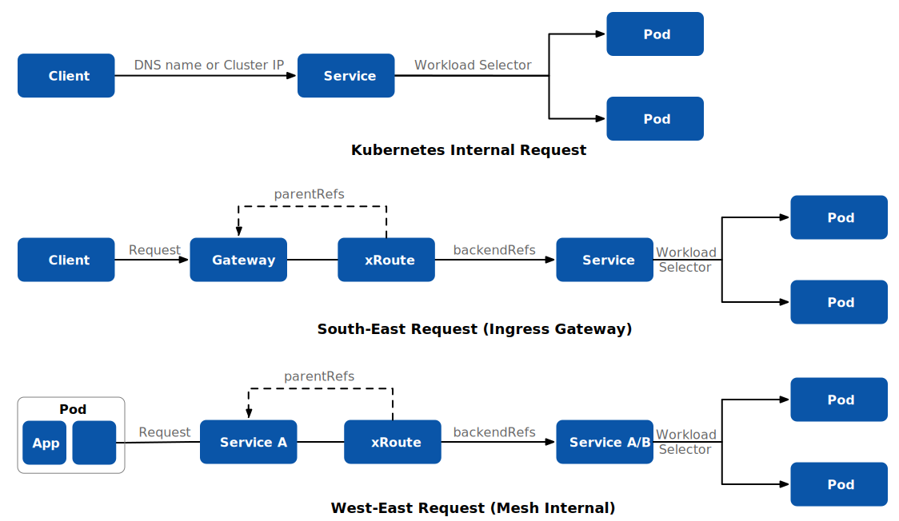

我很高兴呈现 Istio 的最新版本— [Istio 1.19](https://istio.io/latest/news/releases/1.19.x/announcing-1.19/)。这篇博客将概述此版本中的更新内容。

## Gateway API: 彻底改变服务网格

我们的[前一篇博客](https://tetrate.io/blog/why-the-gateway-api-is-the-unified-future-of-ingress-for-kubernetes-and-service-mesh/)强调了 Gateway API 将 Kubernetes 和服务网格中的入口网关统一的潜力，为跨命名空间的流量支持打开了大门。有了 Istio 的官方支持，Gateway API 成为了焦点。它不仅用于北 - 南流量（网格的入口和出口），现在还扩展到东 - 西流量的领域，也就是网格内部的流量。

在 Kubernetes 中，服务承担多项职责，从服务发现和 DNS 到工作负载选择、路由和负载均衡。然而，对这些功能的控制一直有限，工作负载选择是显著的例外。Gateway API 改变了这一局面，让你可以控制服务路由。这与 Istio 的 VirtualService 有一些重叠，因为两者都对流量路由有影响。以下是三种情况的简介：

1. Kubernetes 内部请求：在没有 Istio 的情况下，Kubernetes 的所有内部流量都走服务路由。
2. 北 - 南流量：通过将 Gateway API 应用到入口网关，流入 Kubernetes 的流量会按照 xRoute（目前支持 HTTPRoute, TCPRoute 和 gRPCRoute）到服务。
3. 东 - 西流量：在 Istio 内部，当流量进入数据平面时，Gateway API 的 xRoute 接管。它引导流量到原始服务或新的目标服务。

Gateway API 与 Istio 的这种动态结合不仅精细化了服务网络，也巩固了 Istio 在 Kubernetes 生态系统中的地位。

## 服务网格的 Gateway API: 深入探讨

在当前的实验阶段（v0.8.0 版本），服务网格的 Gateway API 引入了一种新的方法来配置 Kubernetes 中的服务网格支持。它直接将单个路由资源（如 HTTPRoute）与服务资源关联起来，简化了配置过程。

以下是一些关键点：

实验阶段：在 v0.8.0 版本中，服务网格的 Gateway API 仍处于实验阶段。建议不要在生产环境中使用。

服务与路由关联：在配置服务网格时，与使用 Gateway 和 GatewayClass 资源不同，单个路由资源直接与服务资源关联。

服务的前端和后端：服务的前端包括其名称和集群 IP，后端由其端点 IP 的集合组成。这种区分使得在网格内进行路由无需引入冗余资源。

路由附加到服务：将路由附加到服务上以将配置应用到指向该服务的任何流量。如果没有附加路由，流量会遵循网格的默认行为。

命名空间关系：

- *相同命名空间：* 在与其服务相同的命名空间中的路由，被称为生产者路由，通常由工作负载创建者创建以定义可接受的使用情况。它影响来自任何命名空间中的任何工作负载的客户端的所有请求。
- *不同命名空间：* 在与其服务不同的命名空间中的路由，被称为消费者路由，细化了给定工作负载的消费者提出请求的方式。这个路由只影响与路由在同一命名空间中的工作负载的请求。

组合路由：在单个命名空间中的同一服务的多个路由，无论是生产者路由还是消费者路由，都将根据 Gateway API 路由合并规则进行合并。这意味着在同一命名空间中为多个消费者定义不同的消费者路由是不可能的。

请求流程：

- 客户端工作负载发起对命名空间中特定服务的请求。
- 网格数据平面拦截请求并识别目标服务。
- 基于关联的路由，请求被允许、拒绝，或根据匹配规则转发到适当的工作负载。

请记住，在实验阶段，服务网格的 Gateway API 可能会有更多的变化，不建议在生产环境中使用。

但等等，还有更多！我们的旅程并没有结束 - 使用 API 的入口流量支持正快速向通用可用性 (GA) 进发，预计还会有更多动态的发展！

让我们进一步探讨这个版本中的其他增强功能。

## Ambient Mesh 增强

Istio 团队一直在不断优化 ambient mesh，这是一种创新的部署模型，提供了一个替代传统 sidecar 方法的选择。如果你还没有探索 ambient，现在是深入了解[介绍博客](https://istio.io/latest/blog/2022/introducing-ambient-mesh/)的好时机。

在这次更新中，我们强化了对`ServiceEntry`、`WorkloadEntry`、`PeerAuthentication`以及 DNS 代理的支持。并且，修复了一些 bug，增强了可靠性，以确保无缝的体验。

请记住，ambient mesh 在这个版本中处于 alpha 阶段。Istio 社区热切期待你的反馈，以推动它向 Beta 阶段前进。

## 简化虚拟机和多集群体验

简单易用是关键，特别是在处理虚拟机和多集群设置的时候。在这个版本中，我们在`WorkloadEntry`资源中使地址字段变为可选。这个看似小小的调整将大大简化你的工作流程。

## 提升安全配置

你现在可以为你的 Istio 入口网关的 TLS 设置配置`OPTIONAL_MUTUAL`，提供可选的客户端证书验证的灵活性。此外，你可以通过`MeshConfig`微调你偏好的非 Istio mTLS 流量使用的密码套件。

有了这些更新，Istio 1.19 赋予你在管理你的服务网格时更大的控制、灵活性和安全性。

欢迎你探索这些增强功能，并与 Istio 社区分享你的体验。更多详细信息，请参考[官方发布说明](https://istio.io/latest/news/releases/1.19.x/announcing-1.19/)。

祝你网格愉快！

------

本博客最初在[tetrate.io](https://tetrate.io/blog/whats-new-in-istio-1-19-gateway-api-and-beyond/)上发布。
