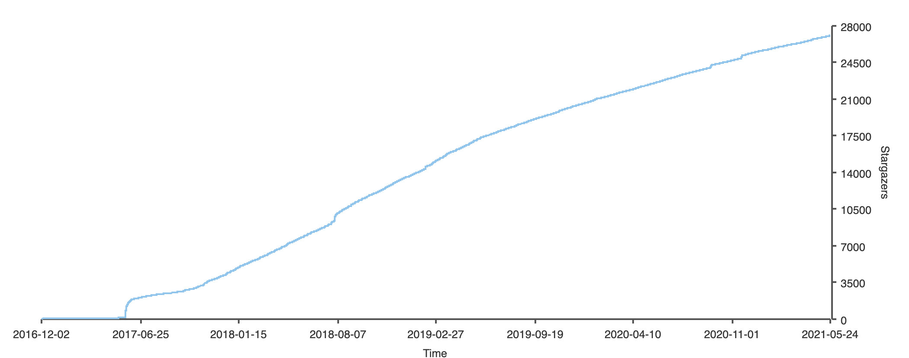
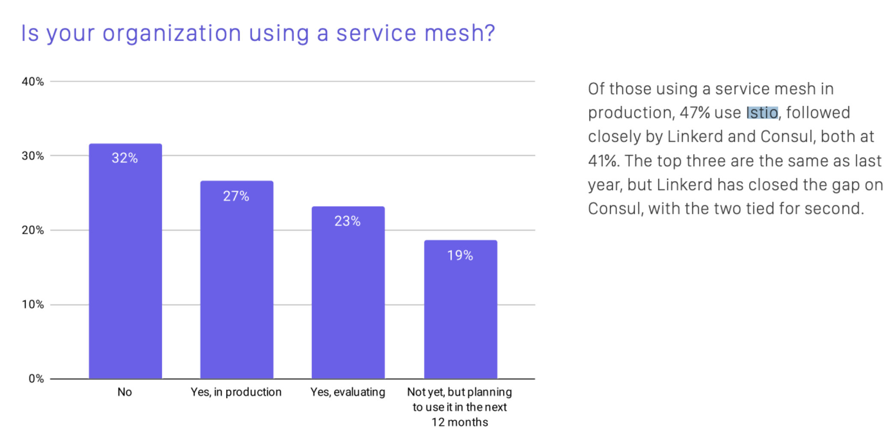

Istio 是由 [Tetrate](https://tetrate.io/) 创始人 Varun Talwar 和谷歌首席工程师 Louis Ryan 命名并在 2017 年 5 月 24 日开源。今天是 Istio 开源四周年，让我们一起来回顾一下 Istio 四年来的发展并展望一下它的未来。

## Istio 的开源历史

2017 年是 Kubernetes 结束容器编排之战的一年，Google 为了巩固在云原生领域的优势，并弥补 Kubernetes 在服务间流量管理方面的劣势，趁势开源了 Istio。下面是截止目前 Istio 历史上最重要的几次版本发布。

| **日期**   | 版本 | 说明                                                         |
| ---------- | ---- | ------------------------------------------------------------ |
| 2017-05-24 | 0.1  | 正式开源，该版本发布时仅一个命令行工具。确立了功能范围和 sidecar 部署模式，确立的 Envoy 作为默认 sidecar proxy 的地位。 |
| 2017-10-10 | 0.2  | 支持多运行时环境，如虚拟机。                                 |
| 2018-06-01 | 0.8  | API 重构。                                                   |
| 2018-07-31 | 1.0  | 生产就绪，此后 Istio 团队被大规模重组。                      |
| 2019-03-19 | 1.1  | 企业就绪，支持多 Kubernetes 集群，性能优化。                 |
| 2020-03-03 | 1.5  | 回归单体架构，支持 WebAssembly 扩展，使得 Istio 的生态更加强大。 |
| 2020-11-18 | 1.8  | 正式放弃 Mixer，进一步完善对虚拟机的支持。                   |

Istio 开源后经过了一年时间的发展，在 1.0 发布的前两个月发布了 0.8 版本，这是对 API 的一次大规模重构。而在 2018 年 7 月底发布 1.0 时，Istio 达到了生产可用的临界点，此后 Google 对 Istio 团队进行了大规模重组，多家以 Istio 为基础的 Service Mesh [创业公司](https://istio.io/latest/about/ecosystem/#providers)诞生，可以说 2018 年是服务网格行业诞生的元年。

2019 年 3 月 Istio 1.1 发布，而这距离 1.0 发布已经过去了近 9 个月，这已经远远超出一个开源项目的平均发布周期。我们知道迭代和进化速度是基础软件的核心竞争力，此后 Istio 开始以每个季度一个版本的固定[发布节奏](https://istio.io/v1.7/about/release-cadence/)，并在 2019 年成为了 [GitHub 增长最快的十大项目中排名第 4 名](https://octoverse.github.com/#fastest-growing-oss-projects-by-contributors)！

## Istio 社区

Istio 开源四年来，已经在 GitHub 上收获了 2.7 万颗星，获得了大量的[社区用户](https://istio.io/latest/about/case-studies/)。下图是 [Istio](https://github.com/istio/istio) 的 GitHub star 数增长情况。

2020 年 Istio 的项目管理开始走向成熟，治理方式也到了进化的阶段。2020 年，Istio 社区进行了第一次[管委会选举](https://istio.io/latest/blog/2020/steering-election-results/)，还把商标转让给了 [Open Usage Commons](https://istio.io/latest/blog/2020/open-usage/)。首届 [IstioCon](https://events.istio.io/istiocon-2021/) 在 2021 年 2 月份成功举办，几千人参加了线上会议。在中国也有大量的 Istio 社区用户，2021 年也会有线下面对面的 Istio 社区 meetup 在中国举办。

根据 CNCF 2020 年调查，46% 的组织在生产中使用服务网格或计划在未来 12 个月内使用。Istio 是在生产中使用的最多的网格。

## 未来

经过 4 年的发展，围绕 Istio 不仅形成了庞大的用户群，还诞生了多家 Istio 供应商，你可以在最近改版的 [Istio 的官网首页](https://istio.io)中看到。在最近几个版本中，Istio 已经将发展中心转移到了提升 Day 2 Operation 体验上来了。我们还希望看到更多的 Istio 的采纳路径建议、案例研究、学习资料、培训及认证（例如来自 Tetrate 的业界的第一个 [Istio 管理员认证](https://academy.tetrate.io/courses/certified-istio-administrator)），这些都将有利于 Istio 的推广和采用。
