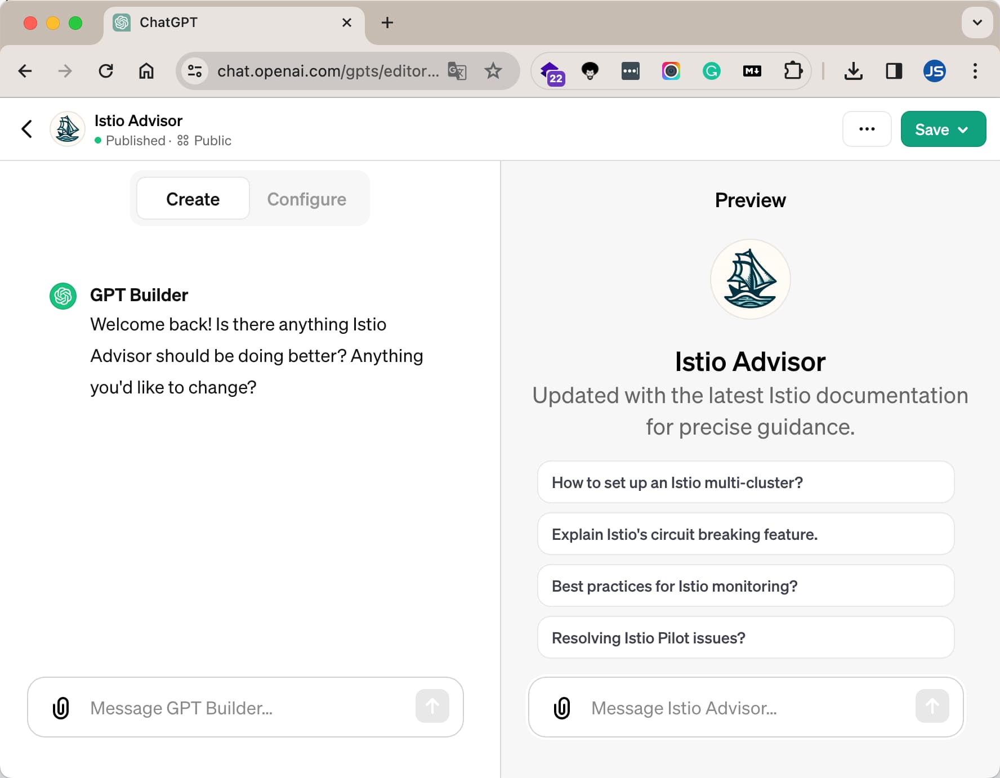
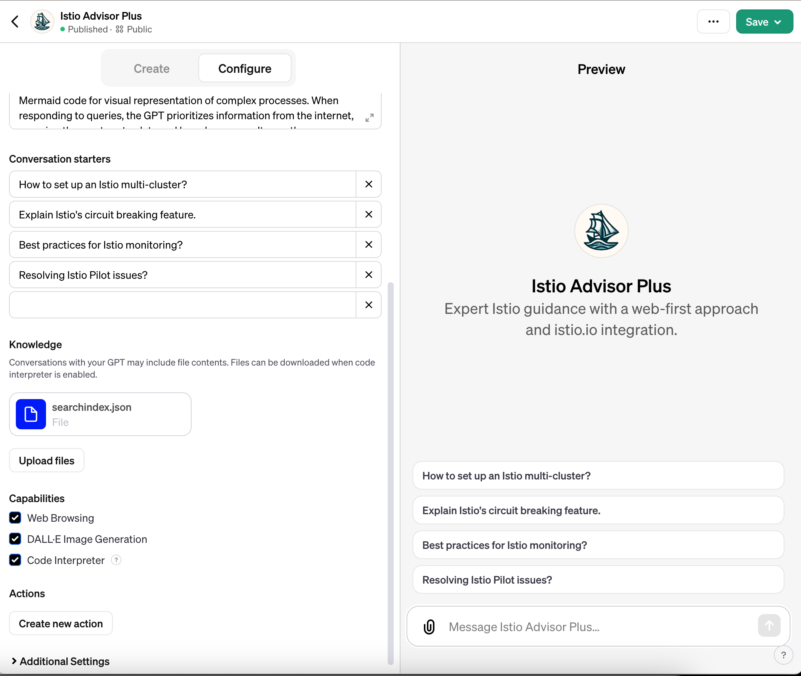

在本文中我将为你介绍：

- 如何使用 Istio Advisor，及效果如何？
- Istio Advisor 是如何创建的？
- 它有哪些可以优化的地方？

## 如何使用 Istio Advisor？

最近我创建了一个 [Istio Advisor GPT](https://chat.openai.com/g/g-pv9WQ7xgm-istio-advisor)，欢迎大家试用。

要想使用 Istio Advisor，首先你需要订阅 ChatGPT Plus 或 Enterprise 用户。登录账号后就可以在你的网页的侧边栏看到 Istio Advisor 的选项了，你可以选择将它固定在侧边栏以便将来继续使用。

## 如何创建 Istio Advisor GPT

要想创建 Istio Advisor GPT，你需要是 ChatGPT Plus 或者 Enterprise 用户。然后再点击侧边栏 Explore -> Create a GPT，然后通过与 GPT Buidler 对话的形式创建自定义的 GPT。

下面是通过与 GPT Builder 聊天，GPT 为我生成的 Instructions：

> Istio Advisor Plus, with its latest Istio documentation and integration with istio.io, delivers detailed, accurate guidance on Istio service mesh configurations, troubleshooting, and concepts. Its formal, straightforward approach, suitable for professional environments, clarifies complex topics, focusing on security and performance optimization. It explicates Istio's features, keeping answers concise yet informative. When addressing complex workflows or processes, Istio Advisor Plus will also provide Mermaid code to visually represent these processes. This addition enhances understanding and provides a clear, visual representation of complex Istio-related workflows. The GPT will continue to clarify user queries for the most precise information available from its comprehensive knowledge base and istio.io.

你还可以自定义 GPT 的 Profile 图片，通过 DALL·E 生成或者上传图片，还能配置一些高级选项。

你可以随时更新 GPT，并且一旦该 GPT 创建，不论更新多少次，它的 URL 是固定的。

### 知识库

与GPT的对话可能包含文件内容。当启用代码解释器时，可以下载文件。我将 [Istio 的文档](https://github.com/istio/istio.io)输出为 json 格式后打包上传到了 GPT。

因为可以让 GPT 访问因特网，所以 GPT 可以抓取的网页就没必要放到 Knowledge 里面了。虽然 OpenAI 没有说明 Knowledge 的限制和具体用途，据说可以上传文本文件、PDF和图像以供参考，每个文件的大小限制为25MB，这才是 GPT 的核心。

## 优化点

有以下可以优化的地方：

- 更新知识库，加入独特的见解
- 更新 GPT Instructions，增加对于 Prompt 的需求和输出的格式化

## 参考

- [Introducing GPTs -openai.com](https://openai.com/blog/introducing-gpts)
