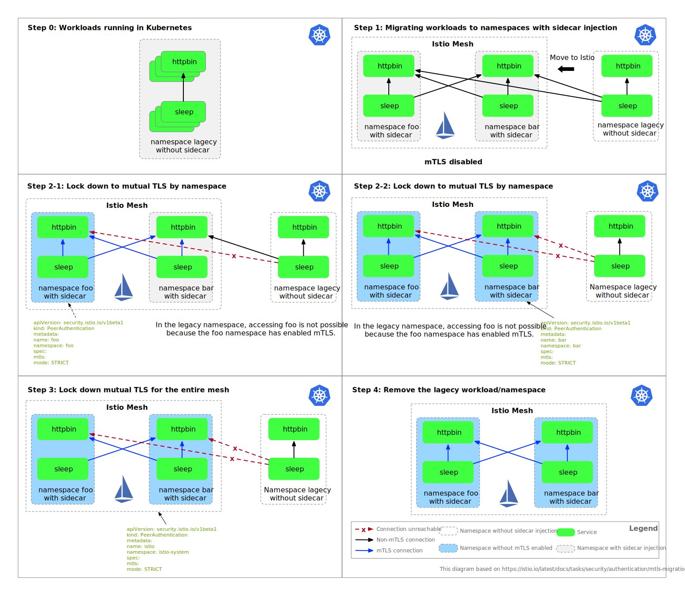
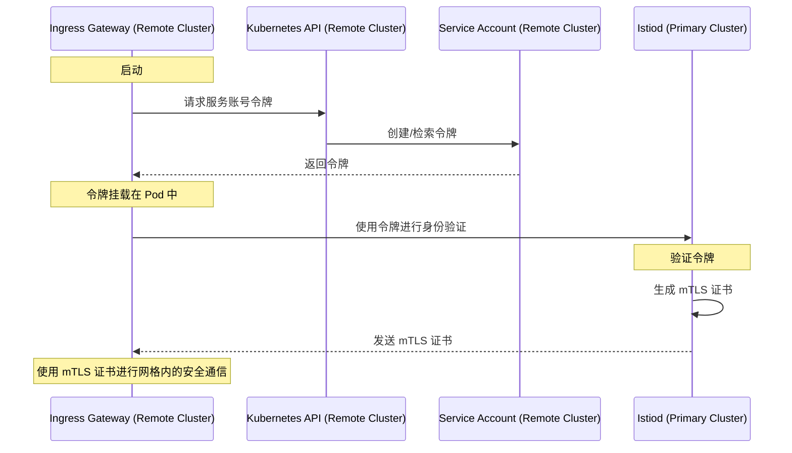

欢迎阅读本周的 Istio 社区周报！随着年末的临近，我们很高兴与 Istio 社区的成员分享一些更新和见解。从月度社区会议到如何有效使用 Istio 的专业技巧，本周报中包含了对每个人都有价值的信息，无论您是经验丰富的 Istio 用户还是刚刚入门。

## 社区更新

### 加入月度 Istio 社区会议

成为 Istio 月度社区会议的一部分，与其他热爱 Istio 的人士互动和交流。

- **时间**：每月第四个星期四，美国太平洋时间上午 10 点。[查看您当地的时间](https://time.is/compare/1000_in_San_Francisco,_California)。

### 保持联系
- **日历更新**：通过加入[此群组](https://groups.google.com/forum/#!forum/istio-community-video-meetings)，自动将会议添加到您的日历中。
- **会议详情**：在我们的[工作文档](http://bit.ly/istiocommunitymeet)中查找议程和记录。
- **录制会话**：错过了会议？可以在[YouTube](https://www.youtube.com/channel/UC-zVlo1F3mUbExQ96fABWcQ)上追赶。

### 在会议上做演讲

分享您的见解！将您的演讲摘要提交至 [istio-steering@googlegroups.com](mailto:istio-steering@googlegroups.com)。有关演示指南和更多详细信息，请参阅[这里](http://bit.ly/istiocommunitymeet)和[这里](https://github.com/istio/community/tree/master?tab=readme-ov-file#community-meeting)。

## Istio 专业技巧

### 在 VirtualService 路由中使用正则表达式
在 **`VirtualService`** 中使用基于标头的路由时，使用 Envoy 的[RE2 正则表达式](https://github.com/google/re2/wiki/Syntax)格式至关重要。例如：

- 匹配 "Google"：**`regex: ".\*Google.\*"`**
- 匹配 "Microsoft"：**`regex: ".\*Microsoft.\*"`**

这个 **`.\*<字符串>.\*`** 模式对于在 Envoy 中正确匹配非常重要。请记住，PCRE 格式与 Istio 不兼容。

- **关键点**：使用与 Envoy 兼容的 RE2 正则表达式进行精确路由。详细讨论内容可在[GitHub](https://github.com/istio/istio/discussions/48405)上找到。

### 无停机迁移到相互 TLS
以下图表说明了零停机迁移过程，以实现相互 TLS，并展示了远程 IngressGateway 和 Istiod 在主要 - 远程多集群部署中建立 mTLS 的过程。

TLS 迁移过程：

mTLS 建立的顺序图：

欲了解更多信息，请访问[GitHub 讨论](https://github.com/istio/istio/discussions/48343)。

---

随着节日的临近，我们祝愿 Istio 社区的所有成员圣诞快乐！愿这个季节带来喜悦、和平以及创新和合作的新机会。节日快乐！
