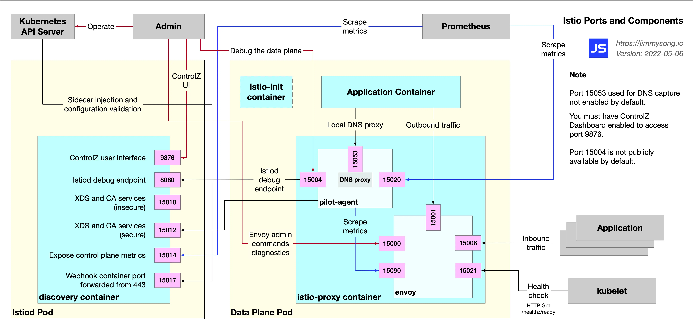
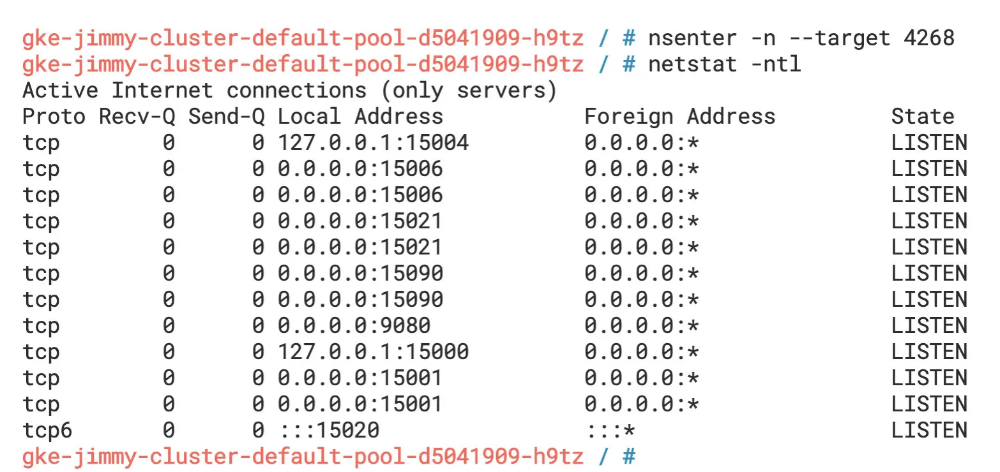
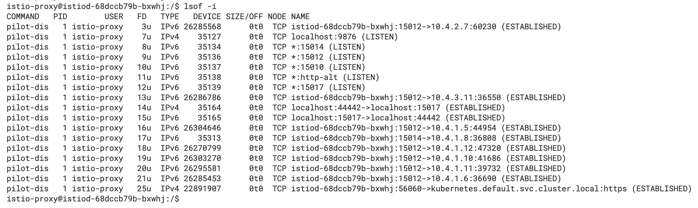
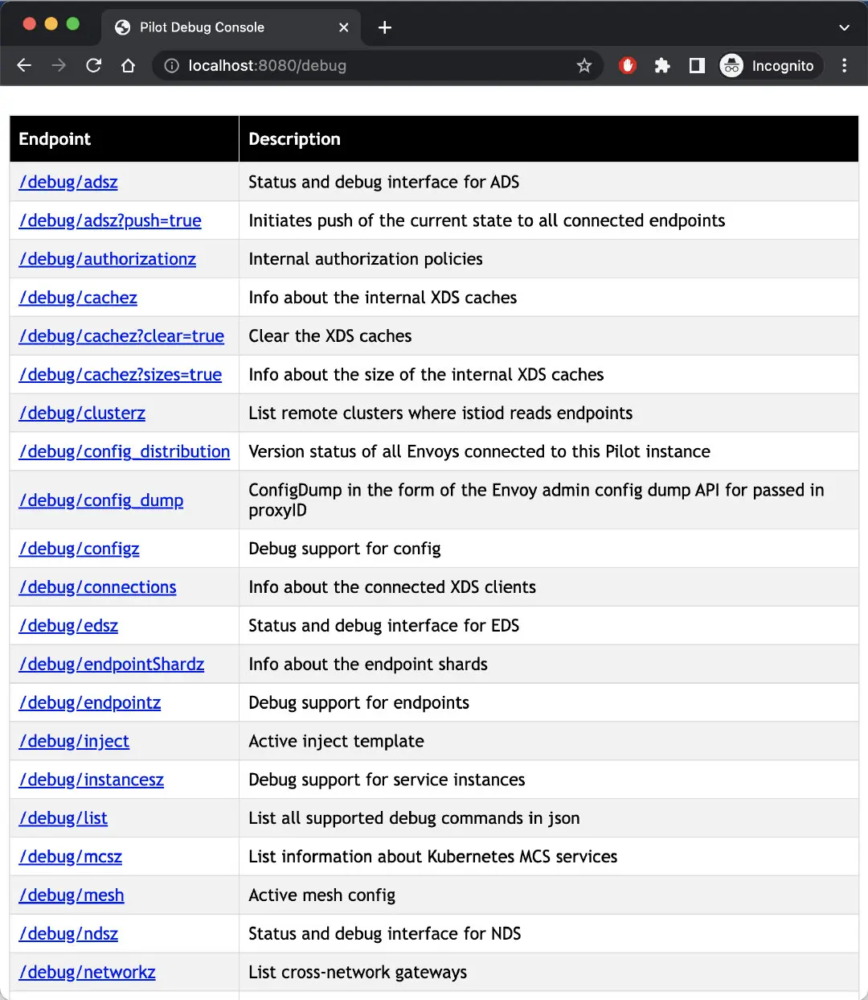

在我的前两篇博客中：

- [Istio 中的 Sidecar 注入、透明流量劫持及流量路由过程详解](https://jimmysong.io/blog/sidecar-injection-iptables-and-traffic-routing/)
- [Sidecar 中的流量类型及 iptables 规则详解](https://jimmysong.io/blog/istio-sidecar-traffic-types/)

我向你详细介绍了 Istio 数据平面中的流量，但数据平面并不能孤立的存在，本文将向你展示 Istio 中的控制平面和数据平面各组件的端口及其功能，有助于你了解这些流量之间的关系及故障排查。

## Istio 中的组件及端口示意图

按照习惯，我们首先展示一个全局示意图。下图展示的是 Istio 数据平面中 sidecar 的组成，以及与其交互的对象。



我们可以使用 `nsenter` 命令进入Bookinfo 示例的 `productpage`  Pod的网络空间，查看其内部监听的端口信息。



从图中我们可以看到除了 `productpage` 应用本身监听的 9080 端口以外，Sidecar 容器还有监听大量的其他端口，如 `15000`、`15001`、`15004`、`15006`、`15021`、`15090` 等，你可以在 [Istio 文档](https://istio.io/latest/docs/ops/deployment/requirements/)上了解 Istio 中使用的端口。

我们再进入 `productpage` Pod 中，使用 `lsof -i` 命令查看它打开的端口，如下图所示。


我们可以看到其中有 `pilot-agent` 与 `istiod` 建立了 TCP 连接，上文中所述的监听中的端口，还有在 Pod 内部建立的 TCP 连接，这些连接对应了文章开头的示意图。

Sidecar 容器（`istio-proxy` ）的根进程是 `pilot-agent`，启动命令如下图所示：


从图中我们可以看到，它 `pilot-agent` 进程的 PID 是 1，是它拉起了 `envoy` 进程。

在 `istiod` 的 Pod 中查看它打开的端口，如下图所示。



我们可以看到其中的监听的端口、进程间和远程通信连接。

## Istio 中各端口的功能概述

这些端口在你进行问题排查时可以起着举足轻重的作用。下面将根据端口所在的组件和功能分类描述。

## Istiod 中的端口

Istiod 中的端口相对比较少且功能单一：

- 9876：ControlZ 用户界面，暴露 `istiod` 的进程信息
- 8080：`istiod` 调试端口，通过该端口可以查询网格的配置和状态信息
- 15010：暴露 xDS API 和颁发纯文本证书
- 15012：功能同 15010 端口，但使用 TLS 通信
- 15014：暴露控制平面的指标给 Prometheus
- 15017：Sidecar 注入和配置校验端口

## Sidecar 中的端口

从上文中，我们看到 sidecar 中有众多端口：

- 15000：Envoy [管理接口](https://jimmysong.io/envoy-handbook/admin-interface/enabling-admin-interface.html)，你可以用它来查询和修改 Envoy 代理的的配置，详情请参考 [Envoy 文档](https://www.envoyproxy.io/docs/envoy/latest/operations/admin)。
- 15001：用于处理出站流量。
- 15004：调试端口，将在下文中解释。
- 15006：用于处理入站流量。
- 15020：汇总统计数据，对 Envoy 和 DNS 代理进行健康检查，调试 `pilot-agent`  进程，将在下文中详细解释。
- 15021：用于 sidecar 健康检查，以判断已注入 Pod 是否准备好接收流量。我们在该端口的 `/healthz/ready` 路径上设置了就绪探针，Istio 把 sidecar 的就绪检测交给了 `kubelet`，最大化利用 Kubernetes 平台自身的功能。`envoy`  进程将健康检查路由到 `pilot-agent` 进程的 15020 端口，实际的健康检查将发生在那里。
- 15053：本地 DNS 代理，用于解析 Kubernetes DNS 解析不了的集群内部域名的场景。
- 15090：Envoy Prometheus 查询端口，`pilot-agent` 将通过此端口收集统计信息。

以上端口可以分为以下几类：

- 负责进程间通信，例如 15001、15006、15053
- 负责健康检查和信息统计，例如 150021、15090
- 调试：15000、15004

下文将对几个重点端口详解。

## 15000 端口

15000 是 Envoy 的 Admin 接口，该接口允许我们修改 Envoy，并获得一个视图和查询指标和配置。

管理接口由一个具有多个端点的 REST API 和一个简单的用户界面组成，你可以使用下面的命令开启 `productpage` Pod 中的 Envoy 管理接口视图。

```bash
kubectl -n default port-forward deploy/productpage-v1 15000
```

在浏览器中访问 `http://localhost:15000`，你将看到 Envoy Admin 界面如下图所示。


## 15004 端口

通过 `pilot-agent` 代理 `istiod` 8080 端口上的调试端点，你可以进入数据平面 Pod 中访问 localhost 的 15004 端口查询网格信息，其效果与下面的 8080 端口等同。

## 8080 端口

你还可以在本地转发 `istiod`  8080 端口，请运行下面的命令。

```bash
kubectl -n istio-system port-forward deploy/istiod 8080
```

在浏览器中访问 `http://localhost:8080/debug`，你将看到调试端点，如下图所示。



当然，这只是一种获取网格信息和调试网格的方式，你还可以使用 `istioctl` 命令或 Kiali 来调试，那样将更加高效和直观。

## 15020 端口

15020 端口有三大功能：

1. 汇总统计数据：查询 15090 端口获取 `envoy` 的指标，也可以配置查询应用程序的指标，将 `envoy`、应用程序和自身的指标汇总以供 Prometheus 收集。对应的调试端点是 `/stats/prometheus`。
2. 对 Envoy 和 DNS 代理进行健康检查：对应的调试端点是 `/healthz/ready` 和 `/app-health`。
3. 调试 `pilot-agent`  进程：对应的调试端点是 `/quitquitquit`、`debug/ndsz` 和 `/debug/pprof`。

下图展示的是使用本地端口转发后，在浏览器中打开 `http://localhost:15020/debug/pprof` 看到的调试信息。


图中信息展示的是 `pilot-agent` 的堆栈信息。

## 总结

通过对 Istio 中各组件端口的了解，你应该对 Istio 中各组件的关系及其内部流量有了更进一步的认识，熟悉这些端口的功能，有助于对网格的故障排除。