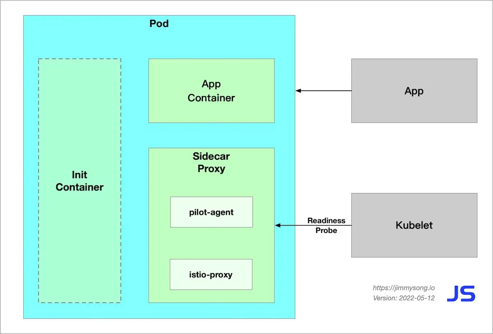

本文将为你讲解：

- Istio 中 sidecar 自动注入过程
- Istio 中的 init 容器启动过程
- 启用了 Sidecar 自动注入的 Pod 的启动流程

下图中展示了 Istio 数据平面中的 Pod 启动完后的组件。



## Istio 中的 sidecar 注入

Istio 中提供了以下两种 sidecar 注入方式：

- 使用 `istioctl` 手动注入。
- 基于 Kubernetes 的 [突变 webhook 准入控制器（mutating webhook addmission controller](https://kubernetes.io/docs/reference/access-authn-authz/admission-controllers/) 的自动 sidecar 注入方式。

不论是手动注入还是自动注入，sidecar 的注入过程都需要遵循如下步骤：

1. Kubernetes 需要了解待注入的 sidecar 所连接的 Istio 集群及其配置；
1. Kubernetes 需要了解待注入的 sidecar 容器本身的配置，如镜像地址、启动参数等；
1. Kubernetes 根据 sidecar 注入模板和以上配置填充 sidecar 的配置参数，将以上配置注入到应用容器的一侧；

使用下面的命令可以手动注入 sidecar。

```bash
istioctl kube-inject -f ${YAML_FILE} | kuebectl apply -f -
```

该命令会使用 Istio 内置的 sidecar 配置来注入，下面使用 Istio详细配置请参考 [Istio 官网](https://istio.io/latest/docs/setup/additional-setup/sidecar-injection/#manual-sidecar-injection)。

注入完成后您将看到 Istio 为原有 pod template 注入了 `initContainer` 及 sidecar proxy相关的配置。

### Init 容器

Init 容器是一种专用容器，它在应用程序容器启动之前运行，用来包含一些应用镜像中不存在的实用工具或安装脚本。

一个 Pod 中可以指定多个 Init 容器，如果指定了多个，那么 Init 容器将会按顺序依次运行。只有当前面的 Init 容器必须运行成功后，才可以运行下一个 Init 容器。当所有的 Init 容器运行完成后，Kubernetes 才初始化 Pod 和运行应用容器。

Init 容器使用 Linux Namespace，所以相对应用程序容器来说具有不同的文件系统视图。因此，它们能够具有访问 Secret 的权限，而应用程序容器则不能。

在 Pod 启动过程中，Init 容器会按顺序在网络和数据卷初始化之后启动。每个容器必须在下一个容器启动之前成功退出。如果由于运行时或失败退出，将导致容器启动失败，它会根据 Pod 的 `restartPolicy` 指定的策略进行重试。然而，如果 Pod 的 `restartPolicy` 设置为 Always，Init 容器失败时会使用 `RestartPolicy` 策略。

在所有的 Init 容器没有成功之前，Pod 将不会变成 `Ready` 状态。Init 容器的端口将不会在 Service中进行聚集。 正在初始化中的 Pod 处于 `Pending` 状态，但应该会将 `Initializing` 状态设置为 true。Init 容器运行完成以后就会自动终止。

关于 Init 容器的详细信息请参考 [Init 容器 - Kubernetes 中文指南/云原生应用架构实践手册](https://jimmysong.io/kubernetes-handbook/concepts/init-containers.html)。

## Init 容器解析

Istio 在 pod 中注入的 Init 容器名为 `istio-init`，我们在上面 Istio 注入完成后的 YAML 文件中看到了该容器的启动命令是：

```bash
istio-iptables -p 15001 -z 15006 -u 1337 -m REDIRECT -i '*' -x "" -b '*' -d 15090,15020
```

我们再检查下该容器的 [Dockerfile](https://github.com/istio/istio/blob/master/pilot/docker/Dockerfile.proxyv2) 看看 `ENTRYPOINT` 是怎么确定启动时执行的命令。

```docker
# 前面的内容省略
# The pilot-agent will bootstrap Envoy.
ENTRYPOINT ["/usr/local/bin/pilot-agent"]
```

我们看到 `istio-init` 容器的入口是 `/usr/local/bin/istio-iptables` 命令行，该命令行工具的代码的位置在 Istio 源码仓库的 [tools/istio-iptables](https://github.com/istio/istio/tree/master/tools/istio-iptables) 目录。

注意：在 Istio 1.1 版本时还是使用 `isito-iptables.sh` 命令行来操作 IPtables。

### Init 容器启动入口

Init 容器的启动入口是 `istio-iptables` 命令行，该命令行工具的用法如下：

```bash
$ istio-iptables [flags]
  -p: 指定重定向所有 TCP 流量的 sidecar 端口（默认为 $ENVOY_PORT = 15001）
  -m: 指定入站连接重定向到 sidecar 的模式，“REDIRECT” 或 “TPROXY”（默认为 $ISTIO_INBOUND_INTERCEPTION_MODE)
  -b: 逗号分隔的入站端口列表，其流量将重定向到 Envoy（可选）。使用通配符 “*” 表示重定向所有端口。为空时表示禁用所有入站重定向（默认为 $ISTIO_INBOUND_PORTS）
  -d: 指定要从重定向到 sidecar 中排除的入站端口列表（可选），以逗号格式分隔。使用通配符“*” 表示重定向所有入站流量（默认为 $ISTIO_LOCAL_EXCLUDE_PORTS）
  -o：逗号分隔的出站端口列表，不包括重定向到 Envoy 的端口。
  -i: 指定重定向到 sidecar 的 IP 地址范围（可选），以逗号分隔的 CIDR 格式列表。使用通配符 “*” 表示重定向所有出站流量。空列表将禁用所有出站重定向（默认为 $ISTIO_SERVICE_CIDR）
  -x: 指定将从重定向中排除的 IP 地址范围，以逗号分隔的 CIDR 格式列表。使用通配符 “*” 表示重定向所有出站流量（默认为 $ISTIO_SERVICE_EXCLUDE_CIDR）。
  -k：逗号分隔的虚拟接口列表，其入站流量（来自虚拟机的）将被视为出站流量。
  -g：指定不应用重定向的用户的 GID。(默认值与 -u param 相同)
  -u：指定不应用重定向的用户的 UID。通常情况下，这是代理容器的 UID（默认值是 1337，即 istio-proxy 的 UID）。
  -z: 所有进入 pod/VM 的 TCP 流量应被重定向到的端口（默认 $INBOUND_CAPTURE_PORT = 15006）。
```

以上传入的参数都会重新组装成 [`iptables` ](https://wangchujiang.com/linux-command/c/iptables.html)规则，关于该命令的详细用法请访问 [tools/istio-iptables/pkg/cmd/root.go](https://github.com/istio/istio/blob/master/tools/istio-iptables/pkg/cmd/root.go)。

该容器存在的意义就是让 sidecar 代理可以拦截所有的进出 pod 的流量，15090 端口（Mixer 使用）和 15092 端口（Ingress Gateway）除外的所有入站（inbound）流量重定向到 15006 端口（sidecar），再拦截应用容器的出站（outbound）流量经过 sidecar 处理（通过 15001 端口监听）后再出站。关于 Istio 中端口用途请参考 [Istio 官方文档](https://istio.io/latest/zh/docs/ops/deployment/requirements/)。

**命令解析**

这条启动命令的作用是：

- 将应用容器的所有流量都转发到 sidecar 的 15006 端口。
- 使用 `istio-proxy` 用户身份运行， UID 为 1337，即 sidecar 所处的用户空间，这也是 `istio-proxy` 容器默认使用的用户，见 YAML 配置中的 `runAsUser` 字段。
- 使用默认的 `REDIRECT` 模式来重定向流量。
- 将所有出站流量都重定向到 sidecar 代理（通过 15001 端口）。

因为 Init 容器初始化完毕后就会自动终止，因为我们无法登陆到容器中查看 iptables 信息，但是 Init 容器初始化结果会保留到应用容器和 sidecar 容器中。

## Pod 启动流程

启用了 Sidecar 自动注入的 Pod 启动流程如下：

1. Init 容器先启动，向 Pod 中注入 iptables 规则，进行透明流量拦截。
2. 随后，Kubernetes 会根据 Pod Spec 中容器的声明顺序依次启动容器，但这是非阻塞的，无法保证第一个容器启动完成后才启动下一个。`istio-proxy` 容器启动时，`pilot-agent` 将作为 PID 1 号进程，它是 Linux 用户空间的第一个进程，负责拉起其他进程和处理僵尸进程。`pilot-agent` 将生成 Envoy bootstrap 配置并拉起 `envoy` 进程；应用容器几乎跟 `istio-proxy` 容器同时启动，为了防止 Pod 内的容器在还没启动好的情况而接收到外界流量，这时候就绪探针就派上用场了。Kubernetes 会在 `istio-proxy` 容器的 15021 端口进行就绪检查，直到 `isito-proxy` 启动完成后 kubelet 才会将流量路由到 Pod 内。
3. 在 Pod 启动完成后，`pilot-agent`  将变为守护进程监视系统其他进程，除此之外，该进程还为 Envoy 提供 Bootstrap 配置、证书、健康检查、配置热加载、身份支持及进程生命周期管理等。

## Pod 内容器启动顺序问题

在 Pod 启动的过程中存在容器启动顺序问题，假设下面这种情况，应用容器先启动，请求其他服务，这时候 `istio-proxy` 容器还没启动完成，那么该请求将会失败，如果你的应用的健壮性不足，甚至可能导致应用容器崩溃，进而 Pod 重启。对于这种情况的解决方案是：

- 修改应用程序，增加超时重试。
- 增加应用容器中进程的启动延迟，比如增加 `sleep` 时间。
- 在应用容器中增加一个 [`postStart`](https://kubernetes.io/zh/docs/tasks/configure-pod-container/attach-handler-lifecycle-event/) 配置，检测应用进程是否启动完成，只有当检测成功时，Kubernetes 才会将 Pod 的状态标记为 `Running`。

## 总结

这篇文章带领大家了解了 Istio 数据平面中的 Pod 启动过程，还有因为 Pod 内容器启动顺序带来的问题。

## 参考

- [istio 常见问题: Sidecar 启动顺序问题 - imroc.cc](https://imroc.cc/post/202105/sidecar-startup-order/)
