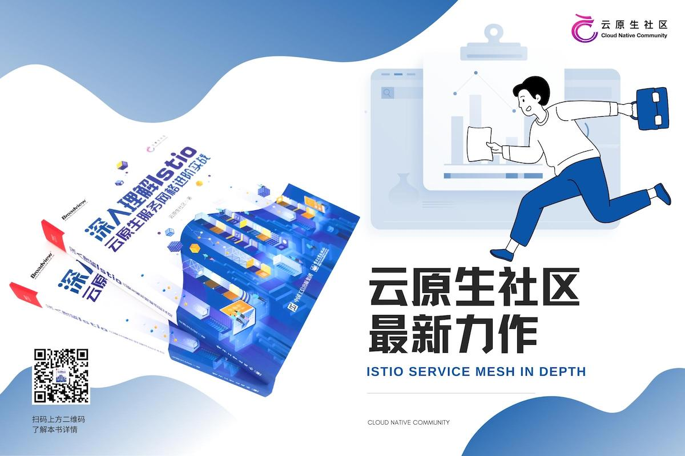
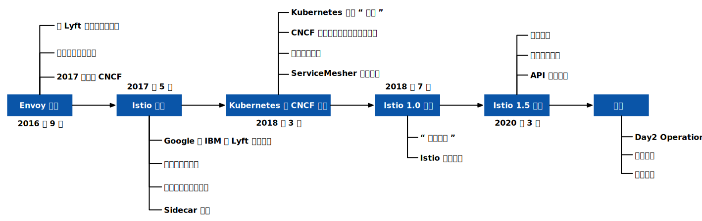

2017 年 5 月，Google、IBM 和 Lyft 联合 [宣布](https://istio.io/latest/news/releases/0.x/announcing-0.1/) 将 [Istio](https://istio.io) 开源，不知不觉中距今已5年有余。在这5年多的时间里，Istio 项目从一颗种子长成了参天大树。尤其是在 2018 年 Istio 1.0 版本发布的接下来两年里，国内有多本关于 Istio 服务网格的图书上市。在 Istio 图书出版领域，我国走在了世界的前列。

## 服务网格：云原生的核心技术之一

如今在国内，Istio 几乎可以作为服务网格的代名词，作为 [CNCF（云原生计算基金会）定义的云原生](https://github.com/cncf/toc/blob/main/DEFINITION.md)关键技术之一，服务网格发展至今经历了以下几个阶段。

- 探索阶段：2017 —2018 年
- 早期采用者阶段：2019—2020 年
- 大规模落地及生态发展阶段：2021 年至今

2018 年，CNCF 对云原生的定义是：云原生技术有利于各组织在公有云、私有云和混合云等新型动态环境中，构建和运行可弹性扩展的应用。云原生的代表技术包括容器、服务网格、微服务、不可变基础设施和声明式 API。

可见，CNCF 将服务网格加入了云原生定义中，即服务网格是云原生的代表性技术之一。如今， Google 正在将 Istio 捐献给 CNCF，我们有理由相信，成为 CNCF 项目后，Istio 的社区会开放，它未来的发展之路也会更顺畅。

## 服务网格与云原生应用

云原生的发展方兴未艾，虽然不断有新的技术和产品出现，但作为整个云原生技术栈的一部分，服务网格在过去一年里不断夯实了它作为“云原生网络基础设施”的定位。下图展示了云原生技术栈模型，其中的每一层都有一些代表性的技术来定义标准。作为新时代的中间件，服务网格与其他云原生技术交相辉映，如 Dapr（分布式应用程序运行时）定义了云原生中间件的能力模型，OAM 定义了云原生应用程序模型等，而服务网格定义了云原生七层网络模型。



## 为什么需要服务网格

使用服务网格并非意味着与 Kubernetes 决裂，而是自然而然的事情。Kubernetes 的本质是通过声明配置对应用进行生命周期管理，而服务网格的本质是提供应用间的流量控制和安全性管理，以及可观察性。 假如已经使用 Kubernetes 构建了稳定的微服务平台，那么如何设置服务间调用的负载均衡和流量控制呢？

Envoy 创造的 xDS 协议被众多开源软件所支持，如 Istio、Linkerd、MOSN 等。Envoy 对服务网格或云原生而言最大的贡献就是定义了 xDS。Envoy 本质上是一个网络代理，是通过 API 配置的现代版代理，基于它衍生出了很多不同的使用场景，如 API 网关、服务网格中的 sidecar 代理和边缘代理。

技术发展从 Kubernetes 到 Istio，概括来讲有以下原因。

- Kubernetes 的本质是应用的生命周期管理，具体来说，就是应用的部署和管理（扩缩容、自 动恢复、发布）。
- Kubernetes 为微服务提供了可扩展、高弹性的部署和管理平台。
- 服务网格的基础是透明代理，先通过 sidecar 代理拦截微服务间的流量，再通过控制平面配置管理微服务的行为。如今，服务网格的部署模式也迎来了新的挑战，sidecar 已经不是服务网格所必须的，基于 gRPC 的无代理的服务网格也在测试中。
- xDS 定义了服务网格配置的协议标准，目前基于 gRPC 的 xDS 也正在开发中。
- 服务网格将流量管理从 Kubernetes 中解耦，服务网格内部的流量无须 kube-proxy 组件的支持， 通过接近微服务应用层的抽象，管理服务间的流量，实现安全性和可观察性功能。
- 服务网格是对 Kubernetes 中 service 更上层的抽象，它的下一步是 Serverless，这也是Google 在 Istio 之后紧接着推出基于 Kubernetes 和 Istio 之上的 Knative 的原因。

## 以社区之名成就开源

2018 年 5 月，在蚂蚁金服的支持下，ServiceMesher 社区成立。随后，国内刮起了服务网格的旋风，由社区领导的 Istio 官方文档翻译工作也进入白热化阶段。

随着时间的推移，我感受到系统介绍 Istio 的中文资料匮乏，于是在 2018 年 9 月开始构思写一本关于 Istio 的图书，并在 GitHub 上发起了 Istio Handbook 的开源电子书项目。几个月后，随着服务网格技术的推广及 ServiceMesher 社区规模的扩大，我在社区的线上线下活动中结识了很多同样热衷于 Istio 和服务网格技术的朋友。我们一致决定，一起写一本 Istio 的开源电子书，将社区积累的宝贵文章和经验集结成系统的文字，分享给广大开发者。

2019 年 3 月，在社区管理委员会的组织下，几十位成员自愿参与并开始共同撰写此书。2020 年 5 月，为了更好地推广云原生技术，丰富社区分享的技术内容，我们成立了云原生社区，并将原有的 ServiceMesher 社区纳入其中，社区运营的内容也从服务网格技术扩展到更加全面的云原生技术。

2020 年 10 月，这本书主要的内容贡献者组成了编委会，成员分别有我、马若飞、王佰平、王炜、罗广明、赵化冰、钟华和郭旭东。我们在出版社的指导与帮助下，对本书进行了后续的版本升级、完善、优化等工作。经过反复的迭代，这本《深入理解 Isito：云原生服务网格进阶实战》终于和大家见面了。



## 关于本书

Istio 在 1.5 版本后有了重大的架构变化，同时引入或改进了多项功能，例如，引入了智能 DNS 代理、新的资源对象，改进了对虚拟机的支持等。

本书以 Istio 新版本为基础编写而成，在持续追踪 Istio 社区最新动向的基础上，力求为读者提 供最新、最全面的内容。另外，本书的多位作者都是一线的开发或运维工程师，具有丰富的 Istio 实战经验， 为本书提供了翔实、宝贵的参考案例。





目前，这本书已经在京东平台上线，要想了解更多有关 Istio 的相关知识，就来读一读这本《深入理解 Isito：云原生服务网格进阶实战》吧！

京东 618，满 100 减 50，扫码即购！



