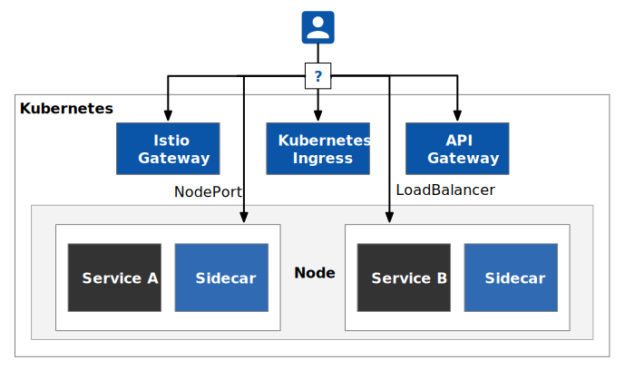

API 网关作为客户端访问后端的入口，已经存在很长时间了，它主要是用来管理”南北向“的流量；近几年服务网格开始流行，它主要是管理系统内部，即“东西向”流量，而像 Istio 这样的服务网格还内置了网关，从而将系统内外部的流量纳入了统一管控。这经常给初次接触 Istio 的人带来困惑——服务网格与 API 网关之间是什么关系？是不是使用了 Istio 就可以替代了 API 网关？Istio 的 API 网关是如何运作的？有哪些方式暴露 Istio mesh 中的服务？这篇文章给为你解答。

## 主要观点

- 服务网格诞生的初衷是为了解决分布式应用的内部流量的管理问题，而在此之前 API 网关已存在很久了。
- 虽然 Istio 中内置了 Gateway，但是你仍可以使用自定义的 Ingress Controller 来代理外部流量。
- API 网关和服务网格正朝着融合的方向发展。

## 如何暴露 Istio mesh 中的服务？

下图展示了使用 Istio Gateway、Kubernetes Ingress、API Gateway 及 NodePort/LB 暴露 Istio mesh 中服务的四种方式。



其中阴影表示的是 Istio mesh，mesh 中的的流量属于集群内部（东西向）流量，而客户端访问 Kubernetes 集群内服务的流量属于外部（南北向）流量。不过因为 Ingress、Gateway 也是部署在 Kubernetes 集群内的，这些节点访问集群内其他服务的流量就难以归属了。

| 方式                  | 控制器             | 功能                                                         |
| --------------------- | ------------------ | ------------------------------------------------------------ |
| NodePort/LoadBalancer | Kubernetes         | 负载均衡                                                     |
| Kubernetes Ingress    | Ingress Controller | 负载均衡、TLS、虚拟主机、流量路由                            |
| Istio Gateway         | Istio              | 负载均衡、TLS、虚拟主机、高级流量路由、其他 Istio 的高级功能 |
| API 网关              | API Gateway        | 负载均衡、TLS、虚拟主机、流量路由、API 生命周期管理、权限认证、数据聚合、账单和速率限制 |

由于 NodePort/LoadBalancer 是 Kubernetes 内置的基本的暴露服务的方式，本文就不讨论这种方式了。下文将对其他三种方式分别作出说明。

## 使用 Kubernetes Ingress 暴露服务

我们都知道 Kubernetes 集群的客户端是无法直接访问 Pod 的 IP 地址的，因为 Pod 是处于 Kubernetes 内置的一个网络平面中。我们可以将 Kubernetes 内的服务使用 NodePort 或者 LoadBlancer 的方式暴露到集群以外。同时为了支持虚拟主机、隐藏和节省 IP 地址，可以使用 [Ingress](https://kubernetes.io/docs/concepts/services-networking/ingress/) 来暴露 Kubernetes 中的服务。Kubernetes Ingress 原理如下图所示。


简单的说，Ingress 就是从 Kubernetes 集群外访问集群的入口，将用户的 URL 请求转发到不同的服务上。Ingress 相当于 Nginx、Apache 等负载均衡方向代理服务器，其中还包括规则定义，即 URL 的路由信息，路由信息得的刷新由 [Ingress controller](https://kubernetes.io/docs/concepts/services-networking/ingress/#ingress-controllers)来提供。


```yaml
apiVersion: networking.k8s.io/v1beta1
kind: Ingress
metadata:
  annotations:
    kubernetes.io/ingress.class: istio
  name: ingress
spec:
  rules:
  - host: httpbin.example.com
    http:
      paths:
      - path: /status/*
        backend:
          serviceName: httpbin
          servicePort: 8000
```

上面的例子中的 `kubernetes.io/ingress.class: istio` 注解表明该 Ingress 使用的 Istio Ingress Controller。 

## 使用 Istio Gateway 暴露服务

我们都知道 Istio 是继承 Kubernetes 之后发展出来的一个流行的服务网格实现，它实现了 Kubernetes 没有的一些功能，请参考[什么是 Istio？为什么 Kubernetes 需要 Istio？](https://jimmysong.io/blog/what-is-istio-and-why-does-kubernetes-need-it/)简要来说，正是因为 Istio 补足了 Kubernetes 对于云原生应用的流量管理、可观察性和安全方面的短板，使得流量管理变得对应用程序透明，使这部分功能从应用程序中转移到了平台层，成为了云原生基础设施。

Istio 0.8 以前版本中使用 Kubernetes [Ingress](https://kubernetes.io/docs/concepts/services-networking/ingress/) 来作为流量入口，其中使用 Envoy 作为 Ingress Controller。在 Istio 0.8 及以后的版本中，Istio 创建了 Gateway 对象。Gateway 和 VirtualService 用于表示 Istio Ingress 的配置模型，Istio Ingress 的缺省实现则采用了和 sidecar 相同的 Envoy 代理。通过该方式，Istio 控制面用一致的配置模型同时控制了入口网关和内部的 sidecar 代理。这些配置包括路由规则，策略检查、遥测收集以及其他服务管控功能。

Istio Gateway 的功能与 Kubernetes Ingress 类似，它负责进出集群的南北流量。Istio Gateway 描述了一个负载均衡器，用于承载进出服务网格边缘的连接。该规范描述了一组开放端口和这些端口所使用的协议，以及用于负载均衡的 SNI 配置等。

Istio Gateway 资源本身只能配置 L4 到 L6 的功能，例如暴露的端口、TLS 设置等；但 Gateway 可与 VirtualService 绑定，在 VirtualService 中可以配置七层路由规则，例如按比例和版本的流量路由，故障注入，HTTP 重定向，HTTP 重写等所有 Mesh 内部支持的路由规则。

下面是一个 Gateway 与 VirtualService 绑定的示例。拥有 `istio: ingressgateway` 标签的 pod 将作为 Ingress Gateway 并路由对 `httpbin.example.com` 虚拟主机的 80 端口的 HTTP 访问，这相当于给 Kubernetes 敞开了一个外部访问的入口。这与使用 Kubernetes Ingress 最大的区别就是，需要我们手动将 VirtualService 与 Gateway 绑定，并指定 Gateway 所在的 pod。

```yaml
apiVersion: networking.istio.io/v1alpha3
kind: Gateway
metadata:
  name: httpbin-gateway
spec:
  selector:
    istio: ingressgateway
  servers:
  - port:
      number: 80
      name: http
      protocol: HTTP
    hosts:
    - "httpbin.example.com"
```

下面这个 VirtualService 通过 `gateways` 与上面的网关绑定在了一起，以接受来自该网关的流量。

```yaml
apiVersion: networking.istio.io/v1alpha3
kind: VirtualService
metadata:
  name: httpbin
spec:
  hosts:
  - "httpbin.example.com"
  gateways:
  - httpbin-gateway
  http:
  - match:
    - uri:
        prefix: /status
    route:
    - destination:
        port:
          number: 8000
        host: httpbin
```

## 使用 API 网关暴露服务

API 网关是位于客户端和后端服务之间的 API 管理工具，一种将客户端接口与后端实现分离的方式，在微服务中得到了广泛的应用。当客户端发出请求时，API 网关会将其分解为多个请求，然后将它们路由到正确的位置，生成响应，并跟踪所有内容。

API Gateway 是微服务架构体系中的一类型特殊服务，它是所有微服务的入口，它的职责是执行路由请求、协议转换、聚合数据、认证、限流、熔断等。大多数企业 API 都是通过 API 网关部署的。API 网关通常会处理跨 API 服务系统的常见任务，例如用户身份验证、速率限制和统计信息。

在网格中可以有一个或多个 API Gateway。API 网关的职责有：

- 请求路由和版本控制
- 方便单体应用到微服务的过渡
- 权限认证
- 数据聚合：监控和计费
- 协议转换
- 消息和缓存
- 安全和报警

以上很多基本功能比如路由和权限认证通过 Istio Gateway 也可以实现，只是在功能的丰富度和扩展性方面有些成熟的 API Gateway 可能更占优势，不过在 Istio mesh 中再引入 API Gateway 也可能带来一些弊端。

- 引入了 API Gateway，需要考虑 API Gateway 本身的部署、运维、负载均衡等场景，增加了后端服务的复杂度
- API Gateway 中承载了大量的接口适配，导致难以维护
- 对于部分场景，增加了一跳可能导致性能的降低

## 总结

在 Istio mesh 中你可以使用多种 Kubernetes Ingress Controller 来充当入口网关，当然你还可以直接使用 Istio 内置的 Istio 网关，对于策略控制、流量管理和用量监控可以直接通过 Istio 网关来完成，这样做的好处是通过 Istio 的控制平面来直接管理网关，而不需要再借助其他工具。但是对于 API 生命周期管理、复杂的计费、协议转换和认证等功能，传统的 API 网关可能更适合你。所以，你可以根据自己的需求来选择，也可以组合使用。

目前有些传统的反向代理也在向 Service Mesh 方向发展，如 Nginx 构建了 [Nginx Service Mesh](https://www.nginx.com/products/nginx-service-mesh/)，Traefik 构建了 [Traefik Mesh](https://traefik.io/traefik-mesh/)。还有的 API 网关产品也向 Service Mesh 方向挺进，比如 Kong 发展出了 [Kuma](https://kuma.io)。在未来，我们会看到更多 API 网关、反向代理和服务网格的融合产品出现。

## 参考

- [利用 Gateway API 发展 Kubernetes 网络](https://cloudnative.to/blog/evolving-kubernetes-networking-with-the-gateway-api/)
- [如何为服务网格选择入口网关？](https://cloudnative.to/blog/how-to-pick-gateway-for-service-mesh/)
- [Service Mesh 和 API Gateway 关系深度探讨](https://cloudnative.to/blog/service-mesh-and-api-gateway/)
- [在 Istio 服务网格中使用 Traefik Ingress Controller](https://cloudnative.to/blog/using-traefik-ingress-controller-with-istio-service-mesh/)
