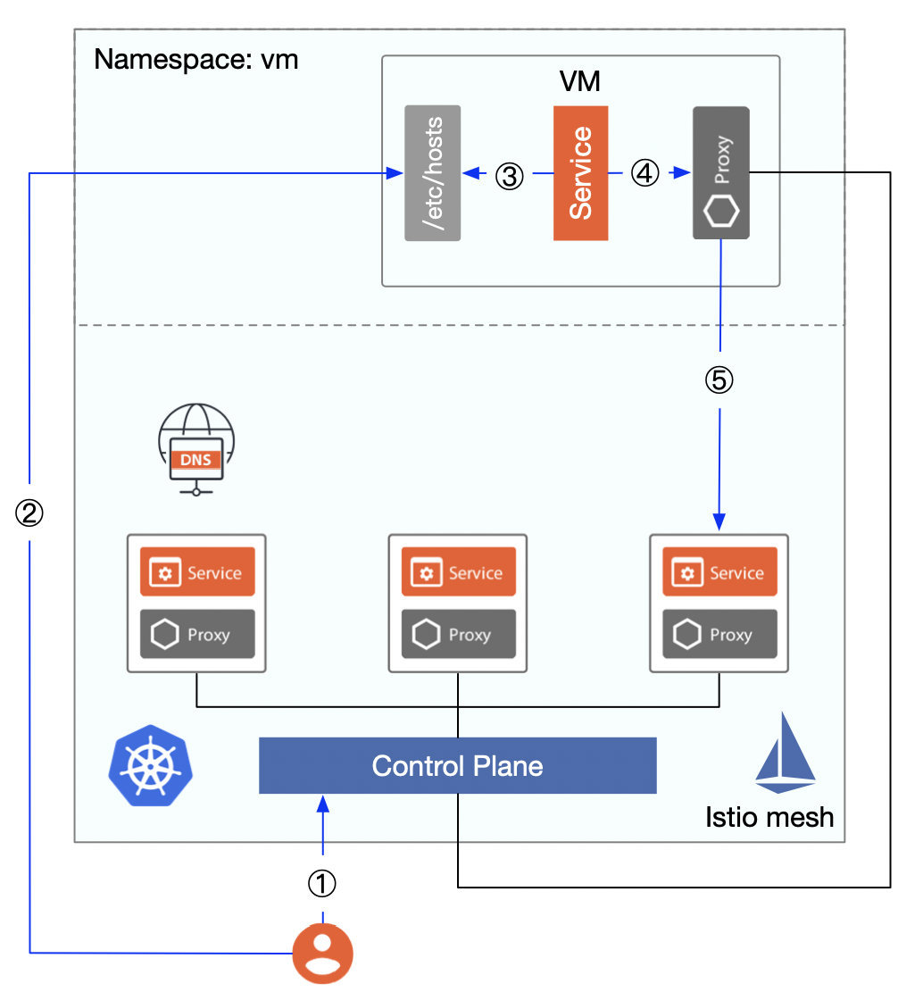

本文将为你介绍 Istio 历史上对虚拟机负载的支持情况，尤其是 Istio 1.8 中引入的智能 DNS 代理及 `WorkloadGroup` 使得虚拟机与容器在资源抽象层面可以等同视之。我将为你展现一幅 Istio 支持虚拟机的波澜壮阔的奥德赛。

## 前言

在我[之前的博客](https://thenewstack.io/how-to-integrate-virtual-machines-into-istio-service-mesh/)中谈到 Istio 1.7 如何支持虚拟机，但那时虚拟机仍然无法无缝的集成到 Istio 中，因为还需要做很多手动的操作。现在，Istio 1.8 新增了 WorkloadGroup 及[智能 DNS 代理](https://istio.io/latest/blog/2020/dns-proxy/)，这使得如虚拟机这样的非 Kubernetes 工作负载可以在 Istio 中成为像 Pod 一样的一等公民。

不论有没有为虚拟机安装 sidecar，虚拟机通常情况下无法直接访问 Kubernetes 集群中的 DNS 服务器以解析 Kubernetes  服务的 Cluster IP 的（虽然你也许可以通过一些黑客的手段做到），这是在 Istio 中集成虚拟的最后一块短板，终于在 Istio 1.8 中完成了突破。

## 为什么要支持虚拟机？

在我们将应用在迁移到云原生架构，不断容器化的过程中，将经历三个阶段，如下图所示。

- 阶段一：应用全部部署在虚拟机上
- 阶段二：应用既部署在虚拟机上也部署在容器里，正在从虚拟机向容器中迁移，并使用 Kubernetes 管理容器
- 阶段三：所有的应用优先部署在容器里，使用 Kubernetes 管理容器，使用 Istio 管理应用间的通信

上图仅是对以上三个阶段的最简化描述，实际上还会有多混合云、多机房、多集群等情况，且阶段三只是个理想化的阶段，容器和虚拟机将是长期共存的，但是容器化趋势不变。

在阶段二中，人们通常会将新业务和少量应用率先实现容器化，并部署到 Kubernetes 中，在应用尚未完全实现容器化的时候，处于过度状态时会遇到很多问题，如何让应用与部署在虚拟机中的服务交互？虚拟机如何访问容器中的服务？在服务迁移的过程中如何保证稳定无缝？是否可以将容器和虚拟机纳入一个统一的控制平面来管理？Istio 从开源初期就考虑并着手解决这一问题。

## Istio 支持虚拟机的历史

Istio 对于虚拟机的支持是个漫长的过程，堪称是一部奥德赛。

### Istio mesh 扩张

Istio 从 0.2 版本开始通过 [Istio Mesh Expansion](https://istio.io/v0.2/docs/setup/kubernetes/mesh-expansion.html) 将虚拟机加入的 Mesh 中，但是需要满足以下前提条件：

- 虚拟机必须可以通过 IP 地址直接访问到应用的 Pod，这就要求容器与 VM 之间通过 VPC 或者 VPN 建立扁平网络，虚拟机不需要访问 Cluster IP，直接对服务的 Endpoint 端点访问即可。
- 虚拟机必须可以访问到 Istio 的控制平面服务（Pilot、Mixer、CA，现在已正整合为 Istiod），可以通过在 Istio Mesh 中部署负载均衡器将控制平面端点暴露给虚拟机。
- （可选）虚拟机可以访问到 Mesh 内部的（部署在 Kubernetes 中）的 DNS server。

集成虚拟机的步骤如下：

1. 为 Istio 控制平面服务及 Kubernetes 集群的 DNS 服务创建 Internal 负载均衡器；
2. 生成 Istio Service CIDR、Service Account token、安全证书、Istio 控制平面服务的 IP（通过 Internal 负载均衡器暴露出来的 IP）的配置文件并发送给虚拟机；
3. （可选）在虚拟机中安装、配置并启动 Istio 的组件、dnsmaq（用于DNS 发现），此时虚拟机可以使用   FQDN 访问 mesh 中的服务了，这一步是为了保证虚拟机可以正确解析出 mesh 中服务的 Cluster IP；
4. 若要在虚拟机中运行服务，需要配置 sidecar，新增需要拦截的 inbound 端口，然后重启 istio，还需要运行 istioctl 为服务注册

下图展示的从集成虚拟机到在 mesh 中访问虚拟机中服务的详细流程。

1. DNS 被虚拟机中部署的 `dnsmasq` 劫持，这使得它可以正确的获取 Istio 服务、Kubernetes 内置 DNS 的端点 IP；
2. 访问 Kubernetes 的内置 DNS 服务（该服务已通过 Internal 负载均衡器暴露到集群外，可以直接访问）；
3. 返回 `productpage.bookinfo.svc.cluster.local` 被解析出来的 Cluster IP，注意该 IP 地址无法直接访问，但是如果无法被 DNS 解析的话将导致 VM 对该服务的请求失败；
4. 虚拟机对 mesh 中服务的访问被 sidecar proxy 劫持；
5. 因为 proxy 已连接 Istio 控制平面，可通过 xDS 查询到该服务的端点，因此流量将被转发到其中的一个端点。关于这一步的详细过程请参考 [Istio Handbook 中的 sidecar 流量路由机制分析 一节](https://www.servicemesher.com/istio-handbook/concepts/sidecar-traffic-route.html)；
6. 要想在 mesh 中访问 VM 中的服务，需要使用 `istioctl register` 命令手动将 VM 中的服务添加到 mesh 中，这本质上是将 VM 中的服务，注册到 Kubernetes 中的 service 和 endpoint；
7. mesh 中的服务可以使用 VM 注册的服务名称（FQDN，例如 `mysql.vm.svc.cluster.local`）来访问；

以上 Istio 对虚拟机支持的方式一直延续到 Istio 1.0，在 Istio 1.1 的时候引入了新的 API [ServiceEntry](https://istio.io/latest/docs/reference/config/networking/service-entry/)，使用它可以在 Istio 的内部服务注册表中添加额外的条目，这样 mesh 中的服务就可以访问/路由到这些手动指定的服务了，不再需要运行 `istioctl register` 命令，而且该命令在 Istio 1.9 中将被废弃。

Istio 1.5 中增加了 `istioctl experimental add-to-mesh` 命令，可以将虚拟机中的服务添加到 mesh 中，其功能与 `istioctl register` 一样。

### 新增资源抽象

Istio 从 [1.6 版本](https://istio.io/latest/news/releases/1.6.x/announcing-1.6/)开始在[流量管理](https://istio.io/latest/news/releases/1.6.x/announcing-1.6/change-notes/)中引入了新的资源类型 [WorkloadEntry](https://istio.io/latest/docs/reference/config/networking/workload-entry/)，用以将虚拟机进行抽象，使得虚拟机在加入 mesh 后可以作为与 Kubernetes 中的 Pod 等同的负载，具备流量管理、安全管理、可视化等能力。通过 `WorkloadEntry` 可以简化虚拟机的网格化配置过程。`WorkloadEntry` 对象可以根据服务条目中指定的标签选择器选择多个工作负载条目和 Kubernetes pod。

Istio 1.8 中增加了 [`WorkloadGroup`](http://istio.io/latest/docs/reference/config/networking/workload-group/) 的资源对象，它提供了一个规范，可以同时包括虚拟机和 Kubernetes 工作负载，旨在模仿现有的用于 Kubernetes 工作负载的 sidecar 注入和部署规范模型来引导 Istio 代理。

下面是虚拟机与 Kubernetes 中负载的资源抽象层级对比。

| 对比项         | Kubernetes | 虚拟机        |
| -------------- | ---------- | ------------- |
| 基础调度单位   | Pod        | WorkloadEntry |
| 编排组合       | Deployment | WorkloadGroup |
| 服务注册与发现 | Service    | ServiceEntry  |

从上面的图表中我们可以看到，对于虚拟机工作负载是可以与 Kubernetes 中的负载一一对对应的。

此时看似一切都比较完美了，但是直接将 Kubernetes 集群中的 DNS server 暴露出来会带来很大的[安全风险](https://blog.aquasec.com/dns-spoofing-kubernetes-clusters)，因此我们一般手动将虚拟机需要访问的服务的域名和 Cluster IP 对写到本机的 `/etc/hosts` 中，但是对于一个节点数量庞大的分布式集群来说，这种做法又有些不现实。

通过配置虚拟机本地 `/etc/hosts` 访问 mesh 内服务的流程，如下图所示。

1. 将虚拟机中的服务注册到 mesh 中；
2. 将要访问的服务的域名、Cluster IP 对手动写入虚拟机本地的 `/etc/hosts` 文件中；
3. 虚拟机获得访问服务的 Cluster IP；
4. 流量被 sidecar proxy 拦截并解析出要访问的服务的端点地址；
5. 访问服务的指定端点；

在 Kubernetes 中我们一般使用 Service 对象来实现服务的注册和发现，每个服务都有一个独立的 DNS 名称，应用程序可以使用服务名称来互相调用。我们可以使用 ServiceEntry 将虚拟机中的服务注册到 Istio 的服务注册表中，但是在 Kubernetes 集群中的 DNS server 无法对 mesh 外部暴露的情况下，虚拟机无法访问 Kubernetes 集群中的 DNS 服务以获取服务的 Cluster IP，从而导致虚拟机访问 mesh 中的服务失败。如果能在虚拟机中增加一个 sidecar 可以透明地拦截 DNS 请求，可获取 mesh 内所有服务的 ClusterIP，类似于图一中的 `dnsmasq` 的角色，这样不就可以解决问题了吗？

### 智能 DNS 代理

Istio 1.8 中引入了[智能 DNS 代理](https://cloudnative.to/blog/istio-dns-proxy/)，虚拟机访问 mesh 内服务无需再配置 `/ect/hosts`，如下图所示。

DNS proxy 是用 Go 编写的 Istio sidecar 代理。Sidecar 上的 Istio agent 将附带一个由 Istiod 动态编程的缓存 DNS 代理。来自应用程序的 DNS 查询会被 pod 或 VM 中的 Istio 代理透明地拦截和服务，该代理会智能地响应 DNS 查询请求，可以实现虚拟机到服务网格的无缝多集群访问。

至此，Istio 1.8 中引入的 WordloadGroup 及智能 DNS 代理，补足了 Istio 对虚拟机支持的最后一块短板，使得部署在虚拟机中的遗留应用可以跟 Kubernetes 中的 Pod 一样完全等同看待。

## 总结

在这部 Istio 支持虚拟机的奥德赛中，我们可以看到：从最初的将 mesh 中的 DNS server 暴露给外部，在虚拟机中安装配置 `dnsmasq`，到最后的使用智能 DNS 代理，并使用 `WorkloadEntry`、`WorkloadGroup` 和 `ServiceEntry` 等资源抽象，逐步实现了虚拟机和 pod 的统一管理。本文仅仅是针对单集群的情况，在实际的生产中使用还远远不够，我们还需要处理安全、多集群、多租户等诸多问题，欢迎关注 Tetrate 的旗舰产品 [Tetrate Service Bridge](https://www.tetrate.io/tetrate-service-bridge/) 了解更多关于 Istio 应用在生产上的最佳实践。
