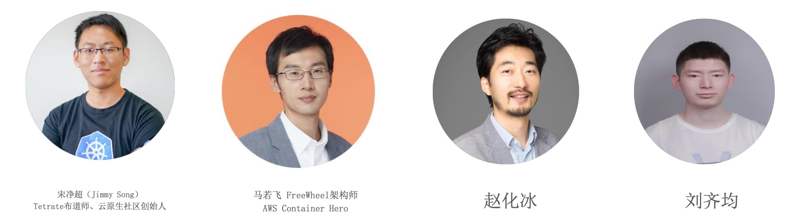
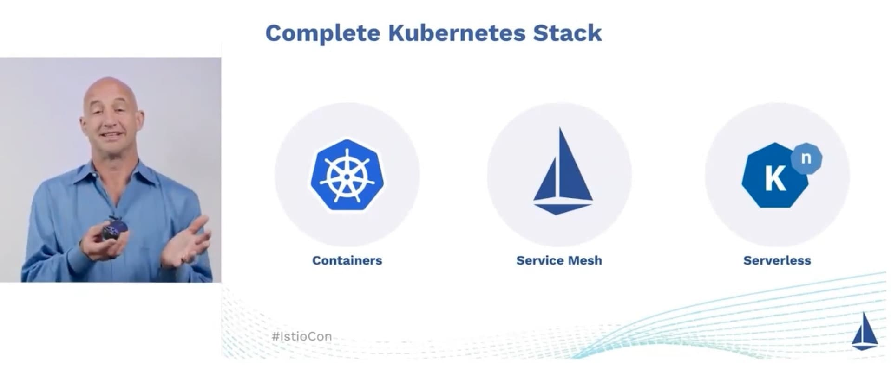

## 前言

这篇回顾文章可能来的有点晚了，之前在云原生社区中国就有好几次有人问我，什么时候可以在 B 站上观看到 IstioCon 2022 的录像（IstioCon 组委会早已将录像上传到了 YouTube，但是国内有些人可能无法访问 YouTube），正好最近我跟会务人员要到了会议录像，将其全部上传到了 B 站。

## 视频回放与 PPT

- [B 站观看视频回放](https://space.bilibili.com/1865134855/channel/collectiondetail?sid=641840)
- [IstioCon 2022 Sessions](https://events.istio.io/istiocon-2022/sessions/)

大部分内容已上传到 B 站，除了以下三个，有人已经提前上传到了 B 站。



PPT 可以直接通过上面的链接选择你感兴趣的话题下载。

## 总结

IstioCon 2022 今年是第二届了，于 4 月 25 日到 29 日在线上举行，笔者作为 IstioCon 的中文场组织者之一参与了本届活动中文场开场及圆桌讨论环节，我们讨论的议题是《Istio 的开源生态展望》，下面是论坛嘉宾。

最近两年来，围绕 Istio，在中国涌现出了几个代表性的开源项目，比如腾讯开源的 Aeraki、DaoCloud 开源的 Merbridge 还有网易开源的 Slime 等。基于 Istio 开发的扩展，我看到的基本都是来自中国，这一点可以说是中国特色。

本次 IstioCon 的关键词如下：

- 零信任
- 多集群
- Proxyless
- eBPF
- Gateway
- 安全

同时，Google Cloud 的 VP Eric Brewer 宣布了一个大消息，将 Istio 捐献给 CNCF，一旦成功，那么由 Google 主导的三个开源项目 Kubernetes、Istio、Knative 将成为 CNCF 中容器编排、服务网格、Serverless 等 Kubernetes 技术栈的三驾马车。

## 关于 Istio 你应该了解

- Istio 只适用于特别场景与规模
- 不会一口吃出一个胖子，要一个一个版本的渐进式提高
- 理解 Envoy 对于应用 Istio 特别重要
- 用户不想再学习另一套 CRD，请考虑在 Istio 之上增加一层抽象
- 不要低估 Day 2 operation 需要消耗的精力

## Istio 在 2022 年的计划

本届大会上还公布了 Istio 在 2022 年的关注点。

### 稳定性与重新定义 Istio 的 API 平面

- 推动当前特性和 API 到稳定版
- 将 API 配置从 MeshConfig 中移到数据平面中并使其稳定
- 继续帮助 Kubernetes API 定义与 Istio API 对齐（Kubernetes Gateway API）
- 继续增强 Telemetry API：增加对使用 OpenTelemetry 等供应商的日志记录的支持，过滤访问日志，以及自定义跟踪服务名称

### 增强升级与故障排查

- 推动基于修订标签的升级到稳定版
- 将 Helm 安装推广到 Beta 版
- 在 `istioctl` 中添加更多的分析器，并扩展当前的分析器，包括针对 Kubernetes 集群以外环境的分析器
- 用户希望用服务网格来排除服务故障，而不是对服务网格进行故障排除

### 增强可扩展性

- Wasm Plugin
- 自定义授权
- 增加标准化集成点以加入自定义的 CA 或网关

### 扩展 Istio 的使用场景

- 支持 IPv6 和双栈网络（Dual Stack Networking）
- 支持 ARM
- 扩展使用 gRPC 的 proxyless Istio
- 性能增强：增量 xDS、降低 sidecar 延迟


双协议栈技术就是指在一台设备上同时启用 IPv4 协议栈和 IPv6 协议栈。这样的话，这台设备既能和 IPv4 网络通信，又能和 IPv6 网络通信。如果这台设备是一个路由器，那么这台路由器的不同接口上，分别配置了 IPv4 地址和 IPv6 地址，并很可能分别连接了 IPv4 网络和 IPv6 网络。Kubernetes 中支持 IPv4/IPv6 双协议栈，详见 [Kubernetes 文档](https://kubernetes.io/zh-cn/docs/concepts/services-networking/dual-stack/)。


### 安全加固

- 默认尽可能安全
- 继续完善安全最佳实践文档
- 推动 distroless 镜像
- 软件 BOM（Bill of Materials，依赖服务清单）
- 增加格外的模糊测试

### 其他增强

- 用自动化使升级更容易：让 Istio 的升级像其他升级一样工作，发布升级自动化的参考实现
- 多规模和大规模集群
- 对于开发者来说，我们已经将每周的工作小组会议合并到。对于开发者来说，我们已经将每周的工作组会议合并，一个在美国，一个在亚太地区。

## 写在最后

希望 Istio 正式进入 CNCF 的那天早日到来，我也希望能够在社区里看到更多源于 Istio 的终端案例分享，也欢迎大家[加入到云原生社区](https://cloudnative.to/community/join/)中来，我们有专门的 Istio 讨论群。