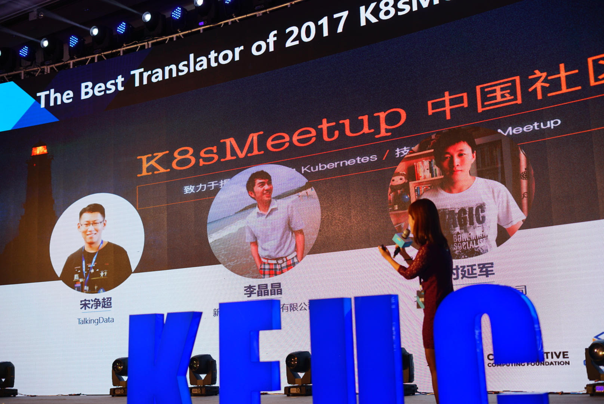

今天受 k8smeetup 社区邀请来到杭州，参加 Kubernetes 中国用户大会简称 [KEUC](http://keuc.k8smeetup.com/)，这已经是我第三次来杭州了，算是再续前缘吧！

其实今年 6 月 19 日 LinuxCon + ContainerCon + CloudOpen 简称 [L3 大会](https://www.bagevent.com/event/561769)在北京国家会议中心召开，那是我跟 [CNCF](https://cncf.io) 首次相会，也获得了我的首批贴纸，该社区的一系列活动吸引了我浓浓的兴趣，自那以后开始持续关注 CNCF 的社区活动。

借用孙中山先生在黄埔军校的训词，愿 Kubernetes 携手云原生应用，让IT基础设施和软件开发流程进入新的纪元。

**云原生主义歌**

> 库巴内提，吾辈所宗；携云原生，以进大同。
> 咨尔多士，为民前锋；夙夜匪懈，主义是从。
> 创业维艰，矢勤矢勇；同心共德，贯彻始终。

祝愿明天的大会圆满成功！

---

今天不小心获得了 k8smeetup 最佳技术专栏作者和社区最佳译者奖，感谢 CNCF 和 k8smeetup 社区。

然后跟 CNCF 执行副总裁 Dan Kohn 探讨了下云原生技术在中国的推广，明年在中国会有云原生相关大会。

欢迎大家持续关注云原生的发展。
