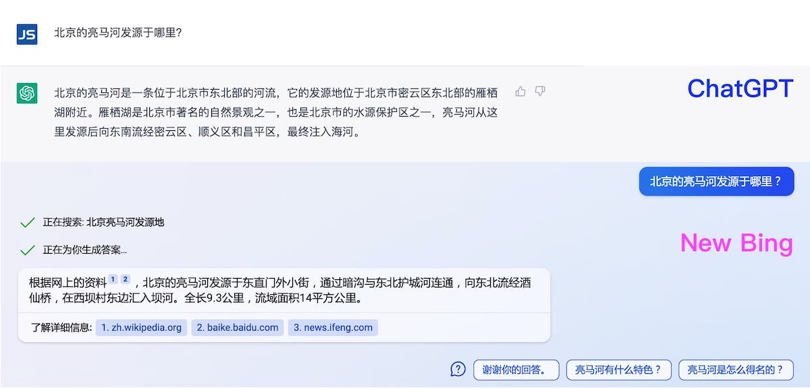

昨天我的新必应体验申请通过了，立马去体验了下，本文记录下我对新必应的最初印象。

## 如何体验新必应 {#how-to-experience-new-bing}

访问必应国际站（[bing.com](https://bing.com)）并下载 Bing App（非中国版），申请加入 waitlist，我是在 waitlist 推出第一天就申请了，直到昨天才正式获批。

新必应推荐（强制）你使用微软 Edge 浏览器和使用 bing.com 进行搜索，如果你在中国大陆使用 Chrome、Safari、火狐或其他浏览器访问的话，无论搜索什么网页都不会给你返回任何结果，你将看到白屏，这令人很无语。

## 使用 Chrome 访问新必应 {#chrome}

如果你身处中国大陆，习惯使用了 Chrome 浏览器，不想为了体验新必应而安装一个 Edge 浏览器，可以使用下面的方法在 Chrome 中使用新必应：

首先在 Chrome 应用商店中安装 [ModHeader](https://chrome.google.com/webstore/detail/modheader-modify-http-hea/idgpnmonknjnojddfkpgkljpfnnfcklj)，方便我们修改  HTTP 请求中的 Header，模仿 Edge 浏览器。

然后配置 ModeHeader，添加规则如下：

在 Request headers 处添加：

- 模拟 Edge 浏览器：`user-agent` =  `Mozilla/5.0 (Macintosh; Intel Mac OS X 10_15_7) AppleWebKit/537.36 (KHTML, like Gecko) Chrome/110.0.0.0 Safari/537.36 Edg/110.0.1587.41`
- 模拟香港 IP：`X-Forwarded-For` =  `1.36.x.y`

在 FILTER 处选择「(Request) URL filter」，填入 `.*://www.bing.com/.*`

现在访问 bing.com 你就可以看到顶部的【聊天】选项，可以顺利的使用新必应了。

## 新必应初体验 {#first-experience}

在新必应推出前，我已经使用过几个月的 ChatGPT 了，因此下面主要将新必应的聊天与 ChatGPT 做对比。通过同一个问题两者给出的不同答案，以小见大。

问题：北京的亮马河发源于哪里？

ChatGPT 和新必应给出了截然不同的回答，如图 1 所示。ChatGPT 的答案究竟来自哪里我们无从知晓，如果你对北京的地面一无所知的话也许会觉得它的回答有模有样，貌似很合理，但实际上稍有了解的人都会觉得它是【一本正经的胡说八道】。而新必应的回答则明确了出处，是来自维基百科和百度百科等渠道。

从上面的回答及我一天的使用体会：

1. ChatGPT 并非直接引用网络上的内容，因为在网上找不到同样的回答，所以我们无法直接验证答案的准确性，需要与它进一步对话来纠正它的错误；
2. 新必应对于问答是问题，很多答案都引用自知乎；
3. 新必应的每条回答都会给出引用来源，这一点方便我们去验证，这就像是搜索引擎的辅助工具，如果你直接搜索也可以很方便找到答案；
4. 新必应会根据你的问题推荐一些相关的问题，类似搜索引擎中的推荐功能；
5. 因为新必应是联网的，如果问一些近期的问题，也可以找到答案，而 ChatGPT 只有 2021 年以前的数据；
6. 新必应聊天功能更稳定，在我试用一天的时间内没有遇到需要刷新重连的情况，而 ChatGPT 免费用户会经常遇到刷新问题；
7. 新必应的上下文联想能力比较差，更像是一个聊天式的搜索工具，它可以将一些搜索到的网页主题进行归纳输出，然后给出引用地址；

> 结论：聊天是新必应的搜索引擎辅助工具，如果 Google 推出同样的服务，比如 Bart，我可能还会继续使用 Google 搜索。

## 网友看法 {#comments}

我昨天在朋友圈里分享了这张图片，看看大家对这两种回答的看法。收到了很多网友的朋友，我精选了以下几条给大家品味一下：

1. ChatGPT 有自己的人格，他就像一个中年油腻男，一本正经的胡说八道的样子，确实很强大。比那些老老实实实的回答的 AI 强多了；
2. ChatGPT 是数学白痴，只要语义自洽逻辑合理，它可以无中生有一本正经胡扯。而且数据陈旧只有 2021 年之前的数据；
3. ChatGPT 目前不太适合客观问题的解答，说白了它的核心就是“生成/编造”，但是非常适合一些基于已有事实的创作，比如润色/翻译文章之类的，新必应更像是传统 NLP + 搜索引擎，其实对于搜索这个场景我觉得反而更靠谱一点；
4. 新必应更好，ChatGPT 没联网而且有时候会捏造答案。新必应用了 ReAct prompt 会自动 search + reason；
5. ChatGPT 是一个发散思路的工具，然后具体的实施和工作，还会根据相关的关键词，交叉验证一下。但是新必应不能把一个功能详细合理的写出来，内容也有限制。现在还是使用 ChatGPT 进行辅助工作。

关于 ChatGPT 和新必应大家有什么看法，欢迎在评论区回复。

## 参考 {#reference}

- [无需梯子！新 Bing ChatGPT 申请教程 by LiXin - ilx.notion.site](https://ilx.notion.site/Bing-ChatGPT-by-LiXin-58dbdab242ed479780adab09a371c260)

