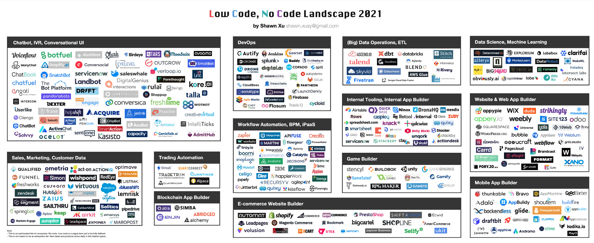

最近看到《[互联（Interconnected）](https://interconnected.blog/)》电子杂志上徐晟洋写的两篇文章：

- [Low Code No Code, Part I: Use Cases and Landscape](https://interconnected.blog/low-code-no-code-part-i-use-cases-and-landscape/)
- [Low Code No Code, Part II: How to Ride This Wave](https://interconnected.blog/low-code-no-code-part-ii-how-to-ride-this-wave/)

这两篇主要介绍了什么是 LCNC—— Low Code（低代码）和 No Code（无代码），对我有所启发，特别是其中谈到[低代码和无代码面临的挑战](https://interconnected.blog/low-code-no-code-part-ii-how-to-ride-this-wave/#lcnc%E9%9D%A2%E4%B8%B4%E7%9A%84%E6%8C%91%E6%88%98)时，我深表认同。

自古以来人来就在不断发明各种工具，来帮助自身摆脱繁重的体力劳动和重复劳动，而把精力投入到创造性工作中去。低代码和无代码其实也是此类工具。如今这类工具已经欣欣向荣，大大降低了软件开发的门槛，减少了部分重复劳动。下图是《2021 年低代码、无代码全景图》，对于其生态可见一斑。

图片来源 - [Shawn Xu](https://shawn-s3.s3-us-west-2.amazonaws.com/public/LCNC+by+Shawn+Xu.pdf)

## 常用的知名的无/低代码软件

下面列举了一些常用的知名的无代码软件：

- WordPress：网站构建
- Shopify：电商建站
- Ghost：博客
- IFTTT：流程自动化
- CircleCI：持续集成工具

以上这是部分代表性软件，我们发现其中大部分都是 SaaS。

## 什么是无代码（No Code）？

目前对于什么是无代码还没有定论，也没有相关机构可以给出一个权威的解释，往往是各个厂商各执一词，下面是来自 [formstack](https://resources.formstack.com/reports/rise-of-the-no-code-economy/what-does-no-code-mean#body-start) 的定义。

> 无代码是一种软件开发类型，允许任何人在不写一行代码的情况下创建应用程序。它涉及使用具有直观的拖放界面的工具来创建一个独特的解决方案。由此产生的解决方案可以有多种形式——从建立移动、语音或电子商务应用程序和网站到自动化任何数量的任务或流程。

关于什么是无代码，有两种类型的诠释：

**无代码是软件工具**

无代码工具是任何类型的软件、系统或产品，允许用户在不需要了解任何代码的情况下建立一个解决方案。

**无代码是思想方式**

无代码的思维方式注重从整体上看待系统和流程。无代码方法不是单独看每个系统或工具，而是看如何通过自动化来最好地结合工具。

## 什么是低代码（Low Code）？

与无代码相关的另一个术语是低代码，低代码与无代码面向的人群有所不同——无代码是面向完全不懂代码的人，降低他们的开发应用程序的门槛，而低代码主要面向是的具有一定编程经验的人员，解放他们的生产力，降低重复劳动。

## 更多

详见[无代码经济的崛起](https://resources.formstack.com/reports/rise-of-the-no-code-economy/)。
