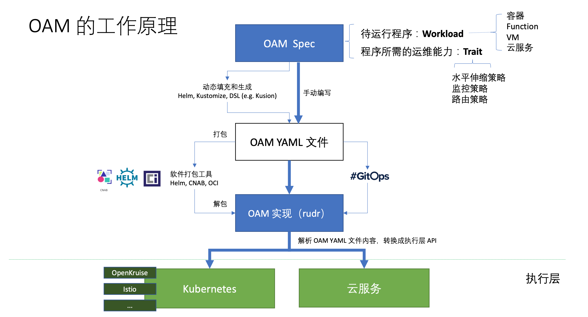

[OAM（Open Application Model）](https://oam.dev/)是阿里巴巴和微软共同开源的云原生应用规范模型，同时开源了基于 OAM 的实现 [Rudr](https://github.com/oam-dev/rudr)。自 2019 年 10 月宣布开源以来截止本文发稿已经有快半年时间了，除了官方文档及 GitHub 外很少看到有关它的详细资料，可能是开发者社区还发展起来。

当前可能大部分人才刚刚开始了解 OAM，所以这篇文章将从最基础出发，为大家介绍 OAM 的诞生背景和要解决的问题，以及它在云原生生态中的作用。

## Takeaways

如果你没有兴趣或者时间阅读下面的全文，那么建议阅读下面这些核心观点：

- OAM 的本质是根据软件设计的“兴趣点分离”原则对负责的 DevOps 流程的高度抽象和封装，这背后还是“**康威定律**”在起作用。
- OAM 仅定义云原生应用的规范，目前推出的的 [Rudr](https://github.com/oam-dev/rudr) 可以看做是 OAM 规范的 Kubernetes 解释器，将云原生应用定义翻译成 Kubernetes 的资源对象。
- OAM 与 [Crossplane](https://crossplane.io/) 将展开合作，就 Kubernetes 式以 API 为中心的应用定义发扬光大，并深度参与 [CNCF SIG App Delivery](https://github.com/cncf/sig-app-delivery)，以共同定义云原生应用标准。

> **康威定律（Conway’s Law）**
>
> [康威定律](https://zh.wikipedia.org/zh-hans/%E5%BA%B7%E5%A8%81%E5%AE%9A%E5%BE%8B)是马尔文·康威（Melvin Conway）1967年提出的： "设计系统的架构受制于产生这些设计的组织的沟通结构。" 

## OAM 简介

OAM 全称是 Open Application Model，从名称上来看它所定义的就是一种模型，同时也实现了基于 OAM 的我认为这种模型旨在定义了云原生应用的标准。

- 开放（Open）：支持异构的平台、容器运行时、调度系统、云供应商、硬件配置等，总之与底层无关
- 应用（Application）：云原生应用
- 模型（Model）：定义标准，以使其与底层平台无关

顺便说下 CNCF 中的也有几个定义标准的「开源项目」，其中有的项目都已经毕业。

- [SMI（Service Mesh Interface）](https://github.com/servicemeshinterface/smi-spec)：服务网格接口
- [Cloud Events](https://github.com/cloudevents/spec)：Serverless 中的事件标准
- [TUF](https://github.com/theupdateframework/specification)：更新框架标准
- [SPIFFE](https://github.com/spiffe/spiffe)：身份安全标准

这其中唯独没有应用定义标准，[CNCF SIG App delivery](https://github.com/cncf/sig-app-delivery) 即是要做这个的。当然既然要指定标准，自然要对不同平台和场景的逻辑做出更高级别的抽象（这也意味着你在掌握了底层逻辑的情况下还要学习更多的概念），这样才能屏蔽底层差异。本文将默认底层平台为 Kubernetes。

- 是从管理大量 CRD 中汲取的经验。
- 业务和研发的沟通成本，比如 YAML 配置中很多字段是开发人员不关心的。

### OAM 基本对象

OAM 模型中包含以下基本对象，以本文发稿时的最新 API 版本 `core.oam.dev/v1alpha2` 为准：

- [**Component**](https://github.com/oam-dev/spec/blob/master/4.component.md)：OAM 中最基础的对象，该配置与基础设施无关，定义负载实例的运维特性。例如一个微服务 [workload](https://github.com/oam-dev/spec/blob/master/3.workload.md) 的定义。
- [**TraitDefinition**](https://github.com/oam-dev/spec/blob/master/6.traits.md)：一个组件所需的**运维策略与配置**，例如环境变量、Ingress、AutoScaler、Volume 等。（注意：该对象在 `apiVersion: core.oam.dev/v1alpha1` 中的名称为 `Trait`）。
- [**ScopeDefinition**](https://github.com/oam-dev/spec/blob/master/5.application_scopes.md)：多个 Component 的共同边界。可以根据组件的特性或者作用域来划分 Scope，一个 Component 可能同时属于多个 Scope。
- [**ApplicationConfiguration**](https://github.com/oam-dev/spec/blob/master/7.application_configuration.md)：将 Component（必须）、Trait（必须）、Scope（非必须）等组合到一起形成一个完整的应用配置。

###  OAM API 的演变

因为 OAM 还处在发展早起，API 变化较快，以上四个对象在不同的 API 版本中的 `kind` 名称不同，请大家使用时注意区别。

| 名称                      | core.oam.dev/v1alpha1    | core.oam.dev/v1alpha2    |
| ------------------------- | ------------------------ | ------------------------ |
| Component                 | ComponentSchematic       | Component                |
| Trait                     | Trait                    | TraitDefinition          |
| Scope                     | Scope                    | ScopeDefinition          |
| Application configuration | ApplicationConfiguration | ApplicationConfiguration |

总的来说，OAM 模型对象的定义格式与 [Kubernetes 对象的类型字段](https://kubernetes.io/docs/concepts/overview/working-with-objects/kubernetes-objects/#required-fields)相似。关于 OAM 的基本概念模型的更多信息请访问 [Overview and Terminology](https://github.com/oam-dev/spec/blob/master/2.overview_and_terminology.md)。

### OAM 工作原理

下图来自阿里云原生应用平台团队孙健波在**《OAM:云原生时代的应用模型与 下一代 DevOps 技术》**中的分享，OAM 的工作原理如下图所示，OAM Spec 定义了云原生应用的规范（使用一些列 CRD 定义）， Rudr 可以看做是 OAM 规范的解析器，将应用定义翻译为 Kubernetes 中的资源对象。



可以将上图分为三个层次：

- **汇编层**：即人工或者使用工具来根据 OAM 规范定义汇编出一个云原生应用的定义，其中包含了该应用的工作负载和运维能力配置。
- **转义层**：汇编好的文件将打包为 YAML 文件，由 Rudr 或其他 OAM 的实现将其转义为 Kubernetes 或其他云服务（例如 Istio）上可运行的资源对象。
- **执行层**：执行经过转义好的云平台上的资源对象并执行资源配置。

## Rudr

Rudr 是对  [OAM v1alpha1](https://github.com/oam-dev/spec/releases/tag/v1.0.0-alpha.1) 在 Kubernetes 环境下的实现，OAM 正在与 [Crossplane](https://github.com/crossplane/) 合作

> **Crossplane**
>
> 使用 Kubernetes 社区开创的以 API 为中心的声明式配置和自动化方法，使基础设施和应用管理标准化。官方网站：<https://crossplane.io/>。

### 安装 Rudr

请参考 [Rudr 文档](https://github.com/oam-dev/rudr/blob/master/docs/setup/install.md)安装，主要依赖以下组件：

- kubectl
- helm 3
- Kubernetes 1.15+

执行下面的命令安装 Rudr 和需要的 trait。

```bash
# 克隆项目
git clone https://github.com/oam-dev/rudr.git
cd rudr
# 创建一个名为 oam 的 namespace
kubectl create namespace oam
# 安装 Rudr
helm install rudr ./charts/rudr --wait -n oam
# 要使用 ingress trait，推荐安装 Nginx ingress
helm repo add stable https://kubernetes-charts.storage.googleapis.com/
helm install nginx-ingress stable/nginx-ingress
# 要使用 autoscaler trait，安装 HorizontalPodAutoscaler
helm repo add kedacore https://kedacore.github.io/charts
helm repo update
helm install keda kedacore/keda -n oam
```

查看当前 oam namespace 下的所有 pod，你会发现已创建了以下 pod。

 ```bash
$ kubectl get pod -n oam
NAME                                              READY   STATUS    RESTARTS   AGE
keda-operator-b6466c989-pn25n                     1/1     Running   0          63m
keda-operator-metrics-apiserver-6cf88c468-k5wd8   1/1     Running   0          63m
nginx-ingress-controller-787bd69d8-n6v8c          1/1     Running   15         7d
nginx-ingress-default-backend-7c868597f4-vvddn    1/1     Running   2          7d
rudr-c648c9b7b-knj9b                              1/1     Running   7          7d
 ```

## 部署示例

我们使用 OAM 官方提供的教程 [Tutorial: Deploy, inspect, and update a Rudr application and its components](https://github.com/oam-dev/rudr/blob/master/docs/tutorials/deploy_and_update.md) 中的 Python [flask](https://palletsprojects.com/p/flask/) 示例，该示例基于 OAM v1alpha1 API，最新版 API 的示例可以参考 [crossplane-oam-sample](https://github.com/oam-dev/crossplane-oam-sample)。

```bash
# 部署 Component

kubectl apply -f examples/helloworld-python-component.yaml
```

此时 get pod 会发现并没有创建任何新的 pod，因为 [examples/helloworld-python-component.yaml](https://github.com/oam-dev/rudr/blob/master/examples/helloworld-python-component.yaml) 文件中只定义了一个名为 `helloworld-python-v1` 的 `ComponentSchematic`，但是 `ComponentSchematic` 是仅仅是定义了一个组件而已，还无法直接创建 pod 的，还需要创建一个 `ApplicationConfiguration` 将其与 `Trait` 绑定才可以创建应用的 pod。

关于该示例的详细信息请参考 [Python flask 示例](https://github.com/oam-dev/rudr/blob/master/docs/how-to/create_component_from_scratch.md)的创建步骤。

### 创建应用配置

在部署了 `ComponentSchematic` 之后我们还需要创建一个 `ApplicationConfiguration` 将其与 `Trait` 资源绑定才可以创建应用。

**当前已有的 Trait**

在安装 Rudr 时已在 oam namespace 中部署了一些 trait，使用下面的命令查看。

```bash
$ kubectl get trait -n oam
NAME             AGE
auto-scaler      7d1h
empty            7d1h
ingress          7d1h
manual-scaler    7d1h
volume-mounter   7d1h
```

在 [examples/first-app-config.yaml](https://github.com/oam-dev/rudr/blob/master/examples/first-app-config.yaml) 中将 `ComponentSchematic` 与 ingress `Trait` 联系起来。一个完整的可部署的应用配置 [examples/first-app-config.yaml](https://github.com/oam-dev/rudr/blob/master/examples/first-app-config.yaml) 的内容如下所示：

```yaml
apiVersion: core.oam.dev/v1alpha1
kind: ApplicationConfiguration
metadata:
  name: first-app
spec:
  components:
    - componentName: helloworld-python-v1 # 引用了上文中的 Component
      instanceName: first-app-helloworld-python-v1
      parameterValues:
        - name: target
          value: Rudr
        - name: port
          value: '9999'
      traits:
        - name: ingress # Ingress 引用，Rudr 已默认创建
          properties:
            hostname: example.com
            path: /
            servicePort: 9999
```

执行下面的命令部署应用。

```bash
kubectl apply -f examples/first-app-config.yaml -n oam
```

若此时查看 oam namespace 下的 pod 将发现有一个新的 pod 创建。

```bash
$ kubectl get pod -o oam
NAME                                              READY   STATUS    RESTARTS   AGE
first-app-helloworld-python-v1-69945684c7-wfd82   1/1     Running   0          16m
...
```

### 测试

执行下面的命令可以测试刚安装的应用。

```bash
# 将 Python flask 应用的 pod 暴露到本机
export POD_NAME=$(kubectl get pods -l "oam.dev/instance-name=first-app-helloworld-python-v1,app.kubernetes.io/name=first-app" -o jsonpath="{.items[0].metadata.name}")
kubectl port-forward $POD_NAME 9999:9999
Forwarding from 127.0.0.1:9999 -> 9999
Forwarding from [::1]:9999 -> 9999
```

在浏览器中访问 <http://127.0.0.1:9999> 将看到 `Hello Rudr!` 的输出，这表示测试成功。

## 未来

从以上描述中可以看出 OAM 对于定义云原生应用标准的野望，其目标不仅限于 Kubernetes 之上的又一上层抽象，而是对于一切云服务，在基于资源对象的基础上，Trait 来控制 Kubernetes 中的一众高层次非可调度的资源对象，如 AutoScaler、Volume、Ingress，Istio 中的流量配置对象 VirtualService、DestinationRule 等，还可容纳更多的云服务，对于 Serverless 时代的去基础设施化的思想不谋而合，未来可期。

## 参考

- [OAM 官方网站 - oam.dev](https://oam.dev)
