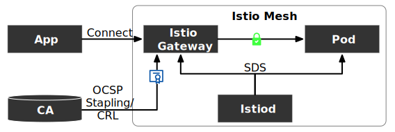

最近 Istio 社区正在处理 [Issue 17763](https://github.com/istio/istio/issues/17763)，以增加 Istio 对证书撤销的支持，目前该功能正在开发工程中，见 [PR #42859 - OSCP Stapling](https://github.com/istio/istio/pull/42859) 和 [OCSP Stapling for Istio Gateways](https://docs.google.com/document/d/15wwYyVyOluubL2KIM89b2X8NFwyhMVxq2_I1MESrZdI/edit#)。这篇博客将向你介绍证书撤销的方式和 Istio 的解决方案进展。

Istio 使用 Envoy SDS 分发证书，一共有两种情形：

- 分发内部证书，用于 mTLS，这种情况需要分别验证客户端和服务端的证书是否被撤销
- 分发外部服务的证书给集群内的服务，用于向集群外的通信加密，此时集群内的服务相当于客户端，仅需验证服务端证书是否被撤销

本文探讨的是第二种情形，即 Istio Gateway 的证书撤销，如下图所示：



CA 通过设置 TTL 控制证书的寿命，如果要提前结束证书可以将证书撤销，有两种方式撤销证书：

1. 配置证书撤销列表（CRL）
2. 在线证书状态协议（OCSP）

## CRL（证书撤销列表）

CRL（证书吊销列表）是一种用于管理和验证证书有效性的机制。它包含一个已被撤销的证书列表，颁发机构（CA）定期更新该列表。当验证证书的客户端（如浏览器）收到证书时，它会检查该证书是否在 CRL 中被列为已撤销，如果是，则该证书被视为无效。

CRL 通常存储在颁发机构（CA）的服务器上，并可以通过互联网公开访问。验证证书的客户端（例如，浏览器）可以下载并检查 CRL 以确定证书是否有效。 CRL 可以以多种格式（如 DER 或 PEM）存储，并通过 HTTP，LDAP 或其他协议发布，以便进行验证。

CRL 文件通常是以二进制形式存储的，不是直接可读的文本文件。但是，可以使用工具（例如 OpenSSL）转换为其他格式，例如 PEM，以方便阅读。下面是一个名为 `crl.pem` 的 CRL 示例文件，以 PEM 格式表示：

```dockerfile
-----BEGIN X509 CRL-----
MIIBtjCBqwIBATANBgkqhkiG9w0BAQUFADBBMQswCQYDVQQGEwJVUzERMA8GA1UE
CBMITmV3IFlvcmsxETAPBgNVBAcTCE5ldyBZb3JrMREwDwYDVQQKEwhNeSBDQTEQ
MA4GA1UECxMHQ2VydGlmaWNhdGUxGDAWBgNVBAMTD01ZIEJ1c2luZXNzIENBMB4X
DTA5MDUwMzE1MTQwMFoXDTEwMDUwMjE1MTQwMFqgLzAtMB8GA1UdIwQYMBaAFJ4f
6Nz7Vuw/NcZXG0U8O6OZ9XB0MAsGA1UdDwQEAwIFoDAdBgNVHQ4EFgQUU6G9fjRK
op+JU6vQPnnhxBxHtzUwDQYJKoZIhvcNAQEFBQADgYEAbYoLz7MnJ4ltIS+nCquG
N/v+8rE00/N0pGzN/dCv/8t0W0tGTGr2zGRb0mv67MPOmWmHcZZq3sOxgEIp8T+O
OJxDCD/xJN6hB0NgN/Z0+fX9hU6bL/6zhwUy/l51xddmSd5KKhJ7FmOh2Py5m9Au
4fJh7w+OLyjKV7rz55WKjvY=
-----END X509 CRL-----
```

使用 OpenSSL 将其转换为可读格式：

```bash
openssl crl -inform PEM -in crl.pem -noout -text
```

输出结果为：

```
Certificate Revocation List (CRL):
        Version 2 (0x1)
    Signature Algorithm: sha256WithRSAEncryption
        Issuer: /C=US/ST=New York/L=New York/O=My CA/OU=Certificate/CN=My Business CA
        Last Update: May 3 11:40:00 2009 GMT
        Next Update: May 2 11:40:00 2010 GMT
    Revoked Certificates:
        Serial Number: 1 (0x1)
            Revocation Date: May 3 11:40:00 2009 GMT
```

**注意**：该 CRL 文件的列表中只保存了一个撤销证书。

CRL 虽被广泛使用，但使用 CRL 文件来撤销证书存在以下几个缺点：

1. **时效性**：CRL 文件必须定期更新，否则将无法识别近期撤销的证书；
2. **可用性**：如果无法访问 CRL 服务器，则无法验证证书是否已被撤销；
3. **效率**：CRL 文件随着证书数量的增加而变得越来越大，因此验证证书的过程可能会变慢；
4. **安全性**：CRL 文件本身也需要安全保护，否则攻击者可能会篡改 CRL 以逃避撤销证书的限制；

因此，现在有更高效和安全的证书撤销机制，例如 OCSP（Online Certificate Status Protocol），它可以实时验证证书的状态，并且不需要存储所有已撤销证书的列表。

## OCSP Stapling

OCSP Stapling（正式名称为 TLS 证书状态查询扩展）是一种 TLS（Transport Layer Security）扩展，用于证明证书的状态是有效的。它允许服务器预先检索证书状态信息，并将该信息“钉”到TLS证书中，以减少对证书颁发机构的依赖，并提高证书状态验证的效率。可代替 OCSP 来查询 X.509 证书的状态。服务器在TLS握手时发送事先缓存的OCSP响应，用户只需验证该响应的有效性而不用再向数字证书认证机构（CA）发送请求。详见[维基百科](https://en.wikipedia.org/wiki/OCSP_stapling)。

OCSP 只适用于单个证书，而不是列表。客户端在收到证书后，与 CA 通信以检查撤销状态。响应可以是 "good"、"revoked" 或 "unknown" 之一。

使用 OSCP Stapling 虽然省去了维护 CRL 的负担，但是它依然有以下几个缺点：

1. **额外的资源开销**：CA 服务器需要不断地响应 OCSP 质询以确保证书的有效性，这将对服务器的 CPU 和网络带宽造成额外的开销；
2. **可用性问题**：如果 OCSP 服务器不可用，则客户端将无法获得证书的有效性信息；
3. **安全问题**：如果 OCSP 响应被篡改或服务器不安全，则证书的有效性信息可能被篡改，从而影响安全；
4. **兼容性问题**：OCSP Stapling 不是所有浏览器都支持的功能，因此可能需要在旧浏览器上实现额外的兼容性。

OCSP的挑战是，它给 CA 带来了很大的负担，因为每个客户端都需要独立地获得证书的验证。总体而言，OCSP Stapling 可以提高证书验证的效率和安全性，但是也存在一些需要考虑的问题。因此，在采用该技术时需要综合考虑多方面的因素。

## Istio 对 OSCP Stapling 支持

很多 Web 服务器都支持 OSCP Stapling，云原生边缘代理 Envoy 也支持该功能，需要对 Envoy 进行以下配置：

- 配置 [`DownstreamTlsContext`](https://www.envoyproxy.io/docs/envoy/latest/api-v3/extensions/transport_sockets/tls/v3/tls.proto#envoy-v3-api-msg-extensions-transport-sockets-tls-v3-downstreamtlscontext) 中的 `oscp_staple_policy`：
  - `LENIENT_STAPLING`：OCSP 响应是可选的，此为默认值
  - `STRICT_STAPLING`：OCSP 响应是可选的，但如果存在并且有效，就会使用。
  - `MUST_STAPLE`: OCSP响应是必需的
- 配置 [`TlsCertificate`](https://www.envoyproxy.io/docs/envoy/latest/api-v3/extensions/transport_sockets/tls/v3/common.proto#envoy-v3-api-msg-extensions-transport-sockets-tls-v3-tlscertificate) 中的 `oscp_staple`，响应必须是DER编码的，只能通过文件名或 `inline_bytes` 提供。响应可能只与一个证书有关。

目前 Envoy 已支持 OSCP Stapling，其作为 Istio 的数据平面和 Istio Gateway 中的代理，理论上 Istio 也可以支持该功能。不过 Istio 的 OSCP Stapling 证书撤销功能支持仍在进行中，详见 [PR #42859 - OSCP Stapling](https://github.com/istio/istio/pull/42859)。该功能的新进展将在本文中更新，请保持关注。
