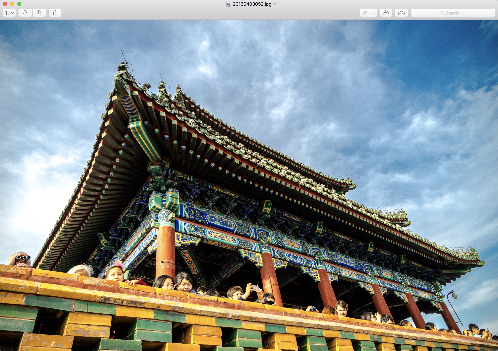
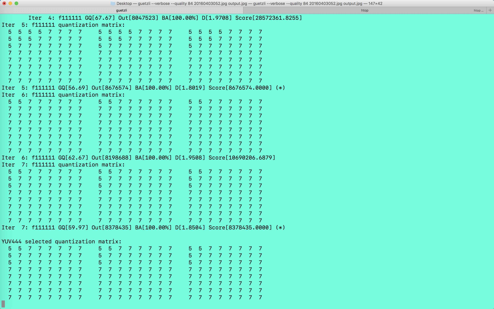
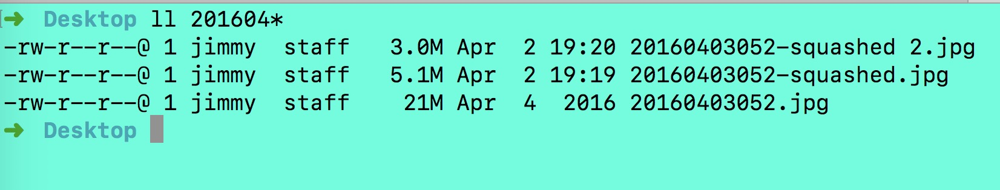
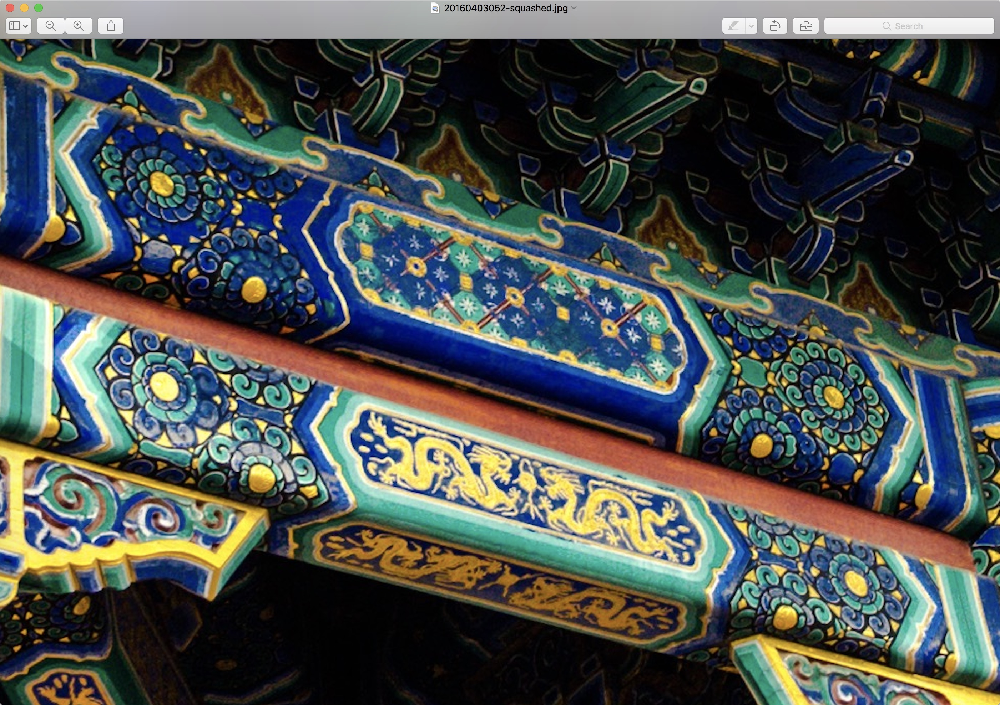
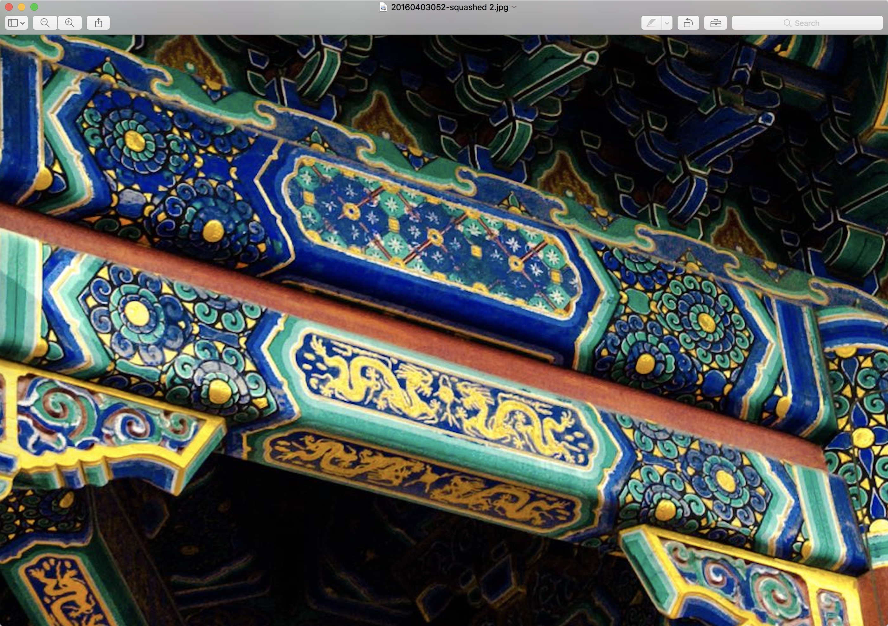
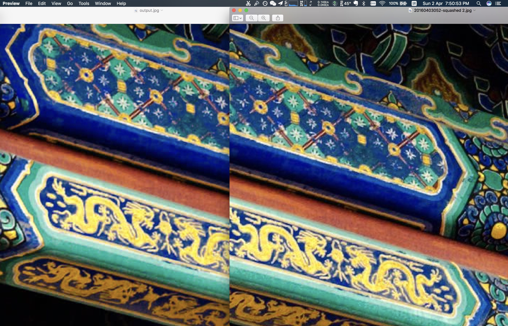

如果你看过美剧「硅谷」会记得剧中主角们所在的创业公司[PiedPipper](www.piedpiper.com)，他们就是靠自己发明的视频压缩算法来跟大公司Hooli竞争的，这部剧现在已经发展到第4季，在[腾讯视频](http://v.qq.com/detail/d/dr2zn76oez8tyt4.html?ptag=baidu.aladdin.tv)上可以免费观看。

最近关注了两个**图像处理**的Open Source Projects。

- [Google Guetzli](https://github.com/google/guetzli) 图像压缩工具
- [Luan Fujun's Deep Photo Style Transfer](https://github.com/luanfujun/deep-photo-styletransfer) 图像style转换工具

另外对于图像处理还处于Photoshop、Lightroom这种摄影后期和图像处理命令行工具[ImageMagick](https://www.imagemagick.org/script/index.php)的我来说，图像压缩，智能图像风格转换实乃上乘武功，不是我等凡夫俗子驾驭的了，但是乘兴而来，总不能败兴而归吧，下面我们来一探究竟。

## Google Guetzli

聊聊架构微信公众号上有一篇介绍[Google开源新算法，可将JPEG文件缩小35%](https://mp.weixin.qq.com/s?__biz=MzA5Nzc4OTA1Mw==&mid=2659599074&idx=1&sn=a26ae2a8becdc1f2cfbddf44d8ca1495&chksm=8be997f0bc9e1ee6e33f3e33c73d11884ad66085c0aedc9dd5e482063482887d0733d8e7d187#rd)文章。

我在Mac上试用了一下，安装很简单，只要一条命令：

```Bash
brew install guetzli
```

但是当我拿一张`22M`大小的照片使用guetzli压缩的时候，我是绝望的，先后三次kill掉了进程。

**因为实在是太慢了**，也能是我软件对内存和CPU的利用率不高，效果你们自己看看。

原图是这个样子的，拍摄地点在景山上的，俯瞰紫禁城的绝佳位置。



```bash
guetzli --quality 84 --verbose 20160403052.jpg output.jpg
```

为什么quality要设置成84呢？因为只能设置为84+的quality，如果要设置的更低的话需要自己修改代码。



耗时了一个小时，后台进程信息。


这个是使用**Squash**压缩后的大小效果，压缩每张照片差不多只要3秒钟。

> Squash的logo就是个正在被剥皮的🍊，这是[下载地址](http://xclient.info/s/squash.html)。

压缩比分别为`70%`和`30%`。



**压缩比70%后的细节放大图**



**压缩比30%的细节放大图**



你看出什么区别了吗？反正我是没有。

下面再来看看耗时一个小时，千呼万唤始出来的guetzli压缩后的效果和使用squash压缩比为30%的效果对比。



左面是使用guetzli压缩后（4.1M），右面使用的squash压缩后（3.1M）的照片。

*似乎还是没有什么区别啊？你看出来了吗？*

### Guetzli总结

可能是我使用Guetzli的方式不对，但是命令行里确实没有设置CPU和内存资源的选项啊，为啥压缩照片会这么慢呢？效果也并不出彩，不改代码的话照片质量只能设置成84以上，但是这个是**Open Source**的，使用的C++开发，可以研究下它的图像压缩算法。

# Deep Photo Style Transfer 

来自康奈尔大学的Luan Fujun开源的图像sytle转换工具，看了[README](https://github.com/luanfujun/deep-photo-styletransfer)的介绍，上面有很多图像风格转换的例子，真的很惊艳，市面上好像还没有这种能够在给定任意一张照片的情况下，自动将另一张照片转换成该照片的style。

这个工具使用Matlab和Lua开发，基于[Torch](https://github.com/torch/torch7)运行的时候需要[CUDA](https://developer.nvidia.com/cuda-downloads)，[cudnn](https://developer.nvidia.com/cudnn)，[Matlab](https://www.mathworks.com/)，环境实在太复杂，就没折腾，启动有人发布[Docker镜像](https://github.com/luanfujun/deep-photo-styletransfer/issues/29)，已经有人提了issue。

如果它能够被商用，绝对是继**Prisma**后又一人工智能照片处理应用利器。

## 后记

是不是有了照片风格转换这个东西就不需要做照片后期了？只要选几张自己喜欢的风格照片，再鼠标点几下就可以完成照片处理了？摄影师要失业了？非也！照片风格东西本来就是很主观性的，每个人都有自己喜欢的风格，照相机发明后就有人说画家要失业了，其实不然，画画依然是创造性地劳动，只能说很多写实风格的画家要失业了。Deep Photo Style Transfer也许会成为Lightroom或者手机上一款app的功能，是一个不错的工具。也许还会成为像Prisma一样的现象级产品，who knows?🤷‍♂️
