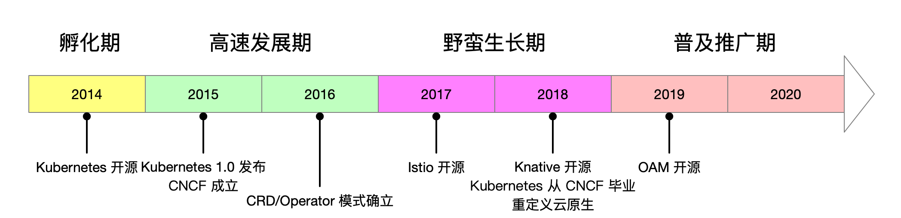
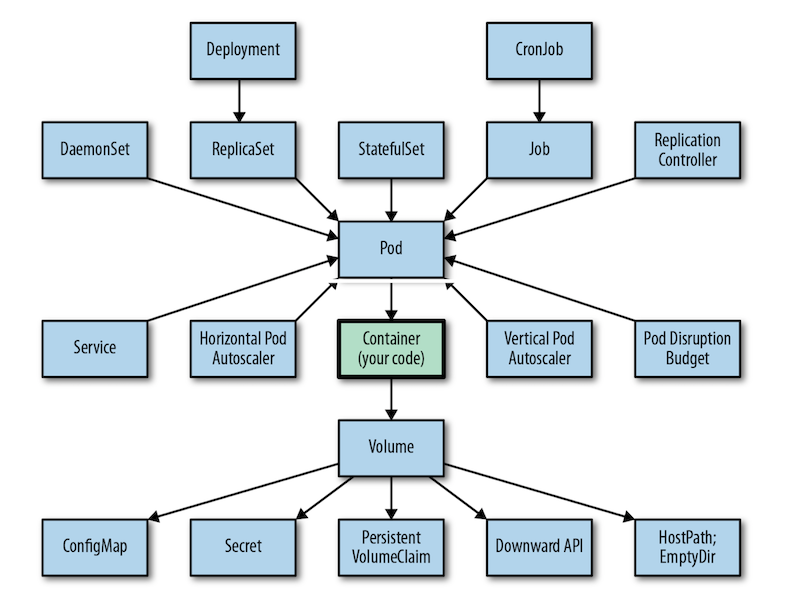
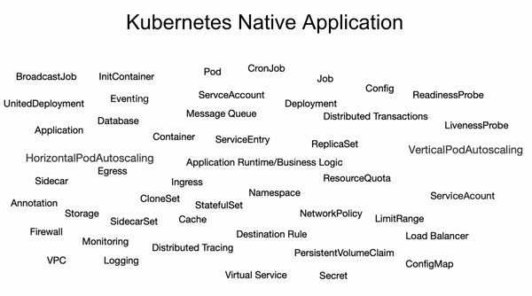
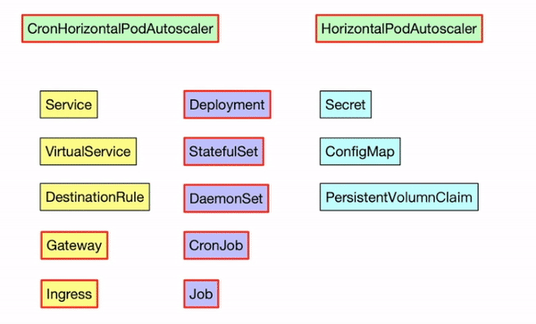
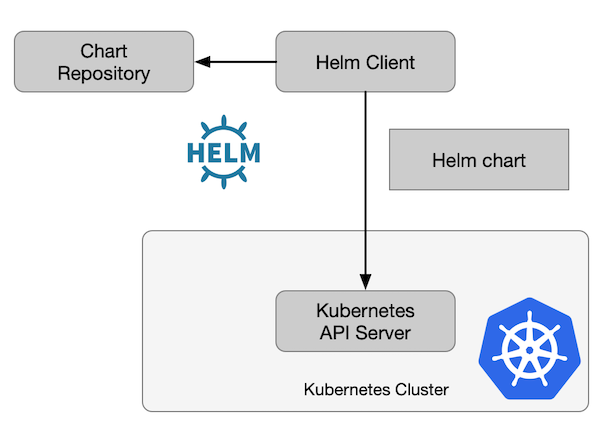
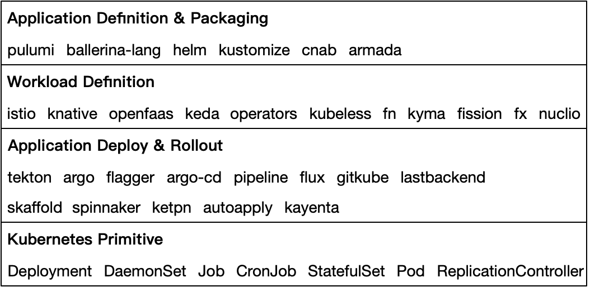

Kubernetes 自开源至今已经走过六个年头了，[云原生时代](https://cloudnative.to/blog/cloud-native-era/)也已到来，我关注云原生领域也四年有余了，最近开始思考云原生的未来走向，特此撰写本文作为[《云原生应用白皮书》](https://jimmysong.io/guide-to-cloud-native-app)的开篇，更多关于云原生应用的介绍请转到白皮书中浏览。
## 重点

- 云原生基础设施已渡过了野蛮生长期，正朝着统一应用标准方向迈进。
- Kubernetes 的原语无法完整描述云原生应用体系，且在资源的配置上开发与运维功能耦合严重。
- Operator 在扩展了 Kubernetes 生态的同时导致云原生应用碎片化，亟需一个统一的应用定义标准。
- OAM 的本质是将云原生应用定义中的研发、运维关注点分离，资源对象进行进一步抽象，化繁为简，包罗万象。
- “Kubernetes 次世代”是指在 Kubernetes 成为基础设施层标准之后，云原生生态的关注点正在向应用层过度，近两年来火热的 Service Mesh 正是该过程中的一次有力探索，而基于 Kubernetes 的云原生**应用**架构的时代即将到来。

Kubernetes 已成为云原生应用的既定运行平台，本文以 Kubernetes 为默认平台展开，包括云原生应用的分层模型。

## 云原生的不同发展阶段

Kubernetes 从开源至今已经走过快[六个年头](https://jimmysong.io/cloud-native/memo/open-source/)（2014 年 6 月开源）了，可以说是 Kubernetes 的诞生开启了整个云原生的时代。我粗略的将云原生的发展划分为以下几个时期。

**第一阶段：孵化期（2014 年）**

2014 年，Google 开源 Kubernetes，在此之前的 2013 年，Docker 开源，DevOps、微服务已变得十分流行，云原生的概念已经初出茅庐。在开源了 Kubernetes 之后，Google 联合其他厂商发起成立了 CNCF，并将 Kubernetes 作为初创项目捐献给了 CNCF。CNCF 作为云原生的背后推手，开始推广 Kubernetes。

**第二阶段：高速发展期（2015 年 - 2016 年）**

这几年间，Kubernetes 保持着高速发展，并于 2017 年打败了 Docker Swarm、Mesos，确立了容器编排工具领导者的地位。CRD 和 Operator 模式的诞生，大大增强了 Kubernetes 的扩展性，促进了周边生态的繁荣。

**第三阶段：野蛮生长期（2017 年 - 2018 年）**

2016 年之后的云原生基本都默认运行在 Kubernetes 平台上，2017、2018 年 Google 主导的 Istio、Knative 相继开源，这些开源项目都大量利用了 Kubernetes 的 Operator 进行了扩展，Istio 刚发布时就有 50 多个 CRD 定义。Istio 号称是[后 Kubernetes 时代的微服务](https://jimmysong.io/blog/service-mesh-the-microservices-in-post-kubernetes-era/)，它的出现第一次使得云原生以服务（应用）为中心。Knative 是 Google 在基于 Kubernetes 之上开源的 Serverless 领域的一次尝试。2018 年 Kubernetes 正式从 CNCF [毕业](https://www.cncf.io/blog/2018/03/06/kubernetes-first-cncf-project-graduate/)，Prometheus、Envoy 也陆续从 CNCF 毕业。CNCF 也与 2018 年修改了 charter，对云原生进行了重定义，从原来的三要素：”应用容器化；面向微服务架构；应用支持容器的编排调度“，修改为”云原生技术有利于各组织在公有云、私有云和混合云等新型动态环境中，构建和运行可弹性扩展的应用。云原生的代表技术包括容器、服务网格、微服务、不可变基础设施和声明式API“。这一年，我曾写过两篇 Kubernetes 及云原生发展的年终总结和展望，见 [2017 年](https://jimmysong.io/kubernetes-handbook/appendix/kubernetes-and-cloud-native-summary-in-2017-and-outlook-for-2018.html)和 [2018 年](https://jimmysong.io/kubernetes-handbook/appendix/kubernetes-and-cloud-native-summary-in-2018-and-outlook-for-2019.html)的预测和总结。

**第四阶段：普及推广期（2019 年至今）**

经过几年的发展，Kubernetes 已经得到的大规模的应用，云原生的概念开始深入人心，Kubernetes 号称是云原生的操作系统，基于 Operator 模式的生态大放异彩。整合 Kubernetes 和云基础设施，研发和运维关注点分离。Kubernetes 到 Service Mesh（后 Kubernetes 时代的微服务），基于 Kubernetes 的 Serverless 都在快速发展，OAM 诞生，旨在定义云原生应用标准。

## Kubernetes 开辟了云原生时代

Kubernetes 开源之初就继承了 Google 内部调度系统 Borg 的经验，屏蔽掉了底层物理机、虚拟机之间的差异，经过几年时间的发展成为了容器编排标准，进而统一了 PaaS 平台的基础设施层。

下图是Kubernetes 原生内置的可以应用到一个 Pod 上的所有控制器、资源对象等。

图片来自图书 [Kubernetes Patterns（O’Reilly）](https://www.redhat.com/cms/managed-files/cm-oreilly-kubernetes-patterns-ebook-f19824-201910-en.pdf)

Kubernetes 作为云原生基础设施设计之初遵循了以下原则：

1. 基础设施即代码（声明式 API）
1. 不可变基础设施
1. 幂等性
1. 调节器模式（Operator 的原理）

其中声明式 API 可谓开创了云原生时代的基调，而调节器模式是 Kubernetes 区别于其他[云部署形式](https://jimmysong.io/cloud-native-infra/evolution-of-cloud-native-developments.html)的主要区别之一，这也为后来的 [Operator 框架的诞生](https://zhuanlan.zhihu.com/p/54633203)打下了基础。

### 声明式 API

根据声明式 API 可以做应用编排，定义组件间的依赖，通常使用人类易读的 YAML 文件来表示。但是，YAML 文件声明的字段真的就是最终的状态吗？有没有可能动态改变？

我们在创建 `Deployment` 时会指定 Pod 的副本数，但是其实际副本数并不一定是一成不变的。假如集群中还有定义 HPA，那么 Pod 的副本数就可能随着一些外界因素（比如内存、CPU 使用率或者自定义 metric）而改变，而且如果集群中还有运行自定义的控制器话，那么也有可能修改应用的实例数量。在有多个控制器同时控制某个资源对象时，如何确保控制器之间不会发生冲突，资源对象的状态可预期？可以使用[动态准入控制](https://kubernetes.io/zh/docs/reference/access-authn-authz/extensible-admission-controllers/#monitoring-admission-webhooks)来达到这一点。

### Kubernetes 原生应用

我们都知道要想运行一个应用至少需要以下几点：

- 应用的业务逻辑（代码）、运行时（可运行的二进制文件、字节码或脚本）。
- 应用的配置注入（配置文件、环境变量等），身份、路由、服务暴露等满足应用的安全性和可访问性。
- 应用的生命周期管理（各种 Controller 登场）。
- 可观察性、可运维、网络和资源及环境依赖、隔离性等。

下图展示了基于 Kubernetes 原语及 PaaS 平台资源的 Kubernetes 原生应用的组成。

我们都知道 Kubernetes 提供了大量的[原语](https://kubernetes.io/docs/concepts/)，用户可以基于这些原语来编排服务，管理应用的生命周期。上图展示的是基于 Kubernetes 原生应用可以使用的 Kubernetes 原语、扩展及平台层资源，从内向外的对象跟应用程序（业务逻辑）的关联度依次降低，到最外层基本只剩下平台资源依赖，已经与 Kubernetes 几乎没有关系了。该图里仅展示了部分资源和对象（包含阿里巴巴开源的 [OpenKruise](https://github.com/openkruise/kruise)、Istio），实际上 [Operator](https://operatorhub.io/) 资源之丰富，也是 Kubernetes 生态如此繁荣的原因之一。

Kubernetes 本身的原语、资源对象、配置、常用的 CRD 扩展有几十、上百个之多。开发者需要了解这些复杂的概念吗？我只是想部署一个应用而已！不用所对于应用开发者，即使对于基础实施开发和运维人员也需要很陡峭的学习曲线才能完全掌握它。

我将 Kubernetes 原生应用所需要的定义和资源进行了分层：

- **核心层**：应用逻辑、服务定义、生命周期控制；
- **隔离与服务访问层**：资源限制与隔离、配置、身份、路由规则等；
- **调度层**：各种调度控制器，这也是 Kubernetes 原生应用的主要扩展层；
- **资源层**：提供网络、存储和其他平台资源；

而这些不同的层，完全可以将其职责分配给相应的人员，比如核心层是由应用程序开发者负责，将其职责分离，可以很大程度上降低开发和运维的复杂度。

云原生应用落实到 Kubernetes 平台之上，仅仅利用 Kubernetes 的对象原语已很难描述一个复杂的应用程序，所以诞生了各种各样的 Operator，但这也仅仅解决了单个应用的定义，对于应用的打包封装则无能为力。

同一个资源对象又有多种实现方式，比如 Ingress 就有 [10 多种实现](https://docs.google.com/spreadsheets/d/1DnsHtdHbxjvHmxvlu7VhzWcWgLAn_Mc5L1WlhLDA__k/edit#gid=0)，PV 就更不用说，对于对于开发者究竟如何选择，平台如何管理，这都是让人很头疼的问题。而且有时候平台所提供的扩展能力还可能会有冲突，这些能力有的可能互不相干，有的可能会有正交，有的可能完全重合。且应用本身与运维特性之间存在太多耦合，不便于复用。

上图中不同颜色的方框代表不同的资源类别，红线框代表不能为一个资源同时应用该配置，否则会出现冲突，不同的颜色上面是一个动画，展示的是部分资源组合。图中仅包含了部分 Kubernetes 中的原语和 Istio 中的资源对象组合及自定义扩展，实际上用户可以根据应用的自身特点，基于 Kubernetes 原语和 CRD 创建出千变万化的组合。

为了管理这些应用诞生出了众多的 [Operator](https://github.com/operator-framework/awesome-operators)。Kubernetes 1.7 版本以来就引入了[自定义控制器](https://kubernetes.io/docs/concepts/api-extension/custom-resources/)的概念，该功能可以让开发人员扩展添加新功能，更新现有的功能，并且可以自动执行一些管理任务，这些自定义的控制器就像 Kubernetes 原生的组件一样，Operator 直接使用 Kubernetes API进行开发，也就是说它们可以根据这些控制器内部编写的自定义规则来监控集群、更改 Pods/Services、对正在运行的应用进行扩缩容。

Operator 的本质是一种调节器模式（Reconciler Pattern）的应用，跟 Kubernetes 本身的实现模式是一样的，用于管理云原生应用，协调应用的实际状态达到预期状态。

调节器模式的四个原则：

1. 所有的输入和输出都使用数据结构。
1. 确保数据结构是不可变的。
1. 保持资源映射简单。
1. 使实际状态符合预期状态。

## 云原生应用走向碎片化

利用声明式 API 及调节器模式，理论上可以在 Kubernetes 上部署任何可声明应用，但是在 Operator 出现之前，管理 Kubernetes 上的有状态应用一直是一个难题，随着 Operator 模式的确立，该难题已得以解决，并促进了 Kubernetes 生态的进一步发展。随着该生态的繁荣，有一种碎片化的特征正在显现。

**云原生应用碎片化的体现**

- Operator 模式将运维人员的反应式经验转化成基于 `Reconcile` 模式的代码，统一了有状态应用的管理模式，极大得扩展了 Kubernetes 应用生态。
- 开发者在引用 Operator 所提供的能力时没有统一的视图，加大了基础设施运维与开发者之间的沟通成本。
- Operator 总体上治理松散，没有统一的管控机制，在同时应用时可能导致互相冲突或无法预期的结果发生。

### 有状态应用管理难题

Kubernetes 对于无状态应用的管理很出色，但是对于有状态应用就不是那么回事了。虽然 StatefulSet 可以帮助管理有状态应用，但是这还远远不够，有状态应用往往有复杂的依赖。声明式的 API 里往往要加载着大量的配置和启动脚本，才能实现一个复杂应用的 Kubernetes 化。

例如在 2017 年初，Operator Framework 出现之前，需要使用大量的 `ConfigMap`、复杂的启动脚本才能[在 Kubernetes 上定义 Hadoop YARN](https://jimmysong.io/kubernetes-handbook/guide/migrating-hadoop-yarn-to-kubernetes.html) 和[运行 Spark](https://jimmysong.io/kubernetes-handbook/usecases/running-spark-with-kubernetes-native-scheduler.html)。虽然 [`StatefulSet`](https://kubernetes.io/docs/concepts/workloads/controllers/statefulset/) 号称可以解决有状态应用的部署问题，但是它主要是保证了 Pod 的在启动、伸缩时的顺序和使 Pod 具有稳定的标识。但是很多分布式应用来说并不仅依靠启动顺序就可以保证其状态，根据其在分布式应用中的角色不同（master/worker）而需要有大量的自定义配置，在没有 Operator 之前这些配置通常是通过一些自定义脚本来实现，这些脚本可能存在于应用镜像中，也可以通过 `ConfigMap` 挂在到容器运行时，但无论如何这些脚本都可能因为散落在各处，这些脚本还是面向过程的，跟在 Kubernetes 诞生之前的运维方式毫无二致，这极其不便于版本控制和运维管理。

### Operator 统一了 Kubernetes 应用运维框架

Operator 大大增强了 Kubernetes 的可扩展性，丰富了以 Kubernetes 为基础的云原生生态，许多原先不是为 Kubernetes 而构建的应用纷纷通过[构建自己的 Operator](https://zhuanlan.zhihu.com/p/54633203) 迁移到 Kubernetes 上。还有一些直接基于 Kubernetes 构建的 Service Mesh、Serverless 框架，它们应用 Operator 模式（如 [Istio](https://istio.io)、[Knative](https://knative.dev)），试图成为云原生应用的基础设施层，补齐 Kubernetes 在服务治理、无服务架构等方面的短板，随着大量的 CRD、Operator 控制器的出现，而 Kubernetes 却无法以应用的视角来管理这些能力及其背后零散的 CRD，这使得云原生应用碎片化。

Operator 百花齐放，在没有一个大一统的视图之前，各个控制器之间存在着这样的关系：

- **独立**：互不干涉，比如 Controller 与服务发现之间就不存在冲突。
- **可组合**：例如 `Service`、`VirtualService`、`DestinationRule` 同属一类资源（可访问性与路由），就是可组合的（后两者是 Istio 中的 CRD，用于流量管理）。
- **有冲突**：例如图中的 `CronHorizontalPodAutoscaler`（CRD）、`HorizontalPodAutoscaler`（Kubernetes 内置），同时使用可能导致无法意料的情况发生。

正是以为这样复杂的关系，导致其无法做到开箱即用，还需要基础设施团队基于云原生社区和生态自己构建出来的，比如[应用交付领域](https://jimmysong.io/awesome-cloud-native/#application-delivery)的系列开源项目。

## 云原生应用管理工具 Helm

Kubernetes 之上有很多能力缺失，比如应用构建、发布、管理和运维等，Helm 的出现主要补偿了应用打包和版本管理的缺陷。其中云原生应用的配置包括：

- 应用程序启动时加载的配置文件；
- 应用程序的运维配置，如资源申请限额；
- 应用程序的服务发现配置；
- 应用程序的工作负载、发布策略、依赖等；

这些配置可以存在于 `ConfigMap`、`Deployment`、`Service`、`Ingress` 等 Kubernetes 的多个资源文件中，如何保证应用程序的复用性？应用程序之间有依赖该如何解决？这是时候你可能自然的想到了 Helm。

云原生应用打包和发布管理

- Helm 通过 chart 模板，提高了应用程序的复用性并解决了部分依赖问题；
- Chart 仓库提供了云原生应用程序的统一管控视图；
- `Release` 概念的引入，使得云原生应用版本化管理进一步加强；

Helm 主要关注的是 [12 因素应用](https://12factor.net/zh_cn/)法则[构建、发布、运行](https://12factor.net/zh_cn/build-release-run)这一原则中的”发布”这一环节。下图是 Helm v3 的架构图。

Helm 可以安装本地或者远程的 chart，当 chart 安装到 Kubernetes 中后就会创建一个 release，每次更新该 chart 的配置并执行 `helm upgrade`， release 的版本数就会加 1，开发者可以升级 chart 或回滚到历史版本。

### 打包、配置和发布

Helm 和 chart 的主要作用是：

- 应用程序封装
- 版本管理
- 依赖检查
- 便于应用程序分发

**打包**

Helm 采用 [Chart](https://helm.sh/docs/topics/charts/) 的格式来标准化描述应用，可以将目录打包成版本化的压缩包进行部署理论上一个 Chart 是可以嵌套若干个 Chart 并定义依赖关系，组织形式非常灵活。Helm chart 用于打包 Kubernetes 原生应用。

**配置**

应用配置参数，在 Chart 中由 `values.yaml` 和命令行参数组成。Chart 采用 Go Template 的特性和 `values.yaml` 对部署的模板文件进行参数渲染，也可以通过 `helm` 命令 `--set key=value` 的方式进行参数赋值。

**发布**

Release 代表 Chart 在集群中的运行实例，Helm 围绕 Release 对应用提供了强大的生命周期管理能力，包括 Release 的查询、安装、更新、删除、回滚等。

## 云原生应用

以上关注的点都是基于 Kubernetes 原语的实现，虽然基于 Kubernetes 构建的 PaaS 平台部分屏蔽了底层基础设施的差异，但是仍有很多云服务是无法通过 Kubernetes 创建，或者需要提前创建供 Kubernetes 原生应用使用的，这些应用通常不运行在 Kubernetes 集群中。因此创建和管理一个云原生应用程序需要考虑以下方面：

- 运行时：ECS、Docker、KataContainer、gVisor 等；
- 资源隔离性：多租户、VPC、Namespace、防火墙；
- 资源调度：各种类型的 controller；
- 网络可达性：Service、Ingress、Egress、Gateway、VirtualService、DestinationRule、LoadBalancer、ServiceEntry 等；
- 可观测性：日志、分布式追踪、指标；
- 安全性：SecurityPolicy、NetworkPolicy、AuthorizationPolicy；
- 平台资源申请：数据库、存储等；
- 运行与隔离：ECS、Docker、KataContainer 等；
- 资源分配和调度：各种控制器；
- 环境隔离：Namespace、多租户、VPC、防火墙、LimitRange、Resources；
- 可访问性：Service、Ingress、Egress、Gateway、LoadBalancer、VirtualService、DestinationRule、ServiceEntry；
- 状态管理：Operator；
- 可观察性：日志、监控、指标；
- 安全性：SecurityPolicy、ServiceAccount；

### 云原生应用分层模型

那么究竟如何来给云原生应用分层，化繁就简？近几年来，基于 Kubernetes 的应用呈爆炸式发展，光是在[应用交付领域](https://jimmysong.io/awesome-cloud-native/#application-delivery)的开源项目就达几十个之多。下图展示我根据这些项目的特性而绘制的 App Delivery Landscape。

- **应用定义和包装**：云原生应用的最上层，直接定义云原生应用的组成形式，解决云原生应用之间的依赖关系，并封装成发布包，如 Helm、CNAB，还有云原生变成语言 Pulumi 和 Ballerina，基于 API 的方式来编排云原生应用；
- **负载定义**：基于 Kubernetes Operator，大多是 Serverless 负载，既负责了负载的定义又负责了生命周期管理。[Istio](https://istio.io) 是比较特殊的存在，它不仅管理服务间的流量，还负责安全性、可观察性。
- **应用发布和上线**：关注应用的构建和发布、GitOps、发布策略等，这也是云原生应用全景中最丰富的部分之一；
- **Kubernetes 原语**：Kubernetes 本身提供的原语，Operator 基于此构建；

以上为我个人分类的云原生应用全景模型，仅限于 Kubernetes 之上的应用，对于其他非 Kubernetes 应用非本文的考虑范围。另外，CNCF SIG App Delivery 中也给出的云原生应用的分层模型，其模型将非 Kubernetes 应用场景也纳入了考虑，详见：[The Dictionary of Cloud-Native App Delivery](https://docs.google.com/document/d/1gMhRz4vEwiHa3uD8DqFKHGTSxrVJNgkLG2WZWvi9lXo/edit#heading=h.h9so53gv5zen)。

Platform/Kuberntes，Kubernetes 仅仅是屏蔽了平台的一些差异，但是对于最上层的应用来说，没有涉及，用户需要自己来基于各种开源组件来搭积木。

### OAM（开放应用模型）

那么以上这么多应用有哪些共性，能不能再进一步抽象呢？

- 所有应用是都以容器作为运行时环境（ContainerizedWorkload），这是 OAM 中的核心 Workload 类型；
- 在应用发布和上线方面，有些是属于应用的运维特征，需要根据实际需求组合和变更，这些是持续变动的部分；
- 要实现某些复杂的应用管控，需要使用到多个 CRD 的组合，比如 Istio 中的让流量根据百分比切分到不同的而服务，就需要部署 Istio Operator，并声明 `VirtualService`、`DestinationRule`，二者同时使用；

一个 `ApplicationConfiguration` 的 Runtime 的正常流程应该是：

- 应用开发者创建自己的 `Component`，在 `Component` 中描述要应用相关的信息，如应用名称、镜像配置、环境变量等，应用到 Kubernetes cluster 中；
- 运维创建各种运维策略，如发布策略、网络策略等等，发布时由 AppConfig 对象关联要发布的 `Component` 和本次的运维策略，apply 到集群中，集群的 OAM operator watch 到一次 `ApplicationConfiguration`的下发，生成 `Component` 对应的 `Workload` 和 `Trait`，`Trait` controller 将本次的 `Trait` 策略应用到本次要管理的 `Workload` 当中，最终到达终态，完成一次发布。

OAM 是对 Kubernetes 友好的，一样采用声明式 API 的理念开发。如果你已经编写了现成的 CRD Operator，可以平滑的接入到 OAM 体系中。OAM 以应用为中心，高度可扩展，扩展点包括：

- Workload：扩展各种运行时类型，不仅限于容器运行时，还可以定义更多其他运行时，比如 Serverless 负载、虚拟机、数据库、网络等；例如，Pod、无服务器函数、数据存储、消息队列或任何其他类型的工作负载，这些都是应用程序开发人员需要设计一个完整的应用程序所需要的，可以直接引用 Kubernetes 的 CRD；
- Trait：各种运维规则，比如扩缩容、流量控制、安全性；

### 生态

以前 CNCF 的主要关注群体大多是基础设施领域的技术人员，但是自 2019 年 9 月，[CNCF 宣布成立 SIG App Delivery](https://www.infoq.cn/article/Cdw7ISlEqKilGyN9V3Pj) 后，CNCF 正在将应用开发者和运维人员更紧密的联系在一起。[应用交付 SIG](https://github.com/cncf/sig-app-delivery) 的使命是：

- 在与开发、分发、部署、管理和运行安全的云原生应用相关的领域进行合作，目标是以云原生方式交付应用。
- 发展信息资源，包括指南、教程和白皮书，让社区了解最佳实践和应用交付的价值。
- 识别合适的项目和现状的差距，定期向 TOC 更新，并以结构化的方式向 TOC 提出行动建议。这包括帮助 TOC 评估和对潜在的新项目进行尽职调查。

目前 OAM 定义的云原生应用模型已有以下项目支持。

- [Crossplane](https://crossplane.io/)：这是一个开源的 Kubernetes 扩展组件，适用于主流公有云平台，使用 `kubectl` 配置和管理基础架构、服务和应用。对于 OAM 的支持详见[运行应用程序](https://crossplane.io/docs/v0.11/getting-started/run-applications.html)。
- [KPT](https://googlecontainertools.github.io/kpt/)：Kpt（发音为 "keep"）是一个在资源配置之上构建声明性工作流的开源工具。它的 git + YAML 架构意味着它只需与现有的工具、框架和平台一起工作。Kpt 包括了获取、显示、自定义、更新、验证和应用 Kubernetes 配置的解决方案。对 OAM 的支持详见 [使用 kpt 来管理由开放应用模型（OAM）定义的自定义 Kubernetes 应用程序](https://googlecontainertools.github.io/kpt/guides/ecosystem/oam/)。

应用交付领域相关的开源项目还有很多，详见 [Awesome Cloud Native](https://jimmysong.io/awesome-cloud-native/#application-delivery)。

## 总结

基于 Kubernetes 的云原生生态发展至今已有 6 年时间，当前已步入了普及推广阶段。可以说谁云原生应用定义的制高点，就可以掌握云原生的未来。从前我们是新技术浪潮的追随者，现在我们抓住时代的基于，参与标准制定、引领云原生的浪潮！欢迎加入 [OAM 社区](https://oam.dev/)，一起参与进来，把国人参与指定的标准推向世界。

## 参考

- [Do you know what’s in Helm 3? - developer.ibm.com](https://developer.ibm.com/technologies/containers/blogs/kubernetes-helm-3/)
- [O’Reilly: Kubernetes patterns for designing cloud-native apps - redhat.com](https://www.redhat.com/cms/managed-files/cm-oreilly-kubernetes-patterns-ebook-f19824-201910-en.pdf)
- [The Dictionary of Cloud-Native App Delivery - docs.google.com](https://docs.google.com/document/d/1gMhRz4vEwiHa3uD8DqFKHGTSxrVJNgkLG2WZWvi9lXo/edit#heading=h.h9so53gv5zen)
- [CNCF 宣布成立应用交付领域小组，正式开启云原生应用时代 - infoq.cn](https://www.infoq.cn/article/Cdw7ISlEqKilGyN9V3Pj)
- [OAM v1alpha2 新版发布：平衡标准与可扩展性，灵活接入 CRD operator - mp.weixin.qq.com](https://mp.weixin.qq.com/s/c7A8lOdAKkW25GoqmwOgWg)
- [Kubernetes API 与 Operator，不为人知的开发者战争 - zhuanlan.zhihu.com](https://zhuanlan.zhihu.com/p/54633203)
- [云原生时代——投资人视角下的云原生趋势思考 - cloudnative.to](https://cloudnative.to/blog/cloud-native-era/)
