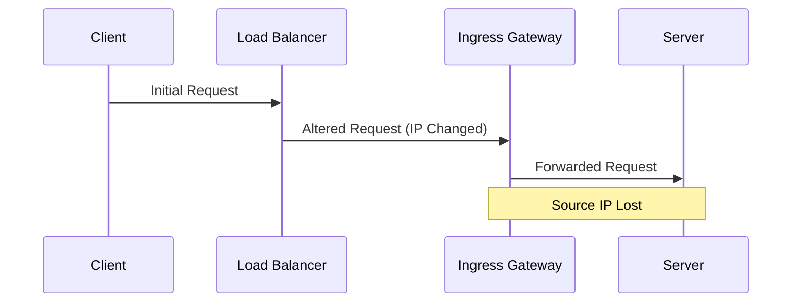
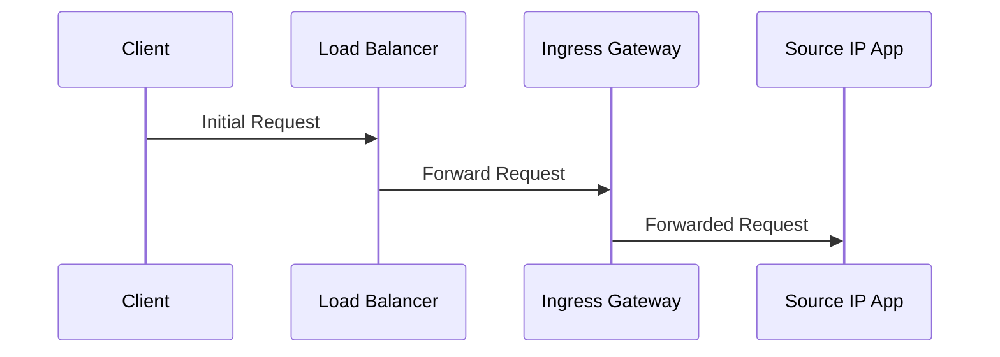
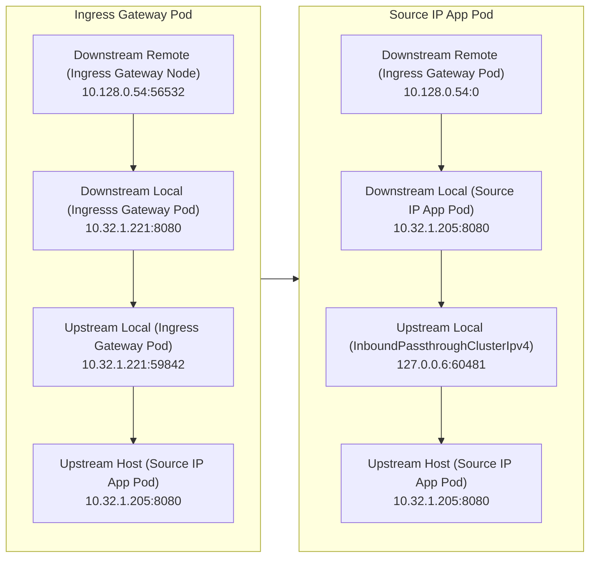
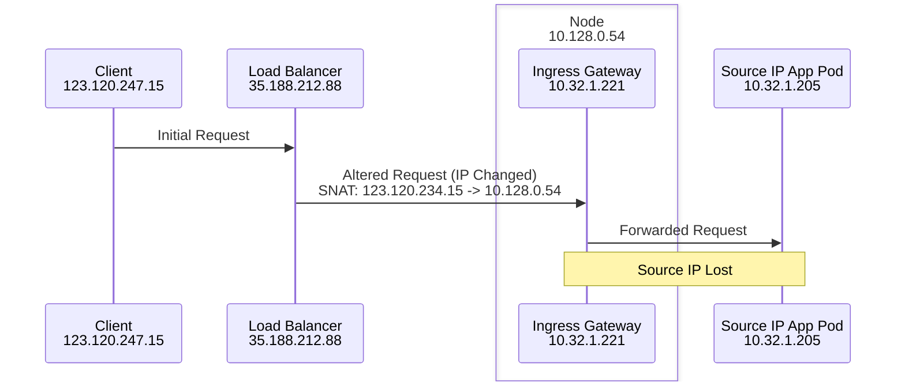
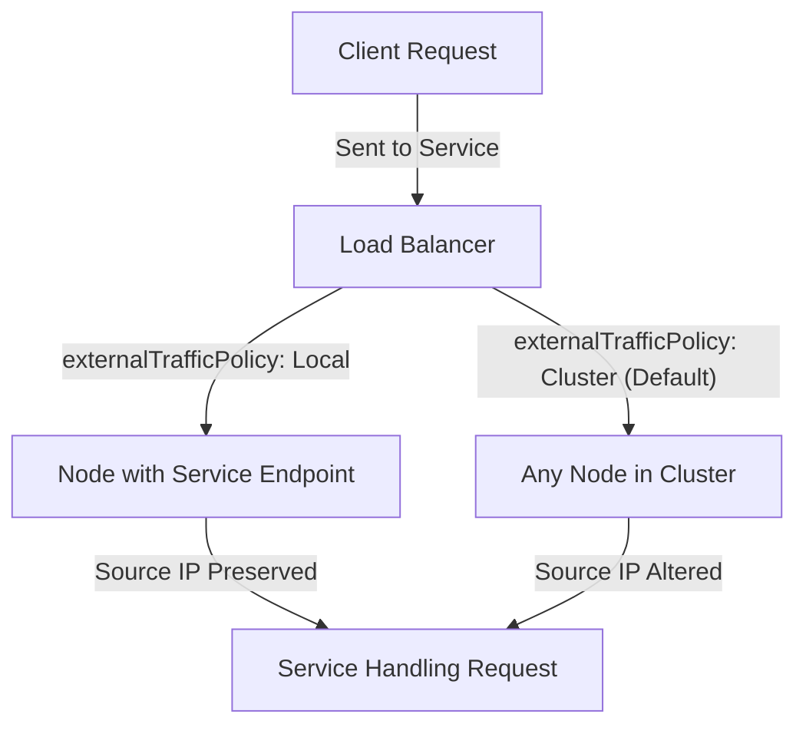
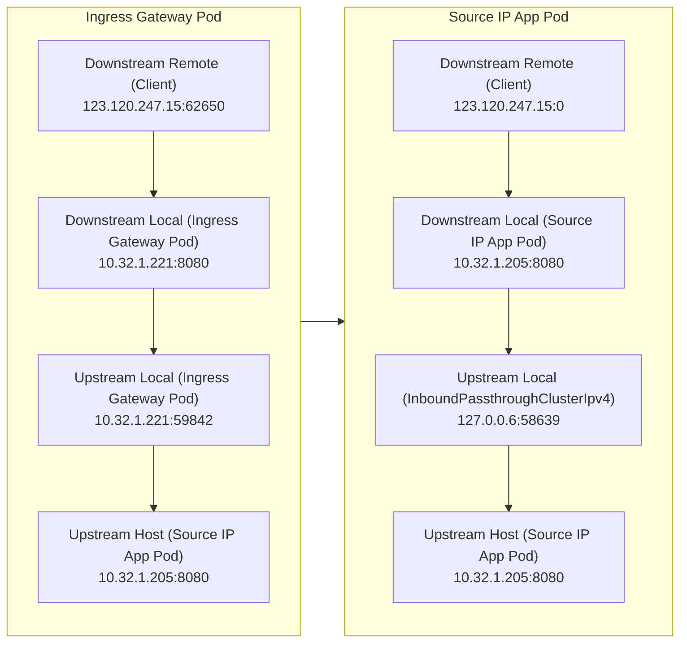
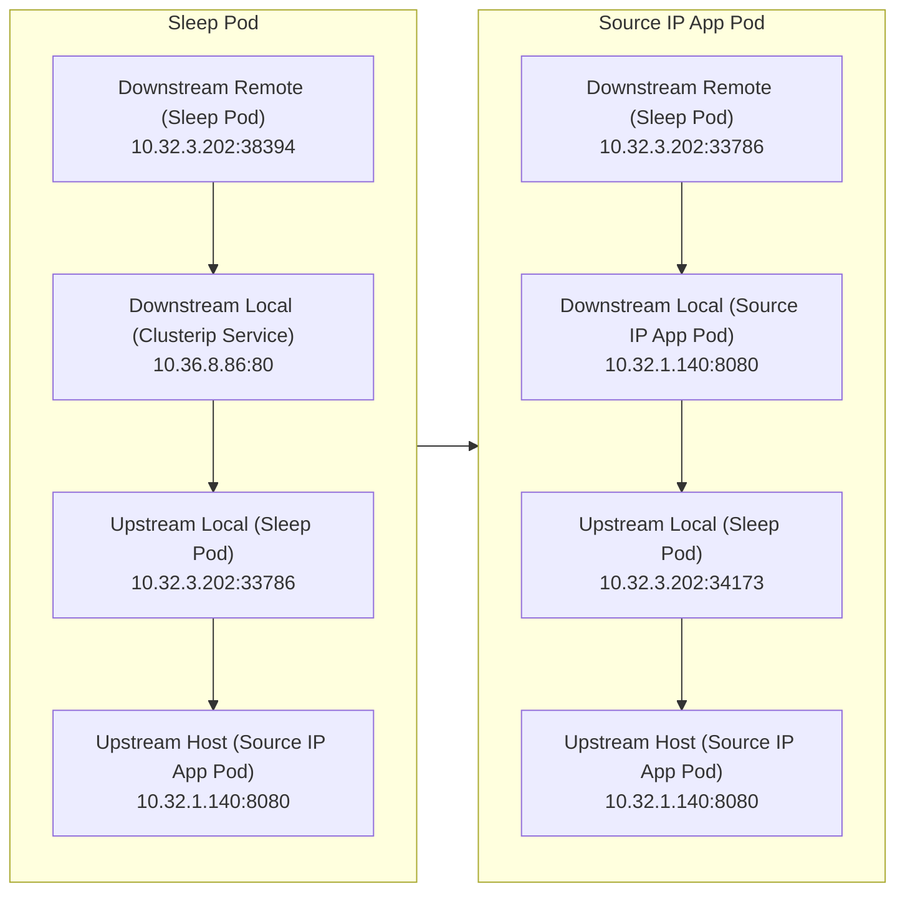
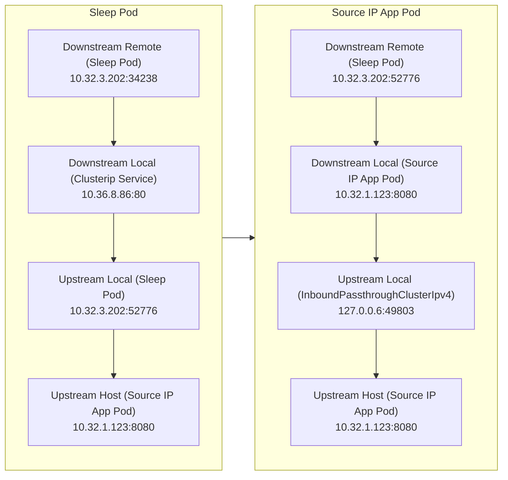
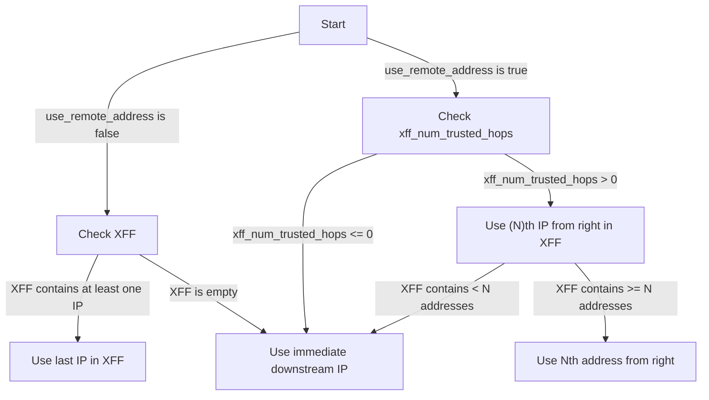
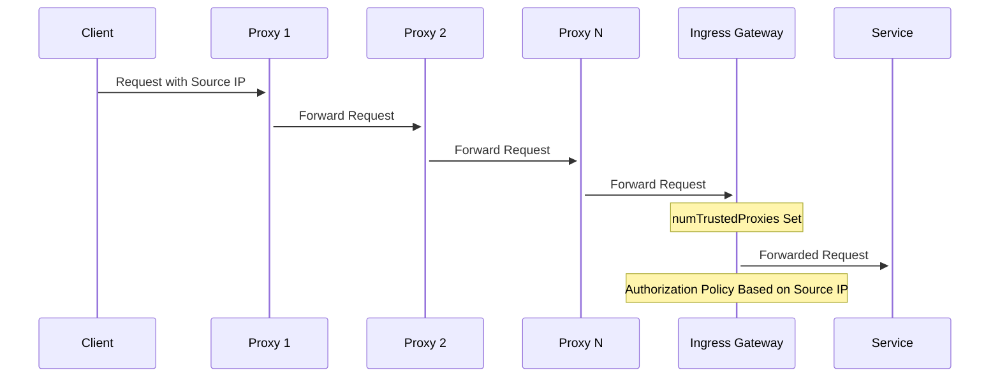

本博文解析了在 Istio 服务网格中服务端获取客户端源 IP 的挑战，并提供了解决方案。将探讨以下问题：

- 数据包传输中源 IP 丢失的原因；
- 如何确定客户端源 IP；
- 在南北向和东西向请求中传递源 IP 的策略；
- 针对 HTTP 和 TCP 协议的处理方法。

## 源 IP 保留的重要性

保留客户端源 IP 的主要理由包括：

- **访问控制策略**：基于源 IP 执行身份验证或安全策略；
- **负载均衡**：实现基于客户端 IP 的请求路由；
- **数据分析**：包含真实源地址的访问日志和监控指标，助力开发人员进行分析。

## 保留源 IP 的含义

保留源 IP 指的是在请求从客户端发出、经过负载均衡器或反向代理后，避免真实的客户端源 IP 被替换的情况。

以下是源 IP 地址丢失的流程示例：



上面图只是最常见的一种情况。本文考虑到以下几种情况：

1. 南北向流量：客户端通过负载均衡器（网关）访问服务端
   1. 只有一层网关
   2. 两层或两层以上网关
2. 东西向流量：网格内部的服务间访问
3. 协议：HTTP 和 TCP

## 如何确认客户端源 IP？

在 Istio 服务网格中，Envoy 代理通常会将客户端 IP 添加到 HTTP 请求的 "X-Forwarded-For" 头部中。以下是确认客户端 IP 的步骤：

1. **检查 x-forwarded-for 头部**：包含请求路径上各代理的 IP 地址。
2. **选择最后一个 IP**：通常，最后一个 IP 是最接近服务器的客户端 IP。
3. **验证 IP 的可信性**：检查代理服务器的信任度。
4. **使用 x-envoy-external-address**：Envoy 可以设置此头部，包含客户端真实 IP。

详情请见 Envoy 文档中对 [`x-forwarded-for` 标头](https://www.envoyproxy.io/docs/envoy/latest/configuration/http/http_conn_man/headers#config-http-conn-man-headers-x-forwarded-for)的说明。对于 TCP/IP 连接，可以通过协议字段解析客户端 IP。

## 测试环境

**GKE**

- Client Version: v1.28.4
- Kustomize Version: v5.0.4-0.20230601165947-6ce0bf390ce3
- Server Version: v1.27.7-gke.1121000

**Istio**

- client version: 1.20.1
- control plane version: 1.20.1
- data plane version: 1.20.1 (12 proxies)

**CNI**

我们使用了 Cilium CNI，但是没有开启无 kube-proxy 模式。

- cilium-cli: v0.15.18 compiled with go1.21.5 on darwin/amd64
- cilium image (default): v1.14.4
- cilium image (stable): unknown
- cilium image (running): 1.14.5

**Node**

| 节点名称                                | 内部 IP     | 备注                         |
| --------------------------------------- | ----------- | ---------------------------- |
| gke-cluster1-default-pool-5e4152ba-t5h3 | 10.128.0.53 |                              |
| gke-cluster1-default-pool-5e4152ba-ubc9 | 10.128.0.52 |                              |
| gke-cluster1-default-pool-5e4152ba-yzbg | 10.128.0.54 | Ingress Gateway Pod 所在节点 |

执行测试的本地客户端电脑的公网 IP：123.120.247.15

## 部署测试示例

下图展示了测试方式：



首先参考 [Istio 文档](https://istio.io/latest/docs/setup/install/)部署 Istio，然后为 default 命名空间开启 sidecar 自动注入：

```bash
kubectl label namespace default istio-injection=enabled
```

在 Istio 中部署 echo-server 应用测试。echo-server 是一个基于 Nginx 的服务器，用于回显客户端发送的请求信息，例如请求头、客户端地址、请求方法等。

```bash
kubectl create deployment echo-server --image=registry.k8s.io/echoserver:1.4
kubectl expose deployment echo-server --name=clusterip --port=80 --target-port=8080
```

创建 Ingress Gateway：

```bash
cat>config.yaml<<EOF
apiVersion: networking.istio.io/v1beta1
kind: Gateway
metadata:
  name: clusterip-gateway
spec:
  selector:
    istio: ingressgateway # 根据你的环境选择适当的 selector
  servers:
    - port:
        number: 80
        name: http
        protocol: HTTP
      hosts:
        - "clusterip.jimmysong.io" # 替换成你想要使用的主机名
---
apiVersion:  networking.istio.io/v1beta1
kind: VirtualService
metadata:
  name: clusterip-virtualservice
spec:
  hosts:
    - "clusterip.jimmysong.io" # 替换成与 Gateway 中相同的主机名
  gateways:
    - clusterip-gateway # 这里使用 Gateway 的名称
  http:
    - route:
        - destination:
            host: clusterip.default.svc.cluster.local # 替换成你的 Service 的实际主机名
            port:
              number: 80 # Service 的端口
EOF
kubectl apply -f config.yaml
```

查看 Ingress Gateway 中的 Envoy 日志：

```bash
kubectl logs -f deployment/istio-ingressgateway -n istio-system
```

查看 Sleep Pod 中的 Envoy 日志：

```bash
kubectl logs -f deployment/sleep -n default -c istio-proxy
```

查看 Source IP App 中的 Envoy 日志：

```bash
kubectl logs -f deployment/echo-server -n default -c istio-proxy
```

获取网关公网 IP：

```bash
export GATEWAY_IP=$(kubectl -n istio-system get service istio-ingressgateway -o jsonpath='{.status.loadBalancer.ingress[0].ip}')
```

在本地使用 curl 测试：

```bash
curl -H "Host: clusterip.jimmysong.io" $GATEWAY_IP
```

### 资源 IP

当部署好测试应用后，你需要获取与以下资源的 IP 地址。在接下来的实验环节中将会用到。

**Pod**

下面是初始状况下的 Pod IP，随着对 Deployment 的补丁，Pod 会重建，名称和 IP 地址都会变。

| Pod 名称                              | Pod IP      |
| ------------------------------------- | ----------- |
| echo-server-6d9f5d97d7-fznrq          | 10.32.1.205 |
| sleep-9454cc476-2dskx                 | 10.32.3.202 |
| istio-ingressgateway-6c96bdcd74-zh46d | 10.32.1.221 |

**Service**

| Service 名称         | Cluster IP  | External IP   |
| -------------------- | ----------- | ------------- |
| clusterip            | 10.36.8.86  | -             |
| sleep                | 10.36.14.12 | -             |
| istio-ingressgateway | 10.36.4.127 | 35.188.212.88 |

## 南北向流量

我们首先考虑客户端位于 Kubernetes 集群外，通过负载均衡器来访问集群内部服务的情况。

### 测试 1：Cluster 流量策略、iptables 流量劫持

这是通过以上步骤部署完测试应用后的默认情况，也是大家遇到的所谓的源 IP 地址丢失的情况。

curl 测试：

```bash
curl -H "Host: clusterip.jimmysong.io" $GATEWAY_IP
```




CLIENT VALUES:
client_address=127.0.0.6
command=GET
real path=/
query=nil
request_version=1.1
request_uri=http://clusterip.jimmysong.io:8080/

SERVER VALUES:
server_version=nginx: 1.10.0 - lua: 10001

HEADERS RECEIVED:
accept=*/*
host=clusterip.jimmysong.io
user-agent=curl/8.4.0
x-b3-parentspanid=03c124c5f910001a
x-b3-sampled=1
x-b3-spanid=103dc912ec14f3b4
x-b3-traceid=140ffa034822077f03c124c5f910001a
x-envoy-attempt-count=1
x-envoy-internal=true
x-forwarded-client-cert=By=spiffe://cluster.local/ns/default/sa/default;Hash=79253e34e1c28d389e9bfb1a62ffe8944b2c3c369b46bf4a9faf055b55dedb7f;Subject="";URI=spiffe://cluster.local/ns/istio-system/sa/istio-ingressgateway-service-account
x-forwarded-for=10.128.0.54
x-forwarded-proto=http
x-request-id=b3c05e22-594e-98da-ab23-da711a8f53ec
BODY:
-no body in request-




你只需要关注 `client_address` 和 `x-forwarded-for` 这两个结果即可。下文的 curl 测试结果中将省略其他信息。



该结果中字段的含义：

- `client_address`：通过解析 TCP/IP 协议而获取的客户端 IP 地址，在 Envoy 中称为 remote address。
- `x-forwarded-for`：`x-forwarded-for` (XFF) 是一个标准的代理头部，用于指示请求在从客户端到服务器的过程中经过的 IP 地址。一个合规的代理会在代理请求之前将最近客户端的 IP 地址添加到 XFF 列表中。详见 [Envoy 文档](https://www.envoyproxy.io/docs/envoy/latest/configuration/http/http_conn_man/headers#x-forwarded-for)。



从测试结果中我们可以看出，源 IP 地址变成了 Ingress  Gateway  Pod 所在节点的 IP 地址（`10.128.0.54`）。

下图展示是两个 Pod 中的数据包流量路径。



对于这种情况，要想保留源 IP 其实很简单，而且也是 Kubernetes 提供的标准选项。

### 源 IP 地址是如何丢失的？

下图展示客户端的源 IP 是如何在请求过程中丢失的。



因为负载均衡器将数据包发送到 Kubernetes 集群中的任意节点，在此过程中会进行 SNAT，导致最终发送到 Server Pod 中的客户端源 IP 丢失。

### 如何保留客户端源 IP

你可以通过设置 service 中的 `externalTrafficPolicy` 字段为 `Cluster` 控制负载均衡器保留源 IP。

**externalTrafficPolicy**

`externalTrafficPolicy` 是一个[标准 Service 选项](https://kubernetes.io/docs/tasks/access-application-cluster/create-external-load-balancer/#preserving-the-client-source-ip)，用于定义传入 Kubernetes 节点的流量是否进行负载均衡以及如何进行负载均衡。`Cluster` 是默认策略，但 `Local` 通常用于保留传入集群节点的流量的来源 IP。`Local` 会在集群节点上有效停用负载均衡，以使本地 Pod 接收的流量看到原始来源 IP 地址。



也就是说将 `externalTrafficPolicy` 设置为 `Local` 就可以让数据包绕过节点上的 kube-proxy，而直达目标 Pod。但是大多数人在 Kubernetes 中创建 Service 时都没有设置 `externalTrafficPolicy`，所以使用了默认的 `Cluster` 策略。

既然 Service 采用 Local 外部流量策略可以保留客户端的源 IP 地址，那为什么 Kubernetes 不默认采用呢？



通过 Local 模式暴露服务以获取客户端源 IP 是一种对可靠性的妥协，如果大家有更好的方案欢迎推荐给我。



Kubernetes 默认将 Service 的 `externalTrafficPolicy` 设置为 `Cluster` 而非 `Local`，主要是基于以下考虑：

1. **负载均衡**：确保流量在所有节点之间平均分配，避免单个节点过载。
2. **高可用性**：允许流量被集群中任何节点接收，提高服务的可用性。
3. **简化配置**：`Cluster` 模式降低了网络配置的复杂性。
4. **性能优化**：避免由于保留客户端源 IP 而引起的潜在性能问题。
5. **通用性**：兼容多种网络环境和集群配置，适应更广泛的使用场景。

### 测试 2：Local 流量策略、iptables 流量劫持

将 Ingress Gateway Service  设置为 Local 外部流量策略：

```bash
kubectl patch svc istio-ingressgateway -p '{"spec":{"externalTrafficPolicy":"Local"}}' -n istio-system
```

Curl 测试：

```bash
curl -H "Host: clusterip.jimmysong.io" $GATEWAY_IP
```




CLIENT VALUES:
client_address=127.0.0.6
command=GET
real path=/
query=nil
request_version=1.1
request_uri=http://clusterip.jimmysong.io:8080/

SERVER VALUES:
server_version=nginx: 1.10.0 - lua: 10001

HEADERS RECEIVED:
accept=*/*
host=clusterip.jimmysong.io
user-agent=curl/8.4.0
x-b3-parentspanid=060c393adb561603
x-b3-sampled=1
x-b3-spanid=8df3e10078cc826b
x-b3-traceid=cf26040ae9536702060c393adb561603
x-envoy-attempt-count=1
x-envoy-external-address=123.120.247.15
x-forwarded-client-cert=By=spiffe://cluster.local/ns/default/sa/default;Hash=79253e34e1c28d389e9bfb1a62ffe8944b2c3c369b46bf4a9faf055b55dedb7f;Subject="";URI=spiffe://cluster.local/ns/istio-system/sa/istio-ingressgateway-service-account
x-forwarded-for=123.120.247.15
x-forwarded-proto=http
x-request-id=35bc2123-0971-9a9c-84c1-2aeee233a268
BODY:
-no body in request-



通过 Envoy 日志可以得出现在的数据包路径：



客户端源 IP 被正确识别为 `123.120.247.15`。

## 东西向流量

在 Istio 默认配置的情况下，对于东西向流量，服务端也无法获取正确的客户端源 IP。

### 测试 3：Local 流量策略、tproxy 流量劫持

将 Source IP App 中的流量拦截方式从 iptables 修改为 [tproxy](https://jimmysong.io/blog/what-is-tproxy/)：

```bash
kubectl patch deployment -n default echo-server -p '{"spec":{"template":{"metadata":{"annotations":{"sidecar.istio.io/interceptionMode":"TPROXY"}}}}}'
```

注意：此时 Source IP App 的 Pod 将会重建，新的 Pod 名称是 `echo-server-686d564647-r7nlq`，IP 地址是 10.32.1.140。

Curl 测试：

```bash
kubectl exec -it deployment/sleep -it -- curl clusterip
```



CLIENT VALUES:
client_address=10.32.3.202
command=GET
real path=/
query=nil
request_version=1.1
request_uri=http://clusterip:8080/

SERVER VALUES:
server_version=nginx: 1.10.0 - lua: 10001

HEADERS RECEIVED:
accept=*/*
host=clusterip
user-agent=curl/8.5.0
x-b3-parentspanid=3c07f3b87cc547dd
x-b3-sampled=1
x-b3-spanid=97844ebdde748bfc
x-b3-traceid=90f57b0fb260dfbf3c07f3b87cc547dd
x-envoy-attempt-count=1
x-forwarded-client-cert=By=spiffe://cluster.local/ns/default/sa/default;Hash=25af59fcf9fbe745eb75a318c47d55059d75914632d2536a43a80d342eaed27c;Subject="";URI=spiffe://cluster.local/ns/default/sa/sleep
x-forwarded-proto=http
x-request-id=e9b27bde-3cf6-9d8b-8f23-1cb0fa35d405
BODY:
-no body in request-



下图展示了数据包路径：



客户端 IP 被正确识别为 `10.32.3.202`。

### 测试 4：Local 流量策略、iptables 流量劫持

将 Source IP App 中的流量拦截方式恢复为 redirect：

```bash
kubectl patch deployment -n default echo-server -p '{"spec":{"template":{"metadata":{"annotations":{"sidecar.istio.io/interceptionMode":"REDIRECT"}}}}}'
```

注意：此时 Source IP App 的 Pod 将会重建，新的 Pod 名称是 `echo-server-6d9f5d97d7-bgpk6`，IP 地址是 10.32.1.123。

Curl 测试：

```bash
kubectl exec -it deployment/sleep -it -- curl clusterip
```



CLIENT VALUES:
client_address=127.0.0.6
command=GET
real path=/
query=nil
request_version=1.1
request_uri=http://clusterip:8080/

SERVER VALUES:
server_version=nginx: 1.10.0 - lua: 10001

HEADERS RECEIVED:
accept=*/*
host=clusterip
user-agent=curl/8.5.0
x-b3-parentspanid=6123380e58ca0ce7
x-b3-sampled=1
x-b3-spanid=633848c0065ec91e
x-b3-traceid=dbcda8b3673e70a46123380e58ca0ce7
x-envoy-attempt-count=1
x-forwarded-client-cert=By=spiffe://cluster.local/ns/default/sa/default;Hash=25af59fcf9fbe745eb75a318c47d55059d75914632d2536a43a80d342eaed27c;Subject="";URI=spiffe://cluster.local/ns/default/sa/sleep
x-forwarded-proto=http
x-request-id=b05e07e1-08ba-9449-90a9-a4a98277a8c0
BODY:
-no body in request-



下图展示了数据包路径：



客户端源 IP 被识别为 `127.0.0.6`。

## 单层代理场景总结

在单层代理的情况下，只需要将 Ingress Gateway 的 Service 的 `externalTrafficPolicy` 设置为 `Local` 即可保留客户端源 IP。将目标服务的流量拦截模式修改为 `TPROXY` 即可以保留东西向请求中的源 IP。

## 多层代理

如果流量在进入 Istio Mesh 前已经经过的多层代理转发，每次流量经过代理时，代理解析 HTTP 流量并将其自身的 IP 地址追加到 `x-forwarded-for` 标头中。那么可以使用 `numTrustedProxies` 配置您信任的代理跳数，请参考 [Envoy 文档](https://www.envoyproxy.io/docs/envoy/latest/configuration/http/http_conn_man/headers#x-forwarded-for) 了解如何确定 `X-Forwarded-For` 标头和受信任的客户端地址。

实际上我们很难确定流量在到达 Istio Mesh 时究竟经过了几层代理，但你可以根据 `x-forwarded-for` 标头了解流量的转发路径。

下图展示了 Envoy 如何根据 `x-forwarded-for` 标头和 `xff_num_trusted_hops`（对应 Istio 中的 `numTrustedProxies` 配置）来确认源 IP 的流程。详见 [Envoy 文档](https://www.envoyproxy.io/docs/envoy/latest/configuration/http/http_conn_man/headers#x-forwarded-for)。



执行下面的命令为入口网关开启受信代理数量配置：

```bash
kubectl patch deployment istio-ingressgateway -n istio-system -p '{"spec":{"template":{"metadata":{"annotations":{"proxy.istio.io/config":"{\"gatewayTopology\":{\"numTrustedProxies\": 2,\"forwardClientCertDetails\":\"SANITIZE_SET\"}}"}}}}}'
```

当 Istio Gateway 收到这个请求时，它将 `X-Envoy-External-Address` 头设置为您 curl 命令中 `X-Forwarded-For` 头中的倒数第二个地址（`numTrustedProxies: 2`）。根据 Istio 的文档，Gateway 在将其转发到服务端负载之前，会将自己的 IP 附加到 `X-Forwarded-For` 头中。但实际情况是标头中只有客户端源 IP 和 External Gateway Pod IP。

你可以执行下面的命令取消这个补丁：

```bash
kubectl patch deployment istio-ingressgateway -n istio-system -p '{"spec":{"template":{"metadata":{"annotations":{"proxy.istio.io/config":"{}"}}}}}'
```

## TCP 流量

上文所说的使用标头获取客户端源 IP 的方式只适用于 L7 网络，对于 L4 网络的 TCP 流量可以使用 Proxy 协议。

Proxy 协议是一种网络协议，它在 TCP 连接的起始处添加了一个协议头部，用于传递连接过程中的一些元数据，如客户端的真实 IP 地址和端口号。这对于在负载均衡器（LB）后部署的应用程序非常有用，因为负载均衡器通常会更改客户端的原始 IP 地址成 LB 的地址，导致服务端无法知晓客户端的真实 IP。很多代理软件都支持 Proxy Protocol，比如 [Envoy](https://www.envoyproxy.io/docs/envoy/latest/configuration/listeners/listener_filters/proxy_protocol) 和 HAProxy、NGINX 等。

你可以使用下面的命令为 Ingress Gateway 打上补丁，以支持 Proxy 协议：

```
kubectl patch deployment istio-ingressgateway -n istio-system -p '{"spec":{"template":{"metadata":{"annotations":{"proxy.istio.io/config":"{\\"gatewayTopology\\":{\\"proxyProtocol\\":{}}}"}}}}}'
```

注意：不是所有的公有云中的 Kubernetes  中 `LoadBalancer` 类型的 Service 创建的的负载均衡器都支持该配置。比如 GKE 中就不支持。在 AWS NLB 中开启 Proxy 协议请参考[该博客](https://istio.io/latest/blog/2020/show-source-ip/)。

Envoy 并不建议使用 Proxy 协议，因为它：

- 只支持 TCP 协议
- 必须上游主机支持
- 可能影响性能

关于 Envoy 对 Proxy 协议的支持请参考[该文档](https://www.envoyproxy.io/docs/envoy/latest/intro/arch_overview/other_features/ip_transparency#proxy-protocol)。

## 应用场景示例

下面是常见的两个源 IP 地址的应用场景。

### 基于源 IP 地址的访问控制

在 Istio 的入口网关配置基于源 IP 的访问控制策略。这通过设置入口网关的授权策略，根据源 IP 地址实现访问限制。

下图展示了基于源 IP 地址的访问控制流程图。



#### 场景假设

假设请求经过三个代理，其 IP 地址分别为 `1.1.1.1`、`2.2.2.2` 和 `3.3.3.3`。在 Ingress Gateway 中，`numTrustedProxies` 被设置为 2，因此 Istio 信任的源 IP 为 `2.2.2.2`（即 `x-envoy-external-address`）。

```bash
curl -H "Host: clusterip.jimmysong.io" -H 'X-Forwarded-For: 1.1.1.1,2.2.2.2,3.3.3.3' $GATEWAY_IP
```

#### 屏蔽特定源 IP

若需屏蔽来自 `2.2.2.2` 的请求，可以使用以下授权策略：

```yaml
apiVersion: security.istio.io/v1
kind: AuthorizationPolicy
metadata:
  name: ingress-policy
  namespace: istio-system
spec:
  selector:
    matchLabels:
      app: istio-ingressgateway
  action: DENY
  rules:
    - from:
        - source:
            remoteIpBlocks:
            - "2.2.2.2/24"
```

#### 使用最终客户端 IP

如果希望识别与 Istio Mesh 直连的客户端 IP（即 `x-forwarded-for` 中的最后一个 IP，例如 `123.120.234.15`），则需要用 `ipBlocks` 配置：

```yaml
apiVersion: security.istio.io/v1
kind: AuthorizationPolicy
metadata:
  name: ingress-policy
  namespace: istio-system
spec:
  selector:
    matchLabels:
      app: istio-ingressgateway
  action: DENY
  rules:
    - from:
        - source:
            ipBlocks:
            - "123.120.234.15/24"
```

这种方法通过配置 Istio 的入口网关授权策略，可以有效地实现基于源 IP 的访问控制。它允许管理员根据不同的需求（如屏蔽特定 IP 或信任最终客户端 IP）灵活设定规则，从而增强了服务的安全性和灵活性。

### 基于源 IP 地址的负载均衡

要在 Istio 中根据源 IP 地址配置负载均衡策略，你需要使用 `DestinationRule` 资源，并指定 `LOAD_BALANCER_POLICY_CONSISTENT_HASH` 策略。这种策略允许您根据一致性哈希算法为流量分配目标，可以基于源 IP 地址来实现会话亲和性（session affinity），确保来自同一源 IP 的请求被路由到相同的目标。

#### 源 IP 地址负载均衡示例

下面是一个示例配置，展示了如何使用 `DestinationRule` 来根据源 IP 地址实现负载均衡：

```yaml
apiVersion: networking.istio.io/v1alpha3
kind: DestinationRule
metadata:
  name: example-destination-rule
spec:
  host: example-service
  trafficPolicy:
    loadBalancer:
      consistentHash:
        httpHeaderName: x-forwarded-for # 这通常包含源 IP 地址，适用于经过代理或负载均衡器转发的流量。
```

注意，如果直接连接到 Istio Ingress Gateway 而不经过其他代理，你可能需要根据实际情况调整 `httpHeaderName` 或使用其他哈希键，例如 `useSourceIp`，如下所示：

```yaml
spec:
  trafficPolicy:
    loadBalancer:
      consistentHash:
        useSourceIp: true
```



- 使用源 IP 地址作为负载均衡的键时，请确保您理解这可能如何影响流量分布，特别是在源 IP 地址分布不均匀的情况下。
- 正如上文所述，在某些环境中，原始的源 IP 可能会被网络设备（如负载均衡器或 NAT 设备）修改，需要确保 `x-forwarded-for` 头或其他相应机制能准确反映原始的客户端 IP。



## 总结

- 保留源 IP 对于实施访问控制、负载均衡和数据分析至关重要。
- Envoy 代理使用 `X-Forwarded-For` 头部来处理 HTTP 请求中的客户端源 IP。
- 通过设置 `externalTrafficPolicy` 和选择合适的流量劫持方式（`REDIRECT` 或 `TPROXY`），可以在南北向和东西向流量中正确获取客户端源 IP。
- 处理经过多层代理的流量时，`numTrustedProxies` 配置是关键。
- 对于 TCP 流量，Proxy 协议是一个有效的解决方案。

## 参考

- [x-forwarded-for - envoyproxy.io](https://www.envoyproxy.io/docs/envoy/latest/configuration/http/http_conn_man/headers#x-forwarded-for)
- [Proxy protocol on AWS NLB and Istio ingress gateway - istio.io](https://istio.io/latest/blog/2020/show-source-ip/)
- [Configuring Gateway Network Topology - istio.io](https://istio.io/latest/docs/ops/configuration/traffic-management/network-topologies/)
- [IP Transparency - envoyproxy.io](https://www.envoyproxy.io/docs/envoy/latest/intro/arch_overview/other_features/ip_transparency)
- [Using Source IP - kubernetes.io](https://kubernetes.io/docs/tutorials/services/source-ip/)
- [Proxy Protocol - github.com](https://github.com/haproxy/haproxy/blob/master/doc/proxy-protocol.txt)
