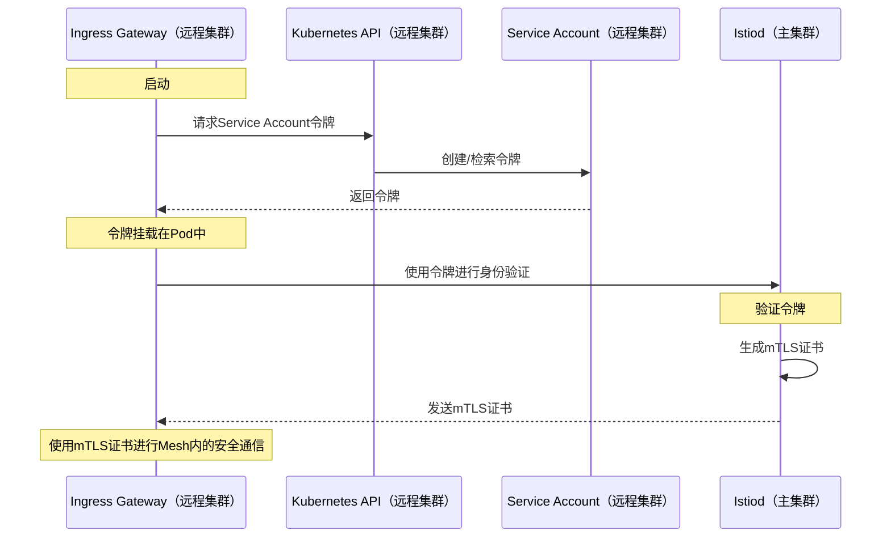

## 前言

我经常在 [Istio 的 GitHub Discussions](https://github.com/istio/istio/discussions) 上回答网友的问题，最近我遇到了一个关于 Istio 主 - 远程部署的[讨论](https://github.com/istio/istio/discussions/48343)，问题是关于远程集群中网关如何最初验证到外部 Istiod 实例的。这个问题触及到服务网格在多集群配置中的核心安全机制，我认为这值得在社区中进行更深入的分享。

## 正文

在 Istio 官方的[不同网络上安装 Primary-Remote](https://istio.io/latest/docs/setup/install/multicluster/primary-remote_multi-network/)文档中，有一个步骤是[将 cluster2 作为 cluster1 的远程集群进行附加](https://istio.io/latest/docs/setup/install/multicluster/primary-remote_multi-network/#attach-cluster2-as-a-remote-cluster-of-cluster1)。这个过程中会创建一个包含 kubeconfig 配置的 Secret，这个配置文件中含有访问远程集群（cluster2）所需的证书和令牌。

```yaml
# 这个文件是自动生成的，请不要编辑。
apiVersion: v1
kind: Secret
metadata:
  annotations:
    networking.istio.io/cluster: cluster2
  creationTimestamp: null
  labels:
    istio/multiCluster: "true"
  name: istio-remote-secret-cluster2
  namespace: istio-system
stringData:
  cluster2: |
    apiVersion: v1
    clusters:
    - cluster:
        certificate-authority-data: {CERTIFICATE}
        server: {CLUSTER2-APISERVER-ADDRESS}
      name: cluster2
    contexts:
    - context:
        cluster: cluster2
        user: cluster2
      name: cluster2
    current-context: cluster2
    kind: Config
    preferences: {}
    users:
    - name: cluster2
      user:
        token: {TOKEN}
```

这个 Secret 的关键作用是让主集群（cluster1）中的 Istio 能够访问远程集群的 API 服务器，从而获得服务信息。此外，远程集群（cluster2）中的 Istiod 服务，通过端点指向主集群中 Istiod 服务的 LoadBalancer IP（端口 15012 和 15017），使得 cluster2 能够通过 Istiod 与主集群进行通信。

因为这两个集群共用一个 CA（由主集群提供），并且远程集群能够访问自己的 API 服务器，所以主集群中的 Istiod 可以验证来自远程集群（cluster2）的请求。下面的序列图清晰地展示了这一过程：



这一过程是 Istio 多集群配置中的关键一环，确保了服务网格中跨集群通信的安全性。正如我们在这次讨论中看到的，无论是远程网关还是服务都依赖于主集群的 CA 来进行初始的 mTLS 认证，这为整个服务网格的安全通信提供了坚实的基础。

## 总结

在本篇博客中，我们探讨了在 Istio 主 - 远程部署中，远程集群的网关如何进行初始验证以连接到外部的 Istiod。我们解释了如何通过创建一个含有 kubeconfig 的 Secret 来允许主集群的 Istio 访问远程集群的 API，以及如何通过共享的 CA 和服务账户令牌来确保 mTLS 认证的安全性。这一过程确保了服务网格中的跨集群通信的安全，为理解和实施 Istio 的多集群配置提供了重要的见解。
