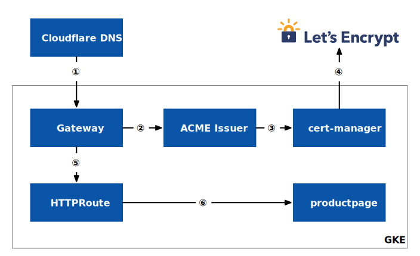

本文将以 Bookinfo 应用为例，为 Istio 的入口网关设置一个真实的 TLS/SSL 证书。我们将使用 Let's Encrypt、cert-manager 来管理 Istio 中入口网关的证书。

## 准备 {#prerequisite}

请先参考 [Istio 文档](https://istio.io/latest/zh/docs/setup/)安装 Istio 和 [Bookinfo 应用](https://istio.io/latest/zh/docs/examples/bookinfo/)，笔者在 GKE 中安装了 Istio 1.16。

本文中安装的各组件版本信息如下：

- Kubernetes 1.24.7
- Istio 1.16
- Gateway API 0.5.1
- cert-manager 1.10.1

## 架构 {#arch}

本实验中包含以下关键组件：

- 使用 Cloudflare 提供 DNS 解析
- 使用 Let's Encrypt 创建证书
- 使用 cert-manager 自动申请和续期证书
- 使用 Gateway API 来创建入口网关
- 所有组件部署在 GKE 中

图 1 展示了本实验的架构以及流量路由过程。



流量路由过程如下：

1. 在 Gateway 创建完成后通过 LoadBalancer 暴露网关 IP，将该 IP 配置在 DNS 解析记录中；
2. Gateway 通过注解引用 [ACME Issuer](https://cert-manager.io/docs/configuration/acme/)；
3. ACME Issuer 向 cert-manager 发送请求证书（[order 和 challenge](https://cert-manager.io/docs/concepts/acme-orders-challenges/)），并使用 [DNS01 Challenge Provider](https://cert-manager.io/docs/configuration/acme/dns01/)；
4. cert-manager 向 ACME 服务器 Let's Encrypt 请求证书并创建 Kubernetes Secret；
5. 在 Gateway 中通过应用 Secret 挂载 TLS 证书；
6. HTTPRoute 将入口流量路由到 productpage 服务；

## ACME Issuer

Istio 包含了开箱即用的 mTLS 支持，你也可以使用[自定义 CA](https://istio.io/latest/zh/docs/tasks/security/cert-management/plugin-ca-cert/) 或 [SPIRE](/blog/cert-manager-spire-istio/) 来管理集群内证书，但是对于入口网关的证书，就需要我们单独设置。你可以[手动为入口网关配置证书](https://istio.tetratelabs.io/zh/istio-in-practice/setting-up-ssl-certs/)，不过管理起来会比较麻烦，因为你需要负责证书的轮换以防止证书过期，或使用 [Let's Encrypt](https://letsencrypt.org/) 这样的 ACME Issuer 来自动化管理证书。

ACME (Automated Certificate Management Environment) Issuer 是一种认证机构，可以使用 ACME 协议为客户端申请和管理证书。ACME 是一种用于自动化 SSL/TLS 证书颁发和管理的开放协议。它通常用于网站或其他在线服务的证书管理，以确保安全连接。

Let's Encrypt 是一个非营利性的 ACME Issuer，可以为网站提供免费的 SSL/TLS 证书。它的目标是使加密技术普及化，并帮助提升网络安全水平。Let's Encrypt 使用 ACME 协议与客户端通信，可以为客户端申请和管理证书。ACME 协议是开放的，因此任何机构都可以成为 ACME Issuer，只要它们遵守 ACME 协议的规定。

## 详细步骤 {#details-steps}

1. 安装 Gateway API：

   ```bash
   kubectl apply -f https://github.com/kubernetes-sigs/gateway-api/releases/download/v0.5.1/standard-install.yaml
   ```

2. 安装 cert-manager

   ```bash
   kubectl apply -f https://gist.githubusercontent.com/rootsongjc/78487acdea70a3c27c1a1b794546d031/raw/0df08b91dfaff6412bbd891ccedffaa882a9a99f/cert-manager.yaml
   ```

   它为 cert-manager Deployment 增加了以下启动项：

   ```bash
   args:
     - --feature-gates=ExperimentalGatewayAPISupport=true
   ```

3. 在 [Cloudflare](https://dash.cloudflare.com/profile/api-tokens) 中创建一个名为 `lets-encrypt-token` 的 API token，自定义模板设置如下：

   Permissions：

   - `Zone - DNS - Edit`
   - `Zone - Zone - Read`

   Zone Resources:

   - `Include - All Zones`

   将该 token 存储在一个 Secret 中：

   ```yaml
   kubectl apply -n default -f - <<EOF
   apiVersion: v1
   kind: Secret
   metadata:
     name: cloudflare-api-token-secret
     namespace: istio-system
   type: Opaque
   stringData:
     api-token: <API Token>
   EOF
   ```

   

   本次实验中该 Token 实际上并没起到作用，正常情况下 cert-manager 会通过 Cloudflare API 与 Cloudflare 交互，为我们配置 DNS 记录。该问题还需要进一步排查。

   

4. 配置 Let's Encrypt  Issuer：

   ```bash
   kubectl apply -n default -f - <<EOF
   apiVersion: cert-manager.io/v1
   kind: Issuer
   metadata:
     name: letsencrypt
   spec:
     acme:
       email: rootsongjc@gmail.com
       server: https://acme-v02.api.letsencrypt.org/directory
       privateKeySecretRef:
         name: lets-encrypt-issuer-account-key
       solvers:
       - dns01:
           cloudflare:
             apiTokenSecretRef:
               name: cloudflare-api-token-secret
               key: api-token
         selector:
           dnsNames:
           - 'bookinfo.jimmysong.io'
   EOF
   ```

5. 配置 Gateway：

   ```bash
   kubectl apply -n default -f - <<EOF
   apiVersion: gateway.networking.k8s.io/v1beta1
   kind: Gateway
   metadata:
     name: bookinfo-gateway
     annotations:
       cert-manager.io/issuer: letsencrypt
   spec:
     gatewayClassName: istio
     listeners:
     - name: http
       hostname: bookinfo.jimmysong.io
       port: 443
       protocol: HTTPS
       allowedRoutes:
         namespaces:
           from: Same
       tls:
         mode: Terminate
         certificateRefs:
           kind: Secret
           group: ""
           name: bookinfo-tls
   EOF
   ```

   在 Gateway 创建完成后，会在 default 命名空间中创建一个网关 Pod 以及 LoadBalancer 资源的服务。

   查看 `default` 命名空间中的 Secret，你会发现 `bookinfo-tls`，它是由 cert-manager 创建的，查看该 Secret 中保存的证书，你将会看到由 Let's Encrypt 颁发的证书信任链：

   - `bookinfo.jimmysong.io` 
   - `ISRG Root X1`
   - `DST Root CA X3`

6. 配置 HTTPRoute：

   ```bash
   kubectl apply -n default -f - <<EOF
   apiVersion: gateway.networking.k8s.io/v1beta1
   kind: HTTPRoute
   metadata:
     name: bookinfo
   spec:
     parentRefs:
     - name: bookinfo-gateway
     rules:
     - matches:
       - path:
           type: Exact
           value: /productpage
       - path:
           type: PathPrefix
           value: /static
       - path:
           type: Exact
           value: /login
       - path:
           type: Exact
           value: /logout
       - path:
           type: PathPrefix
           value: /api/v1/products
       backendRefs:
       - name: productpage
         port: 9080
   EOF
   ```

7. 在 Cloudflare 中配置域名记录：将网关服务的外网 IP 及域名 `bookinfo.jimmysong.io` 添加到 Cloudflare 的 DNS 记录中就可以实现域名解析。

   

   本实验中发现网关 Pod 并没有挂载 `bookinfo-tls`  Secret 中的证书，我们只好通过 Cloudflare 来配置 TLS 证书：为网站开启全（严格）SSL/TLS，这将使用 Cloudflare 颁发的 TLS 证书。

   

8. 在浏览器中访问 <https://bookinfo.jimmysong.io/productpage> 就可以访问 bookinfo 应用了。

## 总结 {#summary}

本次实验虽然实现了网关的 TLS 加密，也为网关生成了 TLS 证书，但实际上网关使用的是 Cloudflare 颁发的证书。这并不是我们最初的目标，即使用 ACME Server（Let's Encrypt）为网关颁发的证书。为什么网关 Pod 没有挂载我们应用的 Secret 中的证书，Cloudflare DNS01 Challenge Provider 为什么没有生效，这两个问题还需要我们进一步调查。

## 参考 {#reference}

- [Acquire SSL Certificates In Kubernetes From Let’s Encrypt With Cert-Manager - thinktecture.com](https://www.thinktecture.com/en/kubernetes/ssl-certificates-with-cert-manager-in-kubernetes/)
- [How To Secure Kubernetes NGINX Ingress With Cert-Manager](https://getbetterdevops.io/k8s-ingress-with-letsencrypt/)
- [Securing gateway.networking.k8s.io Gateway Resources - cert-manager.io](https://cert-manager.io/docs/usage/gateway/)
