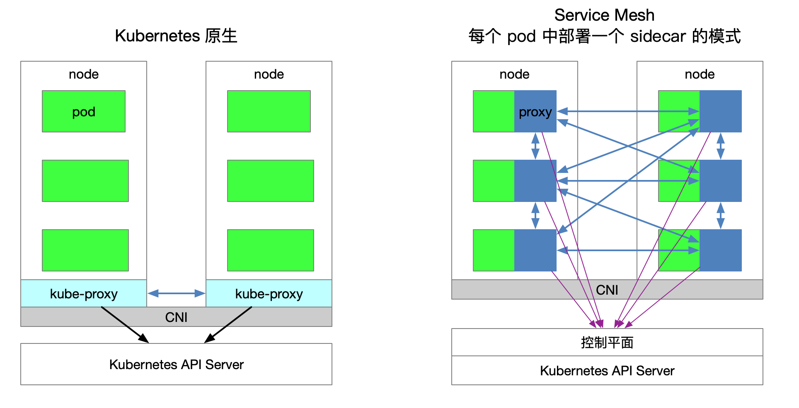
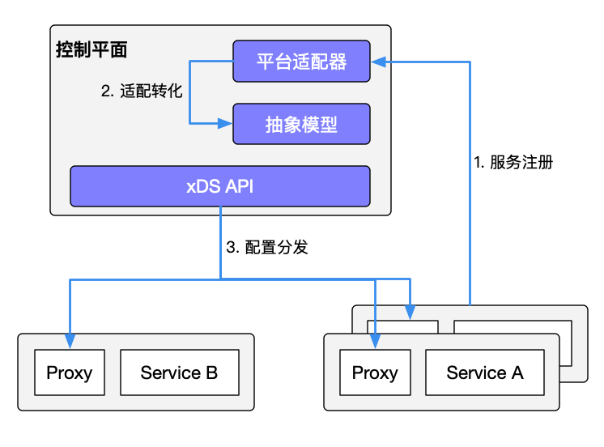
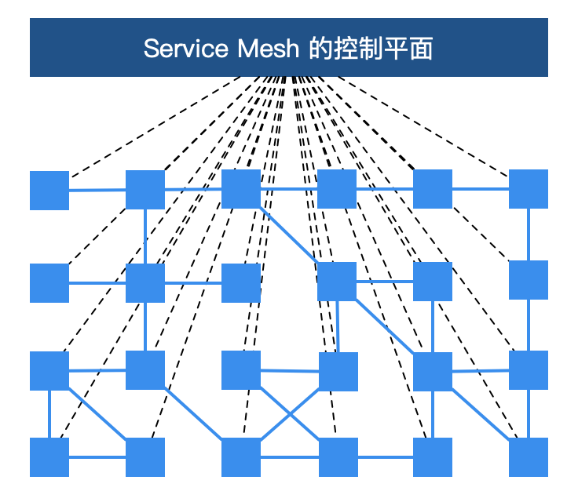
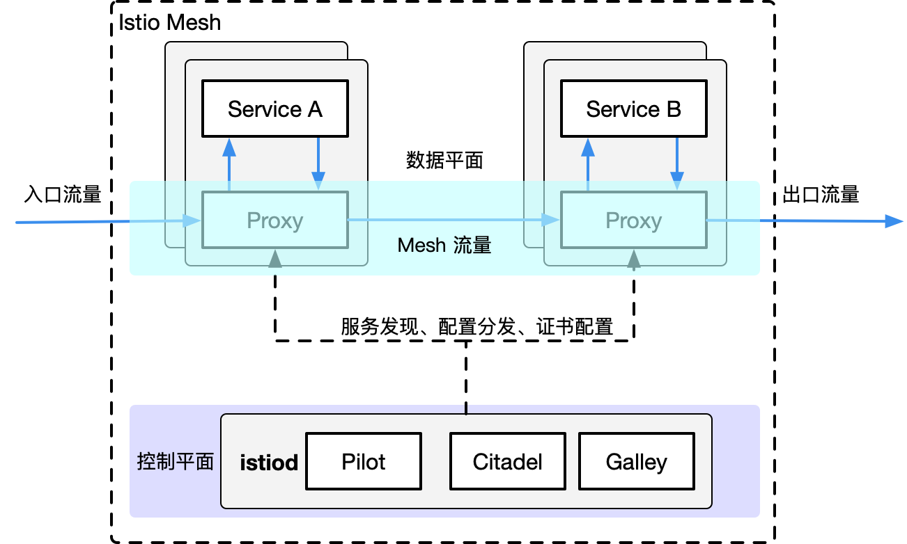

如果你刚听说 Service Mesh 不久，并试用过 [Istio](https://istio.io) 的话，那么你可能都会有下面几个疑问：

1. 为什么 Istio 要运行在 Kubernetes 上呢？
1. Kubernetes 和 Service Mesh 分别在云原生中扮演什么角色？
1. Istio 扩展了 Kubernetes 的哪些方面？解决了哪些问题？
1. Kubernetes、xDS 协议（[Envoy](https://github.com/envoyproxy/envoy)、[MOSN](https://github.com/mosn/mosn) 等）与 Istio 之间又是什么关系？
1. 到底该不该上 Service Mesh？

这一节我们将试图带您梳理清楚 Kubernetes、xDS 协议以及 Istio Service Mesh 之间的内在联系。此外，本节还将介绍 Kubernetes 中的负载均衡方式，xDS 协议对于 Service Mesh 的意义以及为什么说及时有了 Kubernetes 还需要 Istio。

使用 Service Mesh 并不是说与 Kubernetes 决裂，而是水到渠成的事情。Kubernetes 的本质是通过声明式配置对应用进行生命周期管理，而 Service Mesh 的本质是提供应用间的流量和安全性管理以及可观察性。假如你已经使用 Kubernetes 构建了稳定的应用平台，那么如何设置服务间调用的负载均衡和流量控制？

Envoy 创造的 xDS 协议被众多开源软件所支持，如 [Istio](https://github.com/istio/istio)、[MOSN](https:/github.com/mosn/mosn) 等。Envoy 对于 Service Mesh 或云原生来说最大的贡献就是定义了 xDS，Envoy 本质上是一个 proxy，是可通过 API 配置的现代版 proxy，基于它衍生出来很多不同的使用场景，如 API Gateway、Service Mesh 中的 Sidecar proxy 和边缘代理。

**本节包含以下内容**

- 说明 kube-proxy 的作用。
- Kubernetes 在微服务管理上的局限性。
- 介绍 Istio Service Mesh 的功能。
- 介绍 xDS 包含哪些内容。
- 比较 Kubernetes、Envoy 和 Istio Service Mesh 中的一些概念。

## 重要观点

如果你想要提前了解下文的所有内容，那么可以先阅读下面列出的本文中的一些主要观点：

- Kubernetes 的本质是应用的生命周期管理，具体来说就是部署和管理（扩缩容、自动恢复、发布）。
- Kubernetes 为微服务提供了可扩展、高弹性的部署和管理平台。
- Service Mesh 的基础是透明代理，通过 sidecar proxy 拦截到微服务间流量后再通过控制平面配置管理微服务的行为。
- Service Mesh 将流量管理从 Kubernetes 中解耦，Service Mesh 内部的流量无需 `kube-proxy` 组件的支持，通过为更接近微服务应用层的抽象，管理服务间的流量、安全性和可观察性。
- xDS 定义了 Service Mesh 配置的协议标准。
- Service Mesh 是对 Kubernetes 中的 service 更上层的抽象，它的下一步是 serverless。

## Kubernetes vs Service Mesh

下图展示的是 Kubernetes 与 Service Mesh 中的的服务访问关系（每个 pod 一个 sidecar 的模式）。

**流量转发**

Kubernetes 集群的每个节点都部署了一个 `kube-proxy` 组件，该组件会与 Kubernetes API Server 通信，获取集群中的 [service](https://jimmysong.io/kubernetes-handbook/concepts/service.html) 信息，然后设置 iptables 规则，直接将对某个 service 的请求发送到对应的 Endpoint（属于同一组 service 的 pod）上。

**服务发现**

Istio 可以沿用 Kubernetes 中的 service 做服务注册，还可以通过控制平面的平台适配器对接其他服务发现系统，然后生成数据平面的配置（使用 CRD 声明，保存在 etcd 中），数据平面的**透明代理**（transparent proxy）以 sidecar 容器的形式部署在每个应用服务的 pod 中，这些 proxy 都需要请求控制平面来同步代理配置。之所以说是透明代理，是因为应用程序容器完全无感知代理的存在，该过程 kube-proxy 组件一样需要拦截流量，只不过 `kube-proxy` 拦截的是进出 Kubernetes 节点的流量，而 sidecar proxy 拦截的是进出该 Pod 的流量，详见[理解 Istio Service Mesh 中 Envoy Sidecar 代理的路由转发](https://jimmysong.io/blog/envoy-sidecar-routing-of-istio-service-mesh-deep-dive/)。

**Service Mesh 的劣势**

因为 Kubernetes 每个节点上都会运行众多的 Pod，将原先 `kube-proxy` 方式的路由转发功能置于每个 pod 中，因为有 sidecar 拦截流量会多一次跳转时，增加响应延迟，同时大量的配置分发、配置同步，可能会影响应用性能。为了细粒度地进行流量管理，必将添加一系列新的抽象，从而会进一步增加用户的学习成本，但随着技术的普及，这样的情况会慢慢地得到缓解。

**Service Mesh 的优势**

`kube-proxy` 的设置都是全局生效的，无法对每个服务做细粒度的控制，而 Service Mesh 通过 sidecar proxy 的方式将 Kubernetes 中对流量的控制从 service 一层抽离出来，可以做更多的扩展。

## kube-proxy 组件

在 Kubernetes 集群中，每个 Node 运行一个 `kube-proxy` 进程。`kube-proxy` 负责为 `Service` 实现了一种 VIP（虚拟 IP）的形式。 在 Kubernetes v1.0 版本，代理完全在 userspace 实现。Kubernetes v1.1 版本新增了 [iptables 代理模式](https://jimmysong.io/kubernetes-handbook/concepts/service.html#iptables-代理模式)，但并不是默认的运行模式。从 Kubernetes v1.2 起，默认使用 iptables 代理。在 Kubernetes v1.8.0-beta.0 中，添加了 [ipvs 代理模式](https://jimmysong.io/kubernetes-handbook/concepts/service.html#ipvs-代理模式)。关于 kube-proxy 组件的更多介绍请参考 [kubernetes 简介：service 和 kube-proxy 原理](https://cizixs.com/2017/03/30/kubernetes-introduction-service-and-kube-proxy/) 和 [使用 IPVS 实现 Kubernetes 入口流量负载均衡](https://jishu.io/kubernetes/ipvs-loadbalancer-for-kubernetes/)。

### kube-proxy 的缺陷

[kube-proxy 的不足之处](https://cizixs.com/2017/03/30/kubernetes-introduction-service-and-kube-proxy/)：

首先，如果转发的 pod 不能正常提供服务，它不会自动尝试另一个 pod，每个 pod 都有一个健康检查的机制，当有 pod 健康状况有问题时，kubelet 会重启对应的 pod，kube-proxy 会删除对应的转发规则。另外，`nodePort` 类型的服务也无法添加 TLS 或者更复杂的报文路由机制。

Kube-proxy 实现了流量在 Kubernetes service 多个 pod 实例间的负载均衡，但是如何对这些 service 间的流量做细粒度的控制，比如按照百分比划分流量到不同的应用版本（这些应用都属于同一个 service，但位于不同的 deployment 上），做金丝雀发布（灰度发布）和蓝绿发布？Kubernetes 社区给出了 [使用 Deployment 做金丝雀发布的方法](https://kubernetes.io/docs/concepts/cluster-administration/manage-deployment/#canary-deployments)，该方法本质上就是通过修改 pod 的 [label](https://jimmysong.io/kubernetes-handbook/concepts/label.html) 来将不同的 pod 划归到 Deployment 的 Service 上。

## Kubernetes Ingress vs Istio Gateway

上文说到 `kube-proxy` 只能路由 Kubernetes 集群内部的流量，而我们知道 Kubernetes 集群的 Pod 位于 [CNI](https://jimmysong.io/kubernetes-handbook/concepts/cni.html) 创建的网络中，集群外部是无法直接与其通信的，因此 Kubernetes 中创建了 [ingress](https://jimmysong.io/kubernetes-handbook/concepts/ingress.html) 这个资源对象，它由位于 Kubernetes [边缘节点](https://jimmysong.io/kubernetes-handbook/practice/edge-node-configuration.html)（这样的节点可以是很多个也可以是一组）的 Ingress controller 驱动，负责管理**南北向流量**，Ingress 必须对接各种 Ingress Controller 才能使用，比如 [nginx ingress controller](https://github.com/kubernetes/ingress-nginx)、[traefik](https://traefik.io/)。Ingress 只适用于 HTTP 流量，使用方式也很简单，只能对 service、port、HTTP 路径等有限字段匹配来路由流量，这导致它无法路由如 MySQL、Redis 和各种私有 RPC 等 TCP 流量。要想直接路由南北向的流量，只能使用 Service 的 LoadBalancer 或 NodePort，前者需要云厂商支持，后者需要进行额外的端口管理。有些 Ingress controller 支持暴露 TCP 和 UDP 服务，但是只能使用 Service 来暴露，Ingress 本身是不支持的，例如 [nginx ingress controller](https://kubernetes.github.io/ingress-nginx/user-guide/exposing-tcp-udp-services/)，服务暴露的端口是通过创建 ConfigMap 的方式来配置的。

Istio Gateway 的功能与 Kubernetes Ingress 类似，都是负责集群的南北向流量。Istio `Gateway` 描述的负载均衡器用于承载进出网格边缘的连接。该规范中描述了一系列开放端口和这些端口所使用的协议、负载均衡的 SNI 配置等内容。Gateway 是一种 [CRD 扩展](https://jimmysong.io/kubernetes-handbook/concepts/crd.html)，它同时复用了 sidecar proxy 的能力，详细配置请参考 [Istio 官网](https://istio.io/docs/reference/config/networking/gateway/)。

## xDS 协议

下面这张图大家在了解 Service Mesh 的时候可能都看到过，每个方块代表一个服务的实例，例如 Kubernetes 中的一个 Pod（其中包含了 sidecar proxy），xDS 协议控制了 Istio Service Mesh 中所有流量的具体行为，即将下图中的方块链接到了一起。

xDS 协议是由 [Envoy](https://envoyproxy.io/) 提出的，在 Envoy v2 版本 API 中最原始的 xDS 协议指的是 CDS（Cluster Discovery Service）、EDS（Endpoint Discovery service）、LDS（Listener Discovery Service） 和 RDS（Route Discovery Service），后来在 v3 版本中又发展出了 Scoped Route Discovery Service（SRDS）、Virtual Host Discovery Service （VHDS）、Secret Discovery Service（SDS）、Runtime Discovery Service（RTDS）等，详见 [xDS REST and gRPC protocol](https://www.envoyproxy.io/docs/envoy/latest/api-docs/xds_protocol)。

下面我们以各有两个实例的 service，来看下 xDS 协议。

上图中的箭头不是流量进入 Proxy 后的路径或路由，也不是实际顺序，而是想象的一种 xDS 接口处理顺序，其实 xDS 之间也是有交叉引用的。

支持 xDS 协议的代理通过查询文件或管理服务器来动态发现资源。概括地讲，对应的发现服务及其相应的 API 被称作 *xDS*。Envoy 通过 **订阅（subscription）** 的方式来获取资源，订阅方式有以下三种：

- **文件订阅**：监控指定路径下的文件，发现动态资源的最简单方式就是将其保存于文件，并将路径配置在 [ConfigSource](https://www.envoyproxy.io/docs/envoy/latest/api-v2/api/v2/core/config_source.proto#core-configsource) 中的 `path` 参数中。
- **gRPC 流式订阅**：每个 xDS API 可以单独配置 [`ApiConfigSource`](https://www.envoyproxy.io/docs/envoy/latest/api-v2/api/v2/core/config_source.proto#core-apiconfigsource)，指向对应的上游管理服务器的集群地址。
- **轮询 REST-JSON 轮询订阅**：单个 xDS API 可对 REST 端点进行的同步（长）轮询。

以上的 xDS 订阅方式详情请参考 [xDS 协议解析](https://jimmysong.io/istio-handbook/concepts/envoy-xds-protocol.html)。Istio 使用 gRPC 流式订阅的方式配置所有的数据平面的 sidecar proxy。

### xDS 协议要点

最后总结下关于 xDS 协议的要点：

- CDS、EDS、LDS、RDS 是最基础的 xDS 协议，它们可以分别独立更新。
- 所有的发现服务（Discovery Service）可以连接不同的 Management Server，也就是说管理 xDS 的服务器可以是多个。
- Envoy 在原始 xDS 协议的基础上进行了一些列扩充，增加了 SDS（秘钥发现服务）、ADS（聚合发现服务）、HDS（健康发现服务）、MS（Metric 服务）、RLS（速率限制服务）等 API。
- 为了保证数据一致性，若直接使用 xDS 原始 API 的话，需要保证这样的顺序更新：CDS --> EDS --> LDS --> RDS，这是遵循电子工程中的**先合后断**（Make-Before-Break）原则，即在断开原来的连接之前先建立好新的连接，应用在路由里就是为了防止设置了新的路由规则的时候却无法发现上游集群而导致流量被丢弃的情况，类似于电路里的断路。
- CDS 设置 Service Mesh 中有哪些服务。
- EDS 设置哪些实例（Endpoint）属于这些服务（Cluster）。
- LDS 设置实例上监听的端口以配置路由。
- RDS 最终服务间的路由关系，应该保证最后更新 RDS。

## Envoy

Envoy 是 Istio Service Mesh 中默认的 Sidecar，Istio 在 Enovy 的基础上按照 Envoy 的 xDS 协议扩展了其控制平面，在讲到 Envoy xDS 协议之前我们还需要先熟悉下 Envoy 的基本术语。下面列举了 Envoy 里的基本术语及其数据结构解析，关于 Envoy 的详细介绍请参考 [Envoy 官方文档](http://cloudnative.to/envoy/)，至于 Envoy 在 Service Mesh（不仅限于 Istio） 中是如何作为转发代理工作的请参考网易云刘超的这篇[深入解读 Service Mesh 背后的技术细节 ](https://www.cnblogs.com/163yun/p/8962278.html)以及[理解 Istio Service Mesh 中 Envoy 代理 Sidecar 注入及流量劫持](https://jimmysong.io/blog/envoy-sidecar-injection-in-istio-service-mesh-deep-dive/)，本文引用其中的一些观点，详细内容不再赘述。

### 基本术语

下面是您应该了解的 Enovy 里的基本术语：

- **Downstream（下游）**：下游主机连接到 Envoy，发送请求并接收响应，即发送请求的主机。
- **Upstream（上游）**：上游主机接收来自 Envoy 的连接和请求，并返回响应，即接受请求的主机。
- **Listener（监听器）**：监听器是命名网地址（例如，端口、unix domain socket 等)，下游客户端可以连接这些监听器。Envoy 暴露一个或者多个监听器给下游主机连接。
- **Cluster（集群）**：集群是指 Envoy 连接的一组逻辑相同的上游主机。Envoy 通过[服务发现](http://www.servicemesher.com/envoy/intro/arch_overview/service_discovery.html#arch-overview-service-discovery)来发现集群的成员。可以选择通过[主动健康检查](http://www.servicemesher.com/envoy/intro/arch_overview/health_checking.html#arch-overview-health-checking)来确定集群成员的健康状态。Envoy 通过[负载均衡策略](http://www.servicemesher.com/envoy/intro/arch_overview/load_balancing.html#arch-overview-load-balancing)决定将请求路由到集群的哪个成员。

Envoy 中可以设置多个 Listener，每个 Listener 中又可以设置 filter chain（过滤器链表），而且过滤器是可扩展的，这样就可以更方便我们操作流量的行为，例如设置加密、私有 RPC 等。

xDS 协议是由 Envoy 提出的，现在是 Istio 中默认的 sidecar proxy，但只要实现 xDS 协议理论上都是可以作为 Istio 中的 sidecar proxy 的，例如蚂蚁集团开源的 [MOSN](https://github.com/mosn/mosn)。

## Istio Service Mesh

Istio 是一个功能十分丰富的 Service Mesh，它包括如下功能：

- 流量管理：这是 Istio 的最基本的功能。
- 策略控制：通过 Mixer 组件和各种适配器来实现，实现访问控制系统、遥测捕获、配额管理和计费等。
- 可观测性：在 sidecar proxy 中实现。
- 安全认证：Citadel 组件做密钥和证书管理。

### Istio 中的流量管理

Istio 中定义了如下的 [CRD](https://jimmysong.io/kubernetes-handbook/concepts/custom-resource.html) 来帮助用户进行流量管理：

- **Gateway**：[Gateway](https://istio.io/docs/reference/config/networking/gateway/) 描述了在网络边缘运行的负载均衡器，用于接收传入或传出的HTTP / TCP连接。
- **VirtualService**：[VirtualService](https://istio.io/docs/reference/config/networking/virtual-service/) 实际上将 Kubernetes 服务连接到 Istio Gateway。它还可以执行更多操作，例如定义一组流量路由规则，以便在主机被寻址时应用。
- **DestinationRule**：[`DestinationRule`](https://istio.io/zh/docs/reference/config/networking/destination-rule/) 所定义的策略，决定了经过路由处理之后的流量的访问策略。简单的说就是定义流量如何路由。这些策略中可以定义负载均衡配置、连接池尺寸以及外部检测（用于在负载均衡池中对不健康主机进行识别和驱逐）配置。
- **EnvoyFilter**：[`EnvoyFilter`](https://istio.io/docs/reference/config/networking/envoy-filter/) 对象描述了针对代理服务的过滤器，这些过滤器可以定制由 Istio Pilot 生成的代理配置。这个配置初级用户一般很少用到。
- **ServiceEntry**：默认情况下 Istio Service Mesh 中的服务是无法发现 Mesh 外的服务的，[`ServiceEntry`](https://istio.io/docs/reference/config/networking/service-entry/) 能够在 Istio 内部的服务注册表中加入额外的条目，从而让网格中自动发现的服务能够访问和路由到这些手工加入的服务。

## Kubernetes vs xDS vs Istio

在阅读完上文对 Kubernetes 的 `kube-proxy` 组件、xDS 和 Istio 中流量管理的抽象概念之后，下面将带您仅就流量管理方面比较下三者对应的组件/协议（注意，三者不可以完全等同）。

| Kubernetes | xDS      | Istio Service Mesh |
| ---------- | -------- | ------------------ |
| Endpoint   | Endpoint | WorkloadEntry      |
| Service    | Route    | VirtualService     |
| kube-proxy | Route    | DestinationRule    |
| kube-proxy | Listener | EnvoyFilter        |
| Ingress    | Listener | Gateway            |
| Service    | Cluster  | ServiceEntry       |

## 总结

如果说 Kubernetes 管理的对象是 Pod，那么 Service Mesh 中管理的对象就是一个个 Service，所以说使用 Kubernetes 管理微服务后再应用 Service Mesh 就是水到渠成了，如果连 Service 你也不想管了，那就用如 [knative](https://github.com/knative/) 这样的 serverless 平台，但这就是后话了。

Envoy/MOSN 的功能也不只是做流量转发，以上概念只不过是 Istio 在 Kubernetes 之上新增一层抽象层中的冰山一角，但因为流量管理是服务网格最基础也是最重要的功能，所以这将成为本书的开始。

## 参考

- [深入解读 Service Mesh 背后的技术细节 - cnblogs.com](https://www.cnblogs.com/163yun/p/8962278.html)
- [理解 Istio Service Mesh 中 Envoy 代理 Sidecar 注入及流量劫持 - jimmysong.io](https://jimmysong.io/blog/envoy-sidecar-injection-in-istio-service-mesh-deep-dive/)
- [kubernetes 简介：service 和 kube-proxy 原理 - cizixs.com](https://cizixs.com/2017/03/30/kubernetes-introduction-service-and-kube-proxy/)
- [使用 IPVS 实现 Kubernetes 入口流量负载均衡 - jishu.io](https://jishu.io/kubernetes/ipvs-loadbalancer-for-kubernetes/)
- [xDS REST and gRPC protocol](https://www.envoyproxy.io/docs/envoy/latest/api-docs/xds_protocol)
